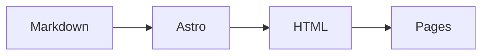

# eScience Center Blog

The Netherlands eScience Center blog — articles on research software engineering, data science, digital scholarship, and open science. Originally hosted on [Medium](https://blog.esciencecenter.nl), now a standalone Astro site.

**Live:** [blog2.esciencecenter.nl](https://blog2.esciencecenter.nl)

---

## Implemented features

- Astro static site generated from markdown posts.
- Medium-style homepage with featured article, image cards, and full archive feed.
- Responsive article pages with wide images, captions, reading time, tags, and source links.
- Author archive pages with bios, profile photos, and post lists.
- Topic/tag archive pages plus homepage topic discovery.
- Client-side search across posts.
- RSS feed and JSON endpoints for posts, authors, and topics.
- Dark mode support.
- GitHub Pages deployment via Actions.
- Rich technical writing support in post bodies:
  - standard markdown: headings, links, blockquotes, lists, tables, code blocks, and inline code;
  - images kept alongside the Markdown for each post;
  - raw HTML for editorial affordances such as `<details>` / `<summary>`;
  - iframe embeds for videos and interactive content, including YouTube and Observable-style embeds;
  - math notation via inline and block LaTeX;
  - Mermaid diagrams from fenced `mermaid` code blocks.
- Unlisted direct-link posts for integration/showcase pages that build but stay out of public listings, RSS, APIs, topics, authors, and search.

---

## Adding a new post

### 1. Create the post directory

Use the helper command so directory names only encode the date and title; author names live in frontmatter where special characters are safe:

```sh
bun run new-post "Why We Build Tools" --author "Jesse Gonzalez" --tags "RSE,Tools,Open Source"
```

This creates `content/posts/YYYY-MM-DD - why-we-build-tools/index.md` with `published: false` for review. Keep post-specific assets in that directory:

```text
content/posts/YYYY-MM-DD - why-we-build-tools/
├── index.md
├── why-we-build-tools-diagram.png
└── workflow.webp
```

### 2. Frontmatter (required)

```yaml
---
title: "Why We Build Tools"
author: Jesse Gonzalez
tags:
  - RSE
  - Tools
  - Open Source
---
```

| Field | Required | Notes |
|---|---|---|
| `title` | yes | Wrap in quotes if it contains special characters |
| `date` | no | Publication date comes from the `YYYY-MM-DD` directory prefix; use this only for imported metadata |
| `author` | yes | Full name as you want it displayed |
| `tags` | no | List of keywords. Defaults to `["uncategorized"]` if omitted |
| `source` | no | `"medium"` (default) or omit for original posts |
| `source_url` | no | Link to original if cross-posted |
| `published` | no | `false` to hide from the site entirely. Defaults to `true` |
| `unlisted` | no | `true` keeps the direct URL generated but excludes the post from homepage, search, feeds, APIs, topic pages, and author pages |
| `featured` | no | `true` makes the post eligible for the homepage featured slot. If multiple listed posts are featured, the newest by filename date wins. If none are featured, the newest listed post is used |

### 3. Body content

Write markdown, plus supported rich content when needed. Keep post-specific images next to the post Markdown and reference them with a relative path:

```markdown

```

For images that need a visible caption, use a semantic HTML `<figure>` block. This is the preferred pattern for new posts because it keeps the alt text and the caption separate:

```html
<figure>
  
  <figcaption>Caption shown under the image. Credit/source links are allowed.</figcaption>
</figure>
```

Caption rules:

- `alt` describes the image for screen readers; it is not the caption.
- `<figcaption>` is the visible editorial caption under the image.
- Keep captions short and factual, Medium-style.
- Put credits/source links in the caption when needed.
- Avoid the old export pattern where caption text is pasted as a normal paragraph directly after an image; use `<figure>` instead.

Supported body content includes:

- normal markdown paragraphs, headings, links, blockquotes, lists, tables, and code fences;
- inline code with backticks;
- syntax-highlighted code blocks with language fences, e.g. ```` ```python ````;
- inline math with `$...$` and block math with `$$...$$`;
- Mermaid diagrams with fenced `mermaid` blocks;
- raw HTML for small editorial elements such as `<details>` / `<summary>`;
- iframe embeds for videos or interactive figures, as long as the provider allows framing.

Example Mermaid diagram:

````markdown

````

Example embed:

```html
<iframe
  src="https://observablehq.com/embed/@d3/bar-chart/2?cells=chart"
  title="Observable D3 bar chart embed"
  loading="lazy">
</iframe>
```

Use the unlisted integration showcase post as a reference for supported content patterns:
[`content/posts/2026-06-11 - integration-showcase/index.md`](content/posts/2026-06-11%20-%20integration-showcase/index.md).

Contributors can also view the live showcase to see what is possible:
[https://blog2.esciencecenter.nl/posts/2026-06-11---integration-showcase/](https://blog2.esciencecenter.nl/posts/2026-06-11---integration-showcase/).

### 4. Rebuild

The site rebuilds automatically on push to `main`. To preview locally: `bun run dev` → [localhost:4321](http://localhost:4321).

---

## Content rules

1. **One post per directory.** Put its Markdown in `index.md`.
2. **Keep post assets with the post.** Put images next to `index.md` and reference them with relative paths. Don't hotlink external images — download them and commit them with the post. Use descriptive filenames: `why-we-build-tools-diagram.png` not `IMG_4829.jpg`.
3. **HTML is allowed when it adds value.** Keep it minimal and purposeful: embeds, `<details>`, and small semantic elements are fine. Avoid large custom layouts inside posts unless there is a strong editorial reason.
4. **Frontmatter before body.** The `---` block must be the first thing in the file.
5. **Directory naming convention.** `YYYY-MM-DD - post-slug/index.md`. Publication date comes from the directory name; keep author names in metadata only.
6. **Alt text on every image.** Accessibility matters: ``.
7. **Editing existing posts.** Edit its `index.md`. Rebuild and the changes go live.
8. **Deleting a post.** Remove its directory, or set `published: false` to hide without deleting.
9. **Author pages.** Author pages are auto-generated from the `author` field. Use consistent author names across posts (e.g. always "Jesse Gonzalez", never mix "Jesse Gonzalez" and "J. Gonzalez").
10. **Tags are freeform.** No controlled vocabulary — but prefer existing tags for discoverability. Check `/search` to see what's already in use.
11. **Embeds depend on provider policy.** Some websites block iframes with `X-Frame-Options` or `Content-Security-Policy`; test embeds locally before publishing.
12. **Use unlisted posts for smoke tests or private demos.** Set `unlisted: true` and keep `published: true` when a page should build and be reachable directly, but not appear in listings or feeds.
13. **Feature one post manually when needed.** Set `featured: true` to put a listed post in the homepage featured slot. Only the newest featured post is used.

---

## Project structure

```
content/
├── posts/            ← All blog posts (Markdown + frontmatter + local assets)
src/
├── pages/            ← Route pages (index, posts/[slug], authors/[slug], search)
├── layouts/          ← Base layout (header, footer, OG metadata)
├── styles/           ← Global CSS (Tailwind + post-content typography)
└── content.config.ts ← Post schema (Zod types)
public/
├── assets/           ← Shared site assets
├── header-banner.webp
└── favicon.svg
```

---

## Tech stack

- [Astro](https://astro.build) — static site generator
- [Tailwind CSS v4](https://tailwindcss.com) — utility-first styling
- [Bun](https://bun.sh) — package manager and runtime
- GitHub Pages — hosting (via Actions)

See [DEV.md](DEV.md) for local setup and development.
