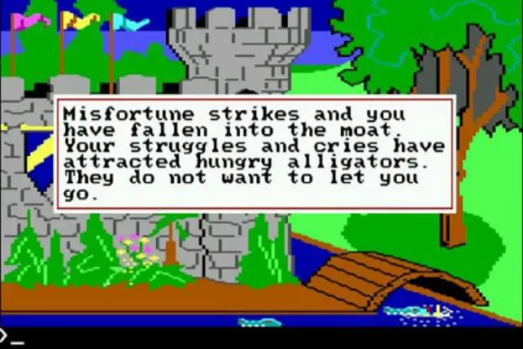
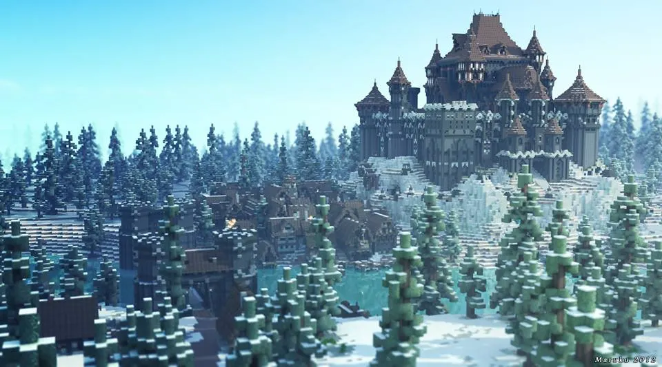
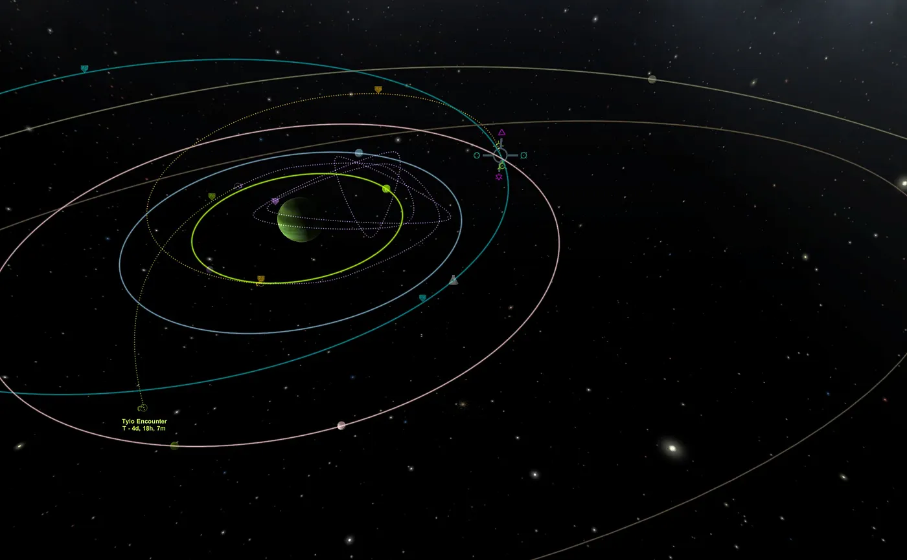
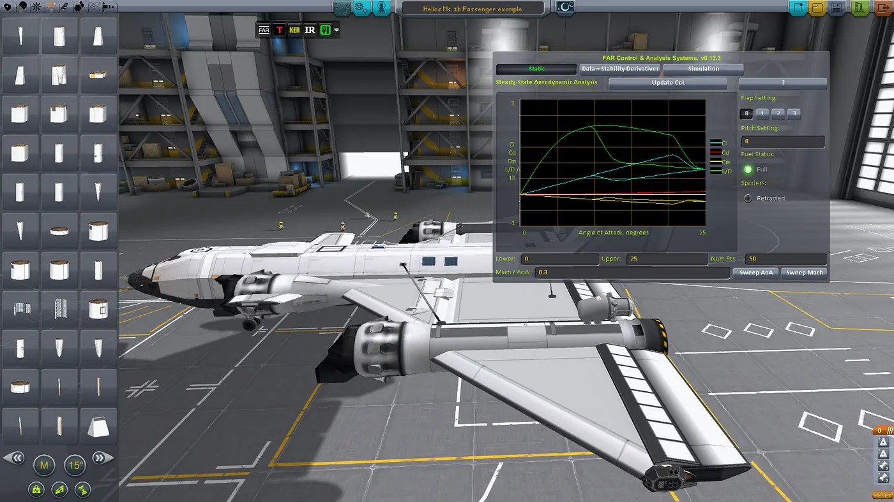
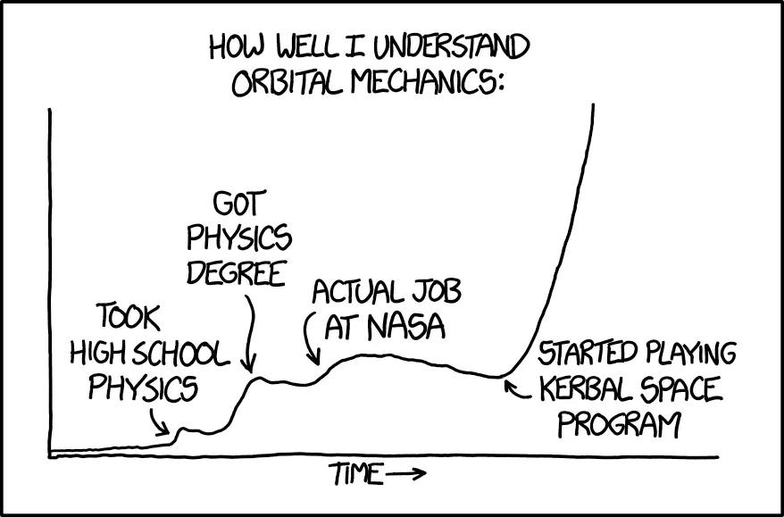

If you know me at all, you have probably heard me talk about computer games at least once. Games are such a huge part of how I spend my free time, it is hard for me to not talk about them in the best of circumstances, but if there is at least one other enthusiast present, you will find me going off on a tangent [soon(tm)](http://www.urbandictionary.com/define.php?term=soon+%28tm%29). That goes for professional settings as well — because the interfaces they use to convey complex information in simple terms are a great source of inspiration for my work as eScience Research Engineer. In this blog I’d like to share this passion, and more specifically the passion I have for science-related games.

Many of the younger generation of readers might not realize this, but when I grew up in the late 20th century, games were considered a complete waste of time by anyone and everyone. Even if the entire reason for your complete English vocabulary (I am not a native speaker) was gained from playing games like King’s Quest and Space Quest, and your analytical thinking was stimulated as well. Anyway, enough ranting about my childhood issues, let’s get to the point.

King’s quest, by Sierra Online. Where I had to learn English to survive.

### Into the sandbox: A broader perspective on games

In 2017, the video games market has changed from having an overabundance of ‘classic’ AAA titles funded by large production companies to a much broader spectrum of titles. This development was largely set in motion due to [Valve’s Steam store](http://store.steampowered.com/) making sure smaller titles could grab the spotlight without having an enormous marketing budget to back them up. These self-funded ‘Indie’ (aka Independent) titles ==now got== more attention and were allowed to grow.

The first of the hugely successful Indie titles is, by now, a legend. Minecraft took the world by storm in 2010. This game singlehandedly showed the large production companies that they had been wrong all along, instead of having set goals, a lot of people wanted to express their creativity in games. They wanted a digital sandbox. Sales of this game with procedurally generated content and the ugliest graphics of any game in 10 years went through the roof. Minecraft is now the second most sold game in history, after Tetris. And, as a further measure of success, the Intellectual Property was bought by Microsoft for 2.5 Billion Dollars in 2014.

Creativity and architecture in the sandbox of Minecraft, by Mojang.

With Minecraft’s success the way was clear for others to follow. Indie titles popped up everywhere and showed the investors of the world that the sandbox game was here to stay.

### Orbital Mechanics!

In 2014 I found this little game called Kerbal Space Program, a side project of a developer for a marketing company. Back then, it was a little sandbox game where you could slap some rockets together using a catalog of parts and try to launch them into space to do science. Still in the ‘alpha’ stage of development, the game had little functionality, even less tutorials and plenty of bugs.

I’ve always been interested in space, science fiction was my first real love in literature, and science is obviously my thing. It was *perfect*.

“Just a simple Hohmann Transfer to Tylo”, a Screenshot from Kerbal Space Program, by Squad

It was also the reason I realized I knew nothing about orbital mechanics.

If you haven’t studied physics since high school, you probably have some vague idea on how the physics of the solar system work. You have some notion of gravity, and some idea of aerodynamics. Well, unless you’ve grasped all of these concepts a lot better than the average person, [you know nothing, Jon Snow.](http://knowyourmeme.com/memes/you-know-nothing-jon-snow)

Sure, I had heard people say before that orbiting a planet is the same as continuously falling and missing the ground because you’re going too fast, I had heard it, and disregarded it as nonsense or maybe an abstraction. I even thought I understood the [tyranny of the Rocket equation](https://www.nasa.gov/mission_pages/station/expeditions/expedition30/tryanny.html). Sure, I’ve heard people say that flying to the moon is hard, or that it was such a long trip to Mars, or using gravity assists, and I thought I understood that too. *But, at the same time, I argued for nuclear fission as a waste free alternative power because we could always just launch our nuclear waste into the sun for destruction afterwards…*

### Enter the community: Aerodynamics

Even though this game was perfect at the start, I had no idea it would get so much better over time. The greatest asset of Kerbal Space Program was not its game engine, its content or even its idea. These all paled in comparison to its *community*. So many people who were interested in the same things found this game and its forums, and started to write mods (short for modification).

While the underlying physics of Kerbal Space Program’s aerodynamics had seemed decent up until now, the addition of the mods called “Ferram Aerospace Research” and “Deadly Reentry” taught me I was wrong there too. Gone was everything I had learned about rocket flight trajectories and the ins and outs of Single Stage To Orbit space-plane construction (a plane that can boost itself into space from a horizontal launch, without dropping any components in the process). These mods introduced a working model of aerodynamics that made the original hide in a corner in shame.

Designing spaceplanes with Ferram Aerospace Research, a Screenshot from Kerbal Space Program, by Squad

Suddenly I had to be concerned with things like the center of lift on my plane and the center of mass, and how they relate to each other. I found myself researching concepts like ==sideslip angle and stability derivatives==, changing aerodynamic conditions during the transition to supersonic speeds, and designing for in-flight changing mass because of fuel usage. When my original designs had happily used Aerobreaking in the atmosphere of Jool (a gas giant modeled after Jupiter), Deadly Reentry taught me this was not as viable a strategy as I thought without bringing the extra mass of a decent heat shield:)

### Even more physics: Rocket fuel

And then there was “Realism Overhaul”, oh my. A collection of mods dedicated to making your life completely miserable. Concepts in Rocket science I hadn’t even considered until now suddenly became a whole new obstacle. Engines that need some form of ignition which has limited use, and cannot throttle from 1% to 100% (like in the standard game), fuel tanks that allow the fuel to float in the middle of the tank in zero-G and therefore not reach the engine, or fuel that needs to be kept at cryogenic temperatures to not boil off through the tank walls. Fuel types that auto-ignite when joined together for reaction control thrusters (the kind that allow you to do small maneuvers) and the different levels of efficiency and thrust to be gained with each.

### In conclusion

Realism overhaul and the things Kerbal can teach you do not stop here, but in the interest of keeping things short, I will break off this tangent and allow you to experience these wonders on your own. And, if you will not take my word for it, please heed the words of the immortal Randall Munroe:

[https://imgs.xkcd.com/comics/orbital\_mechanics\_2x.png](https://imgs.xkcd.com/comics/orbital_mechanics_2x.png)

### Inspiration

==My job at the Netherlands eScience Center is to visualize scientific data for insight and understanding, but also in a large part, for inspiration. Visual analysis of data can lead to knowledge in learning what we know, but also what we do== ==*not*== ==know.==

Games and the interfaces they use to convey complex information in simple terms are a great source of inspiration for my own work, as well as the reason I got into Computer Science in the first place. But, at the same time, science will always be my passion and the reason that I do what I do. Without the science to back it up, a visualization is just a pretty picture.
