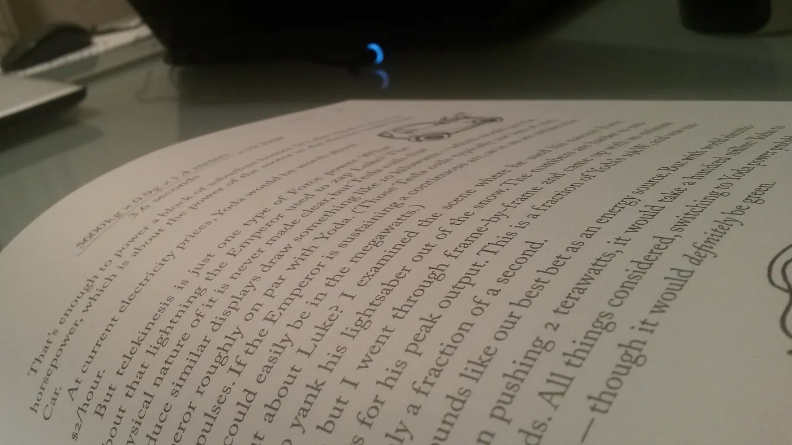
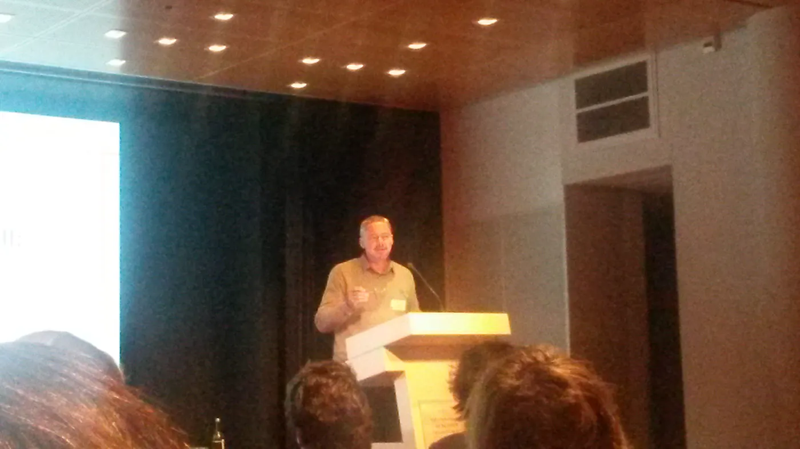

On Friday 20th of January 2017, the Royal Library (a.k.a. [Koninklijke Bibilotheek](http://kb.nl/) or KB) hosted the second congress on [Historic newspapers as big data](https://www.kb.nl/nieuws/2016/historische-kranten-als-big-data-ii-concepten-op-drift), with the central topic of Concept Drift. Slides and photos can be found in the [KB website](https://www.kb.nl/nieuws/2017/historisch-onderzoek-in-digitale-kranten-verslag-van-het-big-data-congres). Concept Drift is the study of how a concept is modified as time goes by — this is a topic which interests me as it relates to one of my previous projects, [ShiCo](https://www.esciencecenter.nl/project/mining-shifting-concepts-through-time-shico). It was a very well attended event, where many familiar faces were present.

## [Historische kranten als ‘big data’ II: Concepten op drift](https://www.kb.nl/nieuws/2016/historische-kranten-als-big-data-ii-concepten-op-drift?source=post_page-----1cc557b46ddf---------------------------------------)

### Op het congres krijgen wetenschappers uit diverse disciplines het woord, variërend van historici tot computationeel…

www.kb.nl

## Morning keynotes

During the morning session, Lily Knibbeler highlighted the importance of [Delpher](http://www.delpher.nl/), as a research resource for exploring historic news papers. Delpher is a data store where you can find digitalized newspaper articles in Dutch. He emphasized the KB’s desire of fostering an open community where we can work and learn from each other. This is definitely something I feel is extremely important — we should all work together more closely and make the most of the fantastic resources (data and expertise) which are available at the KB and other organisations.

During his keynote speech, Steven Claeyssens noted how libraries themselves are changing and drifting towards being more inclusive for machines. This brought up the topic of the quality of OCR ([optical character recognition](https://en.wikipedia.org/wiki/Optical_character_recognition)) technology. It is an issue the community at large acknowledges and is actively working on; it is also an issue where one of our engineers, [Janneke](https://www.esciencecenter.nl/profile/dr.-janneke-van-der-zwaan), has a personal interest (which she expressed during her [Flash presentation](#7d00)). The last keynote speech by Hein van den Berg focused on detailed definitions of concept schemas and their importance to understand concept drift.

Lunch time was occupied by interesting conversations as well as a number of demos scattered across the room.

## Afternoon session

After lunch, the dynamic duo, Pim Huijnen and Melvin Wevers, spoke about digital tools they use in historical research (both of which have eScience center connection): [Texcavator](http://texcavator.hum.uu.nl/) (on which Janneke worked) and [ShiCo](https://github.com/NLeSC/ShiCo) (on which [I worked](https://www.esciencecenter.nl/profile/dr.-carlos-martinez-ortiz)). It is great to see eScience tools being used by domain experts!

The first round of flash presentations featured Janneke, pitching her idea for deep learning based OCR post-correction — a member of the public mentioned [OCRopus](https://github.com/tmbdev/ocropy) as a possible alternative, which would be interesting to look into to find out whether it is suitable or not. Martin Reynaert also talked about OCR — hot topic!

The afternoon session continued with an interesting talk by Laura Hollink on the use of tools for evaluating concept shifts on linked data, Hennie Brugman presenting [Nederlab](http://www.nederlab.nl/onderzoeksportaal/), Marieke van Erp also discussed the difficulties of analysing semantic changes and how this can be tackled with tools (with nice connections to [CLARIAH](http://www.clariah.nl/)). Finally Lotte Wilms also sneak previewed [tools](http://www.kbresearch.nl/genre/) from [KB Lab](http://lab.kbresearch.nl/). So many cool tools! I would love to play with all of them!

The final session of the day featured Jaap Kamps discussing how the libraries are changing and the effect that has in how people use libraries for doing research. Serge ter Braake also discussed how research practice has changed with digital tools.

During the second round of flash presentations I was particularly interested in the idea pitched by Astrid van Aggelen and Milan van Lange, regarding mining shifts in sentiment in newspapers — this seems like an interesting use case for ShiCo. This actually goes back to the point made during the morning presentations: we should try to work together!

## Closing time

From the final words of Joris van Eijnattten during his last minutes as KB fellow, 3 things stood out as important to me:

- The importance of analyzing networks of words and concepts
- The importance of classification of words and concepts
- The importance of analyzing language variations.

It is clear that there are still many interesting challenges in this community, and I for one would be very excited to continue collaborating with everyone in this field.

Closing remarks by Joris van Eijnattten
