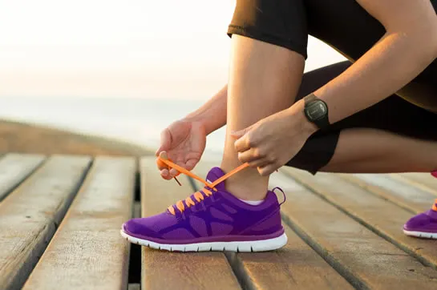
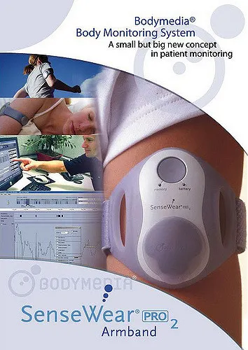
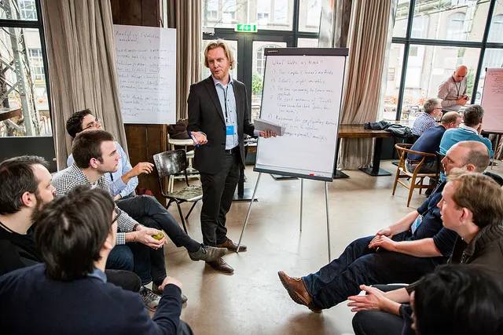

Rewind to 2008. I loved science. I loved technology. I wanted to combine the two worlds. However, looking back, I must admit: It ain’t easy being a developer of scientific software (a.k.a. [research software engineer](https://www.software.ac.uk/blog/2016-11-17-not-so-brief-history-research-software-engineers)) and a scientist at the same time. In this blogpost, I am sharing the biggest challenges I encountered — and some of the solutions I found.

Before I begin, some background about myself. I worked 8+ years as developer of software in the scientific disciplines of physical activity and sleep. A field that has made a radical shift to rely on wearable acceleration sensor data instead of traditional survey data. Some of my work includes: [automated signal calibration](http://jap.physiology.org/content/117/7/738.long), [removing the gravitational component from acceleration signals](http://journals.plos.org/plosone/article?id=10.1371%2Fjournal.pone.0061691), [estimating human energy expenditure](http://journals.plos.org/plosone/article?id=10.1371%2Fjournal.pone.0022922), and [estimating human sleep](http://journals.plos.org/plosone/article?id=10.1371%2Fjournal.pone.0142533).

The wrist worn accelerometer with which most of the data I worked with was collected. The accelerometer was selected because it comes with open source software (copyright: https://www.geneactiv.org GENEActiv TM)

## 8 challenges of being a software engineer in academia

1. **Multi-tasking.** Over the years I had to multi-task between: (1) organising methodological studies, (2) collecting data on human participants, (3) cleaning, archiving and analysing the data, (4) developing and maintaining generic software, (5) writing scientific papers, (6) staying up to date with the field literature, (7) staying up to date with technology, (8) helping out with the analyses of other people’s data, and (9) exploring funding opportunities. It often felt as an impossible job to excel in everything.
2. **Scientific recognition.** Scientific journals that publish research based on research software do not always welcome the supporting methodological work for publication. Further, innovative scientific methods are not necessarily innovative technology. Therefore, there is often no obvious scientific journal to publish a new scientific method in: The science journal from the research community for which the methods are made often reject methodological papers as they are considered too technical, and technology journals, justifiably, do not see the technological novelty. Luckily, theme-free journals like the online open access journal [PLoSONE](http://journals.plos.org/plosone/) have come to existence to address this issue. Theme-free journals have the advantage that editors will not judge a manuscript based on its topic of research but based on the quality of the research regardless of whether it is technical, fundamental, or applied.
3. **Technology feedback.** Working among the scientists has been great for understanding their needs, and getting feedback on software functionality. However, working among the scientists requires an extra effort to find people willing and able to brainstorm about the technological aspects of the software. I did manage to find a small group of computer scientists for feedback, but truly collaborating on papers remained difficult as a result of major differences in interests and publication culture between academic fields.
4. **Helpdesk.** When developing open source software you may not necessarily have the resources to set up an end-user helpdesk. Consequently, software users will contact the developer with all their queries, sometimes four or five times per week. There does not seem to be a simple solution to this challenge. Ignoring the queries would mean the possible end of the software and the end of its impact on science, answering all queries would require a lot of time, and building a community that answers each others’ questions only makes sense if there is more than one person in the community who fully understands the software and has a personal interest to dedicate time in helping scientists. Of course, there is always the option of offering support as a paid consultancy.
5. **Dependency on commercial technology.** The majority of scientific technologies in my field are produced by commercial parties who are not always able to guarantee long term product support. For example, the sensor company [BodyMedia](https://en.wikipedia.org/wiki/BodyMedia) was sold to the company JawBone, which in turn stopped producing the sensors by which none of the scientific studies done with the these sensors in the past two decades can now be reproduced. Further, the existence of proprietary commercial software in this field has undermined scientific transparency also. As a consequence, a substantial part of the scientific work in the physical activity and sleep research community has been to empirically compare the data coming out of proprietary software. These comparisons are needed to verify compatibility of research results, needed to preserve methodological consistency. This situation may have made some scientists feel vulnerable and left in the dark.
6. **Technology myths.** In recent decades, hundreds of conference proceedings have been published by the technology research community with strong claims about the potential of machine learning for accelerometer data classification. Although, the enthusiasm of those publications is understandable form a computer science perspective, they did not live up to the requirements of the physical activity and sleep researchers: A large number of those optimistic statements were not accompanied by reproducible research, were limited to unrepresentative study populations, had a too low sample size, or had an unrealistically easy classification task. Not surprisingly technological research is not always taken serious by the scientists. A conclusion from this may be that a too positive pitch of your new scientific technology can decrease the trust of scientists in your work, especially if reality does not live up to the pitch. Therefore, a close collaboration between scientific technology developers and end-users seems essential.
7. **Career path.** As a developer of scientific methods you tend to be sucked into a facilitating role because the goal of the work is to enhance the work of scientists. Their cooperation and approval of a method is needed for the success of the method. This makes it difficult to prove yourself as an independent scientist, because the more you focus on your own academic output the less time you have to listen to and help the scientist, which in turn is essential for your own output.
8. **Computing resources.** During my PhD research I had unlimited access to a computing cluster. It felt to me as having access was normal, while during my time as a post-doc at a different university I had to organise this myself. Senior scientists are not always aware of the need for computing infrastructure at the start of a project and it is important to know your infrastructure requirements and communicate them on time.

BodyMedia’s proprietary software made scientists dependent on their services for reproducible research

## Solutions?

In 2015 I joined the [Netherlands eScience Center](http://www.esciencecenter.nl/) as an [eScience Research Engineer](https://www.esciencecenter.nl/careers/escience-research-engineer), which has addressed a number of the challenges mentioned in this blogpost for me:

- I am exposed to a wide range of technologies and scientific challenges to learn from and be inspired by.
- Scientific software is recognized as scientifc output.
- The collaboration between research software engineers and scientists is at the core of each project.
- The work has made me aware that there are many scientific software developers facing the exact same challenges as I did. For example, organised in national organisations like the [Dutch Techcentre for the Life Sciences](https://www.dtls.nl/) and the international [Research Software Engineer](https://www.software.ac.uk/research-software-engineers) community.

Discussions between research software engineers (me in brown sweater on the right) and scientists about opportunities and challenges in improving data analytics in science ( ©Copyright: Hucopix, http://hucopix.com, 2017)

So, what did I want to say? It has taken almost a decade, but I think I found the perfect platform to make a broad and sustainable scientific impact using technology!

**I am interested to hear about *your* experiences. Don’t hesitate to leave a comment!**
