## The StoryTeller application gives you a different perspective on the news

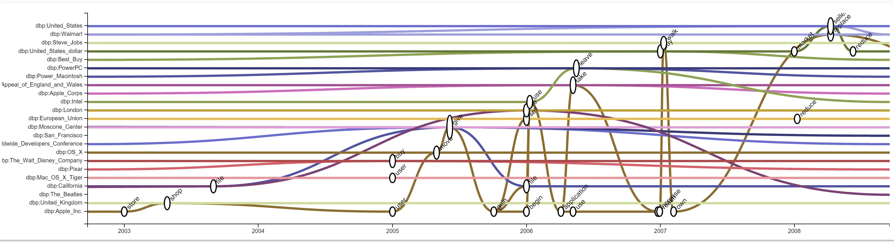

A screenshot from the StoryTeller application. Shown here is a co-participation graph for entities that participate in events together with Apple\_inc.

When I started working with the Computational Linguistics group of the [VU University Amsterdam](https://www.vu.nl/en/) two years ago, I didn’t know much about Natural Language Processing. I used to think that communicating human beings were pretty understandable, especially in everyday news reporting. I’ve since learned that I was terribly wrong.

**Computers do not understand us.** Human language is so abstract and full of context, innuendo and cultural references, that to an observer without the same background (the computer, in this case) we are nearly impossible to understand.

### Shaka, when the walls fell.

As an example of an exploration of cultural differences and understanding language, I’d like to point you to an episode of [Star Trek: The next Generation](https://en.wikipedia.org/wiki/Star_Trek:_The_Next_Generation) called “ [Darmok](http://memory-alpha.wikia.com/wiki/Darmok_\(episode\)).”

This scene from “Darmok” illustrates the difficulty of ‘speaking’ with someone that does not share your cultural references and language structure.

In this episode, the English-speaking captain of the star ship Enterprise is forced to communicate with an alien race with a completely different language. The aliens’ words are translated to English, but they make no sense at all because they are completely speaking in metaphors.

Since this is an episodic series, the impasse is of course resolved eventually, but the point is well made.

Human(oid) communication is a very difficult problem indeed.

### Natural Language Processing

This is where science must find a solution. If we ever want computers to answer complex queries from humans (or even make us a cup of Earl Grey on voice command), we have to make computers and people understand each other.

[Great](http://citeseerx.ist.psu.edu/viewdoc/summary?doi=10.1.1.19.8013) [strides](https://arxiv.org/abs/1301.3781) [have](http://dl.acm.org/citation.cfm?doid=2133806.2133826) already been made, but many challenges persist. One of those challenges is event-based data like news stories. While literary works are usually well researched works of knowledge or stories with a well defined structure, the news is fraught with an extra layer of challenges because of its time-based nature. The facts of today might be the fake news of tomorrow, and opinions of politicians and other prominent speakers may shift over the course of time. [Even concepts themselves are not as stable as you might think.](https://www.esciencecenter.nl/project/mining-shifting-concepts-through-time-shico) The news and its complexities is the chosen topic of research for the group of professor [Piek Vossen](http://vossen.info/).

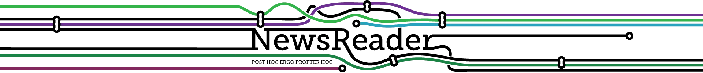

### NewsReader

Enter the [NewsReader](http://www.newsreader-project.eu/) project, a European-funded multi-partner research project that aims to help humanity overcome at least some of the challenges as described above. To help improve the communication between computers and people, a software pipeline was constructed. This pipeline is a collection of software packages dealing with specific parts of human language, which can be connected to form a more complete picture of stories in newspapers.

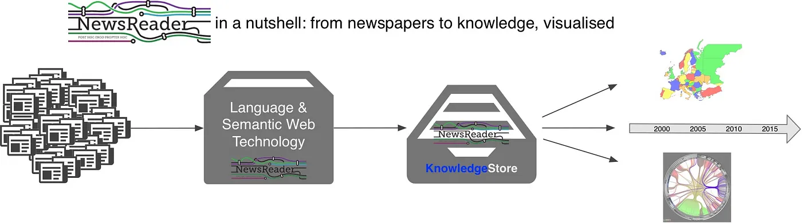

A visual representation of the NewsReader pipeline.

The newsreader pipeline extracts what happened to whom, when and where from billions of news stories, company databases and biographies and stores them in a structured database, enabling more precise search over this immense stack of information. It supports multiple languages (English, Spanish, Italian and Dutch) and allows its users to find complex interconnections between participants, events and perspectives on these events.

Before I joined the project, however, a new and exciting challenge appeared. The output of the pipeline was too complex to understand *for humans.*

### Word soup

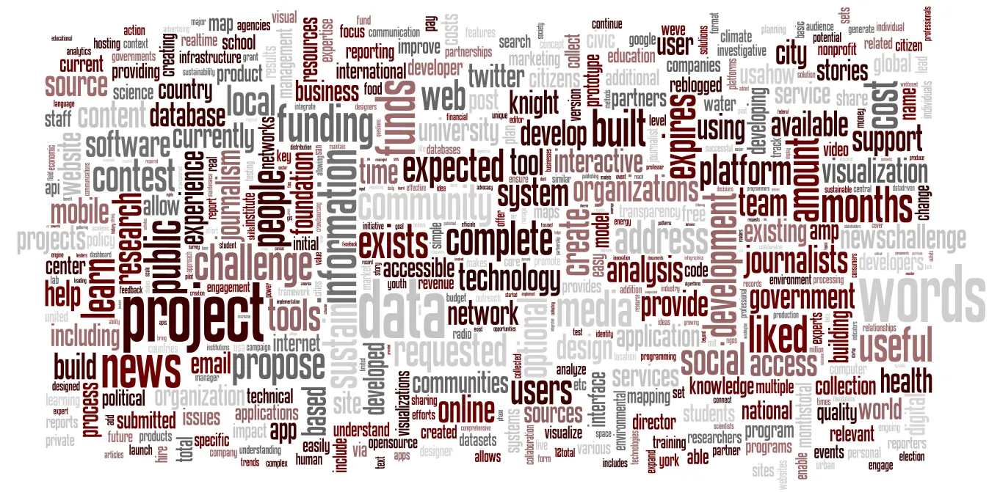

[http://compsocsci.blogspot.nl/2012/06/word-cloud-of-knight-news-challenge.html](http://compsocsci.blogspot.nl/2012/06/word-cloud-of-knight-news-challenge.html)

A term usually applied to the inane utterings of politicians [or their representatives](http://theslot.jezebel.com/kellyanne-conway-is-losing-her-hold-on-talking-head-pro-1792391189), it quite accurately describes the issues with scientific output in computational linguistics. At least to us humans, English speaking humans, or me alone, depending on how narrow this particular selection is made. *On second thought, let me explain.*

Before new users start to make sense of the output of the NewsReader pipeline, they encounter an enormous mass of words, arranged in mentions (instances of events that are mentioned in the news) and their attributes. Dates, cited persons, authors, event participants, labels, groups, perspectives etc. All neatly arranged in a computer-readable data structure. Needless to say, I didn’t understand any of its significance until it was explained to me.

### Climax events and Storylines

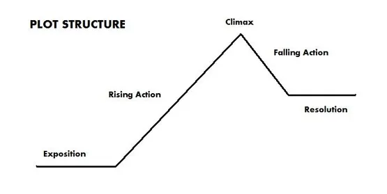

The pipeline spews forth a slurry of events and their mentions in the news, but fortunately there is now some structure to the data. Stories have been defined by defining a ‘climax’ event, and connecting it to other events through their participants, labels, groups and other metadata. These stories should follow the ancient structure of all human stories, at the very least since the first recorded epic of [Gilgamesh](https://en.wikipedia.org/wiki/Gilgamesh). Incidentally, (and probably not very coincidentally) this epic tale was also a large part of the resolution of that Star Trek episode I linked earlier.

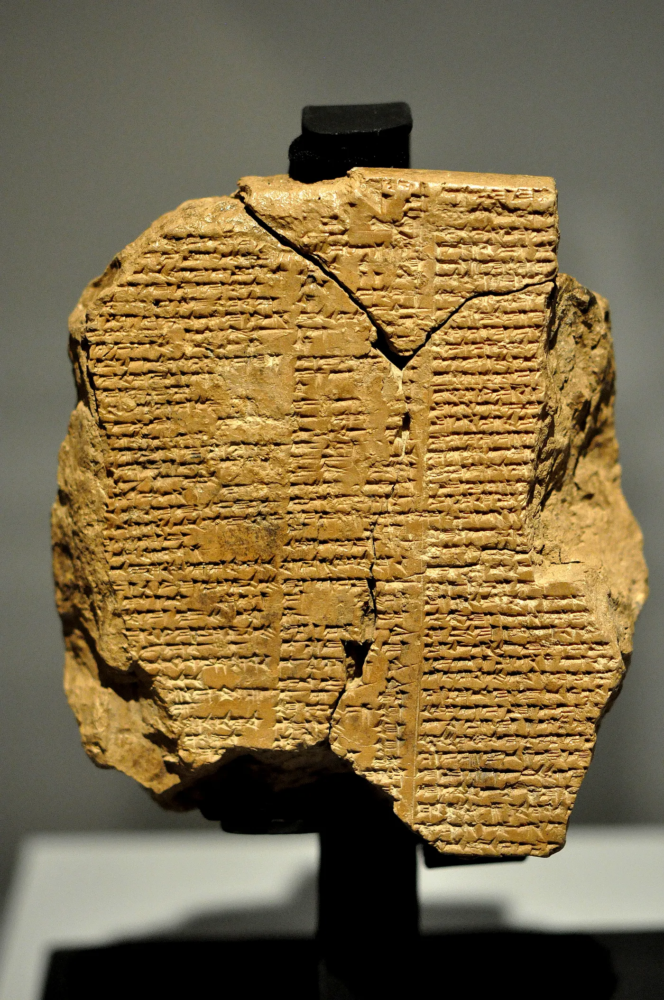

Tablet V of the epic of Gilgamesh. The tablet dates back to the old Babylonian period, 2003–1595 BCE.

To detect climax events, the software uses multiple Natural Language Processing modules including [named entity recognition and linking](https://en.wikipedia.org/wiki/Entity_linking), [semantic role labeling](https://en.wikipedia.org/wiki/Semantic_role_labeling), [time expression detection and normalization](https://nlp.stanford.edu/projects/time.shtml) and [nominal and event coreference](https://en.wikipedia.org/wiki/Coreference). Processing a single news article results in the semantic interpretation of mentions of events, participants and their time anchoring in a sequence of text.

Where the pipeline of NewsReader finds climax events, it will first look for events that are part of the same storyline as the largest climax event of the selected data, and link them to this climax event in a story. It will do so in a greedy fashion, until it can find no more that it can link. It will then move to the next biggest climax event that is left in the pool and continue its operation. This creates a set of stories, linked by single events with a number of participants, citations, authors and perspectives.

### Movie narrative charts

Very early on in the project, we realized that one visualization would not be enough. The complexity of the connections between events, actors and mentions was just too great to capture in a single image. Especially if that image had to be algorithmically constructed instead of painstakingly hand-crafted. While we used the legendary Randall Munroe’s Movie narrative Charts (see image) as a source of inpiration for one of our visualizations, we knew that we could never fit as much information in the image automatically.

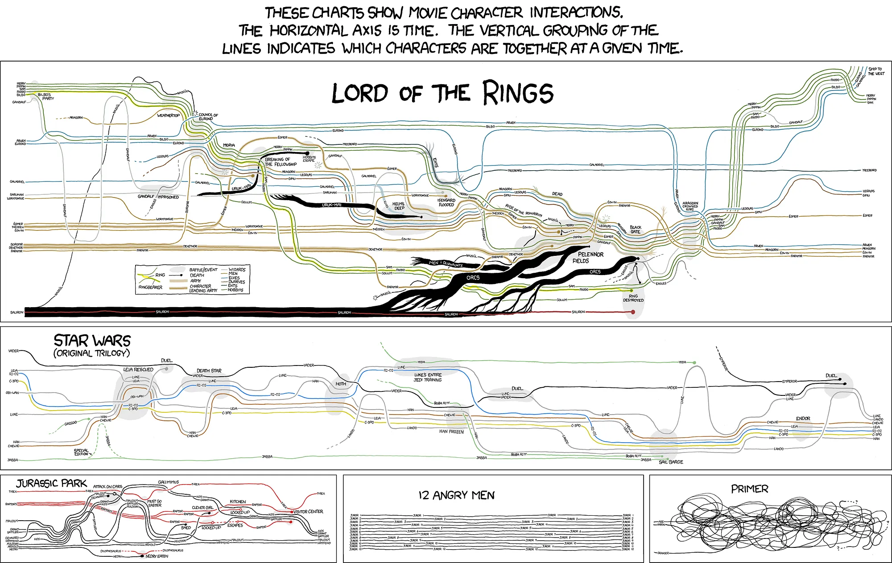

XKCD Movie narrative charts. The inspiration for our co-participation graph.

We therefore decided on three different visualizations in different tabs (or views), which were linked through filters and selections.

### Visualize and conquer!

*(Hold on to your horses, a link will be provided soon… I just need to explain a little more…)*

The first of our chosen visualizations is a variation on the [bubble chart](https://en.wikipedia.org/wiki/Bubble_chart). It shows events on a timeline, with the size (and color, for distinctiveness) of the bubbles as a measure of their importance. Every line in the chart is a story, with a topic (on the left side) and event labels.

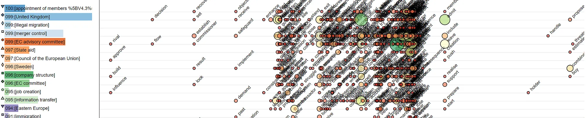

The event-centric view of StoryTeller offers multiple storylines and their events on a timeline. In this case, the Brexit dataset of the Financial Times was visualized.

**Too much is shown at once. We know.** Luckily we have the handy tool of interaction to help us. From this view, we can filter on stories, intervals and (relative) importance of events.

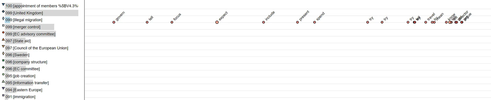

An example of a filtered view on the event-centric graph.

### More interested in who was present or who was mentioned?

(*or colorful spaghetti?*)

That’s what the relations tab is for. This is also where the previously mentioned xkcd comes in handy. We see participants on the left and single mentions on the right. Colorful lines are drawn through events with actors that appear in these events simultaneously.

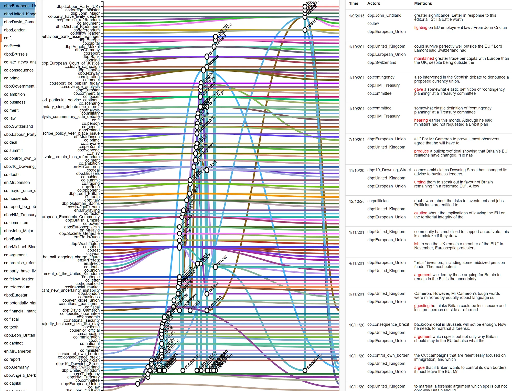

The relations tab of StoryTeller

This graph can of course also be filtered, here we see all events linked to both the United kingdom and David Cameron.

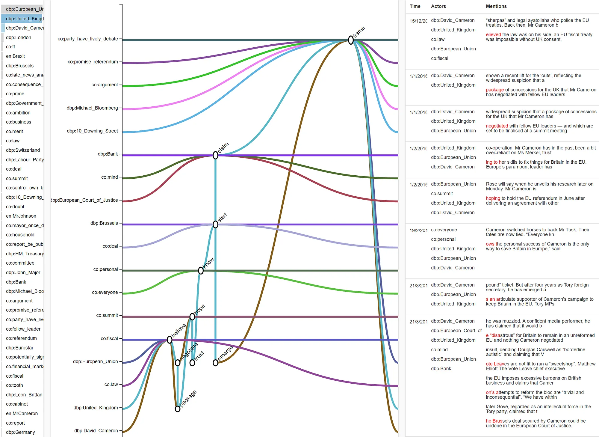

### What about these perspectives you mentioned at the start?

This is the last tab of our web-app. Here a user can visually find (and filter on) events with sentiments (negative, neutral or positive), events which mention the past or present, events that the original speaker was certain or uncertain about etc. We can also filter on specific citations by people and authors of articles.

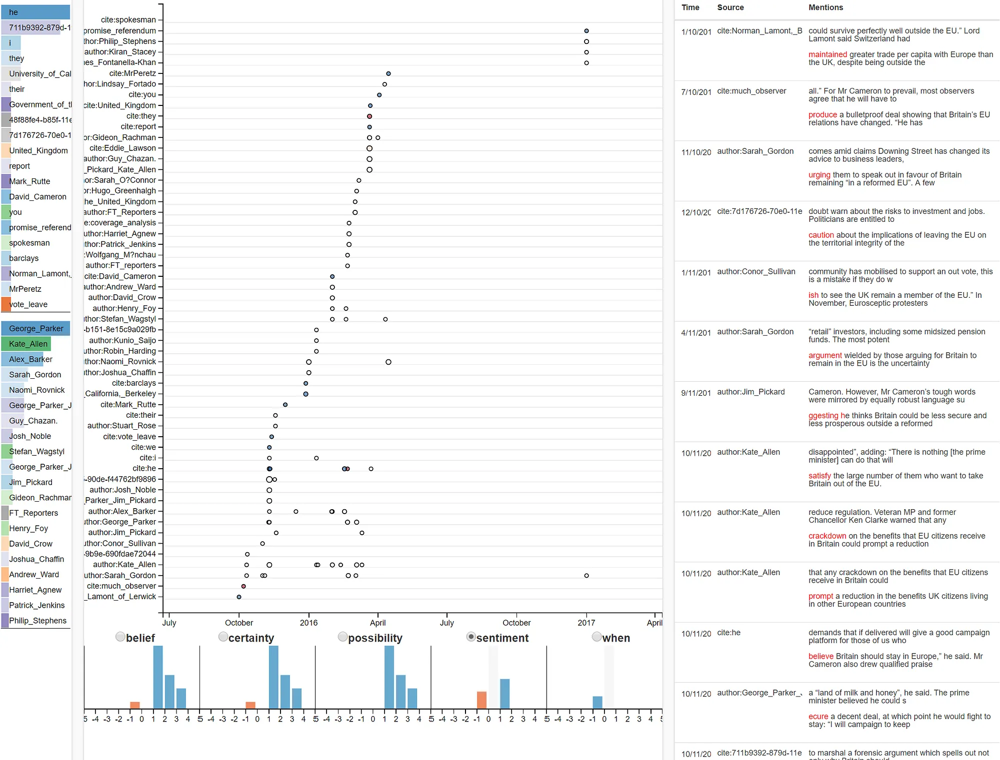

### Try it!

*(please do allow for a few moments for the page to load, the amount of data in here is quite … big)*

[**StoryTeller for pre-brexit-referendum news data**](http://nlesc.github.io/UncertaintyVisualization/)

### Ugh, too much work, don’t you have a video?

Sure, here is Dr. [Tomasso Caselli](http://vu-nl.academia.edu/TommasoCaselli), a researcher working with Piek Vossen, explaining StoryTeller step by step at our [visualization event](https://blog.esciencecenter.nl/what-is-the-impact-of-visualization-on-science-5d16bb6dd844) in Rotterdam!

### Ok, cool, so how did you make this? Can I use it? Can I cannibalize your code? Use it to take over the world?

Whoa! Yes! All of the software we develop at the eScience Center is open source, with a very permissive attribution-only licence. So go ahead and try it out.

The [**source code**](https://github.com/NLeSC/UncertaintyVisualization/) is written in Javascript, with [AngularJS 1.0](https://angularjs.org/). It makes heavy use of the [DC.js library](https://dc-js.github.io/dc.js/), which uses [D3](https://d3js.org/) for visualization and [Crossfilter](http://crossfilter.github.io/crossfilter/) for the filtering code. We applied some Angular sauce and customized quite a bit of code of course. Many (if not all) of the graphs in StoryTeller are custom work loosely based on the DC.js examples.

If you are going to use it, awesome! I’d appreciate it if you send me a message if you encounter any issues. It’s meant to be quite readable and useable, so if it’s not, I’d like to know. Don’t hesitate to make an issue on Github either. I promise I’ll be nice:)
