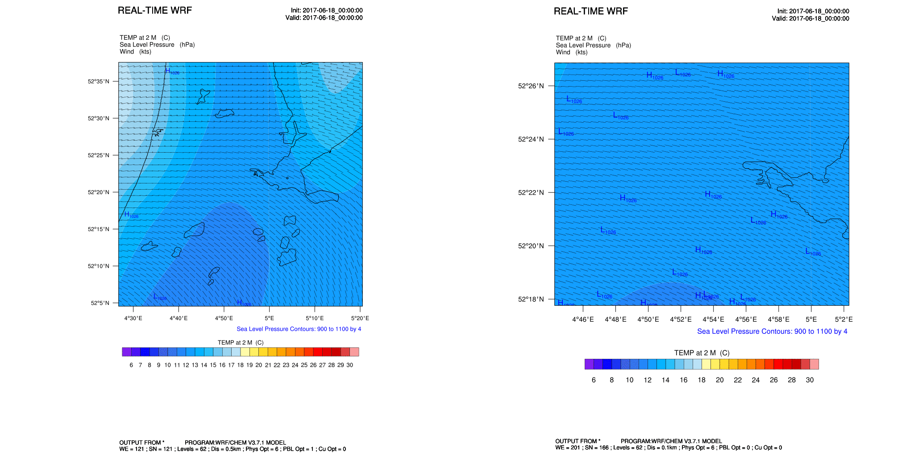
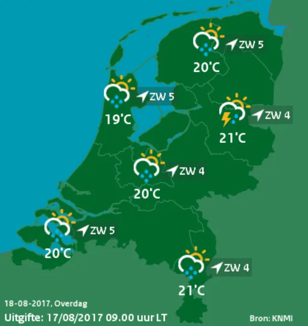
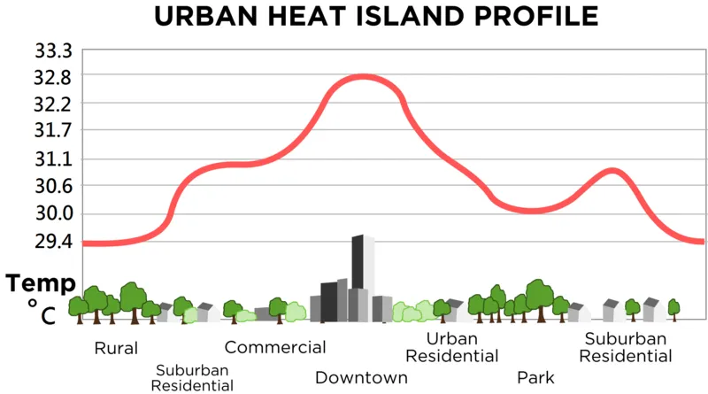
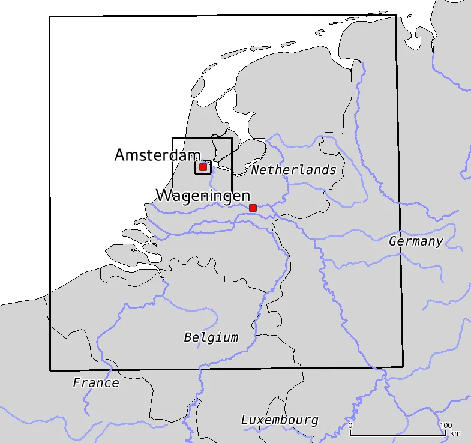
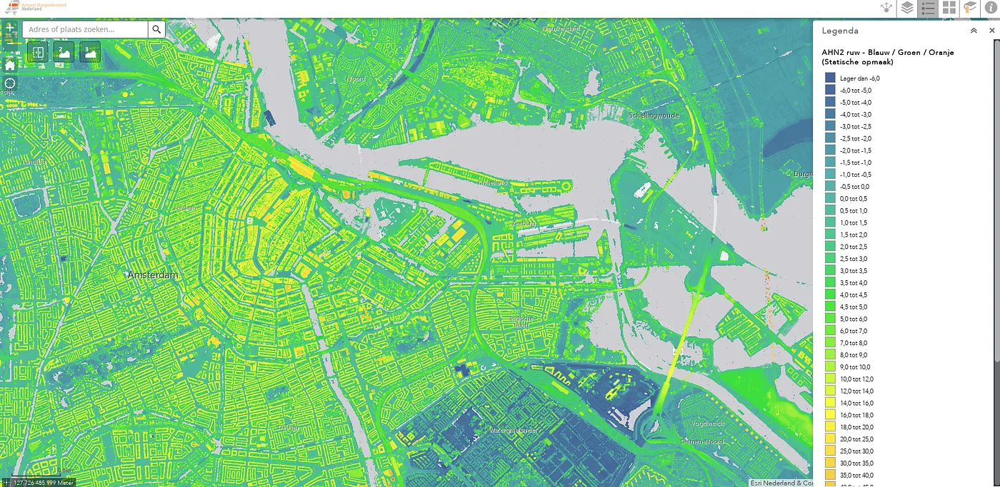
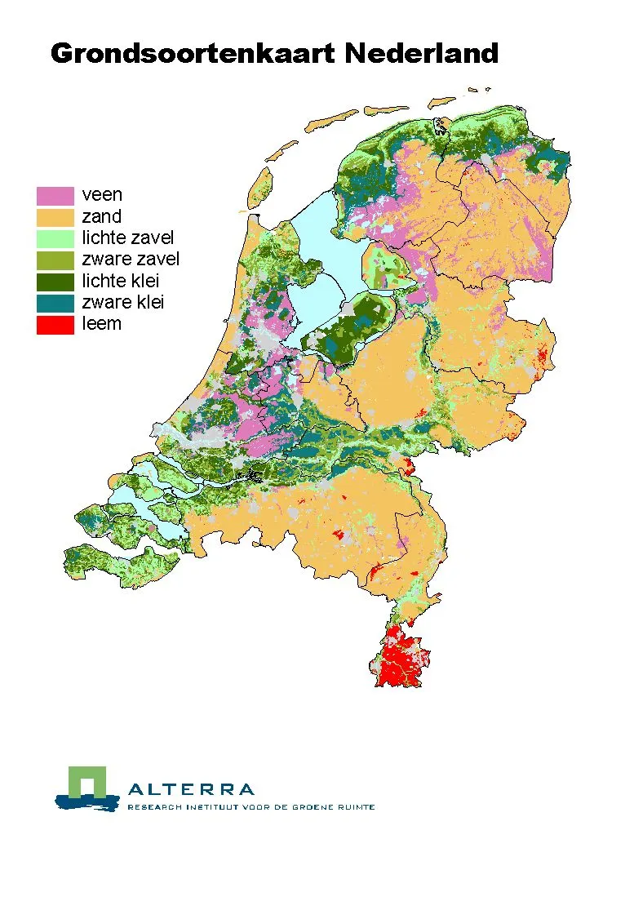
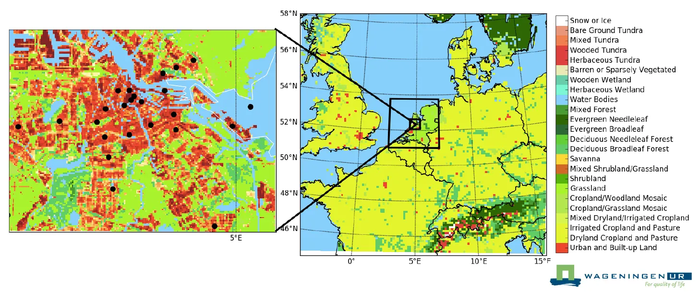

The next big thing in weather forecasting

Example of a high resolution weather forecast at 500m (right) and 100m (left) resolution

eScience Research Engineers at the Netherlands eScience Center are collaborating with a team of climate scientists to develop a novel approach to predict temperatures in your own street. Before we go into detail on why this is relevant and how we did this, let’s first talk some general history about the why and how of weather forecasting.

### History of weather forecasting

In the beginning of the 20th century major advances were made in atmospheric physics. It was argued by Vilheml Bjerknes (1862–1951) that numerical weather forecasting should be considered an initial value problem and could be solved by integrating a set of equations. Although he made a small mistake in the set of equations he defined, which was later corrected by Lewis Fry Richardson (1881–1953), Bjerknes laid the foundation for the weather forecasts as we know them today.

Vilheml Bjerknes

Lewis Fry Richardson

Richardson then went on to simplify the governing equations and produce the first albeit unrealistic, hand calculated, numerically calculated weather forecast. Because of the large amount of calculations involved it took him six weeks to produce an eight hour weather forecast for one single location. The next big step in the history of numerical weather forecasting was made by the introduction of digital computers in the 1940s. After World War II, weather forecasting was one of the first major applications of digital computers. With the availability of more compute power in more recent years, numerical weather models continued to evolve and became more and more complex.

Today, we are able to make fairly accurate weather forecasts 7 days in advance. However, all forecasts are still pretty coarse. In reality, weather is pretty fine-grained — it may be raining in your street but dry in the next. Could we predict weather on such a fine-grained scale?

### Why do we need weather forecasts for the urban area

Traditional weather forecast (source: KNMI)

Traditional weather forecasts as we all know them from the evening news, although reliable enough to plan an outdoor trip, predict average temperatures in rural areas of several kilometers by size. In cities, where most people live and work, temperatures may be several degrees Celsius higher due to lots of activities going on that produce heat, and building materials and structures that insulate or hold the heat: the city doesn’t release its heat as fast as the surrounding country side. This is called the *urban heat island* effect. Increased daytime temperatures, reduced nighttime cooling, and higher air pollution levels associated with urban heat islands can affect human health by contributing to general discomfort, respiratory difficulties, exhaustion, and other heat-related health issues.

Urban heat island temperature profile

### Computational challenge

At the Netherlands eScience Center we have two projects related to the subject of weather forecasts for urban areas: Summer in the City (finished) and the follow-up project ERA-URBAN (ongoing). Both projects are in collaboration with the Meteorology and Air Quality group at Wageningen University. In these projects the Weather Research Forecasting (WRF) model, a so-called limited area (regional) model (LAM), is used. Limited area models work by increasing the resolution of a global model in a small, limited area of interest. Such an area could cover for example the northwestern part of Europe. The weather calculated by the global model is used as input at the edges of the regional model for factors such as temperature, wind, and sea surface temperature. The global model determines the very large scale effects of atmospheric and land surface processes, while the regional model adds regional refinement by resolving the local impacts given small scale information about orography (land height), land-sea contrasts, land use, and (optionally) cities. Thus, limited area models downscale the weather prediction from global weather models with regional refinements.

With the large scale weather and a regional model, we are now able to set up a weather forecast for our region of interest. However, an urban weather forecast should ideally be at a resolution in the order of a few hundred meters or higher. Running a limited area model for the whole of Europe (or even the whole of the Netherlands) at this resolution is still computationally too expensive. A typical way to overcome this is by using nested grids: the model creates a copy of itself on a subdomain at a higher resolution. In our case we went for 4 nested grids, going from low to high resolution: 12.5km — 2.5km — 500m — 100m. This is shown in the figure below.

Overview of the forecast domains: The 100m resolution domain is centered on the city of Amsterdam (domain 4). The next domain, at 500m resolution, covers the Randstad (domain 3). The whole of the Netherlands is covered at 2.5 km resoluton (domain 2). The outer domain (at 12.5 km resolution) covers a large part of northern Europe.

### Detailed description of the area

Algemene hoogtekaart Nederland (AHN) (source: https://ahn.arcgisonline.nl/ahnviewer/ )

Typically, the land surface description of the area included with the model comes in a much coarser resolution than what is needed for urban weather forecasts. Therefore, the next step is adding detail to the description of the area. The accuracy of land surface parameters, including topography, land use, vegetation cover, and soil type, influence the modeled land surface processes and characteristics of the atmospheric boundary layer (lowest part of the atmosphere). These variables greatly influence the model performance and directly determine surface parameters such as albedo, emissivity, roughness, porosity and thermal conductivity of the soil. Examples of data sources that were used in this project include NDVI (vegetation) maps (available from e.g. Landsat 7 ETM+ or Digitale Kleuren Luchtfoto Nederland (DKLN)), accurate information on the location and shape of the buildings ([TOP10NL](https://www.kadaster.nl/web/artikel/productartikel/TOP10NL.htm)), accurate building heights ([AHN](http://www.ahn.nl/)), landuse classes ([TOP10NL](https://www.kadaster.nl/web/artikel/productartikel/TOP10NL.htm)) and soil types ([Grondsoortenkaart](http://www.wur.nl/nl/show/Grondsoortenkaart.htm)), all at very high resolution.

Soil types (left, source: ALTERRA ) and land use classes (right)

### Finetuning

Three things remain to be done. Firstly, the sea surface temperatures and river temperatures that follow from the global model that are used as boundary conditions are not very accurate. For a city near the coast, such as Amsterdam, this affects the forecasted temperature. Therefore, we manually set these to more accurate values as obtained from [Rijkswaterstaat](https://www.rijkswaterstaat.nl/apps/geoservices/rwsnl/awd.php?mode=html&projecttype=watertemperatuur). Secondly, we need to make sure that the heat in the buildings is retained between forecast runs in order to have a more accurate representation of the urban heat island effect. Thirdly, results may be improved even further by assimilating (crowd-sourced) local weather observations into the initial conditions of the regional forecast run (currently this is still an area of research in the ERA-URBAN project and not implemented for the [operational forecast](http://www.met.wur.nl/Summerinthecity/pages/dailyforecasts.html)). Finally, to automate the whole workflow and automatically create a weather forecast at a daily basis we need a workflow engine. Here we adopted [Cylc](https://cylc.github.io/cylc/), but of course others can be used as well.

### Check out the end result!

An example of a 2-day forecast on the 500-m domain of a hot summer day in June 2017 is included in the figure below. For a live daily forecast on all four domains, please visit [http://www.met.wur.nl/Summerinthecity/pages/dailyforecasts.html](http://www.met.wur.nl/Summerinthecity/pages/dailyforecasts.html) (available during the northern hemisphere summer months).

Example temperature forecast for the 500m (left) and 100m (right) domain. Daily temperature forecast for all domains is available via http://www.met.wur.nl/Summerinthecity/pages/dailyforecasts.html during the summer months.
