Imagine, you invest a lot of time and energy in the development of a piece of scientific software. The work pays off and scientists start to use your software in their research. However, the growing user community also produces a stream of help requests, feature requests, and bug reports. What to do about it?

### Keeping the software alive is not a straightforward exercise

1. Software maintenance can be a time consuming activity and is not necessarily a fun or exciting thing to do.
2. If you are a scientist, the maintenance of software may not easily translate itself into a new proposal for a research grant. The work required is typically a pile of unrelated issues from a diverse group of stakeholders without a clear overarching and innovative research question.
3. If you are the engineer who built the software you may want to move on to work on new technological challenges rather than maintaining the software for the decades to come. On the other hand, if you actually want to continue working on the software, the scientist(s) you work with may not have more funding to pay for your time.

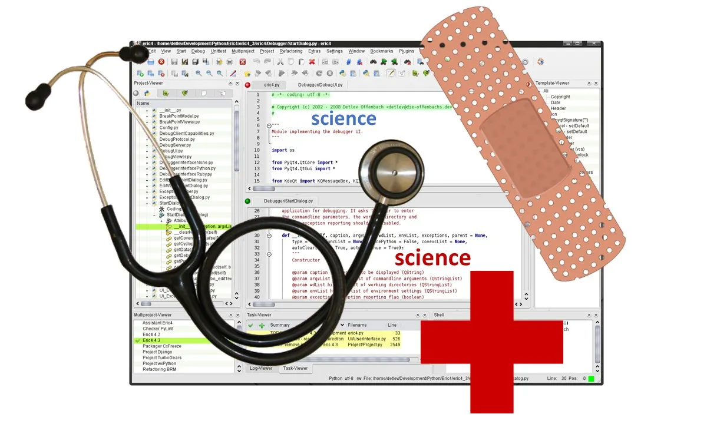

Sources of images: screenshot; stethoscope, bandage, and red cross (all with Creative Commons license)

### Reasons to invest in your scientific software

Despite the challenges mentioned above you may have the following reasons to carry on investing in your scientific software:

1. It can extend the impact of your original work, which could be good for your track record as engineer or as scientist.
2. It can secure the reproducibility of the research that has been done with it, which may be essential if you are a scientist (assuming that no other piece of software exists that can guarantee 100% reproducibility compared with your own software).

So, regardless of whether you have stakes in the software as a scientist, as an engineer or both, you have gone from a victorious **“I did it!”** situation to a depressing **“who has time and interest to help me keep my software alive?”** situation.

**If this sounds familiar to you, then the rest of this blog post will help you to do something about it.**

### Why are data scientists not lining up to help?

If your software would be as generic as Python’s libraries [*Numpy*](http://www.numpy.org/) or [*Keras*](https://keras.io/) or R packages [*ggplot2*](http://ggplot2.org/) or [*caret*](http://topepo.github.io/caret/index.html) then data scientists might be lining up by now to help you maintain and improve your software. However, the reality is different: Your software is so much tailored to your field of science that those data scientists are less likely to be interested. Note that I am referring to them as data scientists for convenience, this includes anyone outside your field of research with software development expertise.

Your software may have been designed for a relatively small community of just a few hundred non-software savvy scientists rather than the thousands of software savvy users (if not more) that are common to generic types of software as mentioned above. With such a user base it may be *relatively* easy to find someone able and willing to fix an issue or respond to questions from users. Further, the lack of interest by data scientists to help you may be explained by the fact that your software is not cutting edge from a technological perspective even though it is *bleeding edge* from the perspective of your field of research. For example, your software might be the only software in the world able to read in a data format unique to your field of research, account for measurement error using expert-endorsed techniques, and visualize the resulting cleaned data in a way that exactly matches how the big guru of your field introduced it in his/her famous 1970 paper.

### Ten ways

The ten ways I can think of to keep successful scientific software alive are listed below in no particular order. I wrote this list based on my own experiences from the development and maintenance of [R package GGIR](https://cran.r-project.org/web/packages/GGIR/vignettes/GGIR.html), which has been [used](https://github.com/wadpac/GGIR/wiki/Publication-list) by researchers who study human physical activity and sleep. These experiences may not perfectly translate to the nature and context of your software, but I hope there are enough generic elements to make these experiences useful for any type of scientific software.

When I finished the list I realized that it may be hard to navigate, so to ease navigation I created the visual quadrant as shown below. The quadrant splits the perspective of the engineer from the scientist, and splits options that mainly involve doing the work yourself from the options that are more about involving others.

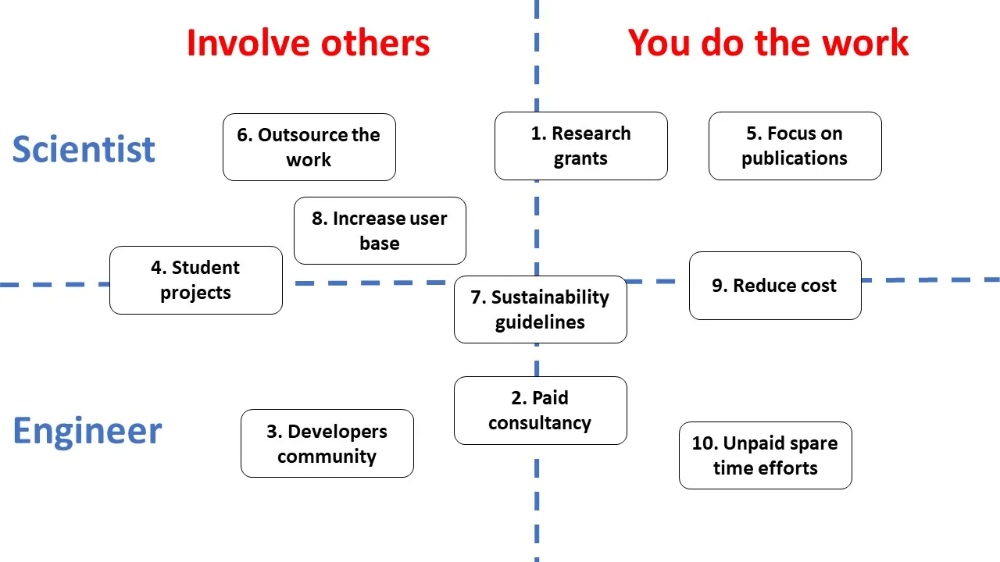

Map of the ten options as listed below, categorized by the extent you involve others and the extent to which you are a scientist or an engineer

## Research grants

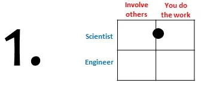

Getting a **research grant** could result in a substantial amount of resources (people time). This option is most realistic if you are a scientist with a position at an academic institution. There may not be funding calls dedicated to scientific software maintenance, but it may be possible to incorporate some time for software maintenance in a grant proposal if it is a logical step towards achieving research goals. We at the [Netherlands eScience Center](https://www.esciencecenter.nl/) in our capacity as funding body have software sustainability investments explicitly listed in our calls. Scientists are encouraged to set time aside for this within the course of a funded project. Applying for research grants is not necessarily something a software engineer would do, but the engineer could play an important role by encouraging the scientists using the software to account for software maintenance time in their grant proposals. *I have had one successful experience with this approach, the research required a new software feature and some bugs to be fixed, by which doing this maintenance work was a justifiable start to the project.*

## Paid consultancy

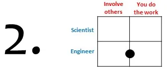

Paid consultancy has the advantage that you, as engineer, make clear to other stakeholders that your time and expertise are not for free. I see three variants on this: (***i) Paid consultancy in spare time*** — Some tips: you may need to register as a company or as freelancer to obtain a VAT number, make sure to not overload yourself with contractual obligations as even three hours of spare time work per week on top of a full time job can already feel like a burden, note that not all employment contracts allow for spare time consultancy, and Intellectual Property or copyright laws may apply —; ***(ii) Paid consultancy as part of your regular job*** with payments going directly to your employer in exchange for the hours you work on the software — This requires that the work is in line with the mission of the organisation you work for, which may limit the scope of consultancies you can provide —, and; ***(iii) Set up a start-up company*** around the software and find a person to lead it. *I have limited but positive personal experiences with the first two options, with a preference for the second. I have no personal experience with the third option, but successful examples I have seen elsewhere include* [*OpenSmile*](http://audeering.com/technology/opensmile/) *and* [*ADF*](https://www.scm.com/adf-modeling-suite-2/)*.*

## Build developers community

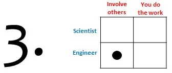

Building a community of software engineers around your scientific software could reduce the work load on individual contributors. However, building a community of engineers around a very research domain specific piece of software could be challenging as I explained in the introduction. *My own software has benefited from several unrelated external contributions over the years, but a real ongoing team effort has not been the case for a long time. Very recently a PhD-student in Spain agreed to help me maintain the software. So now we are a community of two persons, which I think is a great step forwards.* Nonetheless, successful examples of (large) community building are possibly more seen for the types of scientific software that have either research domain overarching functionalities like [CWL](http://www.commonwl.org/) or Numpy, or are generic enough within a research field to attract multiple developers. So, if you are keen to follow this route then it seems advisable to focus your efforts on the generic features of your software and reach out to people with a potential shared interest in these features. Finally, I would like to point you to a [blog post by C. Titus Brown](http://ivory.idyll.org/blog/2016-sustaining-research-software-development.html) from 2016 with a more in dept discussion about community building.

## Student projects

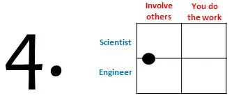

Student projects (students from the research domain) are in my experience ideal for testing the feasibility and documentation of existing software features and for the exploratory development of new software features. If the student project lasts multiple years, like with PhD-students, and if the student has sufficient software skills then it may be realistic to give them more responsibility in the process of software development and maintenance. As I showed in the previous point about community building, PhD-students can be part of your developers community.

## Focus on publications

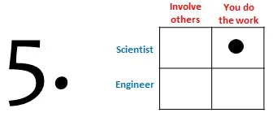

Focus on academic publications about, or using, the software. Thiscould be seen as the conventional academic approach. Here, the objective is that you as a scientist only focus on the software issues that are relevant to your own research, ignoring all other reported issues. This approach may not be ideal from the perspective of other users because not all issues will be addressed. However, the strengths of this classical approach are that it generates evidence to support the validity of specific models or algorithms embedded in your software, it demonstrates feasibility of the software for at least one application area, and it exposes the software to the scientific community it is designed for.

## Outsource the work

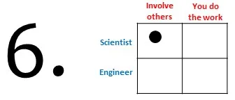

Outsourcing to commercial parties could be an option if you, as a scientist, lack access to software engineers, but already have financial resources, and if you have clearly defined software maintenance target(s). The work may be outsourced to any of the many consultancy firms around the world, freelancer websites like [https://www.freelancer.com](https://www.freelancer.com/), or possibly to academics in computer science and software engineering if a match can be found with their research interests. Outsourcing to commercial parties may not be efficient if the work to be done requires a thorough understanding of the science involved and entails time consuming and uncertain research trajectories. *The only examples of outsourcing I encountered were not successful,* but if you know successful examples of outsourcing the maintenance of already successful software then please post them in the comments.

## Software sustainability guidelines

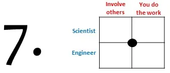

Follow software sustainability guidelines while developing your scientific software as engineer. For example, put your code online and add an open source license, write unit tests, use continuous integration tools, and document your software. Detailed discussions of this topic can be found in the [Software management plans](https://www.software.ac.uk/software-management-plans) by the Software Sustainability Institute, the blog posts [Defining Software Sustainability](https://danielskatzblog.wordpress.com/2016/09/13/defining-software-sustainability/) and [Hardening software vs making it sustainable](https://danielskatzblog.wordpress.com/2015/12/28/hardening-software-vs-making-it-sustainable/) by Daniel S. Katz., a [guide](https://guide.esciencecenter.nl/software/software_overview.html) being developed by my colleagues at The Netherlands eScience Center, and a [paper from 2016 by Haydee Artaza and colleagues](https://f1000research.com/articles/5-2000/v1). Following these guidelines will reduce the effort needed to maintain the software, and will make it easier for outsiders to contribute. Needless to say that these guidelines do not generate time (salary) for people to actually do the maintenance. Therefore, following sustainability guidelines is best combined with one or two of the other options mentioned in this blog post. It is important to have clear agreements between scientist and engineer about the sustainability targets within a project. *Unfortunately I was not aware of these guidelines when I started developing my own software years ago*, but it is never too late to start prioritizing the guidelines!

## Increase user base

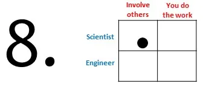

Increase your software’s user base as mentioned in [Simon Hettrick’s blog post](https://www.software.ac.uk/blog/2016-10-06-three-tips-software-sustainability-egi-user-forum): “The more users you have signed up, the more important your software will be to the research community, and the less likely that it will be *allowed* to fail”. This is not a direct solution to the question of how to find people time to maintain the software, but it at least pressures a growing number of stakeholders to find a solution. To increase the user base an initial investment from you is required, which could be a challenge on its own. Nonetheless, there may be tricks to grow your user base without too much effort, for example by actively advertising your software if you have not done so before or by joining forces with a similar and/or complementary piece of software like facilitating each others data formats.

## Reduce cost

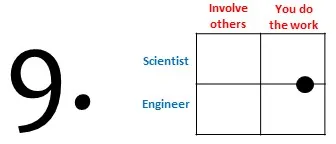

Reduce cost as mentioned in [Simon Hettrick’s blog post](https://www.software.ac.uk/blog/2016-10-06-three-tips-software-sustainability-egi-user-forum), which entails that you try to minimize the amount of software components you develop and maintain yourself by aiming to rely as much as possible on off the shelf software *developed and maintained by others*, either commercially or open-source. Simon’s blog post provides an excellent reflection on the advantages and disadvantages of this option.

## Unpaid spare time efforts

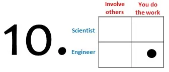

Unpaid spare time effortscan sometimes be an attractive option if you were the engineer who built the software and none of the other options in this list are feasible or immediately available to you. Doing the work in your spare time has the advantage that you can do it whenever it suits you without time pressure. You may even want to see some of the spare time efforts as an investment in your personal skills. Further, spare time efforts can be an effective solution when the amount of work is relatively low and the expected impact is high. The disadvantage of working on the software in your spare time is that it may give other stakeholders the impression that your time and expertise are for free, which is not the case. Lastly, quoting John Wanamaker: “People who cannot find time for recreation are obliged sooner or later to find time for illness”.

**I hope you found this list of options useful, either for your own scientific software or to learn how you can support someone else’s scientific software.**

**If you think I have missed an option or disagree with the ones I have mentioned: Please leave your thoughts in the comments!**
