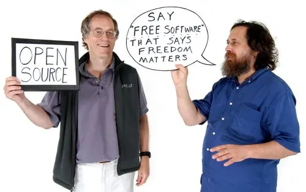

## Or why the GNU General Public License is open for business

When you release your software on the Internet for others to use, you need to choose a license for it. One issue you might want to consider is further development of your software by commercial parties. In this post, we’ll have a look at the GNU General Public License, and how it affects potential commercial users and developers of your software.

## Commerce and Free, Open Source Software

Science is mostly a publicly funded enterprise. Society is willing to pay for it, because scientific research enables the development of products and services that make people’s lives better. At the [Netherlands eScience Center](http://www.esciencecenter.nl/), we work with scientists to develop software for doing scientific research, and where applicable we want to let our software be used commercially by others, and allow people to develop it into commercial products as well.

To enable this, it is important that the related intellectual property rights are licensed appropriately. Wherever possible, we license the software we develop under a Free, Open Source Software (FOSS) license, in particular, the Apache License 2.0. We sometimes use other FOSS licenses as well, including the GNU General Public License (GPL). This latter license is sometimes believed to be hostile to commercial interests. It’s even been called [“communist” and “un-American”](http://ebb.org/bkuhn/blog/2012/12/14/unamerican-mccarthyist-cancer.html) by some particularly hotheaded detractors.

Much of the confusion here stems from that word “Free” in the term Free Software. Free, in this context, [refers to the freedom of the users](https://www.gnu.org/philosophy/free-sw.html), not to the price of the software. Or, as the inventor of the term, Richard Stallman, put it: Free Software is “Free as in (free) speech”, not “Free as in (free) beer”.

I’d like to argue that “Free as in (free) market” is also an appropriate description, describe how the GPL affects commercial software development, and explain why it doesn’t keep a company like Red Hat from making hundreds of millions of dollars per year in profits off of GPL-licensed software.

## The market for software

First, the GPL is not a non-commercial license. Like all other common FOSS licenses, it explicitly allows commercial use of the software licensed under it, as well as the sale of copies. To understand what it does do with respect to commerce, we need to dive a little bit into the economic aspects of software development and use.

So, let’s consider the market for software, let’s say Microsoft Office (the traditional one, not Office 365). There are the users, who are in economic terms consumers, and the developers, who are producers. Because Microsoft owns the copyrights to Office, only Microsoft is allowed to make and sell copies, and the users can only buy from Microsoft.

While there are other office products, switching to them is not so easy because of compatibility issues and users having to be retrained. In classical economics terms (you may remember Adam Smith from school), this makes this market [not so free](https://en.wikipedia.org/wiki/Economic_rent), which advantages the producers. Indeed, Microsoft has been making a rather healthy profit from Office for the past two decades.

Today, the term “free market” is often used to refer to markets that are free from government regulation. In those terms, the market for Office does seem to be rather free. The only government interference with Microsoft Office, has been the decision by European governments to require support for open standard file formats. But they were simply exercising their buying power as a major customer; there was no legislation or litigation involved.

While this sounds good, it misses a key insight: this whole market for copies of Microsoft Office would not exist without copyright, and copyright is an entirely artificial construct instituted by governments. Without copyright, anyone could make copies, and the price of MS Office would rapidly drop to the marginal cost of making a copy. So another way of looking at this, is that a government-granted monopoly on making copies has resulted in customers paying much more than they otherwise would. That’s not so free at all, whichever terms you use!

## Free Software makes free markets

This is where Free Software comes in. You may be more familiar with the term Open Source, or the combination Free and Open Source Software (FOSS). In practical terms, there is not much difference (hence the combination term): if a program is Free Software, then it is almost always also Open Source, and vice versa. However, there are philosophical differences (Open Source is much more pragmatic) and what I’m discussing here is the concept of Free Software, so that is the term I will use.

Free Software is not about price. As I said above, you can sell copies of it as much as you want. The [Free in Free Software refers to the users’ freedom](https://www.gnu.org/philosophy/free-sw.html) to use the program for any purpose, to modify it to suit their needs, to make copies so that they can help their neighbour, and to share their changes so that others can benefit and software can be developed collaboratively.

This is good news for consumers. It means that the consumers can change between different producers of copies whenever they want, as all the copies are exactly identical. Unhappy? Just switch! Also, they can always get exactly the software they need, by modifying or extending it as needed.

Free Software creates a perfect free market (in both senses) for copies of software, undoing the monopoly created by copyright law, and making all producers equal. This does drive the price down to the marginal cost of making a copy, but that is a consequence, not the goal.

## So why produce Free Software?

While this sounds good for consumers, it raises the question of why anyone would invest in producing Free Software. Sure, you can reduce development costs when others help develop the software, and perhaps the quality increases because the community knows better than you do on your own. Also, customers like being able to switch, so it is a value-add to your product. But selling copies still won’t cover anyone’s development cost, so doing anything at all seems like a net loss regardless.

The answer is simple: people invest in developing Free Software because they, or their customers, need software. For example, sometimes scientists need custom software to help with their research, and so the Dutch science funding body NWO funds the Netherlands eScience Center to work with them to create that software. And so my colleagues and I are paid to create software. Once in that situation, making it Free Software [improves science](https://www.openscience.nl/) and reduces costs.

As another example, business users need software to support their business processes. A company like Red Hat provides them with that software, and with support in the form of easy, timely security updates and help if something breaks or needs changing. Red Hat is in a good position to offer such support, because it employs some of the developers working on the software, so that it’s intimately familiar with it. On the other hand, most of the software that comprises their product is written and paid for by others.

Of course, this does not stop anyone from copying e.g. Red Hat Enterprise Linux, renaming it, and selling support for that. Red Hat are not too happy about this, but they cannot really stop it from happening. To set their products apart, the competing companies add their own improvements, for which they employ developers. And so Free Software keeps getting produced, albeit at a somewhat lower profit margin than non-Free software.

Photo by Muhammad Mahdi Karim. Licensed under the GFDL 1.2.

## The GNU General Public License

I started this blog post mentioning the Apache License version 2.0 (ALv2), and the GNU General Public License. The main difference between these licenses is that the GPL forbids using any software licensed under it in a (partially) non-Free program, while the ALv2 (as well as the BSD and MIT licenses) does allow such use.

As a result, if we at the eScience Center release something under the GPL, and someone takes it and sells it (or maybe a modified version), they will have to allow their customers to use the software for any purpose, to modify it to suit their needs, to make copies so that they can help their neighbour, and to share their changes, so that others can benefit and software can be developed collaboratively. As a result, they will be in a very free market, as anyone will be able to compete with them: on selling copies, or on selling support services.

If we release something under the ALv2, anyone selling unmodified copies will still be in a very free market, as their customers can also get a copy from us or anyone else. But in this case, the reseller is allowed to make a modified version available under a license that forbids copying, thus reactivating the copyright monopoly, creating a much less free market, and potentially making higher profits.

So there you have it. Is it easier to start a company based on non-Free (proprietary) software, as allowed by the ALv2? Probably, because you are more protected from competition. Is it more lucrative? Also, yes. Does the GPL make it impossible to make a profit? Absolutely not.

It’s just that with the GPL, any market surrounding the software will be more free, which is a bit worse for producers, and a bit better for consumers. Considering that there are many more consumers of software than producers, I’d consider that a win.
