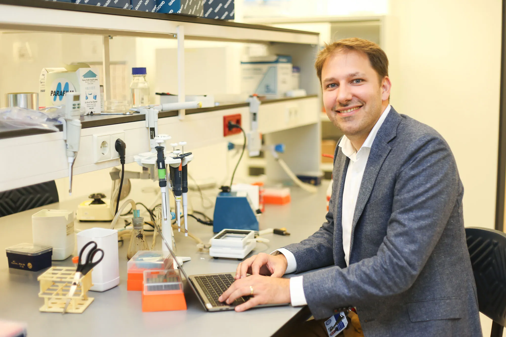
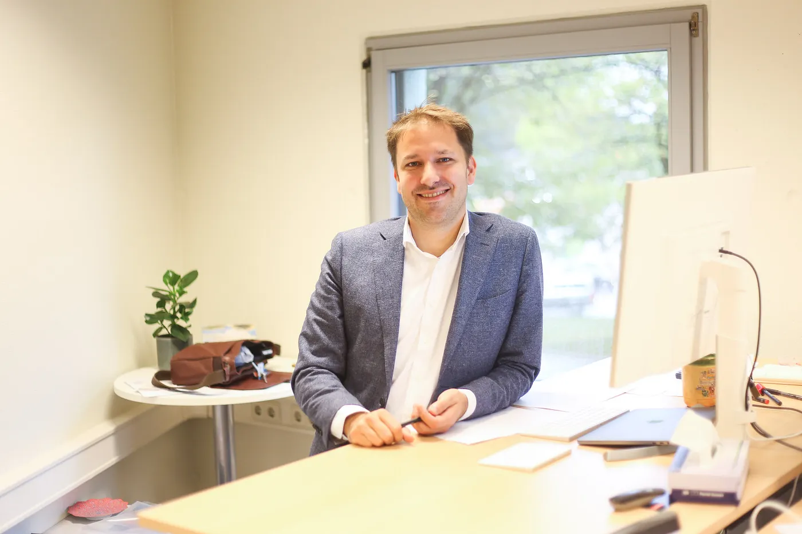
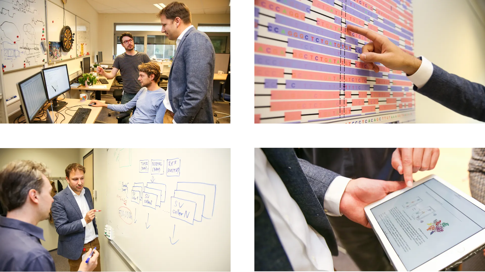
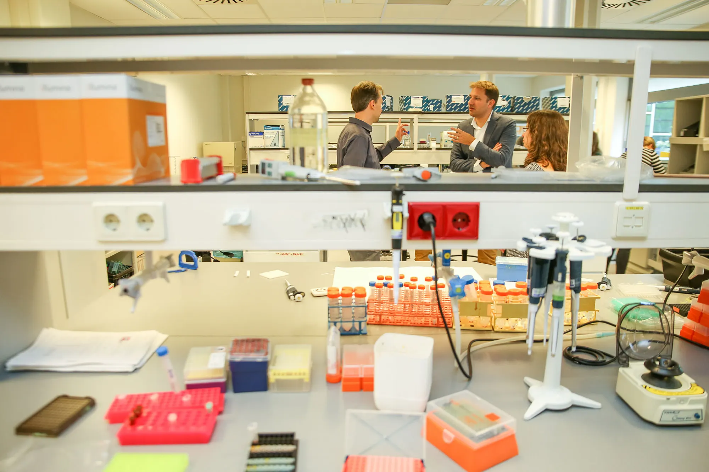
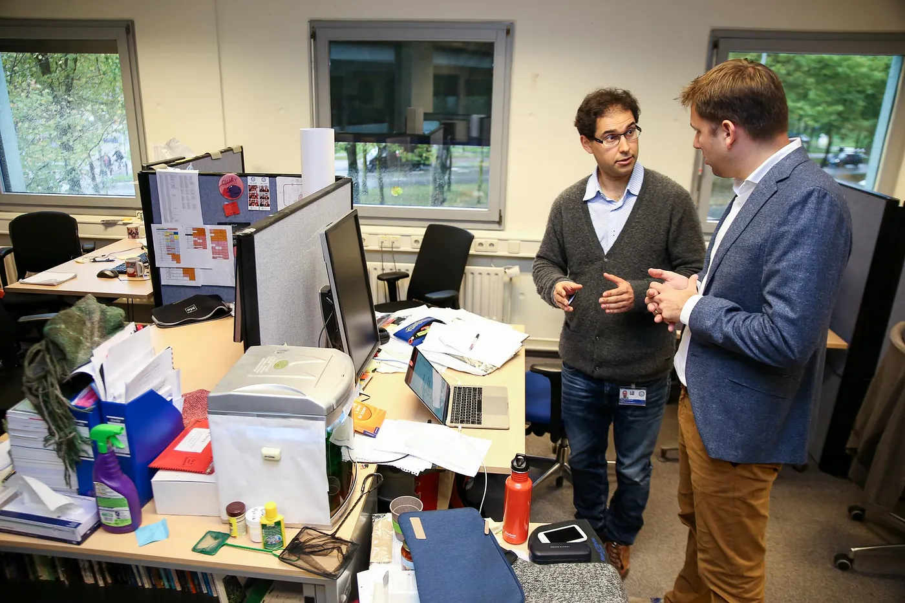
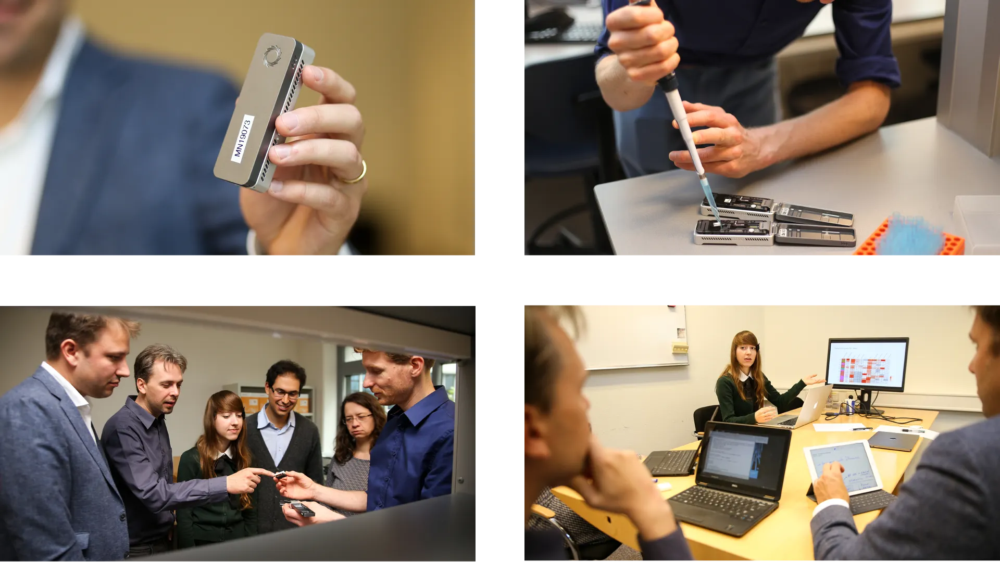
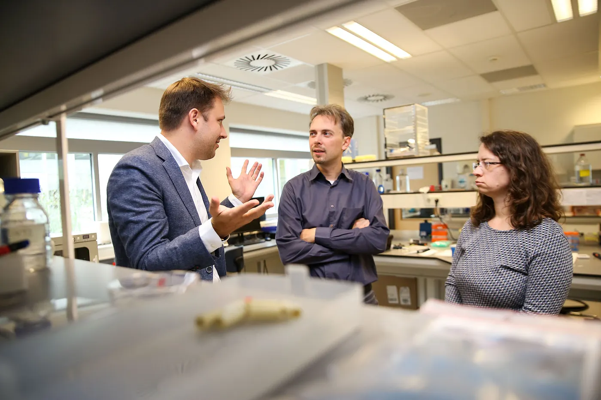
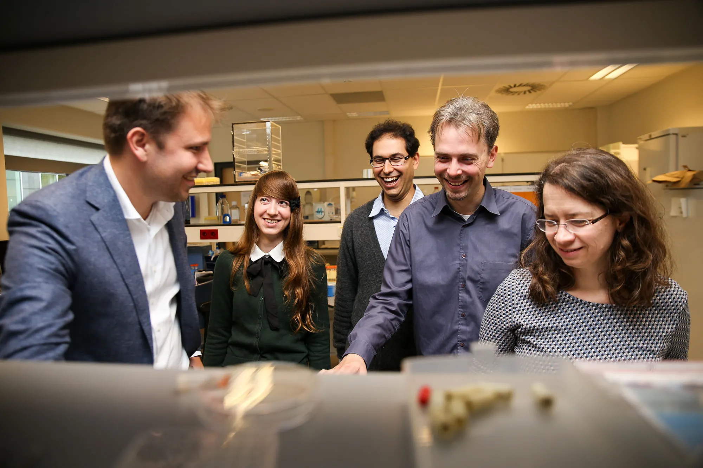
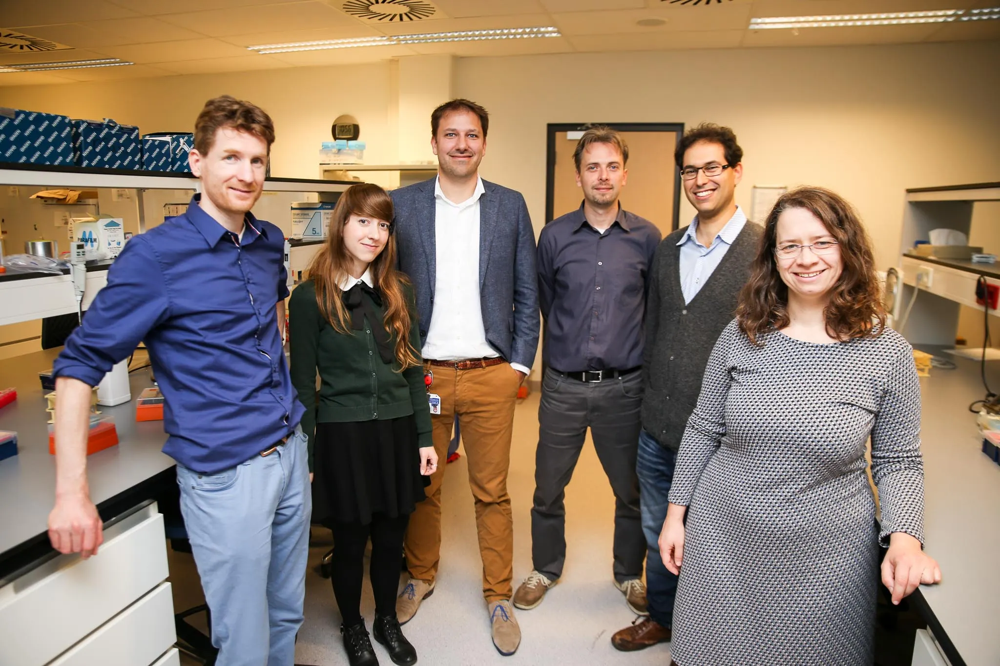

Jeroen de Ridder, Associate Professor at the University Medical Center Utrecht

*Photography: Elodie Burrillon |* [*http://hucopix.com*](http://hucopix.com/)

Jeroen de Ridder is Associate Professor at the University Medical Center Utrecht (UMCU). In 2016, Jeroen received a [grant](https://www.esciencecenter.nl/funding) and in-kind expertise from the [eScience Center](https://www.esciencecenter.nl/) for his project [Googling the cancer genome](https://www.esciencecenter.nl/project/googling-the-cancer-genome).

Jeroen’s ambition is to create data analytics methods that turn Big Data into value for the patient — in this project the aim is to develop new methods to drive the discovery of novel cancer genes.

“Before I joined the UMCU in May 2016, I was an Assistant Professor at Delft University of Technology. I also did my MSc degree there, originally in the field of Electrical Engineering, later in bioinformatics. My PhD was a joint research project between the Netherlands Cancer Institute and the Delft University of Technology.”

> “My ambition is to create data analytics methods that turn Big Data into value for the patient.”

### What do you find most exciting about life science research?

“Modern day life science has become so complex that there is only one way forward: bring together different expertises and collaborate.”

“Bridging the gap between expertise, medicine, genomics, biology, computer science and machine learning is incredibly rewarding and exciting. The possibilities to measure a wide range of phenomena is virtually limitless, the grand challenge is to make sense of them.”

Modern day life science requires collaboration between different expertises

### Biology and Big Data

“In our lab we create and apply innovative data science methods to advance our understanding of disease biology. Our research efforts are always inspired by a biological question and typically deal with big data, such as large-scale genomics and epigenomics datasets.”

“As a result, much of the research floats on machine learning and data integration algorithms. We also heavily rely on high-performance computing and statistics.”

### Personalized treatments for cancer patients

In the Googling the cancer genome project, Jeroen and his team are developing methods to discover novel cancer genes. Cancer affects millions of people worldwide.

With the advent of novel DNA sequencing technologies, genome sequencing has now started to become part of a routine workflow for cancer diagnostics. This has the potential to enable fine-tuned personalized treatments for cancer patients.

In spite of the massive genomic data production, systematic and comprehensive analysis of these data, in particular regarding the detection and interpretation of structural variation, is lagging behind due to computational and algorithmic limitations.

This is a state-of-the-art nanopore sequencer — a third-generation single-molecue sequencing device that can sequence long stretches of DNA and are particularly suited to provide insight into the structural variation in the human genome

### What is the scientific challenge that you aim to tackle by collaborating with eScience Research Engineers?

“I force myself to focus on the scientific questions. However, to be able to answer those, often times one or more challenging engineering questions need to be solved. We are not always suited to do that, or it can take too much time. By collaborating with eScience Research Engineers we dramatically speed up this process and tap into expertise and knowledge that we don’t have ourselves. This is proving to be an extremely fruitful way of doing science.”

> Collaborating with the eScience Center is proving to be an extremely fruitful way of doing science

### What kind of expertise do the eScience Research Engineers bring to your project?

“Arnold Kuzniar brings in a lot of expertise on ‘developing and porting bioinformatics workflows to High-Performance Computing infrastructures and on linking biological data(bases). Sonja Georgievska brings in deep learning and machine learning expertise.”

From left to right: Jeroen de Ridder, Marleen Nieboer, Carl Shneider, Arnold Kuzniar and Sonja Georgievska

### What does the future look like for your research area?

“In the near future, I hope we will be able to have applications of our methods in the clinic. This should give clinical geneticists the tools to find novel genomic variants involved in disease. On of the biggest challenges for the coming years will be to leverage the huge leaps in machine learning for clinical genomics. I hope the eScience Center recognizes these trends and will invest in data analytics and machine learning to anticipate this need”

From left to right: Wigard Kloosterman, Marleen Nieboer, Jeroen de Ridder, Arnold Kuzniar, Carl Shneider and Sonja Georgievska
