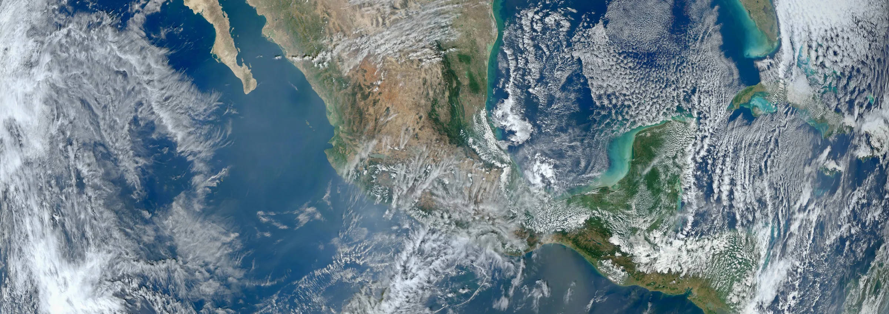
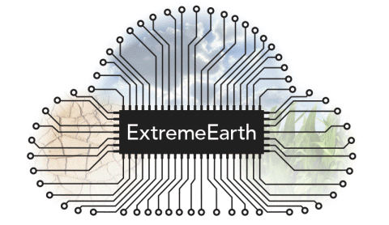

“The end of theory.” This is the title of an [article](https://www.wired.com/2008/06/pb-theory/) in Wired Magazine 10 years ago. No theory needed, the data deluge allows us to extract any knowledge by exploring data. This new empiricism received lots of attention and criticism. I came across it a few years ago when I started to immerse myself into the world of big data, artificial intelligence and computing. Having a background in climate research, I thought I knew all about computation and data. I was wrong.

Image Credit: NASA/NOAA/GSFC/Suomi NPP/VIIRS/Norman Kuring

I work at the [Netherlands eScience Center](http://www.esciencecenter.nl/) now, which is an expertise center on research software at the interface of computer and data science and research applications. I got fascinated by the [wealth of projects](https://www.esciencecenter.nl/projects) at the eScience Center. Astronomers plowing through Petabytes of data to find pulsars, high energy physicists fitting their models to data from particle accelerators in a massive parallel way, humanities scholars learning with machines from ancient texts, sociologists unraveling complex networks, medical scientists taking advantage of modern sequencing methods, imaging techniques and coupling to many other data sets. It is a world with new names as SPARK and XENON and where bright stickers cover laptops. It is only natural to think about my own field of research and what all these developments in data sciences entail.

In Earth sciences, including meteorology, it has been about theory and data in the past century. Based on theory, there is a quest for resolving finer scales in numerical models as physical processes interact seamlessly from the planetary to the molecular scales. Having a theory has large advantages. We know which equations to solve and theory limits state and parameter space in to explore. Still, to resolve deep convection, one of the most important drivers of the large scale weather and climate, at least a thousand-fold more computational resources are needed. New exascale computing developments are promising, but it will take much more than increasing generic computing resources and the machines are too energy-hungry. We clearly need new paradigms. Only through co-design with manufacturers, hardware vendors, software engineers, computer scientists and weather and climate scientists such a huge quest can be taken on. We can take astronomy for inspiration. Projects like LOFAR are a success due to co-design and its focus on research software and workflows to make very efficient pipelines. Only when we take such a professional approach that serves an entire community we can meet the demands.

> “Only through co-design with manufacturers, hardware vendors, software engineers, computer scientists and weather and climate scientists such a huge quest can be taken on”

Do we need new data science methods as well? Of course. Processes at unresolved scales are not fully understood and boundary conditions, think of details and characteristics of the land surface, are poorly known. Interactions and processes beyond the physical domain often don’t have a basic theory. There is already work ongoing in heuristic modelling for radiative transfer, turbulence and cloud characteristics. Not only can such studies aid in increasing understanding, it also enables to accelerate simulations. Again, taking advantage from computer and data science knowledge and domain knowledge will bring in the necessary interdisciplinary perspective to make progress.

The data integration is an even bigger challenge. There is so much data out there to take profit from. We can’t even count it. They say it must by Zetabytes. Using data from unconventional sensors in meteorology, such as my cell phone, is still at its infancy, let alone using social media data. Especially at short forecast horizons and at small scales, the heterogeneity of the environment and the limits of computation raises opportunities for machine learned models and to include unconventional data. Also, weather and climate information is just one source of information to base decisions on. It takes a much wider perspective on data and simulations to advance science and to advance informed decision making.

All of this seems daunting to work on, but in proposals like Extreme Earth (a Flagship project proposed to the European Commission), our community comes together and dares to dream and pass disciplinary boundaries. Digital technology when developed in co-design will help us to reach our goals. We are on a mission. Confronting theory and simulations at all scales with data interactively will allow us to increase scientific understanding and improve informed decision making. I am looking forward to that bright Extreme Earth sticker, the only one that may cover my laptop case.

