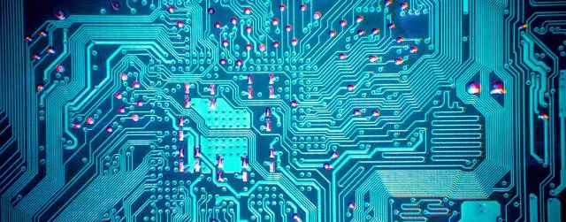
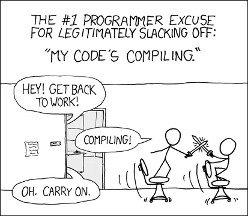
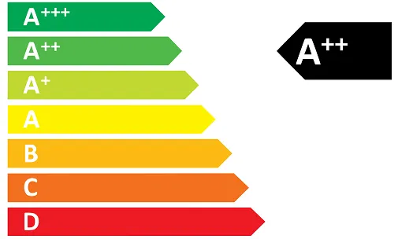

## The (dis)advantages of Field Programmable Gate Arrays

Recently, [Intel bought Altera](https://newsroom.intel.com/news-releases/intel-completes-acquisition-of-altera/), one of the largest producers of FPGAs. Intel paid a whopping $16.7 billion, making it their largest acquisition ever. In other news, [Microsoft is using FPGAs in its data centers](https://www.microsoft.com/en-us/research/wp-content/uploads/2014/06/HC26.12.520-Recon-Fabric-Pulnam-Microsoft-Catapult.pdf), and [Amazon is offering](https://aws.amazon.com/ec2/instance-types/f1/) them on their cloud services. Previously, these FPGAs were mainly used in *electronics* engineering, but not so much in *software* engineering. Are FPGAs about to take off and become serious alternatives to CPUs and GPUs?

## What is an FPGA?

If you want to compute something, the common approach is to write some software for an instruction based architecture, such as a CPU or GPU. Another, more arduous, route one could take is to design a special circuit for this specific computation — as opposed to writing instructions for a general purpose circuit such as a CPU or GPU.

Once you have designed this circuit, you need some way to implement the design so that you can actually compute something. One way, which requires quite deep pockets, is to actually produce a circuit that implements this design (this is called an Application Specific Integrated Circuit or ASIC).

An easier way, and the main topic of this blog, is to implement your circuit design is to use a *Field Programmable Gate Array* (FPGA), a *reconfigurable integrated circuit*. You can configure the FPGA to become any circuit you want to (as long as it fits on the FPGA). This is quite a bit different than the *instruction-based hardware* most programmers are used to, such as CPUs and GPUs. Instruction-based hardware is configured via *software*, whereas FPGAs are instead configured by specifying a *hardware* circuit.

## (Dis)Advantages of FPGAs

Why would you prefer to use an FPGA for your computation over the more common CPU or GPU? The differences with GPUs and CPUs are in the following areas:

- **Latency**: How long does it take to compute something?  
	→ FPGAs are good at this.
- **Connectivity**: What input/output can we connect and with which bandwidth?  
	→ FPGAs can directly be connected to inputs and can offer very high bandwith.
- **Engineering cost**: How much effort does it cost to express the computation?  
	→ The engineering cost is typically much higher than for instruction based architectures, so the advantages must really be worth it.
- **Energy efficiency**: How much energy does it cost to compute something?  
	→ This is often listed as a large benefit of FPGAs, but whether FPGAs are better than CPUs or GPUs really depends on the application.

Let’s discuss each of these in more detail.

## Low latency

Low latency is what you need if you are programming the autopilot of a jet fighter or a high-frequency algorithmic trading engine: the time between an input and its response as short as possible. This is where FPGAs are much better than CPUs (or GPUs, which have to communicate via the CPU).

With an FPGA it is feasible to get a latency around or below 1 microsecond, whereas with a CPU a latency smaller than 50 microseconds is already very good. Moreover, the latency of an FPGA is much more deterministic. One of the main reasons for this low latency is that FPGAs can be much more specialized: they do not depend on the generic operating system, and communication does not have to go via generic buses (such as USB or PCIe).

A couple of FPGAs in mid-air (probably)

## Connectivity

On an FPGA, you can hook up any data source, such as a network interface or sensor, directly to the *pins of the chip*. This in sharp contrast to GPUs and CPUs, where you have to connect your source via the standardized buses (such as USB or PCIe) — and depend on the operating system to deliver the data to your application. A direct connection to the pins of the chip gives very high bandwidth (as well as low latency).

This high bandwidth is needed, for example, in radio-astronomy applications, such as [LOFAR](http://www.lofar.org/about-lofar/about-lofar) and [SKA](https://www.skatelescope.org/). In these applications there are a lot of specialized sensors in the field, which generate an enormous amount of data. The volume of data needs to be reduced before being sent off, to make it more manageable. For this purpose, the Netherlands Institute for Radio Astronomy, [ASTRON](https://www.astron.nl/), designed the [*Uniboard²*](https://www.astron.nl/r-d-laboratory/uniboard/uniboard-i-and-ii), a board with four FPGAs which can handle more data per second than the Amsterdam internet exchange.

These small radio astronomy antennas generate a lot of data (image credit: Svenlafe at en.wikipedia )

## Engineering cost

Before turning to the subtle issue of energy efficiency, let’s discuss the main disadvantage of FPGAs: they are really *much* harder to program/configure than instruction based architectures (i.e. CPUs and GPUs). Traditionally, these hardware circuits are described via *Hardware Description Languages* (HDL), such as VHDL and Verilog, whereas software is programmed via one of a plethora of programming languages, such as Java, C and Python.

From a theoretical perspective, both hardware description languages and programming languages can be use to express any computation (both are Turing complete), but the difference in engineering details is vast.

An upcoming trend is High Level Synthesis (HLS): programming FPGAs using regular programming languages such as OpenCL or C++, allowing for a much higher level of abstraction. However, even when using such languages, programming FPGAs is still an order of magnitude more difficult than programming instruction based systems.

==A large part of the difficulty of programming FPGAs are the== ==**long**== ==compilation times. For example, when using Intel’s OpenCL compiler, it takes somewhere between 4 and 12== ==*hours*== ==to compile a typical program for the FPGA. This is due to the== ==*place-and-route phase*====: the custom circuit that we== ==*want*== ==needs to be mapped to the FPGA resources that we== ==*have*====, with paths as short as possible. This is a complex optimization problem which requires significant computation. Intel does offer an emulator, so testing for correctness does not require this long step, but determining and optimizing performance does require these overnight compile phases.==

Programming FPGAs gives you a lot of time to slack off (image credit: XKCD )

## Energy efficiency

In their communications, Intel is always touting energy efficiency as a clear benefit of FPGAs. However, the situation is really not that clear cut, especially when it comes to floating point computations, but let us first consider situations where FPGAs are clearly more energy efficient than a CPU or GPU.

Where FPGAs shine in terms of energy efficiency is at logic and fixed precision (as opposed to floating point) computations. In crypto-currency (such as bitcoin) mining, it is exactly this property that makes FPGAs advantageous. In fact, everyone used to mine bitcoin on FPGAs.

By the way, nowadays everybody is using ASICs (Application Specific Integrated Circuit) for bitcoin mining. Which are special integrated circuits built for just one purpose. ASICs are an even more energy efficient solution but require a very large upfront investment for the design and large number of chips produced to be cost effective. But back to FPGAs.

Another benefit of FPGAs in terms of energy efficiency is that FPGA boards *do not require a host computer to run,* since they have their own input/output — we can save energy and money on the host. This in contrast to GPUs, which communicate with a host system using PCIe or NVLink, and hence require a host to run. (An exception to the rule that GPUs require a host is the [NVidia Jetson](https://developer.nvidia.com/embedded-computing), but this is not a high-end GPU.)

## Energy efficiency for floating point — FPGA vs GPU

A lot of high performance computing use cases, such as deep learning, often depend on floating point arithmetic — something GPUs are very good at. In the past, FPGAs were pretty inefficient for floating point computations because a floating point unit had to be assembled from logic blocks, costing a lot of resources.

Newer FPGAs such as the [Arria 10](https://www.altera.com/products/fpga/arria-series/arria-10/overview.html) and [Stratix 10](https://www.altera.com/products/fpga/stratix-series/stratix-10/overview.html) have *built-in* floating point units on the FPGA fabric, making them much better at floating point computations. Does the addition of floating point units make FPGAs interesting for floating point computations in terms of energy efficiency? Are they more energy efficient than a GPU?

Let’s compare a state-of-the-art GPU to a state-of-the-art FPGA. The fastest professional GPU that is available now is the [Tesla V100](https://images.nvidia.com/content/technologies/volta/pdf/tesla-volta-v100-datasheet-letter-fnl-web.pdf), which has a theoretical maximum of 15 TFLOPS (Tera-floating-point-operations per second, a standard means of measuring floating point performance) and uses about 250 Watts of power. One of the best available FPGA boards now is the [Nallatech 520C](http://www.nallatech.com/wp-content/uploads/Nallatech-520C-Product-Brief-V9.pdf), which uses the new [Statix 10 Chip](https://www.altera.com/products/fpga/stratix-series/stratix-10/overview.html#family-table) by Altera/Intel. This card has a theoretical maximum of 9.2 TFLOPS and uses about 225 Watts of power.

If we compare these two devices on energy efficiency, the GPU appears to be more energy efficient, achieving 56 GFLOP/W (Giga-floating-point-operation per Watt, a standard means of measuring energy efficiency of float point performance) in theory, while the FPGA achieves only 40.9 GFLOP/W. So if you’re going to buy new floating point hardware right now, and you need a host computer, then it seems you’re better off with the GPU, at least in this crude comparison.

However, the difference is small, and it is very possible that a new FPGA card, such as [this upcoming card](https://www.bittware.com/fpga/intel/boards/s10vm4/) based on the Stratix 10 FPGA, is more energy efficient than the Volta on floating point computations. Moreover, the above comparison is between apples and oranges in the sense that the Tesla V100 is produced at a12 nanometer process, whereas the Stratix 10 is produced at the older 14 nanometer process.

While the comparison does show that if you want energy efficient floating point computations *now* that it is better to stick with GPUs, it does *not* show that GPUs are inherently more energy efficient for floating point computations. The battle for floating point energy efficiency is currently won by GPUs, but this may change in the near future.

Energy label for FPGAs: depends on the application (Image copyright: European Union)

If the host is not required, then a comparison between a high end *GPU with a host* and an high end *FPGA without a host* is in order. If we use the same numbers as in the above comparison, then a GPU with a host and an FPGA without a host are exactly as energy efficient if the host takes 116.7 Watts (per GPU in the case of a multi-GPU setup). A modern host consumes somewhere in the 50–250 Watt range, making the FPGA much more competitive.

## Overview and outlook

In some areas, it is hard to get around FPGAs. In military applications, such as missile guidance systems, FPGAs are used for their low latency. In radio-astronomy applications, the specialized input/output of FPGAs is essential to process the huge amount of data. In crypto-currency mining the energy efficiency on fixed precision and logic operations of FPGAs can be advantageous.

Artist’s impression of the yet to be built SKA radio telescope (image credit: SKA Organisation/Swinburne Astronomy Productions)

However, Intel did not spend $16.7 billion on Altera just for these somewhat niche-markets — they have bigger plans for it. The two markets they want to infiltrate are, as far as I can tell, high performance computing and cloud computing (i.e. use in amazon-like centers).

### FPGAs for High Performance Computing

Personally, I do not think FPGAs will make a big splash in the high performance computing market in the coming years. Even if they become slightly more energy efficient than GPUs, the development of software for FPGAs is still a lot more difficult than for GPUs. The HPC community is already used to GPUs — getting people to switch from GPUs to FPGAs requires larger benefits. In the longer run, i.e. more than 5 years, it might turn out that FPGAs do offer such large benefits, which is what Intel seems to be hoping.

### FPGAs for Cloud providers

The other market is cloud providers. Intel envisions cloud servers to have an FPGA or to run on an CPU-FPGA hybrid. The idea is that certain parts of the computation can be offloaded to the FPGA and/or that FPGAs can be used to customize the network topology.

Microsoft, no doubt in cooperation with Intel, [has implemented using FPGAs in its datacenters](https://www.microsoft.com/en-us/research/wp-content/uploads/2014/06/HC26.12.520-Recon-Fabric-Pulnam-Microsoft-Catapult.pdf) and has a network of 100.000 FPGAs. Microsoft is touting big benefits in terms of performance of Bing search, which now is computed partially by FPGAs, and flexibility. Amazon is also offering FPGA nodes on its popular EC2 platform. Whether this trend continues remains to be seen.

### Outlook

So are these previously esoteric FPGAs about to go mainstream? Personally, I’m skeptical. I think that for FPGAs to really take off two things are needed:

- ==They should be much easier to== ==**program**====,== especially by bringing down compile times.
- They should be more **energy efficient** on floating point computations.

Intel is working hard on these issues, but these are very large hurdles to take.

Do you have comments or more information? Leave a note in the comments!

Want to know more? A lot of information can be found here:

[https://www.nextplatform.com/tag/fpga/](https://www.nextplatform.com/tag/fpga/)
