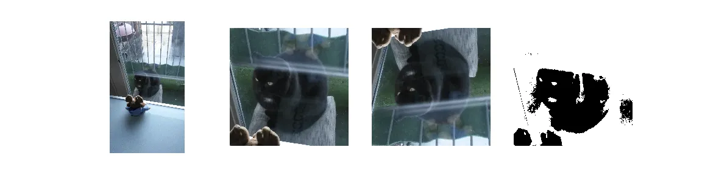

## A list of resources to kick-start your workshop

I wanted to organize a workshop on image processing for PhDs in the medical domain. I usually use [Software Carpentry lessons](https://software-carpentry.org/lessons/) in my workshops, but there are no lessons on image processing. Before starting to re-invent the wheel, I thought I should ask the Software Carpentry community if anybody had given a workshop like that recently.

> Hey guys, image processing lesson anyone?

I was hit by a wave of suggestions and existing materials — and although not everything fitted in the scope of my workshop, it sure made my life a lot easier! Here is a summary of some of the useful links which were shared.

## List of resources

- [Python tutorial focused on packaging, testing, and  
	performance using very simple image analysis](https://python-102.readthedocs.io/en/latest/).
- [Example worked through with a group,](https://github.com/tomwright01/imp-parallel) cone counting using scipy.
- Check out the [scipy lecture notes](https://www.scipy-lectures.org/) (in the end this is mostly what I did).
- [Two-day workshop](https://git.embl.de/grp-bio-it/python-workshop-image-processing) on image processing with Python. This course teaches the basics of bio-image processing, segmentation and analysis in python.
- [Image Processing I](http://bi1x.caltech.edu/2016/handouts/image_processing_1.html), basic techniques for image processing using scikit-image with Python
- [Digital Imaging and Vision Applications in Science](https://mmeysenburg.github.io/image-processing/) (DIVAS) Image Processing, using Python and OpenCV to do basic image processing — I really liked this lesson, because OpenCV is super powerful, but was a bit afraid it wouldn’t work in some people’s laptop.
- [PSYCH 214](https://bic-berkeley.github.io/psych-214-fall-2016/arrays_and_images.html), arrays as images, images as arrays.
- [Playing with images & filters](https://github.com/luispedro/python-image-tutorial), use numpy and [mahotas](https://mahotas.readthedocs.io/en/latest/) to manipulate images.
- [Lots of materials at scikit-image](https://github.com/scikit-image/skimage-tutorials/tree/master/lectures), The numbered ones are the most complete/polished.
- Developing [image processing lessons at Stanford](https://github.com/DataLucence/images), for graduate students in neuroscience.

## In the end

In the end, I had all the material that I wanted for [my workshop](https://escience-academy.github.io/2018-08-29-BQMinded/material/ImageProcessing.pdf), which went quite well — with the usual issues one encounters in a workshop: too basic for some, a bit confusing for others. One day I will find the perfect balance.

Do you have any valuable resources to include in the list? Let me know in a comment below!

*Also posted* [*here*](https://carpentries.org/blog/2018/09/image_processing_resources/)
