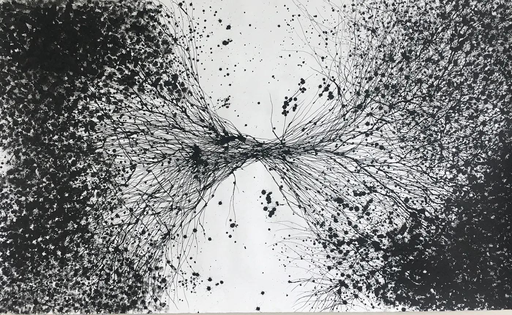
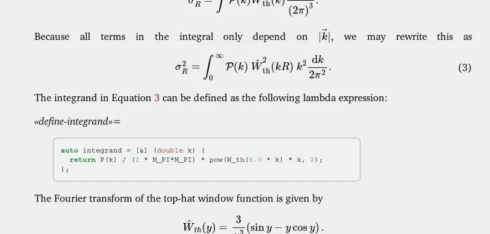

## a bi-directional Literate Programming tool



© Alessandra Sequeira, Entanglement ( http://sinapsisequeira.blogspot.com/ )

I present *enTangleD* ([github.io pages](https://entangled.github.io/)), a tool for pain free literate programming.


Donald Knuth

There’s no way I can write about literate programming not starting at the source: Donald Knuth, the great master and chief, writer of “The Art of Computer Programming”, “Surreal Numbers” and inventor of *literate programming*. He coined this term somewhat maliciously, thinking that “nobody wants to admit writing an *illiterate* program”. So what is literate programming?

Knuth considers code as a way of communicating with a computer. As you write code you are *teaching* the computer how to perform a certain task. However, many times when you’re programming, you’re not just teaching the computer. You are also teaching your (very human) peers. This is why so many teachers drone on about:

- clean code
- simple solutions
- extensive documentation

Literate programming goes much further than that. A literate program is a program that can be read as a work of literature. Specifically, we write the *entire* program as a document (be it Markdown, Org-mode or LaTeX) explaining what the program does and how this is implemented in plain English. The actual implementation, in whatever language you may prefer, is sprinkled around in the form of code blocks. For those who are familiar with Jupyter notebooks, or the notebook interface to Mathematica: notebooks can be considered a form of literate programming, but there are differences which we will discuss later on.

An example of how a woven literate program looks can be found in my numerical code to compute cosmological structure formation [“Computing the adhesion model using C++ and CGAL”](https://jhidding.github.io/adhesion-code/) ([DOI:10.5281/zenodo.1477535](https://doi.org/10.5281/zenodo.1477536)).



Screenshot of woven literate code.

The principles underlying literate programming, merely prudent in most circumstances, become essential once we consider writing and publishing code for the scientific community, for several reasons.

- **scientific meticulousness:** Scientific works are supposed to be held to exacting standards. These standards are upheld by systems of peer-review and demands of precise reporting of methodology. These standards are often surprisingly lax when it concerns the use of software. This problem is for a large part addressed by the “Open Science” movement in general, stimulating the use of open source software in science. Still, even if code is open source, this does not mean that this code can be easily understood.
- **epistemology:** Epistemology is the theory of *knowledge* and part of the philosophy of science. When can we say we know something? When was the theory of relativity born? Was it when Einstein woke up after having a dream about trains, mirrors and flashlights, or after he successfully wrote his theory down in such a way that one other person could understand it? Think about it.
- **programming literacy:** Scientists create a lot of computer code, but are, in general, not professionally trained programmers. This increases the need for exposure to each others code. Literate programming stimulates other people to actually read your code, while you’ll have an easier time reading other people’s code. This interaction should make better programmers of all of us.

Knuth developed a system called *WEB* for annotating TeX with the relations between the different code blocks. *WEB* came with two tools: *tangle* and *weave*. The *tangle* tool takes the literary source, parses the *WEB* references therein and pastes together traditional source files that can be subsequently compiled into a working binary. *Weave* converts the (annotated) TeX source into a secondary TeX that is ready for type setting and publishing. We will refer to these programs as the *tangler* and *weaver*.

There is a practical issue with this form of literate programming. We’re having the true source code in a different place than the compiler, debugger and IDE think it is, and this breaks the usual development cycle. If one were to develop a system for literate programming today, it would look a bit different. I will now explain a Markdown based system and present a tool called *enTangleD* that makes the development cycle of literate programs a smoother experience.

## Literate programming in Markdown


© Alessandra Sequeira, Inner Foliage ( http://sinapsisequeira.blogspot.com/ )

[Markdown](https://daringfireball.net/projects/markdown/) has become a standard way of expressing text documents (without there being a standard and moreover many different flavours). Markdown can be converted to HTML, LaTeX and many other formats. Everyone’s favourite tool for markdown conversion is of course [PanDoc](https://pandoc.org/). One guiding principle in the following design is that the resulting Markdown is parsable by PanDoc. We will be denoting code blocks using three back ticks on the opening and closing line of the code block like so:

```hs
\`\`\`py
print("Hello, Amsterdam!")
\`\`\`
```

One way of denoting the programming language of the code block is by extending the opening back ticks with an accepted abbreviation of the language. In the above example we tell the document formatter that the given source code is written in Python. For our purpose this syntax is not flexible enough. We want to extend the code block meta-data with other properties. PanDoc supports attaching a CSS class, id and attributes to code blocks using curly brackets:

```hs
\`\`\` {.py file=hello.py}
print("Hello, World!")
\`\`\`
```

In this system of literate programming the tangler will extract this code block and write it to a file \`hello.py\`. More complicated programs can be built using a system of references. Keeping with Python, it is considered good form to enclose a main script using the following \`if\`-statement:

```hs
\`\`\` {.py file=hello2.py}
if __name__ == "__main__":
    <<main-body>>
\`\`\`
```

We can define the body anywhere else in the document:

```hs
\`\`\` {.py #main-body}
print("Hello, Universe!")
\`\`\`
```

The tangler will then combine these code blocks into a single file:

```hs
if __name__ == "__main__":
    print("Hello, Universe!")
```

The system of references allows us to decompose a program into literary parts, putting the code in a didactic narrative.

## enTangleD


© Alessandra Sequeira, Inner Shadow ( http://sinapsisequeira.blogspot.com/ )

As I mentioned before, there is a practical problem with developing software in the way I described above. All our code is in one or more Markdown files. If we want to build it, we first have to tangle, then, if we work with a compiled language, compile, hope that nothing goes wrong and run. But what if we have compiler errors, or worse, the program compiles but doesn’t give the expected output? We then enter the usual edit-compile-debug cycle. The source files that we work on were generated by the tangler and it makes no sense editing them directly. In comes *enTangleD*! The D stands for *daemon*.

*enTangleD* monitors both the Markdown and the generated source files for changes. If a source file changes, the corresponding code blocks in the Markdown are updated accordingly, and the other way around. To make this work, *enTangleD* writes the source code with commented markers telling the daemon where in the Markdown file the code comes from.

## Alternatives

There exist alternatives to our Markdown based literate programming model:

- **Jupyter:** [Jupyter](https://jupyter.org/) gives you an interactive notebook environment for any language that has a Jupyter kernel written (there are many). Advantages are: interactivity, inline graphing, good for experimentation. Disadvantages: Jupyter notebooks do not play well with git version control, the interactivity also doesn’t play well with compiled languages and lastly provenance is not guaranteed since the order of cell-execution is not fixed. Jupyter is awesome, but it is not perfect.
- **literate Haskell:** Haskell programmers write their papers in *literate Haskell*. This is very fine for Haskell. *enTangleD* is completely language agnostic.
- **Pweave**, **Weave.jl**, **Racket Scribble**, etc: these are all language specific.
- **Org-mode:** if your editor of choice is Emacs and your document is only supposed to be opened by like-minded people, Org-mode is the awesomest;). Still, it does not support bi-directional tangling.

## Try it yourself!

Try *enTangleD* for yourself! *enTangleD* is written in Haskell and source code is hosted on [GitHub](https://github.com/jhidding/entangled). The repository also contains an example Markdown file containing source code for an over-engineered C++ implementation of [“99 bottles of beer”,](https://jhidding.github.io/enTangleD/99-bottles.html) and a small browser game called [“Slasher”](https://jhidding.github.io/enTangleD/slasher.html) which is [implemented in Elm](https://jhidding.github.io/enTangleD/elm-slasher.html).
