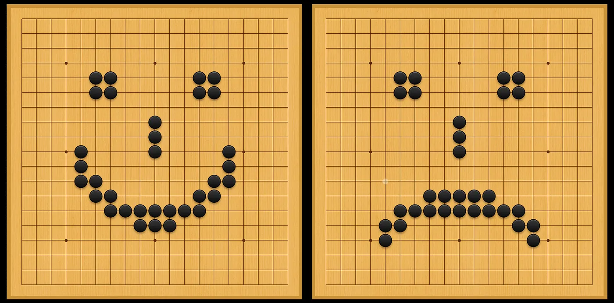

**#demystifyAI series** (this small series aims at putting important AI-related aspects into perspective)

Why you shouldn’t be afraid of AI tools occasionally performing ***superhuman*** in some tasks. And why **you** are the true superhuman being.

Superhuman performance is nothing rare. Here: humans forming a “superhuman” tower. Photo by Alessandra Pezzotta, published under CC BY license.

I started my first hands-on training in machine learning and AI right after the GO matches between alpha go and Lee Sedol. At that time, it still felt a bit like a miracle to me. Not the shear fact that a computer would beat a world leading go player, but more the way it played and surprised the professional commentators.

That was 3 years ago and the news were full of the “rise of AI” and the new area of superhuman AI. I had the feeling that a lot of that was silly, but at the same time I had not enough in-depth knowledge on AI to prove some wild claims to be wrong.

I guess over time it just became a bit too much for me. If you sit in the wrong social media bubble, **it must feel as if Superhuman AIs are already taking over** the world. A recent headline I saw in a bigger newspaper was *“Superhuman’ robots will outstrip mankind within 50 years, warns AI expert”*

Yeah. Sure…

## Superhuman? So what!

So here’s the thing. ***Superhuman*** apparently sounds like something special, like science fiction that has become real. It absolutely is not. It only means “above”, “over”, “beyond”, “better than” a human. And if you think about it for a second, this is something entirely ordinary. We make use of superhuman powers since thousands of years!

Humans started domesticating animals more than 10.000 years ago.[^1] And this was often not primarily to get meat, but to make use of their ***superhuman*** powers. Dogs would have superhuman smell and hearing. Oxen or horses were used for their superhuman strength.

Figure 1. There is a long history of using animals for their superhuman powers. Top: Ancient picture of oxen, dogs (“Painter of the burial chamber of Sennedjem”, ca. 1200 BCE, https://en.wikipedia.org/wiki/File:Maler\_der\_Grabkammer\_des\_Sennudem\_001.jpg Bottom: Image from a Krater depicting an ancient boar hunt, 550BC, British Museum, https://en.wikipedia.org/wiki/File:Boar\_Hunting.jpg

Yes, true. Those aspects wouldn’t touch our holiest humans-only domain: cognitive tasks! But here as well, ***superhuman*** might be little more than an over-used buzzword.

Take the development of “writing” for instance. This can be seen as a way to externalize knowledge or memories. Also a diverse set of tools to help humans to do calculations have a long history, going back thousands of years.[^2] Electronic calculators have long beaten our modest capabilities to doing calculations (quickly). And yet, nowadays nobody would look at one of them and feel the terror of being beaten by a machine!

Figure 2. Olivetti Programma 101, 1965–1971, Museo nazionale della scienza e della tecnologia Leonardo da Vinci, Milano, Creative Commons Attribution-Share Alike 4.0 International license. ( https://en.wikipedia.org/wiki/File:Olivetti\_Programma\_101\_-\_Museo\_scienza\_e\_tecnologia\_Milano.jpg )

But let’s finally quick jump to today. Now, with the help of modern computers and algorithms, AI finally seems to be ahead of us in an ever increasing number of tasks! And that’s true. Current computers are fast enough to produce amazing results using modern or semi-modern algorithms or methods.[^3]

Computers now can beat us in the most classical board games (GO, chess). They correctly classify pictures, spoken and written language, and to some extent can drive a car. Amazing stuff. And those developments have quite an impact already. And they for sure will have far more impact in the near future. But the way the adjective **superhuman** is used in those contexts is often heavily misleading.

## AI savantism

Until today, all, really **all** AI and machine-learning tools and products are only superhuman in one or few very specific aspects. Not much difference to the historic examples given above.

Intelligence and learning are very complex concepts. Projecting the isolated performance in only one single, restricted area onto a “general” concept of intelligence or learning, will nearly always lead to wrong and often ridiculous conclusions. Such entirely wrong predictions were made based on early AI successes in the 1960s and then later in the 1980s. And I am convinced that we see something very similar happening in recent years.\[4\]

> “In from three to eight years we will have a machine with the general intelligence of an average human being.”  
> Marvin Minsky, 1970 in Life Magazine (though he believed to be misquoted here…)
> 
> “machines will be capable, within twenty years, of doing any work a man can do”,  
> H.A. Simon, 1965

Along the same lines, a very nice 2017 article in the magazine *Wired* made very clear that describing intelligence as an one-dimensional characteristic is the wrong way to go. They also make a strong case against a linear ladder-like evolution towards high, human intelligence.

> “Intelligence is not a single dimension, so ‘smarter than humans’ is a meaningless concept.”  
> [Wired, 2017](https://www.wired.com/2017/04/the-myth-of-a-superhuman-ai/)

I am not saying that there is no threat for certain parts of the job markets. Just as the industrial revolution(s), and later phase of automation has already made many jobs obsolete, this is very likely to happen through AI-based applications as well. Maybe even more rapidly and drastically. And there are huge issues with AI algorithms being applied improperly or being given too much trust at important positions (e.g. deciding about loans, assurances etc.).

But the mere ability to perform superhuman in **ONE** thing, shouldn’t spark too much terror. No matter how long we train their neural networks, alpha Zero and his brothers and sisters will never learn why we play a board game at all. Or how to leave the building when the fire alarm goes off. It is only trained to understand [^5] one narrow interpretation of a 19x19 grid with black and white stones on it.

Figure 3. Alpha Zero can outplay any human go player easily. But anything that is not a typical go situation, even if it’s within the limited 19-by-19 grid horizon, it won’t get. Both board situations depicted here will mean the same to the AI: ‘100% black wins, white to resign’. Illustration by Florian Huber, can be reused under the CC BY license

How little current AI tools are able to generalize, and how restricted their trained capabilities are, becomes evident if we look at so called “adversarial examples”. In essence, these are examples that were specifically designed to trick AI tools. The same way optical illusions reveal a lot about how we humans perceive the world, adversarial examples give us a good sense of how AI tools work. One of the earlier examples that became widely known in the AI community was a technique to add a specifically designed but imperceptible (imperceptible to humans that is) signal to an image which would result in an entirely wrong classification of the image by the respective neural network (Figure X).

Figure 4. An adversarial example from 2015 which became quite popular. Here an image of a panda is altered by adding a specific, but imperceptible signal on top. To the human eye the picture obviously remains a panda, while the neural network suddenly is convinced that the picture shows a gibbon. Figure adapted from \[Goodfellow, Shlens, Szegedy, 2015\].

A more recent example reveals the AI’s very limited “understanding of the world” even more strikingly. A group of AI researchers designed a sticker that will trick a neural network to believe it sees a toaster. [^6] This example is surprisingly robust and works for many standard neural networks used for image interpretation.

**Figure 5** / Youtube-movie. More recent adversarial examples. The authors of [this paper](https://arxiv.org/pdf/1712.09665.pdf) designed a sticker that will trick a typical neural network used on images to believe it sees a toaster.

Every AI technique that hits the market right now is of the most extreme form of **hyper-savantism**. Very good at one thing. Terrible at practically anything else. Let them be mono-superhuman then. It will still never make them truly super-human.

## Collective intelligence

A much more meaningful concept of “superhuman” lies in the power of collective and symbiotic phenomena. This is also how Francois Chollet [^7] describes it in his [fantastic blog post on the same topic](https://medium.com/@francois.chollet/the-impossibility-of-intelligence-explosion-5be4a9eda6ec).

The baseline here is: You know what has more general intelligence than a human? **More humans collaborating!**  
Following his arguments, human intelligence and learning are concepts that cannot be understood by looking at individual brain power, but are tightly linked to collective and collaborative interactions and human civilization or society as a whole.

> “Most of our intelligence is not in our brain, it is externalized as our civilization”  
> Francois Chollet (in his [blog post](https://medium.com/@francois.chollet/the-impossibility-of-intelligence-explosion-5be4a9eda6ec.))

Figure 6: Human intelligence cannot be thought as an isolated, individual brain. Our tools, surroundings, and our society are part of us. We are hence all truly superhuman beings! Illustration by Florian Huber, can be reused under the CC BY license.

More than ever we rely on knowledge, expertise, and skills of other human beings in our daily life. We rely on superhuman bodies of knowledge collected and processed over countless generations. We rely on complex societal constructs, on a sophisticated educational and health care system, etc. As human beings, we cannot be described by only looking at our individual brain. What we are, what we do, and what we think is inextricably linked with our body, our surroundings, and the society around us.[^8]

AI tools, agents, methods will continue to grow into more and more functions around us. AI will hence become a bigger part of our society. And thereby AI will become a bigger part of us. Next to our supposedly essential co-existence with biological life on and within us (think gut microbes [^9], but also the ecosystem), we will also become more machine. [^1]

## Sounds frightening?

Well, first of all I would argue most of us are anyway already cyborgs to quite some extent. I know a lot of people that would have less trouble adapting to the removal of one of their legs than to the removal of their smartphone and computer.[^10]

Secondly, I don’t see how this is qualitatively different from the many other dependencies that we have long accepted in our daily life. In the end, making use of all kind of tools to perform things faster, better, or easier, or achieve things out-of-reach is one key aspect of human civilization.[^11] One could even argue that one of the main driving forces in human history is probably the desire to outgrow human limitations. Currently developed AI tools are only the next items on the list.

AI might perform at superhuman level in some, typically very narrow, tasks. But AI is no other competing species, AI has no consciousness, no self-awareness, no personality, no own body. In my opinion we should avoid any panicking notion of **“them or us”**. AI is a tool. And as such it will become part of *our* intelligence.[^12]

**\*** You know what’s even has more general intelligence than a human? More humans collaborating. This blog post was edited and commented on by several other people. Thanks to Nicholas Renaud,

[Tom Bakker]

,

[Maarten van Meersbergen]

, Christiaan Meijer,

[Johan Hidding]

,

[Patrick Bos]

, Sophie Pfaff for making it a superhuman blog post.

## Footnotes:

[\[10\]](#_ftnref1) [In this blog post or I should better say BOOK](https://waitbutwhy.com/2017/04/neuralink.html), Tim Urban even thinks about humans becoming AI. This text is huge and also makes similar remarks than this post or Francois Chollet’s on why human intelligence needs to be understood as a collective phenomenon. Also contains a lot about the evolution of the brain, the brain itself, and a lot of other stuff worth reading! I am not entirely convinced by the narrative of a steady, continuous evolution of human intelligence, see [\[4\]](#_ftnref4) and [wired article](https://www.wired.com/2017/04/the-myth-of-a-superhuman-ai/).

[^1]: See [animal husbandry](https://en.wikipedia.org/wiki/Animal_husbandry). Or [\[MacHugh et al. 2017\]](https://www.annualreviews.org/doi/10.1146/annurev-animal-022516-022747)

[^2]: Such as the [abacus](https://en.wikipedia.org/wiki/Abacus)

[^3]: Many of the key ideas behind today’s AI methods come from the 1980s, but there simply wasn’t enough computational power and data to reveal their full potential at that time.

[^4]: One popular example might be the one-dimensional intelligence concept used by author Nick Bostrom (in his book “superintelligence”) and many others. Here the argumentation is always surprisingly simple and pretty much the same as in the 60s and 80s. This would go like: OK yesterday we had tools that could do tasks on the level of an ant, today we have tools that can do tasks of a mouse, so tomorrow we will reach human or superhuman level. Simple interpolation (ignoring some very wrong assumptions in the first place and that the problem is not suited for simple approaches). For further discussion and criticism of such standpoints, see also [wired article](https://www.wired.com/2017/04/the-myth-of-a-superhuman-ai/), this [blog post](https://forum.effectivealtruism.org/posts/A8ndMGC4FTQq46RRX/critique-of-superintelligence-part-1) (though I don’t necessarily agree with all positions of the author…), [Francois Chollet’s blog post](https://medium.com/@francois.chollet/the-impossibility-of-intelligence-explosion-5be4a9eda6ec), or this [blog post](https://www.technologyreview.com/s/609048/the-seven-deadly-sins-of-ai-predictions/)

[^5]: If you can even call it understanding!

[^6]: There are many different neural networks used to classify and interpret images. The sticker was designed to work with five neural networks with are widely known and recognized in the field if AI (inceptionv3, resnet50, xception, VGG16, and VGG19). This doesn’t mean that the sticker will necessarily fool every AI tool out there. But since virtually all image-based neural networks are built on the same principles (the most relevant part probably being: stacking many convolutional neural network layers), one can safely assume that all those network will be vulnerable to this or similar attempts. See also other blog posts on this, such as [this one](https://gizmodo.com/this-simple-sticker-can-trick-neural-networks-into-thin-1821735479)

[^7]: The man behind Keras, one of the most used machine-learning, deep-learning software tools!

[^8]: See for instance [this blog post](https://aeon.co/ideas/the-body-is-the-missing-link-for-truly-intelligent-machines) on the role of having a body for becoming intelligent as we understand it.

[^9]: There is are more and more reasons to believe that the huge amounts of microbes living in and on our body have tremendous effects on not only our health, but also our mental condition. See for instance [guardian article](https://www.theguardian.com/science/2019/feb/04/gut-bacteria-mental-health-depression-study), [scientific american article](https://www.scientificamerican.com/article/the-tantalizing-links-between-gut-microbes-and-the-brain/), [epoch times article](https://www.theepochtimes.com/whats-in-your-belly-affects-whats-in-your-head-link-found-between-schizophrenia-gut-bacteria-study-says_2803526.html).  
Mice, for example were shown to be become more anxious, or more adventurous depending on the microbes in their guts [https://www.apa.org/monitor/2012/09/gut-feeling](https://www.apa.org/monitor/2012/09/gut-feeling)

[^10]: And that by itself is nothing new either. Because the same is true for many other tools, only that those happen to not be digital or AI related. I would also more easily adapt to a life without one leg than to life without my glasses…

[^11]: Going far beyond individual capabilities by collaborating and interacting seems typical for humans, but it is of course also find in many other biological life forms. Think of animal flocks, or of extremely collective life forms such as ants or termites.

[^12]: Again, I am not saying that the current, rapid rise of AI tools will not cause serious problems! It can probably with good right be called a “disruptive” technology and could lead to serious problems in many labor markets, but also in decision making. But it will not become the next human. Current AI technologies have virtually nothing to do with science-fiction like conscious AI. But I plan to do another blog post on that…
