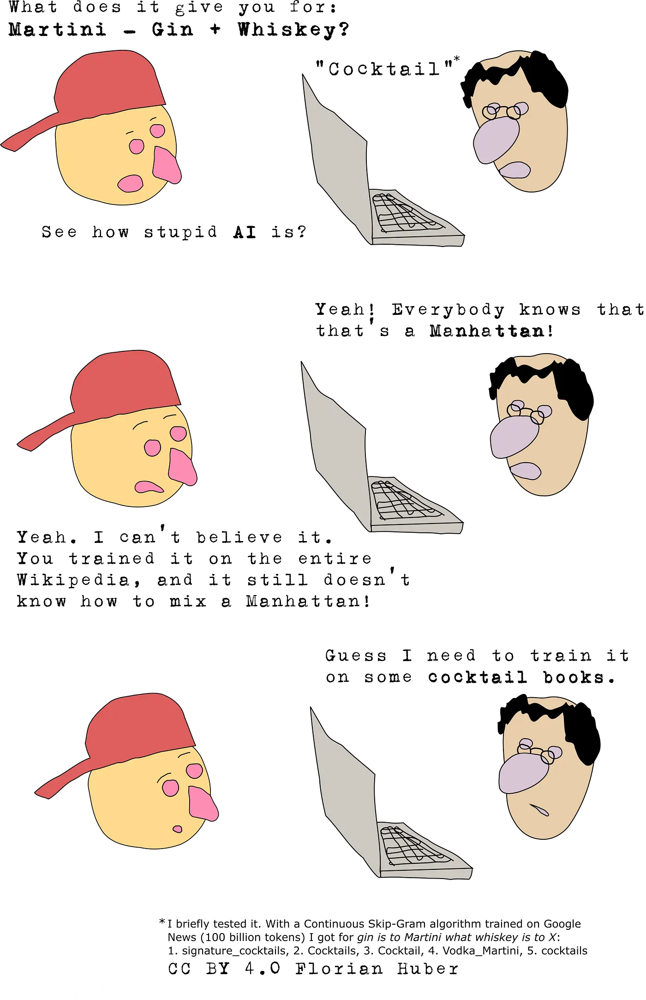
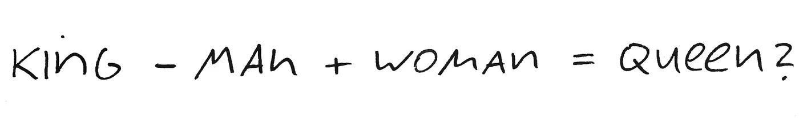
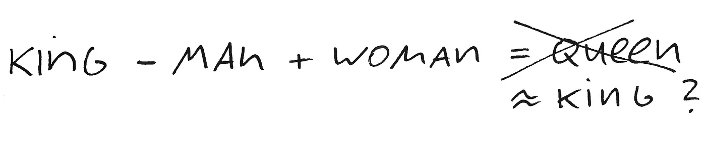
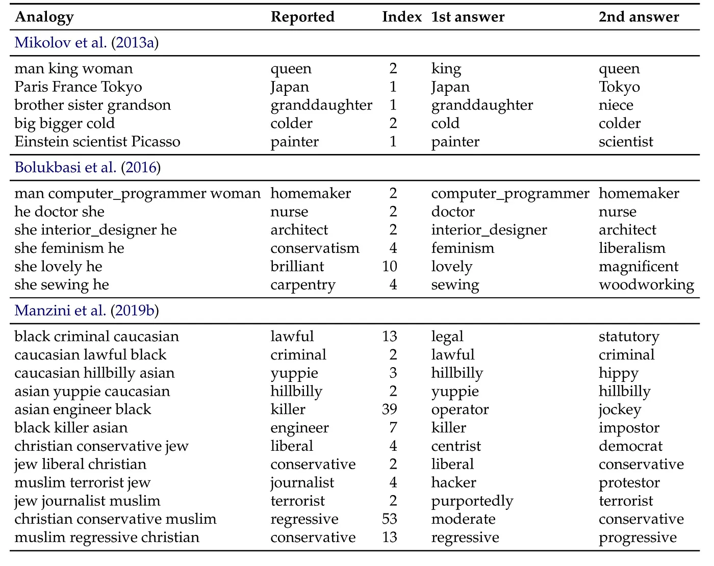

## Some of the best known examples used to explain the power of prominent Natural Language Processing tools (like Word2Vec) only seem to work with some cheating.

One of the most important fields for applying modern machine-learning tools is Natural Language Processing, or simply: NLP. It is about using digital tools to analyze, interpret and even generate human (natural) language.

Arguably the most famous algorithm, known by virtually all people in the NLP field (and even to many people interested in machine-learning but not working on NLP) is **Word2Vec**. Word2Vec has been implemented in a few ways that makes it very easy to use. And it is frequently taught as an example in many introductory machine-learning/AI or NLP courses.

One of the main reasons people like it is that it seems very intuitive. Most of all, its fame stems from some striking, intuition-building examples that are often used to demonstrate what Word2Vec is capable of. To explain briefly what Word2Vec does:

It looks at large amounts of text and counts which words frequently co-occur with others. Based on those co-occurrences, Word2Vec finds abstract representations for every word, so called **word embeddings**. This are low-dimensional vectors (think of a list of 200 or 300 numbers). Once you have those word vectors, you can do nearly-magical math with words! If you take the vectors for King, Man, Woman, you can calculate King - Man + Woman and then you’ll get the vector for: Queen!

I can really recommend playing with word vectors! It’s fun and you can find plenty of pre-trained networks, so you can get started right away. Try this word vector calculator. If you then feel like doing some training on cocktail books yourself, I highly recommend “Liquid Intelligence” by Dave Arnold (in word embeddings that would probably be: cocktails — fuzz + linear\_algebra). Cartoon by Florian Huber, licensed under CC BY 4.0. (which means: feel free to share or re-use it, if you don’t mind my limited drawing skills).

**Wow. King - Man + Woman = Queen!**  
That is magic. The algorithm hence learned what the words *mean*. It kind of *understands* them. At least that’s how it seems…  
The problem is, that reducing Word2Vec to this one paramount example has been a huge mistake in my opinion. To me (and I believe many others as well) this has been very misleading.

**Just to be clear:** there is nothing wrong with the algorithm itself! It is conceptually very interesting and works very well for a lot of cases. Done right, it can give a decent representation of word similarity or meaning. But the *“King - Man + Woman = Queen”* example by faroverstates what the algorithm actually is capable of.

Here are some reasons why I think we should stop using that classical example to introduce Word2Vec:

1 It turns out that for the example to work in the first place, you have to include some **‘cheating’**. The actual result would namely be King - Man + Woman = King. So, the resulting vector would be more similar to King than to Queen. The widely known example only works because the implementation of the algorithm will exclude the original vector from the possible results! That means the word vector for **King - Man + Woman** is closest to the word vector for King. Second comes Queen, which is what the routine will then pick. Quite disappointing, isn’t it?

In many courses and tutorials I’ve seen, this issue was not mentioned. I hence believe it is still not common knowledge. It was actually only in one of the better online NLP courses that I finally learned about this disappointing *‘trick’* ([HSE course on NLP, worth a visit!](https://www.coursera.org/lecture/language-processing/word-analogies-without-magic-king-man-woman-queen-lpSIA))

Recently, three researchers from the University of Groningen tested many of the given examples from some of the key publications on Word2Vec. While some examples indeed worked as intended, a frustratingly high number of the given examples really only worked when using the little ‘trick’ of not allowing the query word itself (see also: [\[Nissim 2019](https://arxiv.org/abs/1905.09866)\]).

Table taken from Nissim et al. (2019): https://arxiv.org/abs/1905.09866. The authors tested a list of analogy examples from key articles using Word2Vec. They did a query of the type C is to B as A is to X. “Index” denotes the position the reported answer (“Reported”) was actually found (very often NOT “1”!). In addition the 1st and 2nd answer given by the algorithm is displayed in the two right columns.

2 Unfortunately, things get worse.  
Finley et al. \[2017\] did a more thorough analysis of analogies other than Male-Female/King-Queen/Man-Woman. They evaluated a wide range of syntactic and semantic analogies and found that such calculations based on word embeddings (i.e. word vectors) do perform well for some types of analogies, but really poor for others. In the category ‘lexical semantics’ those algorithms seem to perform particularly badly…. with one very notable outlier: male-female analogies! So, in a way those examples typically given in lectures or tutorials rather represent an exception than the rule (see also [\[Finley 2017\]](https://www.aclweb.org/anthology/S17-1001)).

3When it comes to going beyond this one shiny example and comparing different methods for producing word-embeddings, people usually compare the methods accuracy across a large corpus of texts. Even here, things seem to be more complex than often told. Some interesting studies (see \[Levy et al., 2016\]) clearly demonstrate that we need to be really careful when comparing different algorithms. And that includes Word2Vec.

Quite often the “new” method is optimized towards a test dataset to perform well. Then it is compared to the “old” methods, which is fine. Only that those were much less optimized for the respective datasets. When done properly the outcome often is much less convincing, and in many cases reveals that there is very little difference between old methods (done right) and new methods (see also [\[Levy 2016\]](https://www.aclweb.org/anthology/Q15-1016), [\[Levy 2014\]](https://papers.nips.cc/paper/5477-neural-word-embedding-as-implicit-matrix-factorization.pdf)).

All of this tells me two things:

Be careful when comparing methods using benchmarks on one or few particular datasets. That holds true far beyond this Word2Vec example!

And stop reducing Word2Vec to the *“King - Man + Woman = Queen”* example. It creates unrealistically high expectations. Well… and it’s actually not even working without cheating.

## Resources:

- A very good free online course on NLP is done by the HSE in Moscow and can be found on Coursera. This was clearly one of the better NLP courses I’ve seen, and it also puts Word2Vec very clearly into perspective.  
	→ [Link to HSE/Coursera NLP course](https://www.coursera.org/learn/language-processing).  
	→ [Link to video from that course on King-man-woman-queen example](https://www.coursera.org/lecture/language-processing/word-analogies-without-magic-king-man-woman-queen-lpSIA).  
	→ [Link to their GitHub repository](https://github.com/hse-aml/natural-language-processing).
- Like to play with some word embeddings? There is a lot of pre-trained, ready-to-use stuff out there. [Try for instance this **semantic calculator**](http://vectors.nlpl.eu/explore/embeddings/en/calculator/). You can choose between different models trained on Google News, English Wikipedia and others. Fun to play with, and good to get a first glimpse of what it can and cannot do.
- [**Nissim, van Noord, van der Goot (2019)**: Fair is Better than Sensational:  
	Man is to Doctor as Woman is to Doctor](https://arxiv.org/abs/1905.09866)
- [**Levy, Goldberg, Dagan (2016)**: Improving Distributional Similarity  
	with Lessons Learned from Word Embeddings.](https://www.aclweb.org/anthology/Q15-1016)
- [**Levy and Goldberg (2014)**: Neural Word Embedding  
	as Implicit Matrix Factorization.](https://papers.nips.cc/paper/5477-neural-word-embedding-as-implicit-matrix-factorization.pdf)
- [**Finley, Farmer, Pakhomov (2017)**: What Analogies Reveal about Word Vectors and their Compositionality.](https://www.aclweb.org/anthology/S17-1001)

As a side note: In this blog post I mainly write about Word2Vec (or very related algorithms). But given the severity of the issues listed above I also expect that the same problem could be found for many other popular word embeddings as well. It certainly seems worth testing.

*Thanks to* *, and* *for helpful discussions and comments.*
