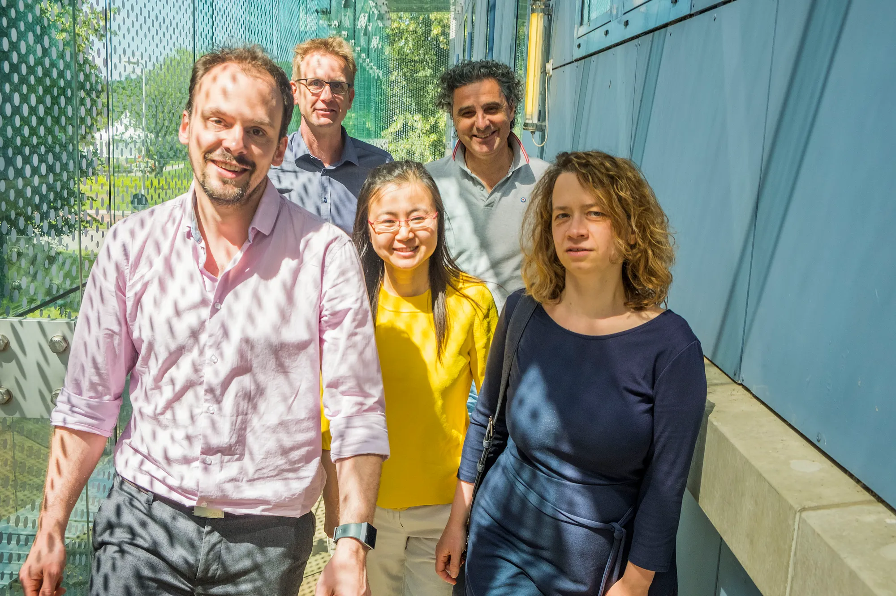
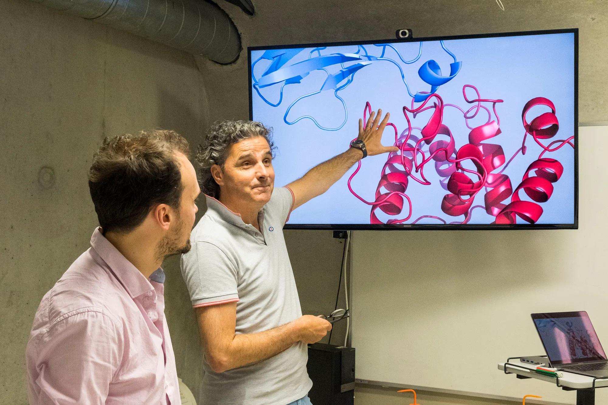
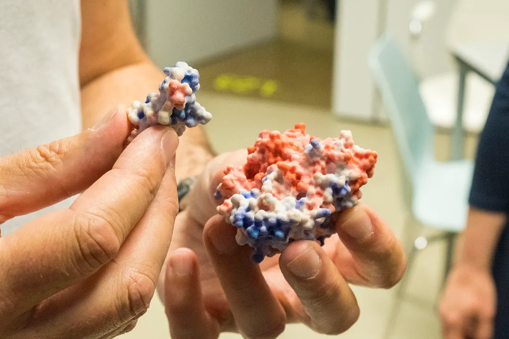
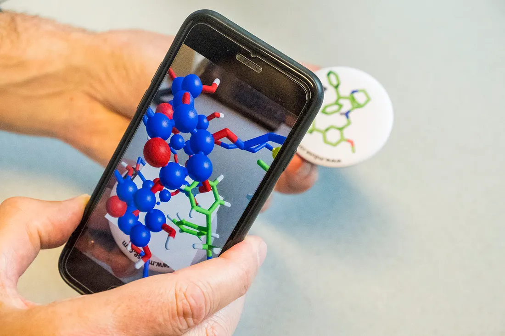
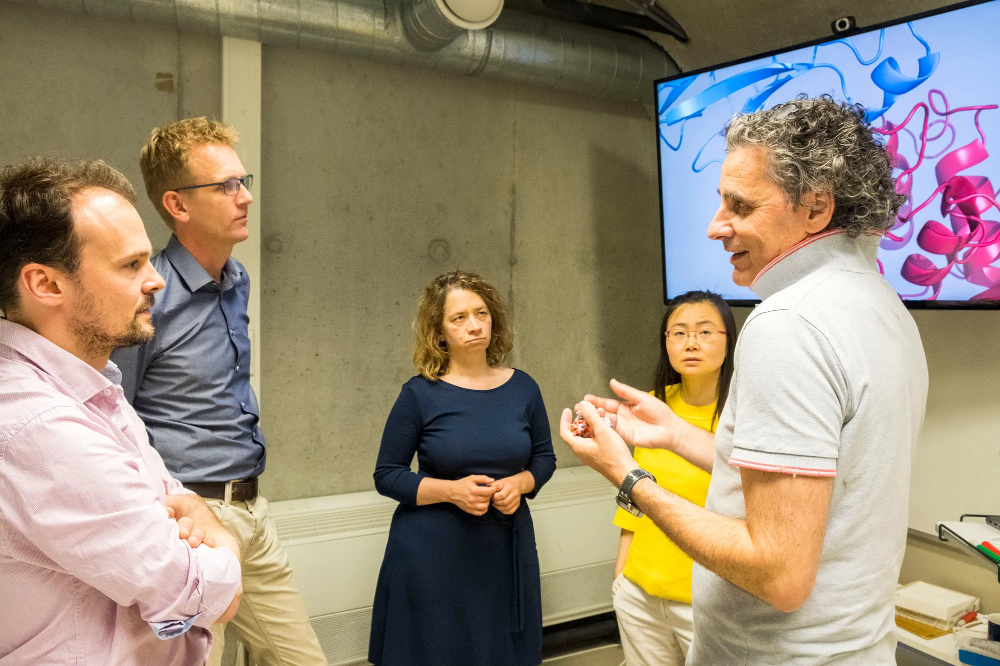
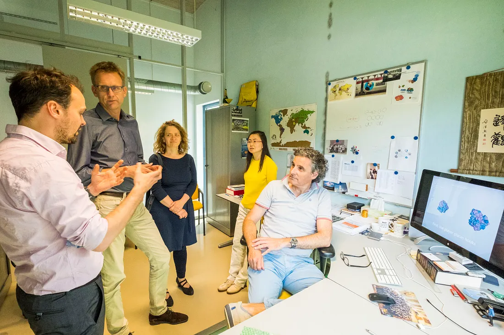
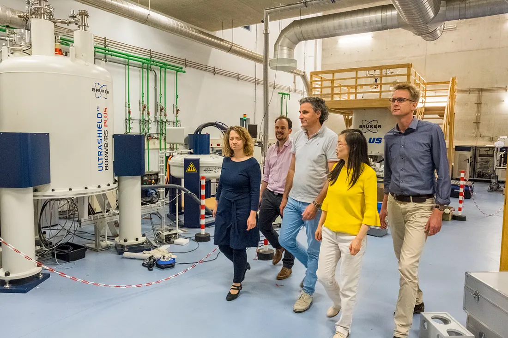
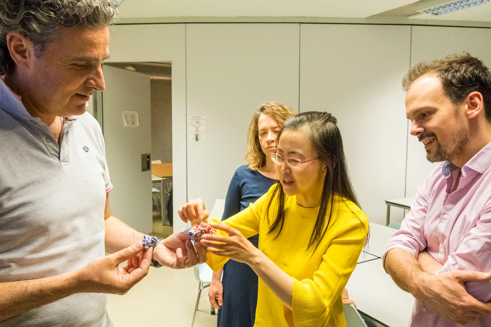

*Photography: Michiel Wijnbergh |* [wijnbergh.nl](http://www.wijnbergh.nl/)

Dr. Lars Ridder, Prof. Alexandre Bonvin, Dr. Nicolas Renaud, Dr. Li Xue, Dr. Sonja Georgievska

The human body contains trillions of cells. These cells, while all specialised, work in harmony to carry out the basic functions necessary for humans to survive. Such cellular processes are in turn controlled by a huge number of interactions between molecules, many of which we still do not know about or fully understand. Gaining such insight could potentially open the door to the development of new and more effective drug therapies and treatments.

In 2017 the project DeepRank was started, a collaboration between Alexandre Bonvin, professor of Computational Structural Biology at Utrecht University, his coworker Li Xue, and the Netherlands eScience Center. The aim of the project is to train deep neural networks (dNNs) to learn complex interaction patterns from the huge amount of experimental data in the Protein Data Bank, a valuable source of information not yet fully exploited.

## Reliably modeling biomolecular complexes

‘Understanding molecular interactions requires studying them in three dimensions’, says Bonvin, whose research group focuses on the development of reliable bioinformatics and computational approaches to predict, model and dissect biomolecular interactions at atomic level. ‘To make this possible, experimental structural biology techniques need to be complemented with computational methods, such as docking, which allows one to model possible complexes of known biomolecular components.’ However, a major challenge in docking is scoring — the identification of correct (near-native) models from a large pool of docked models — due to the biophysical complexity of these interactions.

To overcome this challenge, Bonvin, with support from the eScience Center, uses an innovative strategy in which the problem is treated as a 3D image classification problem. The interfaces of docked models are represented as 3D images and dNNs are trained to classify whether they are near-native or not. It is hoped that the resulting scoring function, DeepRank, will markedly enhance current capabilities to reliably model biomolecular complexes and as a result assist the scientific community in gaining greater insights into macromolecular aspects of life. Bonvin will eventually also implement DeepRank in his HADDOCK modelling platform and freely distribute it through the GitHub and RSD repositories.

## Critical expertise in machine and deep learning

Bonvin is extremely pleased with the intensive collaboration taking place with the eScience Center.

> ‘The eScience research engineers have brought unique expertise in machine and deep learning, and in applying this to the complex models we deal with in this project, while we bring expertise in the research question and the biophysical factors that are important for reliably identifying correct from incorrect solutions. This mix of expertise has really driven new ways of thinking.’

Dr. Sonja Georgievska, Dr. Nicolas Renaud and Dr. Lars Ridder, the eScience Research Engineers involved in the project, agree.

> ‘Prof. Bonvin and his team are among the top international experts in the field and hugely inspiring to work with. They bring unique expertise that we are trying to complement as best as we can. During the project we developed several tools to process the data, train modular neural networks and analyse the results. We also explored different machine learning methods — 3D CNN, Graph CNN and support vector machines — to classify and score predicted 3D structures of protein complexes. We are now using those tools on a large data set, which can be utilised to train neural networks.’

Li Xue, co-principal investigator of the project and assistant professor at Utrecht University’s department of Chemistry, adds:

> ‘The collaboration with the eScience engineers has been very fruitful. All of us bring our own expertise to the table and, as a result, we learn a lot from each other. For example, Sonja Georgievska is an expert on deep learning, Nicolas Renaud has highly efficient programming skills and Lars Ridder is simply impressive for the way he coordinates and steers the team. All of this has really accelerated our level of progress.’
