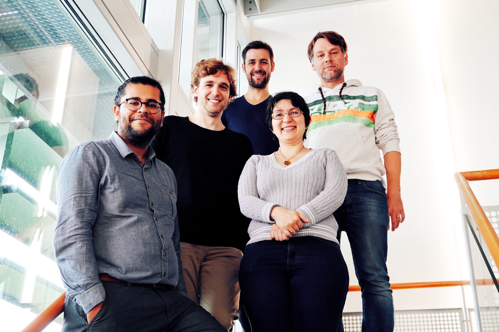
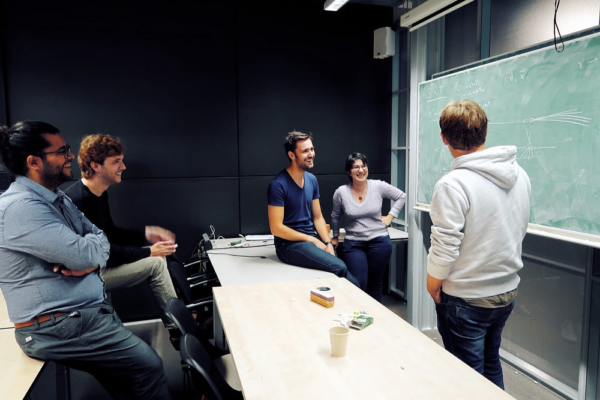
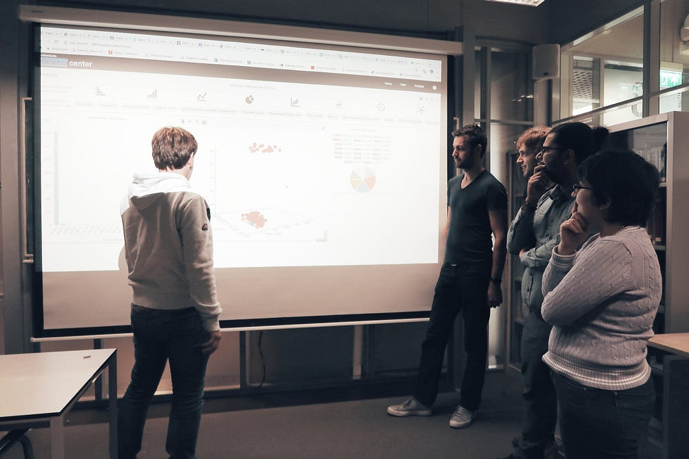
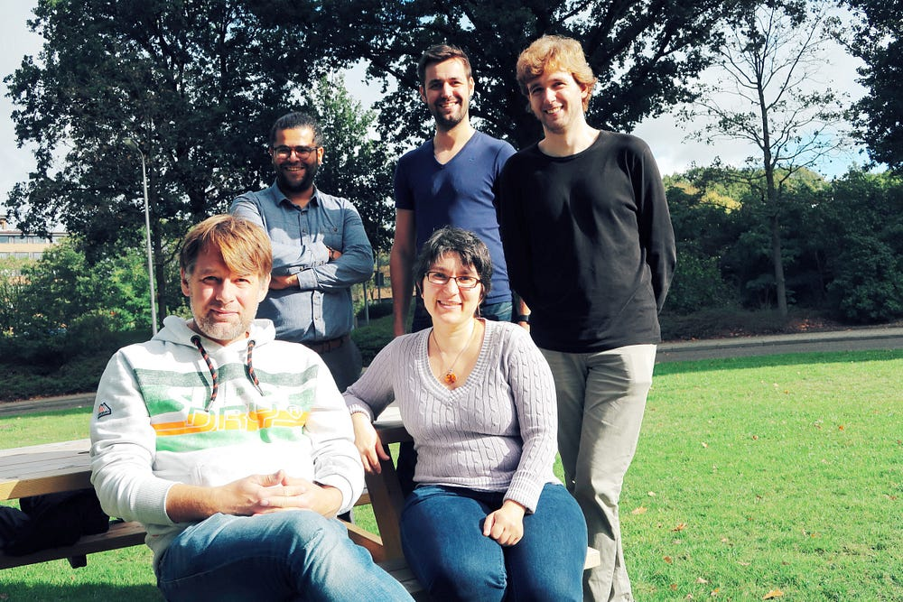

Astronomical observations show that roughly 80% of the mass of the universe is made up of dark matter, a material that cannot be directly observed because emits no light or energy. Although dark matter has never been detected directly, astronomers know it exists because something in the universe is exerting significant gravitational forces on visible matter. Nevertheless, its exact nature remains unknown.**

*Photography: Kim-Anh Holthaus*

Left to right: Faruk Diblen, Bob Stienen, Luc Hendriks, Rena Bakhshi and Sascha CaronToday, one of the biggest objectives within the fields of physics and astronomy is to determine the nature of Dark Matter. It is widely expected that any success in doing so will come about by bringing together and sharing all worldwide available experimental data.

## Harnessing interdisciplinarity

The iDark project aims to combine the worldwide data within the most general models of Dark Matter. Led by Dr Sascha Caron and supported by the Netherlands eScience Center, iDark was launched in 2015 as a platform to bring together expertise in particle physics, physics, astrophysics, eScience and machine learning. Its aim is to test the models, determine the allowed parameter space for dark matter and help focus the effort for experimental searches.

“The project comprises two main technological components”, says Faruk Diblen, eScience Research Engineer and part of the project team. “On the one hand it focuses on using cutting-edge Artificial Intelligence to classify models for hypothetical dark matter, and on the other it aims to develop an open science platform on which interactive data visualization can be done in a collaborative way.”

iDark builds on research carried out Dr Caron, whose main focus is on physics beyond the Standard Model, especially on the search for candidates for Dark Matter. “Over the past twenty odd years, I have been trying to automate searches for new physics and Dark Matter, which can be done with or without the use of candidate models. My research is based on analyzing large amounts of data, grouping data, learning patterns and searching for anomalies. As such, it is strongly linked to eScience, data science, high-performance computing and machine learning.”

## SPOT the collaboration

One of the tools that have so far been developed within the project is SPOT, a platform that allows researchers to share and present their data sets publicly through interactive dashboards.

“SPOT came about through the hard work of my fellow engineer, Jisk Attema, who worked on the software in his spare time and realized that it could be used for iDark. While developing SPOT for iDark project, we realized that it can also be used in many other domains in which numerical data is the primary data type. It helps scientists to make visualizations of multi-dimensional data and open science.”

> 

“While developing SPOT for iDark project, we realized that it can also be used in many other domains in which numerical data is the primary data type.”

According to Bob Stienen, PhD researcher at Radboud University and closely involved in iDark, the collaboration between the different groups has provided a major boost to the project. “iDark is structured in three distinct research directions, all of which intersect in their aim to make the interpretation of high-dimensional data easier. Although I worked on one aspect (machine learning), my research benefited immensely from the expertise and resources provided by the Netherlands eScience Center.”

> “The experts from the eScience Center brought new knowledge on developing web-based data platforms…we wouldn’t have had the ability to work on such large-scale software projects without them.”*

Caron agrees: “The experts from the eScience Center brought new knowledge on developing web-based data platforms. The input provided by Rena and Faruk (eScience Engineers, ed.) was invaluable and only reinforced my view that research depends on successful teamwork and on everyone contributing their own unique skills and expertise. We wouldn’t have had the ability to work on such large-scale software projects without them.”

Read more about [iDark](https://esciencecenter.nl/project/idark)
Read more about [Sascha Caron](https://www.nikhef.nl/~scaron/)
