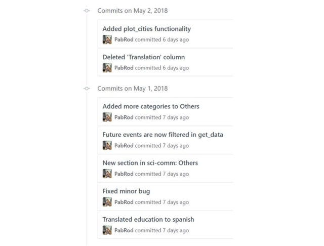

Subscribe*Remember me for faster sign in

The previous example may look like (and actually is) quite silly. But remember that code is alive. Something that today is a simple function tomorrow may be more complicated. Imagine that a collaborator edits your function like this:

sum(x,y):
  return (x - y)The edit is ok, the code will compile, but the function will just not do what it is expected to do. The tests will notice immediately that something went wrong.

Code is not only alive but complex. A week later, your function may become part of a bigger picture, with several functions calling each other. A single error may create a domino effect. Unit tests make easy identifying where exactly the error is happening.

Other side advantages:

* Running the battery of tests allows users/collaborators to check that they installed your code properly
* Tests can be used as complementary documentation
* Writing code with unit tests in mind increases the modularity and quality of code

### I am interested! How should I start?

Although the idea behind unit tests is general and simple, the specific practical implementation depends on the programming language you are using. Perhaps you can guess how to start: just Google “unit testing” + your programming language*.

### Version control

As I said, code is alive. Code grows, changes, gets updated. The idea behind version control is to keep an ordered and commented registry of all the changes that the code has suffered. It allows, for instance, comparing the same file at different stages in time. Or rolling back to a previous version in case of regretting one or several edits.

Additionally, services such as GitHub, GitLab or BitBucket allow easy publishing and sharing of code under version control. This is particularly useful if you are writing code with a team or if you want to make your code available in a practical way.

Example of a GitHub timeline. The “commits” appear in chronological order, and each of them corresponds to a modification important enough to deserve a comment. By clicking on the commits (source [here](https://github.com/PabRod/academic-record/commits/master)) you can see a detailed overview of the changes.

### I am interested! How should I start?

Currently, the most popular version control system is git, which is free and open source. The first encounter can be a bit shocking if you are not used to the console. Feel free to use a graphical user interface, especially at the beginning, if that makes you more comfortable.

### Wait a minute! Is this not too complicated?

After knowing about these methods some researchers react considering them too complicated. These same researchers tend to develop their own artisanal methods, that end up being equally (or more) complicated and much more inefficient and insecure. This should not be surprising, as the complexity is not in the method, but in the problems we are trying to solve.

Writing a scientific paper, a piece of software or a thesis is a complex process not only from a scientific point of view, but also from that of information management. Software engineers have extensive experience in exactly these kinds of problems… why not use their tools of proven efficiency instead of painfully reinventing the wheel?

### References

* [Best practices for scientific computing](https://journals.plos.org/plosbiology/article?id=10.1371%2Fjournal.pbio.1001745)

*This post is strongly based in another post of the author, *[*Algunas cosas que los científicos pueden aprender de los programadores*](https://culturacientifica.com/2018/05/18/algunas-cosas-que-los-cientificos-pueden-aprender-de-los-programadores/)*, written in Spanish for *[*Naukas.com*](https://naukas.com)
