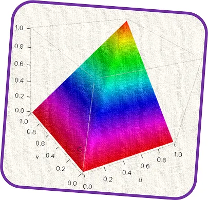
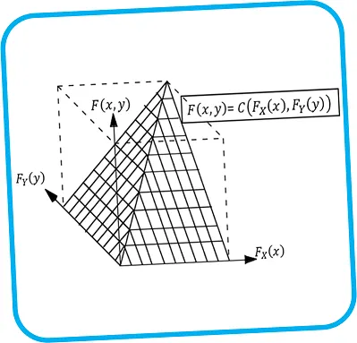

An introduction to copulas.

Climate change challenge badge, FAO

Competition for natural resources such as water and land is increasing due to population growth, industrial development, agricultural intensification, and climate change. With respect to the latter, increasing variation in air temperature and precipitation affects agriculture (for instance crop production), contributing to risks for food security. When studying the crop responses to those changes, the aim is to answer questions like:

- How do warm days in one location affect the weather in another location?
- If the days are very wet over the last months, will the next month be the same?
- Do cold days increase crop production?
- Will the production price increase in the next ten years due to a heatwave?
- What is the probability of a flood in one location on a specific day in a year?

We know that weather, land and water change continuously over space and time. The changes in one are related to changes in the other. The main aspect of recent environmental studies has been to describe those variations and interactions.

### How to describe interactions

For a moment assume one pair of processes that are linked together, such as crop production and air temperature. We want to describe their dependence, that is how they are connected. To do so, one way is to use a function. In 1959, the mathematician Abe Sklar called this function a copula. The name copula comes from the Latin for link or tie. A copula is a bi-variate function (including two variables or processes) that shows, for example, how the crop production is related to the air temperature.

Graph of a copula /kɒpjʊlə/

Now let’s assume more processes like crop production, air temperature, and rainfall. We can define a multivariate function (including more than two processes) that describes the link between those processes.

### The type of functions of a copula

A copula is a joint probability distribution function ( Nelsen 2006 ). In this graph, the function C(.,.) is a copula, x and y axes denote two processes whereas the z-axis indicates the joint probability values.

In probability, a joint probability distribution is a function describing the probability of processes that happen together. A copula is a joint probability distribution function.

### The power of copula-based methods

Nowadays copula is famous in addressing financial problems. However, it is still in its infancy in environmental science. The findings on the application of copulas indicate that copula-based methods can be used for several types of data sets and problems. Therefore, there is a growing interest in the use of copulas in hydrology, disaster management, agriculture, weather, and climate. In this context, copulas have great potential for describing complex dependencies found in, for example, wicked problems like climate change and heatwaves. With this in mind, case studies and functions developed in recent copula-based studies could have a role to play in new areas, for instance, methodological development, promising application, and education.

### The weakness of copula-based methods

One concern about the application of copulas is that available software are limited to a few packages mostly in R programming language. Also, the computational cost of copula-based methods when working with high-dimensional problems is relatively great. Regarding the environmental processes, the application of copulas faces a limitation that emerges from the problems related to the visualizations and interpretations in a high-dimensional space.

More about copulas? I recommend the following references:

- [An Introduction to Copulas.](https://link.springer.com/book/10.1007%2F978-1-4757-3076-0)
- [Extremes In Nature: An Approach Using Copulas.](https://link.springer.com/book/10.1007%2F1-4020-4415-1)
- [Everything You Always Wanted to Know about Copula Modeling but Were Afraid to Ask](https://doi.org/10.1061/\(ASCE\)1084-0699\(2007\)12:4\(347\)).
