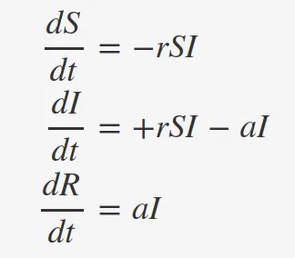
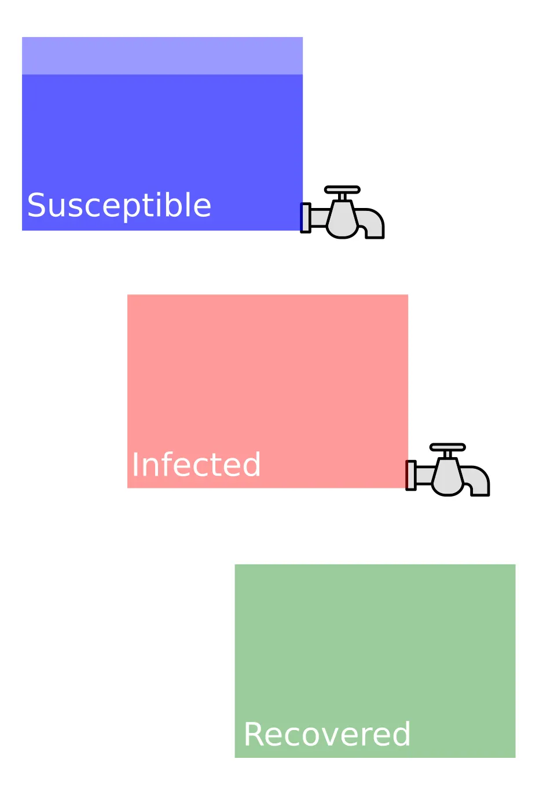
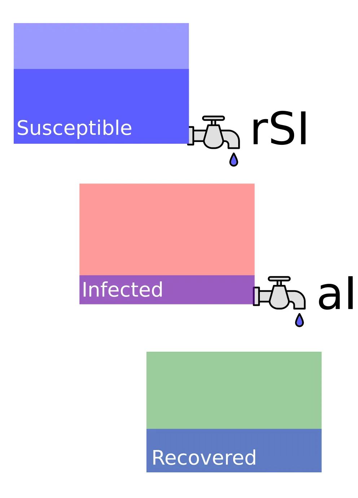
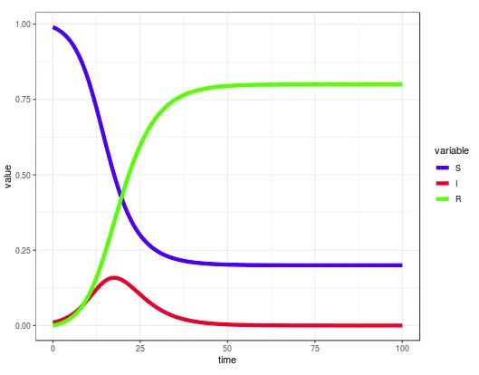

## Flattening the curve, and why you should stay at home

Photo by History in HD on Unsplash

*I write this entry at the beginning of the COVID19 crisis in Europe. I am not a medical expert and, thus, the reader will not find any health advice in the current text. What I am instead is a mathematician. If you ever felt intrigued about how forecasts are being made about the progression of a contagious disease, this text may satisfy your curiosity.*

Perhaps you’ve heard that the number of infections are rising “exponentially”. While in common language “exponentially” seems to mean “rapidly and much faster than yesterday”, it has a more precise meaning in mathematics. Indeed, there is a whole subfield of applied mathematics devoted to the propagation of diseases: mathematical epidemiology. Here we’ll take a look at one of its most basic models.

## The Kermack-McKendrick / SIR model

The most famous model describing the propagation of a contagious disease is that of Kermack and McKendrick, introduced in 1927. It is nicknamed as the SIR model, because of the names of the three state variables it keeps track of, namely:

- S: the population of susceptible individuals
- I: the population of infected individuals
- R: the population of recovered individuals

The model looks like this:

Equations for the SIR model

But don’t let differential equations scare you! It is possible to understand the details of this model using the mental picture of three water tanks arranged as in the figure below. In this figure, all the population is in the “susceptible tank”. Nobody is infected, so nobody can get infected and everything is all right.

This figure represents a normal situation. All population is susceptible, and remains so, as there is no flow in the taps

But, what happens if a disease enters the system? That is, what happens if the population of infected is not zero? Well… then, the taps open!

If someone is infected, the taps open, allowing for movement between tanks and, thus, dynamical changes in the different populations

The equations we showed above are just a statement about how strong the flow of each tap is. Particularly, the upper tap empties the “susceptible tank” and fills the “infected” one. The upper tap thus represents contagion, and the magnitude of its flow, **r·S·I**, grows both with the number of susceptible and infected people (think about it, it makes sense). The constant **r** regulates the overall speed of contagion. The lower tap empties the infected tank, and thus represents recovery. The magnitude of its flow is **a·I**, so the parameter **a** represents the relative recovery rate.

Check again the differential equations given above with this picture of inflows and outflows in mind. Note that inflows are positive and outflows are negative. The equations will just come to life.

## How do the solutions look?

The specific solutions of the SIR model depend on the initial state and the values of the parameters **r** and **a**. An interactive Shiny applet can be found [here](https://pabrod.shinyapps.io/SIRmodel/) (source [here](https://github.com/PabRod/SIR)). A possible solution is sketched below.

Generated with https://pabrod.shinyapps.io/SIRmodel/

## What is this good for?

The SIR model is an extremely simple model of a very complex phenomenon. Nevertheless, it suffices to teach us a couple of lessons. By playing with the contagion (**r**) and recovery (**a**) parameters in the applet linked above, you’ll notice that the evolution curves change.

Lowering **r** (lower contagion rate) and/or increasing **a** (higher recovery rate) sound like good news, and they are. Their main effect is to **flatten the contagion curve**, spreading the number of cases in time and avoiding a potential collapse of the health system.

How can we achieve this? Well, increasing **a** (the relative recovery rate) is currently not in our hands, as right now there is no cure for the COVID19. A vaccine will dramatically reduce the susceptible population, but this is also still not developed. But lowering the contagion rate **r** can be achieved, for instance, by minimizing social contact and staying at home as much as possible.

Your friends said it, the authorities said it, and now the mathematics say it: just stay at home.

## References

- Kermack, W. O. and McKendrick, A. G. “A Contribution to the Mathematical Theory of Epidemics.” *Proc. Roy. Soc. Lond. A* **115**, 700–721, 1927.
- Murray, James D. *Mathematical Biology I. An Introduction*. 3 Vol. 17. New York: Springer, 2002.
- Agent-based simulation at [The Washington Post](https://www.washingtonpost.com/graphics/2020/world/corona-simulator/).
- This and more elaborate models can be found in [Wikipedia](https://en.wikipedia.org/wiki/Compartmental_models_in_epidemiology).
- An accessible article about modelling of the *COVID19* in [Ars Technica](https://arstechnica.com/science/2020/03/new-model-examines-impact-of-different-methods-of-coronavirus-control/).

## Attribution

The tap icon used in the figures was made by [Iconixar](https://www.flaticon.com/authors/iconixar) from [www.flaticon.com](http://www.flaticon.com/)
