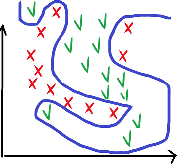
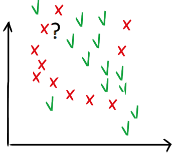
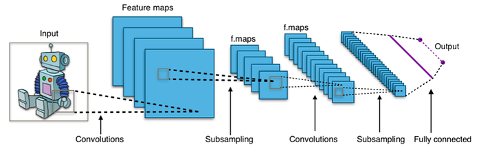
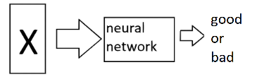
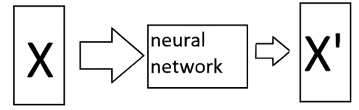

Subscribe*Remember me for faster sign in

Hey, should I draw a wild curve that splits all points exactly?

But how am I sure that the curve will split properly all new points that I haven’t seen, that it will not over-fit* on the training data? I tried lots of methods (SVM, neural networks, random forests…) and still I don’t get good results on my test points, even though I kept some of the training data as a “control” dataset during training.

Wait. Why would I draw curves? Every time I have a new point for which I don’t know whether it is good or bad, I can just look into the neighborhood and label my point as the neighbors (“k-nearest neighbors method”).

But how many neighbors should I look at? One, two, three? They all have different labels. And what is a neighbor by the way? Yes, in 2D it is easy but my points are not in 2D actually.

Wait, how am I sure that I chose the right features to represent my data? Maybe my data looks so messy because the features are not helping into classifying my objects in good and bad. Ah, what a mess, I should start all over with new features! Or maybe I should craft completely new features?

A-ha. Features. Why are we still talking about features when everybody knows that [deep neural networks](https://en.wikipedia.org/wiki/Deep_learning) don’t need features? They take as input directly your data and learn everything by themselves. If you have enough properly labeled data, you barely need to do anything. Maybe you need to watch for over-fitting and under-fitting by using a part of your ground truth data as a control set, and tweak the [hyper-parameters](https://en.wikipedia.org/wiki/Hyperparameter_(machine_learning)) of the network, that is, the parameters that are not automatically learned by the network, until you get desired results. But that’s about it, it is all straightforward. Even the parameter tweaking is being [automated](https://en.wikipedia.org/wiki/Automated_machine_learning) nowadays. So, ML is easy again!

It used to be so, when all you were doing was classifying images. On the [ImageNet](http://www.image-net.org/) dataset. On the input you put a picture of a robot or a man. On the output you tell the network what the picture is. In-between the network tries to adapt its “weights” by seeing many examples of robots or men and using calculus methods. Ultimately it finds which weights are best to go from a picture to a label with as few mistakes as possible.

That would be level 1.0. We opened a new chapter: deep learning.

Level 1.1 is when your input is not a picture or text, or anything else for which off-the-shelve neural networks exist. It is some kind of a special object of type X and there are no neural network architectures that can handle it.

What do you do? Do you try to convert your object into a picture, or a sequence, or? But then what is the best way to convert it so that the neural network can do its job? And what kind of neural network? And how do you best design this conversion, or features, for your neural network? Oh no, features again! Maybe I can try to design a new type of neural network to address my original objects of type X. You wish. That’s level 5.

Level 1.2 is when you are not trying to classify, but instead to map your input object to an arbitrary representation of it that suits your problem. From object X at the input to object X’ at the output. Lots of practical problems are of this type.

Then you need to figure out what the network should learn. It is easy when you classify, the network needs to learn the label *good *or *bad*. In the general case, learning to map from X to X’, you want the output to be as close to X’ as possible. Nice, what’s the problem? The problem is what you mean by “close”. We are back to the “neighbours” problem (see level 0.2). Remember, what works in a 2D space, does not work in an arbitrary space (in math, or ML, this is called “[the curse of dimensionality](https://en.wikipedia.org/wiki/Curse_of_dimensionality)”).

One can go to even higher levels, where the class of problems is different than classification or mapping from representation X to X’. E.g. when you try to [generate](https://towardsdatascience.com/deep-generative-models-25ab2821afd3#:~:text=A%20Generative%20Model%20is%20a,data%20points%20with%20some%20variations.) new data that looks realistic (what do you mean by realistic, then?), i.e. deep generative models, or when you try to come up with a best automated strategy to achieve a goal, i.e. deep reinforcement learning.

There are many applications of neural networks and machine learning, and here we only scratched the surface. And we did not even touch unsupervised learning. See, here the learning was always done using some ground truth (supervised).

And, for sure, there is no upper limit on the number of levels!
