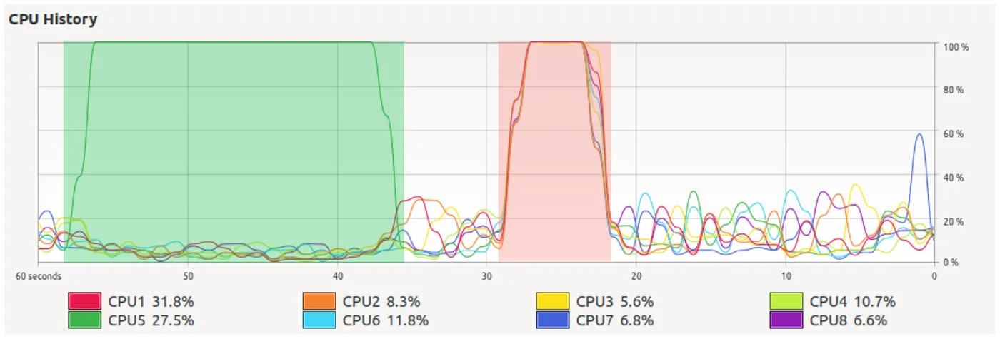
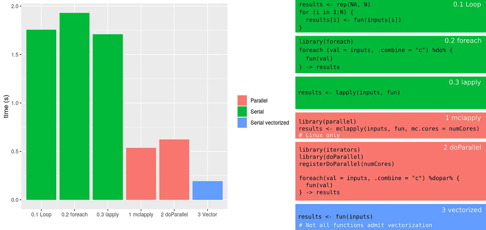
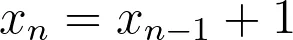

Photo by Marvin Meyer on Unsplash

Loops are, by definition, repetitive tasks. Although it is not part of the definition, loops also tend to be boring. Luckily for us, computers are good at performing repetitive tasks, and they never complain about boredom.

When the tasks are complex, or if the number of repetitions is high, loops may take a lot of time to run even on a computer. There are several strategies to increase the execution speed of loops. In this short tutorial, we will talk about one of them: parallelization.

## Prerequisites

R is required, and RStudio is recommended. Additionally, some libraries may be required. If you are missing any, you can install it running `install.package('<library-name>')`, where `<library-name>` stands for the name of the library (for instance, `install.package('parallel')`).

If you prefer to execute it line-by-line, you may be interested in visiting the [vignette version](https://github.com/PabRod/blog-parallelR) of this tutorial.

## Why parallelizing?

Modern laptops typically have 4 or 8 cores. Each of them can be loosely thought of as an independent mini-computer, capable of doing tasks independently of the other ones. The number of cores in your computer can be retrieved from `R` with the command:

```hs
numCores <- parallel::detectCores() # Requires library(parallel)
print(numCores)# In my case, this prints 8
```

When a program runs serially (as they usually do by default), only one core is recruited for performing the program’s task. Recruiting more than one core for a given task is known as parallelization. The desired result of parallelizing a task is a reduction in its execution time. An analogy could be to build a wall by laying bricks alone, one by one (serial) as opposed to building it with the help of three friends (parallel with 4 “cores”).

In the figure below, we see the CPU usage over time of my computer performing the same task serially (highlighted in green) and in parallel (in red). Both processes performed the very same task and produced the same result, but the parallel one, recruiting more cores, ran roughly three times faster.



It may be surprising to notice that using 8 cores instead of one didn’t multiply the speed by 8. This is normal. Parallelization rarely behaves as linearly as we would like. A reason for this is that the code, and often also the data, has to be copied to each of the cores. The output of each core also has to be put together, and this also consumes time. Following the analogy of the 4 brick-layers, it is clear that building a wall with friends requires a bit of planning and coordination before starting laying the bricks (at least if we want the wall to be one wall, and not four disconnected pieces). Intuition also tells us that, while perhaps asking for the help of 4 friends may be a good idea, calling 256 friends could be an organizational nightmare. For a more formal approach to these ideas, check [Amdahl’s law](https://en.wikipedia.org/wiki/Amdahl%27s_law).

More importantly, some repetitive tasks are not parallelizable at all. For instance, what if instead of a brick wall we want to make a brick stack? There is no point in laying the 3rd brick if the 1st and 2nd are not there already!

But don’t worry about these details now. The example I’ve prepared for you is going to work fine.

## We need a task to perform

In this short introduction, I want to show different approaches, some of them serial and some of them parallel, to approach a parallelizable problem. A good example task for showing the advantages of parallelization would be one that:

1. Is simple.
2. Takes an appreciable amount of CPU time to be completed.

The problem of [deciding if a large integer is prime or not](https://en.wikipedia.org/wiki/Primality_test) fulfills both characteristics.

It will be a good idea to split our task into a **function** (describing WHAT to do) and an **input** (describing to WHOM).

In our case, the **function** performs a test on primality (if you think this is a silly function, you are right, but please see Notes at the end of this tutorial).

```hs
fun <- function(x) {
  numbers::isPrime(x) # Requires the package numbers
}
```

And the **input** is just a vector containing 1000 large integers (that I created programmatically just to not have to type then one-by-one).

```hs
# Generate some large integers
N <- 1000 # Number of integers
min <- 100000 # Lower bound
max <- 10000000000 # Upper boundinputs <- sample(min:max, N) # List of N random large integers (between 1e5 and 1e10)
```

These two objects, `fun` and `inputs`, define the *homework* we want to assign to our computer (in this case, to decide which integers from the list of inputs are prime). We also want our computer to store the results. We will do this in six different ways, two of them parallel. Later, we’ll compare their performance.

## Possibility 0: run serially

In this section, we’ll see three different ways of solving our problem by running serially. That is, without using parallelization. The user is likely to be familiar with at least some of them.

## 0.1 Run serially with a loop

This is the most straightforward approach, although not very efficient. The basic structure is given in the snippet below.

```hs
results <- rep(NA, N) # Initialize results vector
for (i in 1:N) { # Loop one by one along the input elements
  results[i] <- fun(inputs[i])
}
```

## 0.2 Run serially with foreach

The `foreach` package saves us the explicit typing of the index (compare with the `for` loop in the previous example). The output of `foreach` is, by default, a list. We used the parameter `.combine = "c"` (concatenate) to return the output as a vector.

```hs
# Load the required libraries
library(foreach)foreach (val = inputs, .combine = "c") %do% { 
    fun(val) # Loop one-by-one using foreach
} -> results
```

## 0.3 Run serially with lapply

`lapply` is usually preferred over explicit `for` or `foreach` loops.

```hs
results <- lapply(inputs, fun) # Use lapply instead of for loop
```

## Do it in parallel!

And now, we’ll finally use parallel programming to solve our problem.

## Possibility 1: run in parallel with mclapply (Linux only)

`mclapply` is part of the `parallel` library. Rule of thumb: use it instead of `lapply`. If the code is parallelizable, it will do the magic:

```hs
# Load the required libraries
library(parallel)# Run parallel
results <- mclapply(inputs, fun, mc.cores = numCores)
 
# Note that the number of cores is required by mclapply
```

Unfortunately, this approach only works on Linux. If you are working on a Windows machine, it will perform as a serial `lapply`.

## Possibility 2: run in parallel with doParallel + foreach

Rule of thumb: `doParallel` transforms a `foreach` loop into a parallel process. Provided, of course, the underlying process is parallelizable.

```hs
# Load the required libraries
library(iterators)
library(doParallel)# Initialize
registerDoParallel(numCores)# Loop
foreach(val = inputs, .combine = "c") %dopar% {
    fun(val)
} -> results
```

## Possibility 3: take advantage of vector functions

Most (but not all) of `R` functions can work with vectorized inputs. This means that the function accepts a vector of inputs and returns an equally sized vector of outputs. This allows *hiding* the whole *loop* in a single, easy-to-read line.

```hs
results <- fun(inputs)
```

More importantly, although running serially, vector functions often run faster than parallel schemes. Why not use them always then? The quick answer is: we are not always lucky enough to have a function that accepts a vector input.

## Compare results

In the figure below we plot the execution times of each of the six methods we tried. We also provide a summary table for each of them.



We notice that the parallel methods performed significantly better than the serial ones. We also notice that the vector method performed even better (but keep in mind not all functions are vectorizable).

*Pro tip: what about using vectorization AND parallelization?*

## Trying to parallelize non-parallelizable code

In this subsection we’ll use the expression below as an example:



It is just a recipe to build a list of numbers by adding 1 to the previous number in the list. It is easy to see that, when initialized with *x* 0=0, this iterator yields {0,1,2,3,4,…}. Note that in order to obtain the value a given x in position n, we need to know the value of the previous x (that in position n-1; remember the analogy of building a stack of bricks). This operation is thus intrinsically serial.

In this case, our function and inputs look like:

```hs
fun <- function(x) {x + 1}N <- 6
inputs <- rep(NA, N) # Initialize as (0, NA, NA, ..., NA)
inputs[1] <- 0
```

Using a serial loop everything works fine:

```hs
foreach(i = 2:N) %do% {
  inputs[i] <- fun(inputs[i-1])
}# The result is the expected: 0 1 2 3 4 5
```

But what if we insist on parallelizing? After all, our serial loop is very similar to the `foreach` + `doParallel` one, so it is tempting to at least try. And what happens then? As expected, it simply doesn’t work properly. And more worryingly, doesn’t throw an error either!

```hs
inputs <- rep(NA, N) # Initialize again
inputs[1] <- 0foreach(i = 2:N) %dopar% {
  inputs[i] <- fun(inputs[i-1])
}# The result in this case is a disastrous 0 NA NA NA NA NA
```

And that was it. This is just a quick starting guide to a complicated topic. If you want to know more, I suggest you go directly to the [future](https://github.com/HenrikBengtsson/future) library.

## Notes

The astute reader may have noticed that our function `fun` is a mere renaming of the function `isPrime` contained in the package `numbers`. The reason for that is merely pedagogical: we want the readers to:

1. Notice that the structure input -> function -> results is indeed VERY general.
2. Be able to try their own pieces of slow code inside the body of `fun` (this can be done comfortably using our [vignette](https://github.com/PabRod/blog-parallelR)).

## Are you more into Python?

We can also help with that! Check out this other tutorial: [Parallel program in Python](https://blog.esciencecenter.nl/parallel-programming-in-python-7fd62c90217d).

## Acknowledgments

I want to say thanks to [Lourens Veen](https://www.esciencecenter.nl/team/lourens-veen-msc/), [Peter Kalverla](https://www.esciencecenter.nl/team/dr-peter-kalverla-2/) and [Patrick Bos](https://www.esciencecenter.nl/team/dr-patrick-bos/). Their useful comments definitely improved the clarity of the final text.
