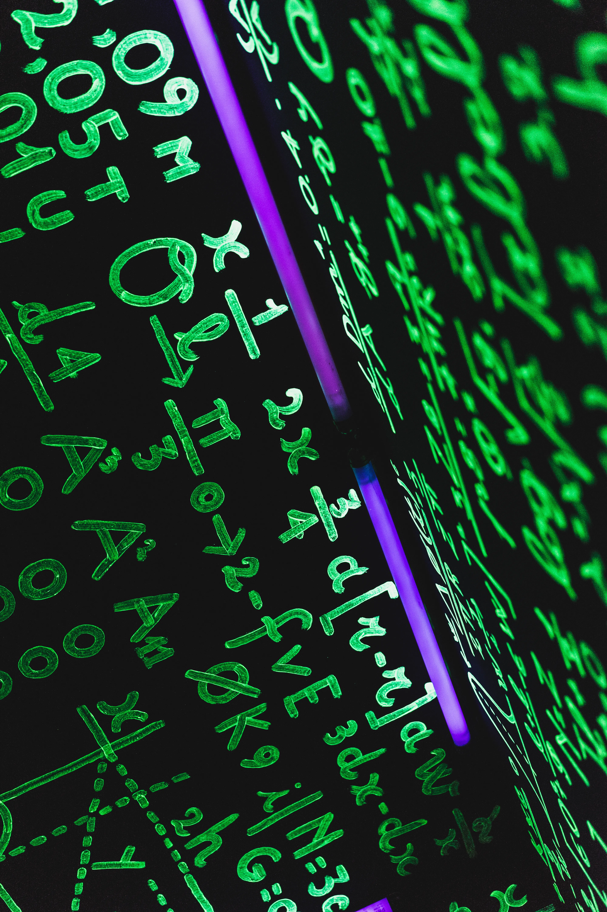

Photo by John Moeses Bauan on Unsplash

Let me start right away with a question: do you think that the future can be predicted? When formulated like this, this question makes us think of crystal balls, palm reading, fortune tellers, … and ultimately invites us to answer with a loud and clear: *“no”*.

Nevertheless, every day we read things like *“the average mean temperature will rise 0.5 ⁰C worldwide in the next ten years”*, or *“the contagion curve of COVID-19 will start to flatten in the next 3 days”.* And we read themwithout raising a single eyebrow. Indeed, these sentences evoke in us feelings of rigor and expert knowledge. But, are they not predictions about the future?

If we dive into the foundations of this kind of forecasts, chances are that they had been obtained using mathematical models. Most likely, they will have error bars attached to them, and provide numerous caveats that, somehow, subtract some strength from the conclusions.

Mathematical models are getting more attention than ever. The COVID-19 pandemic made them jump from the inner pages of specialized journals to the front pages of press and TV news. For audience and format reasons, the necessary details to understand the reach and limitations of these models are rarely mentioned. This may lead to a wrong impression about their power.

## What is a mathematical model?

==A model is a description of a phenomenon under study. A mathematical model just uses mathematical language in this description.==

It sounds almost like a tongue-twister, but is actually anything but exotic. Even more, it is very likely you have worked with mathematical models before. Particularly in school. Do you remember those problems about compound interest? Or those about the movement of a projectile in physics class? Did your teachers not ask you to calculate the future evolution of a bank account or the time and place of the projectile’s impact?

Contrary to what is often thought, mathematical models do not answer the question *“What will happen?”*, but to a subtly different one: *“What would happen if…?”*. This constitutes, simultaneously, the strength and the weakness of mathematical modeling.

Let me illustrate my point with the example of a body in free fall. Perhaps you remember your own skepticism when, in school, your physics teacher told you that a feather and a cannonball free-falling from the same height touch the ground at the very same moment.

Sounds strange, but it is rigorously true. In fact, it is so rigorously true, that if we just drop the word *“free”* from *“free-falling”*, the statement is not true anymore. Free falls require the absence of an atmosphere, and thus do not happen often in our daily life. Still skeptical? Check the video below:

[https://www.youtube.com/watch?v=KDp1tiUsZw8](https://www.youtube.com/watch?v=KDp1tiUsZw8)

If we try to apply the model of free-fall to the fall of an everyday object, we’ll soon see that its prediction fails miserably. We just used an inadequate model, because the free-fall model answers a question we don’t need to answer: *“what would happen if I let this object fall in the absence of an atmosphere?”*.

When we mathematicians build our models, we often start with a very simple one, and we keep adding features to it while we need them. When do we stop, then? When the model is sufficiently good. That is, when we are happy about the light it sheds onto the phenomenon under study.

If we are interested in understanding the fall of a feather, the above-mentioned free-fall model will certainly not make us happy. If we add some drag terms to the model, accounting for the presence of an atmosphere, the results will be much better (although still not perfect, because there will always be small discrepancies between the predictions and the experiment).

All models, no exception, are more or less sophisticated approximations of reality. But they are never perfect. Unfortunately, it is not always easy to quantify the precision of a mathematical model. As a consequence, it is also hard to communicate its limitations to a general audience.

## Why do we use them?

If all mathematical models are approximations, why do we use them? There is a simple answer to this: we use them because they are useful. Models’ capacity of answering the question: *“What would happen if…”*, makes them an excellent substitute for scientific experiments.

In science, the experiment is the highest authority, but sometimes we have no choice but to not perform them. We either use a computational/mathematical model, or we are stuck. Some examples of this situation are:

- Unfeasible experiments: such as studying a black hole on site.
- Costly or very hard experiments: such as studying plankton populations, a problem whose scale in space and time is, literally, oceanic and of the order of decades.
- Destructive or dangerous experiments: such as studying the effects of a earthquake on a city.

Models are also very useful to obtain visualizations that, otherwise, will be difficult or impossible to obtain experimentally. Think for instance of the movement of the wind around a turbine, with the pressure painted as color.

Models also help us understanding. Even models with a very humble predictive power can be very useful to understand complex problems. For instance, thanks to a [very simple model of epidemic propagation](https://blog.esciencecenter.nl/a-mathematician-in-quarantine-4555cfbf9f60) from the 1920s we know that there are thresholds where the contagion becomes explosive. The model is useless if we want to know where exactly that threshold is, but it provides the very idea that such a threshold exists.

## Mathematicians cannot predict the future

Our initial question was: can the future be forecasted? No sensible person will ever answer *“yes, of course, always”*. I hope to have convinced you that mathematicians, who most of the time are also sensible persons, neither will answer so.

Science is, by its own nature, a fundamentally incomplete enterprise. This is true whether we use letters or formulas to write it. Mathematical models have to be consumed with no less than the same healthy skepticism we use with the weather forecast.

## Acknowledgments

The quality of this text was greatly improved by the suggestions of [Patrick Bos](https://egpbos.medium.com/), [Lourens Veen](https://medium.com/@lourensveen), [Florian Huber](https://medium.com/@f.huber).

*This article is an adapted translation from an article the same author published in* [*The Conversation*](https://theconversation.com/) *under a Creative Commons license. If you can (and want to) read Spanish, visit the* [*original article*](https://theconversation.com/los-modelos-matematicos-no-predicen-el-futuro-pero-ayudan-a-entenderlo-147299)*.*
