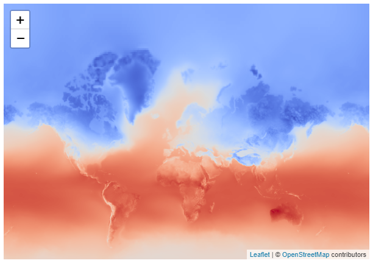
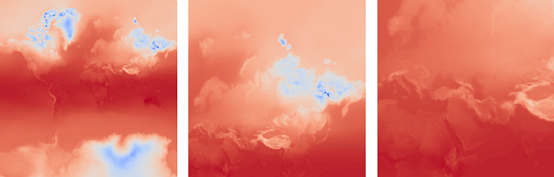
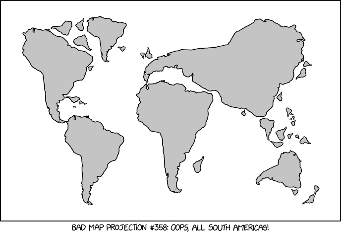

But what if you want to plot your own data? While there are many resources on how to use existing tile or web-map services, I struggled to find out how to make my own. Eventually, I found a [nice example](https://www.azavea.com/blog/2018/08/06/generating-pyramided-tiles-from-a-geotiff-using-geotrellis/) using [GeoTrellis](https://geotrellis.readthedocs.io/en/latest/), but by that time I had already concocted a half-baked solution in my beloved Python. More on that in a bit.

Leaflet also has different kinds of layers. You can draw lines, markers, shapes, polygons, images, and even videos. Here’s how to draw a simple rectangle on a Leaflet map:

var bounds = [[50, 0], [55, 5]]  // ymin xmin ymax xmax
L.rectangle(bounds, {color: "#ffffff", weight: 1}).addTo(map);So if I could load my data into some that bounds array and write a function to determine the colours, that should work. Right?

According to [this blogpost](https://blog.scottlogic.com/2020/05/01/rendering-one-million-points-with-d3.html), Leaflet should perform well up to about ten thousand data points. However, gridded data can easily get bigger. The snapshot of ERA5 data that I used for the first example already has over a million grid cells (0.25 by 0.25 degrees, global coverage). So it seems we’re hitting a dead end there as well… Or not?

[deck.gl](https://deck.gl/) is like Leaflet on steroids. It was designed to “visually explore large-scale datasets”. It leverages the processing power of your graphics card to do some impressive rendering magic. After using Leaflet, I found it quite easy to get up and running with deck.gl, and managed to produce this awesome visualization:

Rendering over a million grid cells using deck.glBut still, I had to cheat a bit. And still, it was slow. For the data… was big.

## Incentives for a hybrid solution

The data I wanted to use came originally in netCDF format and while it seems possible* nowadays to parse that with Javascript, it’s not the oneliner I’m used to in Python. The same goes for the colour mapping. To save me some time, I decided to do some light preprocessing in Python.

Next, let’s talk about data sizes. The size of the original netCDF data for one timestamp was about 4 MB. The size of the preprocessed data in JSON format was considerably larger: almost 50 MB. For climate scientists this is nothing, but for smoothly running a website that’s quite substantial… It might be worthwhile to explore which file formats work well for both languages.

So what about the tile solutions from earlier? Could that save me some bandwidth and rendering time? And how hard could it be to make my own tiles in Python? As you could see from the first Leaflet example, it’s just a matter of creating a folder structure like `baseurl/{z}/{x}/{y}.png`, where the tile numbering follows the slippy tile format explained [here](https://wiki.openstreetmap.org/wiki/Slippy_map_tilenames).

Example tiles at zoom levels 0 (left), 1 (middles) and 2 (right).To draw a tile we basically have to determine the right colour for each pixel. I already mentioned that the tiles are 256x256 pixels. My sample data is 1440x721 grid cells. Therefore, to create the first tile that covers the globe, we need to condense, or *aggregate*, the data. We have 5 to 6 grid cells per pixel in the *x*-direction and about 3 in the *y*-direction. The simplest way to aggregate them would be to take the mean of these ~15 grid cells. (At higher zoom levels, where we have more pixels than grid cells, we’d need to upsample, or *interpolate *instead). Then we’d have to map the values of temperature onto a colour scale. Finally, we’d draw the pixels on a canvas.

There happens to be a Python library that is built to do exactly this: [Datashader](https://datashader.org/). While it's intended for use from within a Python session, there is no reason why you couldn’t use that library to render images upfront. The developers of the package also [realized this](https://github.com/holoviz/datashader/issues/246) and created an initial implementation to render tiles with a somewhat hidden [example notebook](https://github.com/holoviz/datashader/blob/master/examples/tiling.ipynb).

I adapted the example to my needs and started rendering some tiles. In terms of storage, the first 4 zoom levels (0 to 3) were all below 1 MB. Then it quickly went up from 2.4 MB to 6.8 MB to 22 MB for levels 4 through 6. Performance started to degrade at zoom level 6, perhaps because of the upsampling that was going on. At zoom level 7, my code crashed, though I’m sure it can still be optimized.

Now it was time to show my awesome tile layer on a Leaflet map. I struggled a bit to get the projection right, but eventually, it worked like a charm (select the tile layer on the leaflet map [here](https://peter9192.github.io/webmaps/)).

[https://xkcd.com/2256](https://xkcd.com/2256)I was happy that my tile layer worked, but it also got me thinking: zoom level 0 seemed quite redundant: why would anyone want to show the whole globe on a tiny thumbnail? The tile layer only starts to be advantageous at the higher zoom levels. But do I really need that? Indeed, with the source data resolution of 0.25 degrees, there might not be much to gain beyond zoom level 3. Consequently, for a global dataset at this resolution, an image overlay might be a better, and easier, solution.

After tinkering a bit with how to reproject and save the file, I managed to create an image with just as many pixels as I had grid cells, and project it onto my Leaflet map (select the image layer [here](https://peter9192.github.io/webmaps/)). The image size was under 400 KB and it rendered nicely onto the map. Maybe even too nicely: at higher zoom levels, Leaflet did a great job at smoothing the edges between the original pixels, and although this provided a nice looking image, I did not like it. For scientific applications, it is more honest to show the coarse pixels of the source data. In that sense, the polygon solution was much better.

## Not so bad after all?

So let’s do a quick resume. To plot data on a web map, we have several options. For relatively coarse datasets, creating an image overlay seems to be a good option, although you might lose the explicit granularity of the source data. Tile layers will be useful mostly when you go to a much higher resolution (whilst keeping a large domain). Both these options require pre-rendering of the images/tiles, which means that the colour bar will be fixed and the connection with the source data is lost.

Alternatively, rendering the data client-side is also within reach, especially with tools like deck.gl. In my experiments, it required fetching and processing substantial amounts of data, but this can be amended. Similar to the pre-rendered raster tiles I’ve explored, [vector tiles](https://en.wikipedia.org/wiki/Vector_tiles) have become increasingly popular. This could be a good solution when you have (much) more pixels than grid cells, whereas raster tiles work well in the opposite situation. The preferred option is thus determined by the source data resolution, and the zoom levels you want to support.

Finally, let’s look back at the very first figure I showed. It was made with the [hvPlot](https://hvplot.holoviz.org/) library, which is built on top of [HoloViews](https://holoviews.org/), which in turn uses [Bokeh](https://docs.bokeh.org/en/latest/). I also used [Panel](https://panel.holoviz.org/index.html) for exporting the file. Bokeh consists of two components: BokehJS for creating interactive visualizations with Javascript, and the Python library, which makes it easy to ‘define’ visualizations that are understood by the Javascript counterpart. Simply put, these *definitions* are just listings of the different plot elements that constitute the visualization. When you export a visualization as a static file, all possible ‘states’ (in my case the four seasons) are written to the output file(s), alongside the definition. Depending on the plot type, the state may consist of some data, or perhaps an encoded image. At that point, BokehJS can read the definition and state data and reconstruct the visualization.

It is a great solution if you are happy with the possibilities offered by Bokeh and the libraries that are built on top of it. Personally, I’m not so keen on the “you worry about the science, we worry about the implementation” attitude that some of the high-level visualization packages sometimes tend to preach. I think it’s important to have a basic understanding of what’s going on under the hood. And while the BokehJS library seems to be quite good at what it does, I’d like it even better when the exchange formats between Python and Javascript were more interoperable.

Anyway, now that I’m starting to grasp the core principles and challenges, I’ve come to appreciate how far they have come, and I look forward to seeing how this exciting visualization landscape will develop in the near future. This exploration has been a valuable learning experience for me, and I hope it may help some of the readers as well.

Happy mapping!
