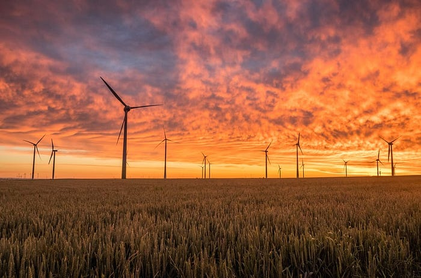

In [PRIMAVERA](https://www.primavera-h2020.eu/), a Horizon 2020 project, we focused upon the I/O machinery in a big European climate model [EC-Earth](http://www.ec-earth.org/about/). In particular, we were asked to come up with a solution to make this model produce those CMIP6 standardized output quantities, preferably without slashing the performance of the simulation workflow. The answer: we leveraged parallel Python to crunch through the high-resolution raw climate data of EC-Earth and apply the necessary formulas and conversions; the [ece2cmor3](https://github.com/EC-Earth/ece2cmor3) tool that does this has been adopted by the community as the method of choice to post-process this model output, and has since then been used to produce petabytes of climate model data for AR6.

Emerging lakes at the termini of receding glaciers in the Bhutan-Himalaya in 2002 (source: NASA)Leaving the data production side of the equation, we enter the analysis aspect of the research: you see, 200 years of simulated global humidity fields on, say, 27 atmospheric pressure levels doesn’t quite answer questions of fellow researchers or policy makers by itself. These data serve as input to tools and applications that reduce them to relevant information for society and the scientific community. The problem is that ‘tools and applications’ often translate into an unsustainable mess of ad-hoc scripts. These get stitched together as a sequence of undocumented commands along the lines of “./proc.sh work/out.nc work/out2.nc”. Now when a colleague asks three months later to “recreate that figure for some other climate model”, a panicky feeling takes over, soon to be followed with regret over the lack of design and documentation, ending in frustration over the fact that those beloved tools appear to have stopped functioning after the previous OS update. And to be frank, analyzing climate data is just becoming too costly in terms of time, RAM, disk space and network bandwidth to just do freewheeling on a PC.

This also has been recognized by the climate community, and data analysis frameworks have been steadily gaining momentum. You may know [Pangeo](https://pangeo.io/index.html), the [Copernicus Data Store](https://cds.climate.copernicus.eu/#!/home), the [KNMI Climate Explorer](https://climexp.knmi.nl), or the [ESMValTool](https://www.esmvaltool.org/) suite, which was used for several charts and tables into create several figures in AR6. ESMValTool stands for Earth System Model Validation Tool, but it can do a lot more than that; it ensures one uses standardized algorithms, containerized tools and transparent provenance during the process of extracting useful information from the massive amount of data coming from observations and models. It makes it easy to create [Findable, Accessible, Interoperable, and Reproducible](https://www.rd-alliance.org/group/fair-research-software-fair4rs-wg/outcomes/fair-principles-research-software-fair4rs) (FAIR) analysis software for climate data. Within the [IS-ENES3](https://www.esciencecenter.nl/projects/is-enes3/) and [C3S-MAGIC](https://www.esciencecenter.nl/news/c3s-magic-developing-software-for-data-from-climate-models/) projects, we have made many contributions to ESMValTool, and we have greatly benefited from its capabilities in the [eWaterCycle2](https://www.esciencecenter.nl/projects/ewatercycle-ii/) and [EUCP](https://www.esciencecenter.nl/projects/european-climate-prediction-system/) projects.

Photo by [Karsten Würth](https://unsplash.com/@karsten_wuerth) at [unsplash](https://unsplash.com)

Finally, we get to the aspect of disseminating the AR6 message to a broad audience. When you navigate to the IPCC web page to look at the AR6 conclusions yourself, you may quickly find yourself lost in the scientific jargon and formal language. AR6 is targeted at researchers and policy makers, but its implications are so far-reaching that it should be addressing our society as a whole. The aim of the H2020 project [RECEIPT](https://climatestorylines.eu/) is to assess Europe’s vulnerability to climate risks and represent these risks in the form of storylines. Sometimes it’s not feasible to perform a full statistical analysis of climate impacts on a complex system. Or even so, it may be that stakeholders are more interested in a few representative (or extreme) datapoints to assess their vulnerability, and that is where storylines enter the picture. By showing the chain of events caused by warming climate and intensifying extreme weather, we hope to better convey potential agricultural, socio-economic and infrastructural hazards. Here, the eScience Center plays a leading role in visualizing these storylines in an interactive [web-based environment](https://www.climateimpactstories.eu/?sector=agriculture&amp;story=1).

These are just a handful of examples of where the eScience Center has in some way contributed to AR6. We have been involved in many more projects in climate and weather, detecting the [occurrence of climate tipping points](https://www.research-software.nl/projects/1349), improving the predictability of climate in Europe (EUCP) and the Northern Atlantic ([Blue Action](https://blue-action.eu/)), or estimating the likelihood and severity of [extreme heat and flooding events](https://climate.copernicus.eu/prototype-extreme-events-and-attribution-service). The common ingredient connecting these research projects is always climate change. While our opponent in the ring is gaining strength, we use science and computing to improve our ability to predict his moves and better brace for impact of the punches. The global effort to reduce emissions will be crucial to limit those impacts and hopefully prolong the battle until a jury decision, to be made by future generations.

Thanks to *[*Bouwe Andela*](https://www.esciencecenter.nl/team/bouwe-andela-msc/)*, *[*Maaike de Jong*](https://www.esciencecenter.nl/team/dr-maaike-de-jong/)*, *[*Jesus Garcia Gonzalez*](https://www.esciencecenter.nl/team/jesus-garcia-gonzalez-msc/)* and *[*Yifat Dzigan*](https://www.esciencecenter.nl/team/dr-yifat-dzigan/)
