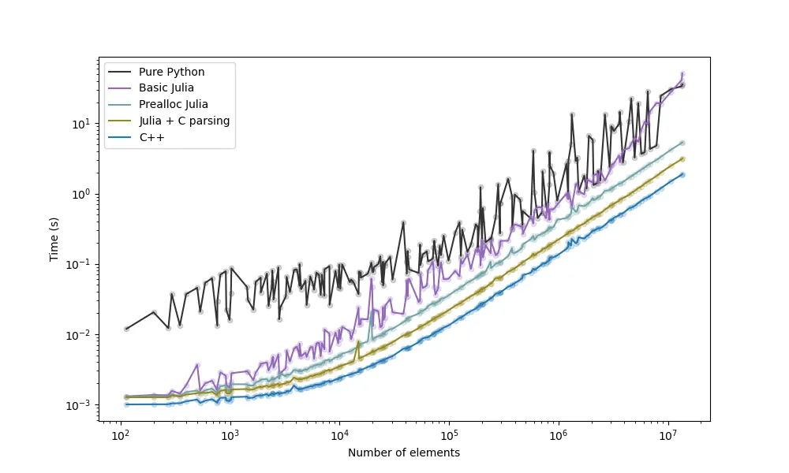
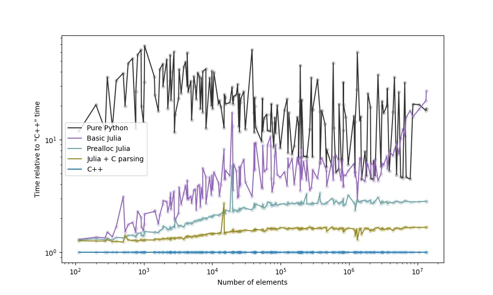
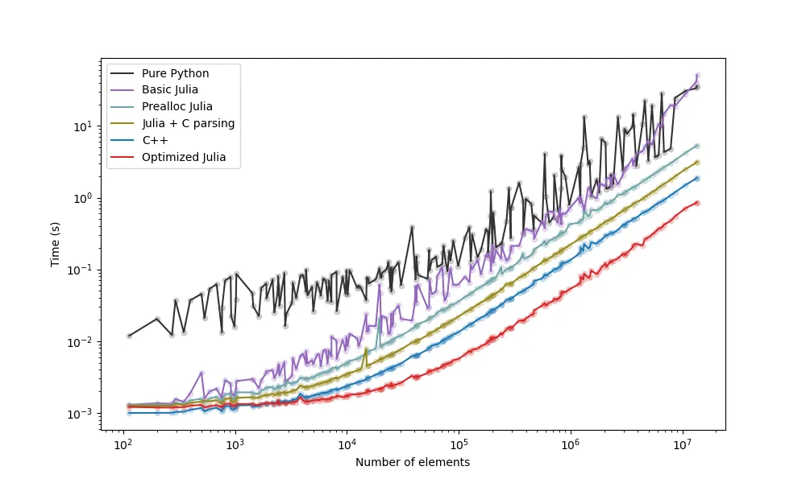
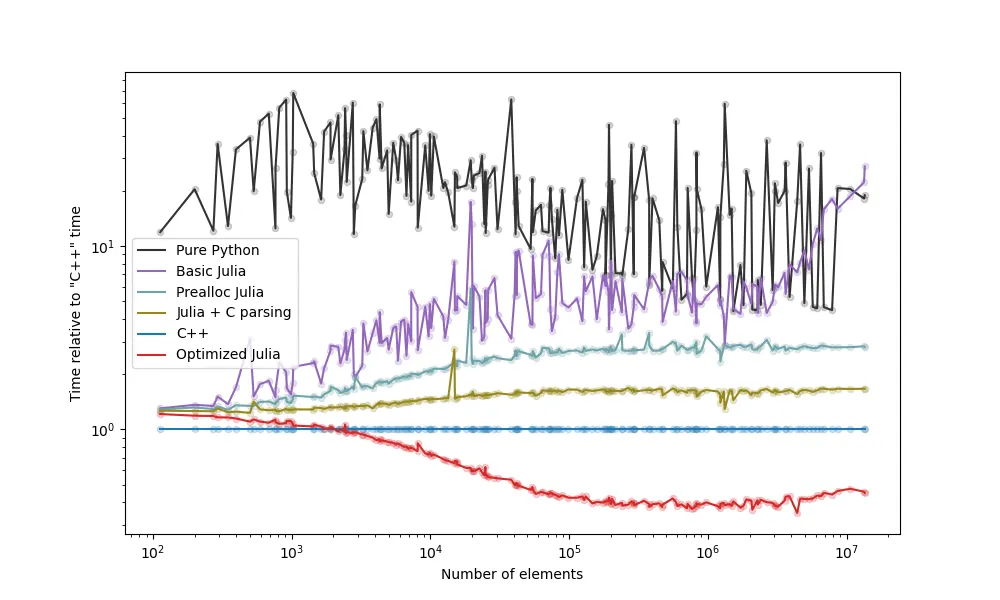
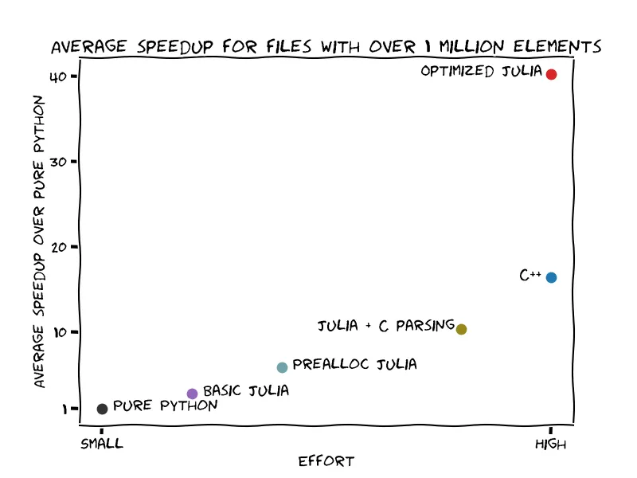

## Part 3 of the series on achieving high performance with high-level code

Here comes a new challenger: It is Julia. Photo by Joran Quinten on Unsplash ( https://unsplash.com/photos/MR9xsNWVKvo ), modified by us.

## Introduction

In our [last post](https://medium.com/@abelsiqueira/speed-up-your-python-code-using-julia-f97a6c155630), we were able to improve Python code using a few lines of Julia code. We were able to achieve a very interesting result without optimizing prematurely or using low-level code. However, what if we want more? In this blog post, we will investigate that.

It is quite common that a developer prototypes with a high-level language, but when the need for speed arises, they eventually move to a low-level language. This is called the “two-language problem”, and Julia was created with the objective of solving this issue (read more on their [blog post from 2012](https://julialang.org/blog/2012/02/why-we-created-julia/)). Unfortunately, achieving the desired speedup is not always easy. It depends highly on the problem, and on how much previous work was done trying to tackle it. Today we find out how much more we can speed up our Julia code, and how much effort it took.

### Previously

- [Patrick Bos](https://egpbos.medium.com/) presented the problem of reading irregular data, or non-tabular data, in [this blog post](https://blog.esciencecenter.nl/irregular-data-in-pandas-using-c-88ce311cb9ef).
- He also presented his original solution to the problem using just Python with pandas, which we are calling **Pure Python** in our benchmarks.
- Finally, he presented a faster strategy which consisits of calling C++ from Python, which we denote **C++.**
- In the [previous blog post](https://blog.esciencecenter.nl/speed-up-your-python-code-using-julia-f97a6c155630) of this series, we created two strategies with Python calling Julia code. Our first strategy, **Basic Julia**, wasn’t that great, but our second strategy, **Prealloc Julia,** was sufficiently faster than **Pure Python,** but not as fast as **C++.**

Remember that we have set up a [GitHub repository](https://github.com/abelsiqueira/faster-python-using-julia-blogposts) with our whole code, and also, that we have a [Docker image](https://hub.docker.com/r/abelsiqueira/faster-python-with-julia-blogpost) for reproducibility.

## For the C fans

Our first approach to speeding things up is to simulate what C++ is doing. We believe that the C++ version is faster because it can read the data directly as the desired data type. In Julia, we had to read the data as *String* and then convert it to *Int*. We don’t know how to do that with Julia. But we know how to do that with C.

Using Julia’s built-in `ccall` function, we can directly call the C functions to open and close a file, namely `fopen` and `fclose`, and call `fscanf` to read and parse the file at the same time. Our updated Julia code which uses these C functions is below.

Let’s see if that helped increase the speed of our code. We include in our benchmark the previous strategies as well. This new strategy will be called **Julia + C parsing.**

Run time of Pure Python, C++ Basic Julia, Prealloc Julia, and Julia + C parsing strategies. (a) Time per element in the log-log scale. (b) Time per element, relative to the time of the C++ version in the log-log scale.

Our code is much more C-like now, so understanding it requires more knowledge about how C works. However, the code is way faster than our previous implementation. For files with more than 1 million elements, the **Julia + C parsing** strategy has a 10.38 speedup over the **Pure Python** strategy, on average. This is almost double the speedup we got with **Prealloc Julia,** which is an amazing result. For comparison, on average, **C++** has a 16.37 speedup.

## No C for me, thanks

Our C approach was very fast, and we would like to replicate it with pure Julia. Unfortunately, we could not find anything in Julia to perform the same type of reading as `fscanf`. However, after some investigation, we found an alternative.

Using the `read` function of Julia, we can parse the file as a **stream of bytes**. This way we can manually walk through the file and parse the integers. This is the code:

We denote this strategy **Optimized Julia.** This version of the code manually keeps track of the sequence of bytes related to integers, so it is much less readable. However, this version achieves an impressive speedup, surpassing the C++ version:

Run time of Pure Python, C++ Basic Julia, Prealloc Julia, Julia + C parsing, and Optimized Julia strategies. (a) Time per element in the log-log scale. (b) Time per element, relative to the time of the C++ version in the log-log scale.

It was not easy to get to this point, and the code itself is convoluted, but we managed to achieve a large speedup in relation to Python using only Julia, another high-level language. The average speedup for files with over 1 million elements is 40.25, which is over 2 times faster than what we got with the **C++** strategy. We remark again that the **Pure Python** and **C++** strategies have not been optimized, and that readers can let us know in the comments if they found a better strategy.

So yes, we can achieve a speedup equivalent to a low-level language using Julia.

## Conclusions: We won, but at what cost?

One thing to keep in mind is that to achieve high speedups, we had to put more effort into getting to that point. This effort comes in diverse ways:

- To write and use the **C++** strategy, we had to know sufficient C++, as well as understand the libraries used. If you don’t have enough C++ knowledge, the effort is higher, since what needs to be done is quite different from what Python developers are used to. If you already know C++, then the effort is that of searching the right keywords and using the right libraries.
- To write and use any of the Julia strategies, you need to put some effort into having the correct environment. Using Julia from Python is still an experimental feature, so your experience may vary.
- To write the **Basic Julia** and **Prealloc Julia** strategies, not much previous knowledge is required. So, we can classify this as a small effort.
- To write the **Julia + C** and **Optimized Julia** strategies, we need more specialized knowledge. This is again a high-effort task if you do not already know the language.

Here’s our conclusion. To achieve a high speedup, we need specialized knowledge which requires a big effort. However, we can conclude as well that, if you are not familiar with either C++ or Julia, then acquiring some knowledge in Julia allows you to get a smaller improvement. That is, a small effort with Julia already gets you some speedup. You can prototype quickly in Julia and get a reasonable result and keep improving that version to get C-like speedups over time.

Speedup gain relative to the effort of moving the code to a different language.

We hope you have enjoyed the series and that it helps you with your code in any way. Let us know what you think and what you missed. Follow us for more research software content.

*Many thanks to our proofreaders and reviewers,* [*Elena Ranguelova*](https://www.esciencecenter.nl/team/dr-elena-ranguelova/)*,* [*Jason Maassen*](https://www.esciencecenter.nl/team/dr-jason-maassen/)*,* [*Jurrian Spaaks*](https://www.esciencecenter.nl/team/jurriaan-spaaks-msc/)*,* [*Patrick Bos*](https://www.esciencecenter.nl/team/dr-patrick-bos/)*,* [*Rob van Nieuwpoort*](https://www.esciencecenter.nl/team/prof-dr-rob-van-nieuwpoort/)*, and* [*Stefan Verhoeven*](https://www.esciencecenter.nl/team/stefan-verhoeven-bsc/)*.*
