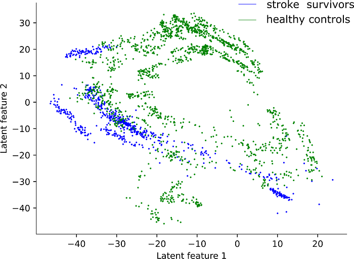

Along the way, the biggest issue was our data set itself. Because data collection of human movements is a job that takes time and our patient group is small, we only have a limited amount of data available. At the same time, the data set is highly variable, which makes the problem more difficult for Machine Learning.

In next steps for this project, we are exploring the results and trying to translate them into information that is valuable for our research field. At the same time, we are in the early stages of a data sharing effort, with those who may have similar data sets. That way, we will be able to increase the size of our training set.

The first result can be seen in the figure below. It shows the distribution of the different people (who were part of a study) using two latent features of a variational autoencoder. By creating the whole-body movement from the latent space, we were able to show the gait patterns which represented the people in the different areas of the two-dimensional latent space. In the future, this will help to evaluate a patient’s gait and their improvement during and after rehabilitation.

[Dr. Sina David**](https://research.vu.nl/en/persons/sina-david) Assistant Professor in the Faculty of Behavioural and Movement Sciences, Neuromechanics and AMS-Rehabilitation &amp; Development at Vrije Universeit Amsterdam. Follow her on Twitter [@SinaDavid1907](https://twitter.com/SinaDavid1907).

[**Dr. Michiel Punt**](https://www.internationalhu.com/research/researchers/michiel-punt) Senior researcher at HU University of Applied Sciences Utrecht. He is also a Postdoc researcher at VU Amsterdam. Follow him on Twitter [@MichielPunt](https://twitter.com/MichielPunt).

[**Yuge Yhang**](https://research.vu.nl/en/persons/yuge-zhang) External PhD Candidate at the Faculty of Behavioural and Movement Sciences, Neuromechanics and AMS-Ageing &amp; Vitality. Follow her on Twitter [@yugezhang5](https://twitter.com/yugezhang5).

Learn more by visiting [human-movement-sciences.nl/nm](https://www.human-movement-sciences.nl/nm/).

## Acknowledgments

The work described in this blog is supported by research software engineers (RSEs) of the Netherlands eScience Center, [Dr. Cunliang Geng](https://www.esciencecenter.nl/team/dr-cunliang-geng/), [Dr. Yang Liu](https://www.esciencecenter.nl/team/yang-liu/) and Dr. [Sonja Georgievska].
