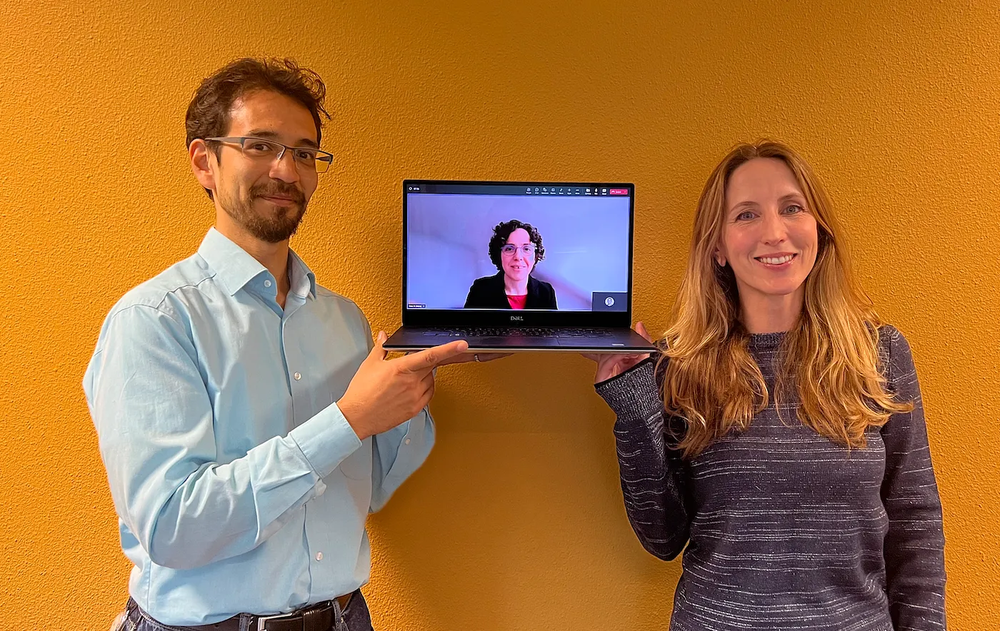
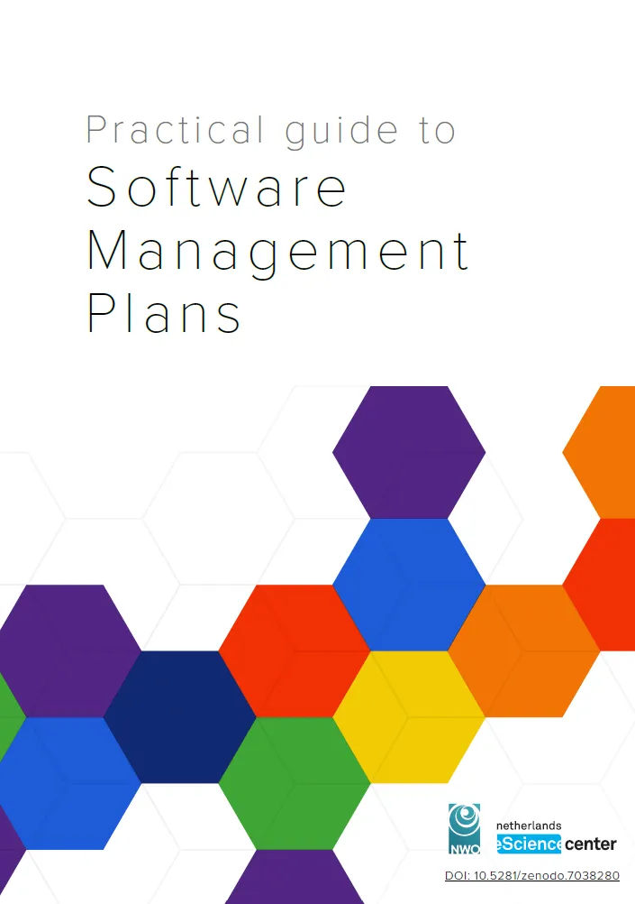
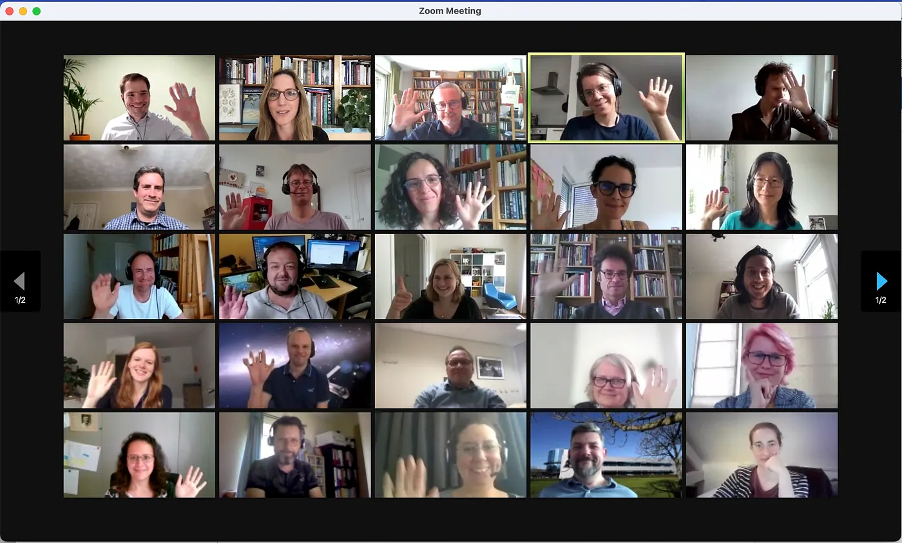

Today the Netherlands eScience Center and [NWO](https://www.nwo.nl/en) released a [Practical Guide to Software Management Plans](https://doi.org/10.5281/zenodo.7038280) (SMPs). The [Software Management Plan Working Group](https://www.esciencecenter.nl/national-guidelines-for-software-management-plans/) developed the Guide with input from many members of the national and international research community. The result is a practical guide that can be used to effectively plan research software development, archiving, reuse and maintenance.

To learn more about this guide, we interviewed three people closely involved with its development: [Carlos Martinez-Ortiz](https://twitter.com/neocarlitos) (Chair of the SMP working group, Netherlands eScience Center), [Maria Cruz](https://twitter.com/gravana) (Coordinator SMP working group, NWO), and [Maaike de Jong](https://www.esciencecenter.nl/team/dr-maaike-de-jong/) (Coordinator SMP working group, Netherlands eScience Center).

Carlos Martinez-Ortiz, Maria Cruz (on-screen) and Maaike de Jong. Photo by Veronica Pang.

**Congratulations on this achievement! Why do we need guidelines on Software Management Plans?**

*Maaike:* Research software has become an integral part of almost every research project. In the Dutch research support community, particularly within the Local Digital Competence Centers, awareness of the importance of research software as a key output of many projects is increasing.

*Maria:* The growing importance of software as a research output in its own right highlights the need for [specific policies and guidelines](https://doi.org/10.5281/zenodo.4543569) that promote the development of open and sustainable research software. Researchers typically specify their plans for managing software in [data management plans](https://www.nwo.nl/en/research-data-management), but these contain limited guidance on research software management.

**Could you give an impression of what’s included in the SMP guidelines?**

*Carlos:* The guidelines describe what you should consider when you manage research software. Examples of requirements for research software are version control, licensing, software citability, and documentation. How you should manage software in a specific research project is dependent on the type of software, and on its functionality. A few scripts for preprocessing a specific dataset often do not require the same kind of management as a core open-source library for a specific research field, for example. The guidelines specify core requirements for all research software, and additional requirements that are only necessary in some situations. They also include resources that tell you how you can meet these requirements. Organizations can use these guidelines to create their own template for a Software Management Plan, and individuals can use it when they are wondering how they should manage their own software.

(text continues below image)

**How did you start with the development of these guidelines?**

*Maaike:* We started by organizing a [Workshop on Software Management Plans](https://blog.esciencecenter.nl/transparency-in-research-and-football-765a726ab5c9) in June 2021. This workshop, jointly organized by the Netherlands eScience Center and NWO, brought together research support staff and policymakers from 28 different Dutch research organizations to discuss software management in research projects.

*Carlos:* The feedback we received from the workshop participants was very clear: There was a need for guidelines on research software management and, in particular, guidance on what should be included in an SMP.

*Maaike:* To address this need, we set up the Working Group on Software Management Plans in November 2021 to establish national guidelines on research software management plans. This work was partly inspired by the [Science Europe Practical Guide to the International Alignment of Research Data Management](https://www.scienceeurope.org/our-resources/practical-guide-to-the-international-alignment-of-research-data-management/).

Participants of the SMP workshop in June 2021

**How did you ensure representation from a wide variety of stakeholders?**

*Maaike:* The [SMP working group](https://www.esciencecenter.nl/national-guidelines-for-software-management-plans/) comprised five experts in research software, representing different research organizations in the Netherlands, and different roles within those organizations, including research support staff, policy makers and research software engineers (RSEs).

*Maria:* We also set up a sounding board who gave feedback on the guidelines at different stages of their development. The sounding board included researchers and other software experts from Dutch and international organizations not represented in the Working Group.

**What kind of questions did the SMP working group and sounding board look at?**

*Carlos:* We started by researching existing SMPs and analyzing the needs and expectations from researchers. Why were SMPs considered necessary? What problems should they address? And how would they help improve research software and research? Answering these questions led to the first draft of the guidelines, which was shared with the sounding board in March 2022.

*Maria:* A second draft of the guidelines was then shared with the sounding board. We collected their feedback byl the end of May 2022. Once this feedback was integrated, a new version was produced and opened up for open consultation to the wider community in June 2022.

**Was there a lot of interest in the guidelines?**

*Carlos:* We received feedback from 65 people from across the globe. This is not surprising. Research software knows no frontiers, and as such, research software management is a topic of global interest and importance.

**How did you integrate all the feedback you received from the community?**

*Maaike:* The consultation rounds provided a huge amount of good and interesting suggestions. The WG worked tirelessly throughout the summer to integrate all the feedback from the open consultation and the workshop to create a final version of the SMP guidelines.

*Maria:* Some of the suggestions were beyond the scope of this first attempt to create national guidelines for software management plans. An excellent example of that is making [SMPs machine-readable](https://danielskatzblog.wordpress.com/2016/04/13/data-and-software-management-plans-must-be-public-and-should-be-machine-readable/), which would make them easier to share, and verify.

*Carlos:* A second workshop took place in June 2022 in parallel with the open consultation. This time we invited the community to bring software examples with which to test the guidelines. After the WG explained how the guidelines were meant to be used, the participants tried to apply the guidelines to their own software. This exercise proved to be very fruitful and generated additional feedback on the guidelines.

**It sounds like this was a long, thorough, and iterative process involving the community. What are the next steps for the SMP guidelines?**

*Maaike:* We encourage the community to use these guidelines as a basis to set up their own SMP templates and research software management policies. The eScience Center aims to continue collaborating with research organizations on this topic, and to support the implementation of software management by e.g. developing training for researchers and support staff.

*Maria:* We consider these guidelines to be a first step in a journey to improve research software management. One important issue that was raised several times during the consultation period was how to implement these guidelines alongside existing research data management policies and protocols. This is something that we still need to solve together with the community in the coming year.

Interview conducted by [Lieke de Boer](https://www.esciencecenter.nl/team/dr-lieke-de-boer/)
