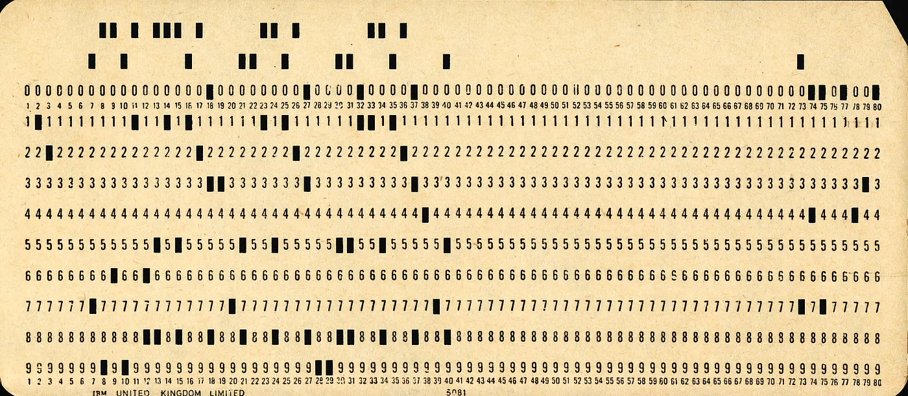
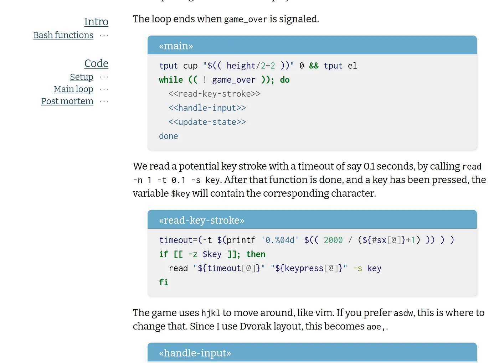

For a Research Software Engineer, dealing with legacy code is seen as a chore: dirty work, but a necessary evil. But the truth is, every time I read someone else’s code, I learn something. Using Entangled to work out how some obscure code works also makes it kind of fun!

Punchcard (credit: Pete Birkinshaw from Manchester, UK)

On a typical day in the life of a Research Software Engineer (RSE), out on the prairies of academia, scavenging for source code, the RSE often encounters source codes for computer programs that have a lot to be desired in terms of readability, reusability, and, to summarize, in terms most modern standards. RSEs have coined a few derogatory terms for these code bases: *PhD-ware*, *labware,* or, heaven forbid, *professor-ware*. The proper academic name for these creatures is *legacy code.*

How we handle these codes depends entirely on the situation. Suppose the correct functioning of the software is responsible for some important research output. We would like to reproduce the said output, or at the very least understand *exactly* how these results were obtained. In an ideal case, it should be enough to read the corresponding journal article and see that it matches what is done in the code. Then we can start changing the model or fiddling with newer data and derive our own conclusions.

When first faced with a new body of source code, the task of disentangling exactly how it works can be quite daunting. In many legacy codes, readability was not a primary concern. In science land it is “ *publish or perish”*, never mind documenting your code. **How can we figure out the inner workings of a code in a systematic way, such that the next pair of eyes will have an easier time?** This is where [Entangled](https://entangled.github.io/) comes in.

Entangled is an engine for doing [literate programming](https://blog.esciencecenter.nl/literate-programming-in-science-1669094541a7) in Markdown. This means you can write entire computer programs from code blocks embedded in a reader-friendly Markdown document. Code blocks can *quote* other code blocks by including `<<reference>>` tags. Entangled replaces these tags with their content in the final output source code. This way, we take a source code apart while the functioning of the compiled program is completely preserved.

So, how do we attack the problem of dissecting our unknown code base? We start with a Markdown file containing, in a code block, the code that we’re interested in. If we find interesting bits, cut out the relevant code, put it in a separate block, and replace it in the original code with a reference. The Markdown lets us put parts of the code in different sections, and add documentation, derivations, tables, references, or even our own thoughts. Repeat until satisfied.

Depending on the size of the project you may want to disentangle just a few essential files in this manner, or perhaps you prefer to deconstruct the entire code. It doesn’t matter. The resulting Markdown files can be converted for online reading using any of your favourite tools: Pandoc, MkDocs, Jekyll, you name it.

### Examples

This all doesn’t mean much without a decent example, so let's see a couple of them.

The first example we’ll look at is one that I picked from Rosetta Code. It’s an implementation of the game [Snake in Bash](https://rosettacode.org/wiki/Snake#UNIX_Shell). Since Bash can be quite a dense language to read, we may learn a lot by destructuring even this tiny program.

Legacy code, looking readable thanks to Entangled

As far as Bash scripts go, this is reasonably clean code, so not your worst nightmare. I encourage you to take a look at the full result at [jhidding.github.io/shell-snake](https://jhidding.github.io/shell-snake). As you may see, I have split the program into three parts: setup, main loop, and post-mortem. If I were more interested, I could further pull apart some expressions, building a deeper hierarchy. If I’m unhappy with some part, I can swap out some code in a well-documented manner.

The second example is a bit bigger. Also, this time I’ve translated the source code from C++ to Rust. There is a 100-sloc C++ code for ray tracing a set of spheres by Kevin Beason, called [SmallPT](https://www.kevinbeason.com/smallpt/) (it is quite famous in some circles). While the original is focused on getting as much as possible into a hundred lines of code, I wanted a bit more understanding. A ray tracer computes an image by doing a physical simulation of millions of photons in a given scene.

A ray-traced rendering of a few spheres.

The full demo can be found here: [jhidding.github.io/literatept](https://jhidding.github.io/literatept/). I made some algorithmic changes to the original that are well documented. See for instance the [section on path tracing](https://jhidding.github.io/literatept/#path-tracing). In another instance, I tried to understand the underlying physics of [reflecting rays in the transparent sphere](https://jhidding.github.io/literatept/#partial-reflection). There I was able to underpin the code with equations and references.

> Does this sound interesting to you? Then you may like to get Entangled at [https://entangled.github.io/](https://entangled.github.io/).
> 
> Also read my other blog posts about [Literate Programming in Science](https://blog.esciencecenter.nl/literate-programming-in-science-1669094541a7).
