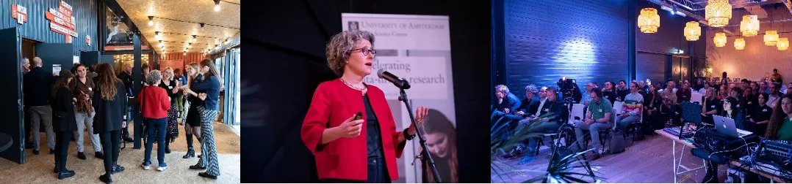
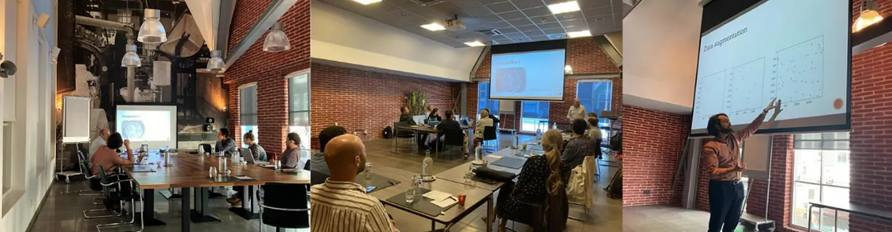
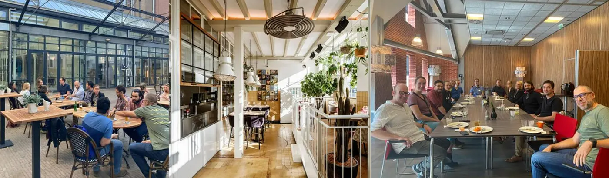

This week, we interviewed [Lisa Yu](https://dsc.uva.nl/content/news/2022/06/interview-with-data-science-community-manager-lisa-yu.html), Community Manager of the Data Science Center (DSC). The DSC is a coordinating hub within the University of Amsterdam (UvA) Library, launched in 2021. The need for software and skills that make researchers able to adequately deal with available data continues to grow across all research disciplines. Thanks to funding provided by the UvA Executive Board, the DSC is in a position to boost digitally driven research at UvA.

**Q: What are the DSC’s most important activities?**

Photo caption: Data Science Day 2022, photographed by Monique Kooijmans

*Lisa:* The DSC hosts a variety of important activities throughout the year. In the autumn of 2022, we held our [second annual Data Science Day](https://dsc.uva.nl/content/news/2022/11/data-science-day-2022.html) at Startup Village in Amsterdam Science Park. More than 100 attendees from within and outside of UvA participated in this action-packed event, which consisted of morning workshops, keynote presentations and pitch presentations on a variety of data science topics.

Data Science Centre Hackathon 2022, photographed by Monique Kooijmans

Our weekly [Friday Coffee and Data meet-ups](https://dsc.uva.nl/programmes/coffee-and-data/coffee-and-data.html) are also very important. These meet-ups are for our DSC members and consist of free workshops and training like the [Software Carpentry](https://software-carpentry.org/lessons/) and Image Analysis, seminar presentations by DSC members, and collaboration sessions. Beyond this being an upskilling opportunity, it is also a chance for members to meet like-minded people from other faculties and campuses and to collaborate with each other.

We update our events page regularly online, so [check our website](https://dsc.uva.nl/) regularly for all our upcoming planned activities!

**Do you have an example of how the DSC has helped researchers at UvA?**

Our ultimate goal is to accelerate software and data-driven research at UvA, and help researchers do research they wouldn’t have otherwise been able to do. One example of how the DSC has helped achieve this is through its [Accelerate programme](https://dsc.uva.nl/programmes/accelerate-programme/accelerate-programme.html), where we co-finance the hiring of data scientists (who have roles comparable to research software engineers, ed.) and data engineers within faculties.

Since its launch in 2021, the Accelerate programme has led to the successful hiring of the equivalent of 18 FTE data scientists and engineers across a range of UvA faculties. The Accelerate programme has helped fund lots of cool research, ranging from how to better understand the history of early globalization and colonisation, to why people follow and break rules, to growing tomatoes!

Another example of how we have helped researchers at UvA is through our Interdisciplinary PhD programme, where we have provided funding for 7 PhD students to work on a selection of interdisciplinary research projects. [More information about these projects and its collaborators is listed on our website](https://dsc.uva.nl/programmes/interdisciplinary-phd-programme/interdisciplinary-phd-programme.html)!

**There are many institutes that may want to increase their capacity and attention for data science and research software. What did the Data Science Centre do to make this a success at UvA? What do you think others in their position could learn from their experience?**

I believe that one of the biggest contributing factors behind the DSC’s success so far is our strong focus on community building and engagement. Our DSC community members are at the heart of everything we do, and we are always in regular interaction with our members, whether it be via our Slack channel, Friday meet-ups, DSC weekly bulletin, or DSC Twitter. This regular interaction also helps us ensure that the activities we plan reflect the needs and wants of the community — for instance, we ask members to vote on what topics they want to receive training on, and then we plan the workshop curriculum based on this feedback.

Data Science Centre Away Day in Zaandam

I also think that we have found a perfect home at the University Library. Firstly, the Library already provides a range of tailored and hands-on data science support to researchers and faculties, which means that the DSC can leverage the available expertise in the field of data management.

Being a part of the University Library also means that we can access its facility services, wide network within UvA, and gain practical support with the communication and logistical coordination of our events and activities (such as Data Science Day). This affords our team greater capacity to drive all the different initiatives and activities that we want to organise for the community at UvA.

**What are the plans for the future of the DSC?**

Since our launch in 2021, we have achieved great progress in building a strong data science community and presence at UvA.

Looking ahead, we want to continue growing the DSC community and giving our members as many opportunities as possible to upskill and further develop their expertise.  
  
This means:

- Expanding our workshop and training support programme
- Continuing to embed data scientists and/or engineers across all research disciplines via the Accelerate programme (by 2025, we aim to have 35 dedicated data scientists and/or engineers across UvA faculties)
- Leverage our partnerships with local, national and international data-science organisations to further stimulate more interdisciplinary and interorganisational data science collaborations

We also welcome new collaborations and partnerships! If you are interested in collaborating with us or learning more about what we do, then please contact us at [dsc@uva.nl](mailto:dsc@uva.nl)!

**Who is the Data Science Centre staffed by?**

The DSC coordinating team consists of our Scientific Director Prof. Paul Groth, Max Haring (Head of Education and Research Support at the University Library), Boy Menist (Operational Director), Eva Lekkerkerker (Digital Skills Coordinator — maternity leave cover for Iris van der Knaap), the University Library Communications team, and a representative from the Social and Behavioural Data Science Centre which is a DSC hub. What I like most about my team is that we all come from varied backgrounds, and therefore can bring very diverse expertise to the table.
