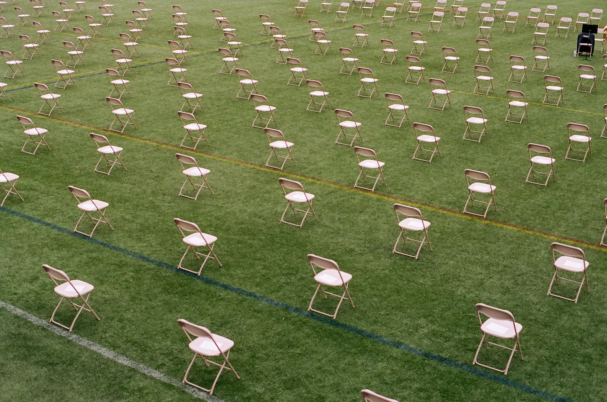
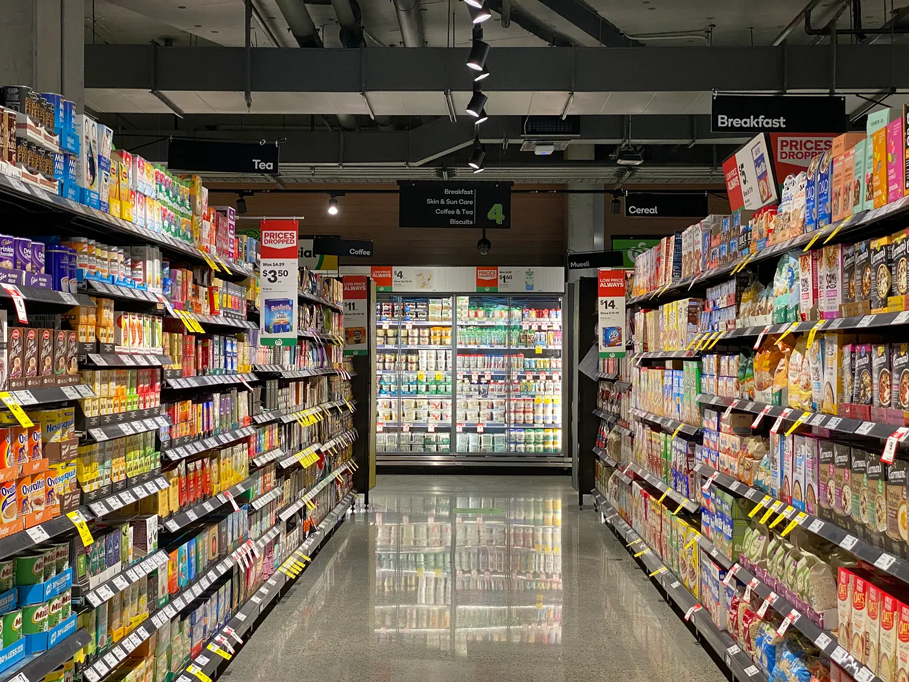

*This blog post is written by University of Amsterdam researchers Charlotte Tanis and Andrew Heathcote, who participated in the Small-Scale Initiative for Software Performance Optimization. Their team’s project: predicting the movement patterns of pedestrians, which can help governments and policy-makers in pandemics and crisis situations.*

Photo by Forest Simon on Unsplash

During the COVID-19 pandemic, a group of researchers from the University of Amsterdam started the [Data vs. Corona](https://dataversuscorona.com/) initiative. Their mission: to create a community of data scientists who make their skills available in society’s battle against the coronavirus. One of the projects that emerged out of the initiative was our [Minds for Mobile Agents](https://www.ampl-psych.com/projects/minds-for-mobile-agents/) project. Minds for Mobile Agents uses real-life data to help governments implement effective physical distancing guidelines. In order to do so, it is key to accurately simulate, explain and predict how individuals move when going grocery shopping or visiting restaurants.

Understanding how individuals move in such so-called *low to medium density settings* has much wider applications than social distancing measures alone. Security authorities benefit from research like this too, because it helps them make realistic vulnerability assessments in crisis situations. This improves the safety and preparedness in the case of, for example, attacks on public spaces. [The elaborate media coverage](https://www.telegraaf.nl/nieuws/1822382862/supermarktproef-stoplicht-bij-ingang-paaseitjesbij-%20%20uitgang%20and%20https:/nos.nl/video/2374282-hoe-houd-je-het-beste-afstand-in-de-supermarktdat-%20%20onderzoeken-ze-in-veldhoven) we received in national media during our initial experiments showed that understanding and predicting pedestrian behavior in small but complex environments is a topic of great current interest.

Photo by Franki Chamaki on Unsplash

Our research objective is to make accurate predictions about the movement patterns of a group of individuals, which means that we need to be able to simulate the fact that individuals move around in their environment for different reasons. That is exactly what the mathematical “Predictive Pedestrian” model does. The model simulates a set of pedestrians in a supermarket or restaurant and predicts each simulated pedestrian’s step choices. The choices a simulated pedestrian makes are based on predictions that simulated pedestrian would make about the behaviour of other pedestrians in the space. Each agent’s “mind” can be flexibly specified using parameters that have clear psychological interpretations, making the behaviour of the model explainable.

Our team incorporated complex series of goals and individual differences in the way in which pedestrians move around and interact with each other according to the model (see [here](https://www.ampl-psych.com/projects/minds-for-mobile-agents/) for background and illustrations). As you may be able to imagine, the computational cost associated with these simulations is high. Our approach requires us to develop methods that can estimate the distributions of many model parameters that can characterize realistic scenarios.

### eScience Center support

We participated in the eScience Center Small-Scale Initiative (SSI) in Software Performance Optimization. The goal of our SSI project was to optimize the computational efficiency of the Predictive Pedestrian model. Our team worked together with eScience Center Research Software Engineers Eva Viviani and Malte Luken. We started off profiling the Predictive Pedestrian model code to identify computational bottlenecks. We then ported a selection of functions to [an R package we dubbed M4MA](https://github.com/m4ma), and added the option to perform the associated computations in C++ through the [Rcpp](https://www.rcpp.org/) framework. This resulted in the code running approximately ten times faster. The M4MA package puts us one step closer to realizing the promise of the Predictive Pedestrian model: to quantitatively characterize and simulate pedestrian behaviour in a wide range of scenarios in real time.

In the next step of the project, the M4MA package will be used to analyse the results of experiments in various settings using ultra-wide band technology to precisely measure the locations of real pedestrians, and to guide the design of new experiments. The experimental results will be used to estimate the model parameters, enabling the first thorough investigation of when individual differences in pedestrian behavior matter and how they change across different scenarios. Models that are calibrated for these environments offer exciting possibilities: they may result in more accurate simulations of how people move around, and can provide meaningful data that can be used to make changes without needing expensive calibration studies in every case. This in turn facilitates policy advice and the better design of environments that achieve a wide variety of goals related to, for example, safety (e.g., maintaining physical distance) and commerce (e.g., encouraging smooth flows through targeted areas).

Edited by *Lieke de Boer.* Thanks to *Eva Viviani* for fact checking.
