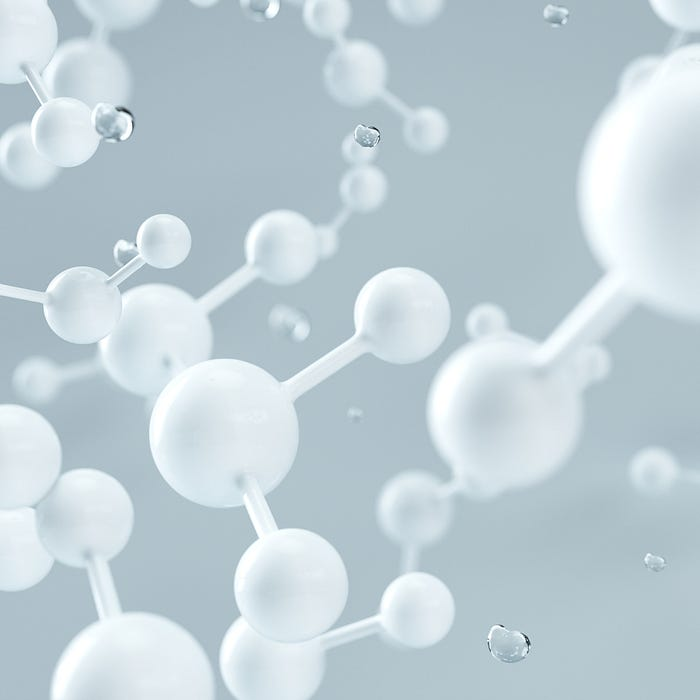
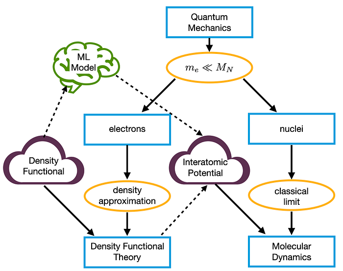
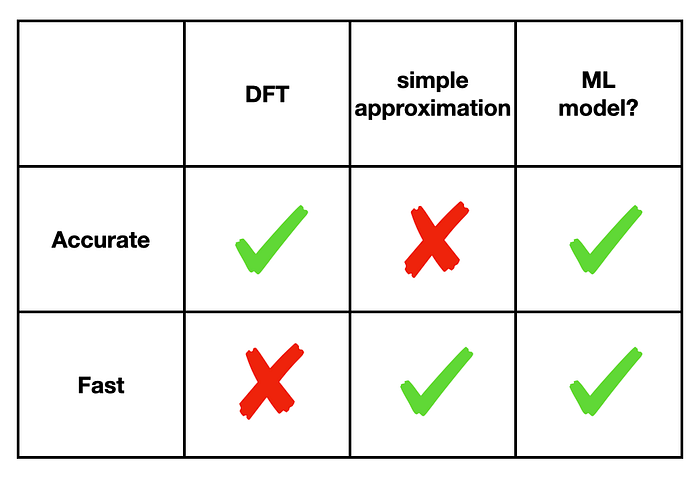
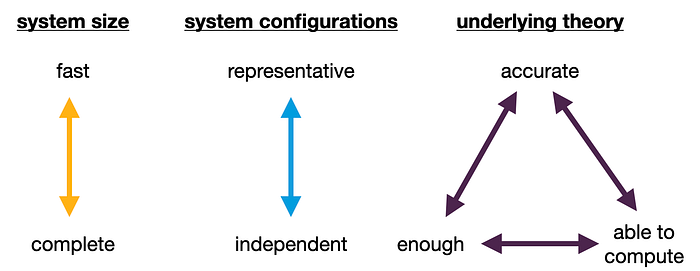
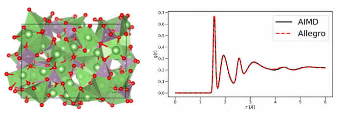

24

In the first part of this series we looked at the physics of simulating molecules, and went from quantum mechanics to something that is more efficient to solve, namely density functional theory and molecular dynamics. These both required the introduction of an unknown potential. In the second part we looked at designing a machine learning model tailored to approximating this potential.

Photo by [D koi](https://unsplash.com/@dkoi?utm_source=medium&amp;utm_medium=referral) on [Unsplash](https://unsplash.com/?utm_source=medium&amp;utm_medium=referral)

In this final part we will discuss what goes into training this model, in particular how to obtain the training data. And we will conclude with some caveats.

It’s possible to read this without having read the previous parts, but I would recommend at least reading [part 2](/molecular-simulations-using-machine-learning-part-2-1d647acd242c), and [part 1](https://medium.com/escience-center/molecular-simulations-using-machine-learning-part-1-e8624a82f680) only if you’re interested in the physical background.

I hope that these considerations will also be useful for anyone thinking of applying machine learning to their own field, even if it is not related to molecular simulations.

## How to obtain the training data

To be able to train the model, we need lots of examples of nuclei positions and the corresponding interatomic potential. To see how we can obtain this, we have to go back to the figure summarizing the first part:

Remember we decoupled the electrons from the nuclei, the electrons being described by Density Functional Theory (DFT), and the nuclei by molecular dynamics (MD). For MD we needed an interatomic potential, which captures the effect the electrons have on the nuclei. But since we do have a way to compute the electron density, namely through DFT, the obvious solution is to use DFT to compute the interatomic potential that we then use in MD, this is called ab-initio Molecular Dynamics (aiMD).

The downside as we discussed was that this is very slow, which was the reason to try using machine learning in the first place. We can still use it to compute the training data though! Note that this does assume that we can do DFT, i.e. that we know a density functional that is accurate for the system we want to study.

After designing the machine learning model to be specifically tailored for this application, and thus very data-efficient, the hope is that with relatively little training data we can train a model, that we can then use to do much more and bigger simulations. The hope then is that once the model is trained, it will be as accurate as ab-initio molecular dynamics, but as fast as molecular dynamics using a simple potential, combining the best of both worlds.

When it comes to generating the training data, there are several tradeoffs that must be carefully considered. We will discuss several of them here.

### system size

Since computing the potential for the training data is so expensive, ideally we want to be able to train the model on a small system, and once trained use it to simulate a larger system.

To be more concrete, we could take for example 10 water molecules, and for 10.000 different configurations of these 10 nuclei use DFT to compute the interatomic potential. That gives us the input and output pairs on which we can train the model. Once it is trained, we can use this model to simulate millions of water molecules for many more steps.

The tradeoff here is that if we make the training system *too* small, it will never be able to learn enough about the larger system. In an extreme case, if we take as the training system a single water molecule, the model wouldn’t see any interactions between two molecules during training.

So we must choose a training system that is small enough to be able to use DFT to generate the data, yet large enough that it captures all the interactions present in the much larger system the model will be used on once trained. What this is will depend heavily on the system considered, and will be a matter of trial and error combined with chemical intuition.

### system configurations

Another question is how to choose the inputs, i.e. the nuclei positions on which we compute the interatomic potential. One option is to just do an aiMD simulation and use all of the steps as inputs. This has the advantage that, with the exception of the initial steps, all of the configurations were obtained by following an MD trajectory, so we can expect that they are typical and we are likely to run into similar (but bigger) configurations once we use the model. So it’s very beneficial if the model performs well on these configurations.

Ideally we want all the inputs to be independent from each other, this maximizes the added value of each additional sample. So the other extreme is to sample the nuclear configurations at random, then they will indeed be completely independent from each other. However, configurations sampled at random are likely not to be physically realistic. So instead of samples being irrelevant because they are very similar to other samples, now they are irrelevant because they won’t be encountered when the trained model is used.

So there is a tradeoff between diversity and representativeness. A good tradeoff between these two extremes can be made by first doing an MD simulation using not DFT but a faster, less accurate potential. These configurations will be much more representative than random ones, but much faster to obtain than using aiMD the whole time. Then, to minimise the correlation between steps, we only take every say 100th step. Finally, because the potential we used was less accurate, only for the steps we picked do we recompute the potential using DFT.

In addition it helps to run the training simulation at a higher temperature than the system you want to use the model on. This makes the system explore more of the configuration space, and prevents the model running into unknown territory during its use.¹

### Quality vs quantity

A final consideration is between the quality and the quantity of the data. Since we compute everything from DFT, and within DFT there are several choices that can make it more accurate and slower or vice versa, choices must be made here too. There need to be enough samples for the model to be able to generalise to configurations it hasn’t seen, but it also needs to be done within our computational budget.

Tradeoffs to be navigated in generating training data.

### Many more considerations

There are tons of other things to consider, here I have focussed on some of the issues that are most particular to this application, rather than providing a full overview of deep learning. I have also focussed on the more conceptually interesting questions. There are lots of details though that can have a significant effect on the final performance, such as what activation function is used, or what optimizer². It is best to start with an existing method if possible, and if improvement is necessary experiment with varying these details and seeing what effect they have on the final performance.

### Getting started

If you are a chemist and want to try this for yourself, a good place to start might be [nequip](https://github.com/mir-group/nequip), [allegro](https://github.com/mir-group/allegro) or [DeepMD-Kit](https://github.com/deepmodeling/deepmd-kit), these work smoothly with the molecular dynamics code LAMMPS. [SchNetPack](https://github.com/atomistic-machine-learning/schnetpack) works with python’s atomic simulation environment. They all implement different models, so it is a matter of figuring out which model works best for your use case and with which software you are most familiar.

Unfortunately due to personal circumstances I didn’t have time to do any experiments myself, so I can’t recommend any particular one.

## Example

After all this theory let’s look at one example from the [Allegro](https://arxiv.org/abs/2204.05249) paper. In the figure below a small system of Li_3 PO_4 is shown, consisting of 192 atoms. The training data the authors made consisted of 11,000 configurations selected randomly from a 50,000 step ab-initio MD simulation. To get a sense of the time scales involved, the time step in this case was 2 femtoseconds, where a femtosecond is 1/10⁶ nanoseconds. The model was trained on this for machine learning standards very small dataset.

It then was able to simulate a much bigger version of the same system, consisting of 421,824 atoms, at a speed of half a nanosecond per day on a single GPU, or even 50,331,648 atoms at half that speed using 128 GPUs.

Example taken from [https://arxiv.org/abs/2204.05249](https://arxiv.org/abs/2204.05249).Assessing the accuracy of the model is a much more subtle question than say for a model that classifies whether an image is a cat or a dog. I will just explain one plot from the paper that is just one measure of the accuracy. What is shown on the right in the figure above is the radial distribution function. This is a measure of the probability of finding a pair of atoms at a given distance. The peaks in the graph reveal characteristic structures or patterns in the material, such as the most common atomic bonds or the preferred spacing between certain atom types The figure shows that Allegro managed to come very close to the accurate but slow ab-initio Molecular Dynamics, at least in this measure.

## Conclusion

Deep learning can be used to model the potential energy between molecules, needed in molecular dynamics simulations. This is a rapidly evolving field, with multiple libraries under active development, and regular papers with further improvements in methodology. It is exciting to follow these developments, and the larger scale simulations they will enable. For a relatively recent review, see [here](https://www.nature.com/articles/s41563-020-0777-6).

### footnotes

1: Thanks to Simon Batzner for correspondence on these issues.

2: In fact as I write this blog, the [latest innovation](https://arxiv.org/abs/2303.08169) is exactly a new optimizer.
