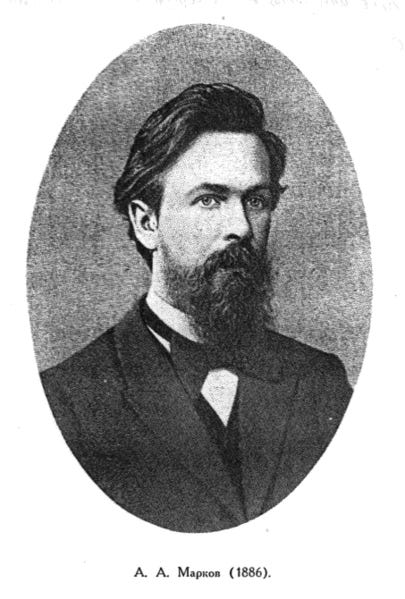
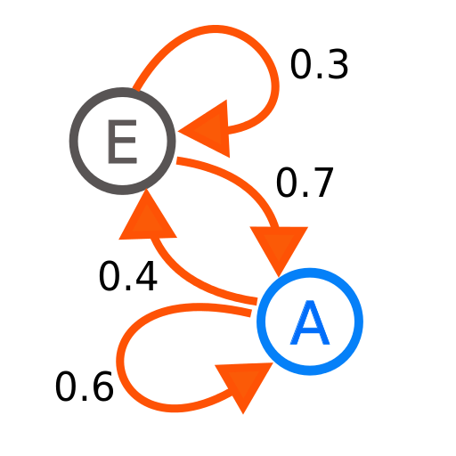
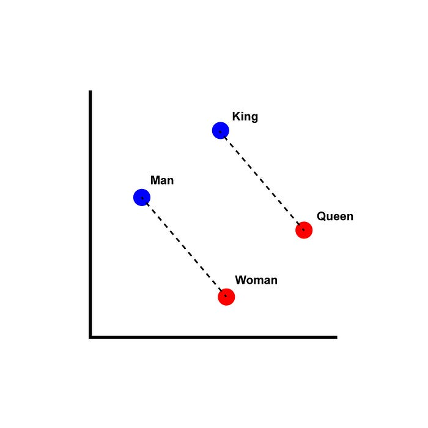

*ChatGPT has become the symbol for a new wave of Artificial Intelligence. New models with even stronger conversational skills are released on a weekly basis, and the world discusses about their impact on humanity. There are utopian and dystopian fantasies, as well as concrete potentials and risks. A view of the history of language modeling helps to understand the present and the future.*

> Photo by [Brett Jordan](https://unsplash.com/@brett_jordan?utm_source=medium&amp;utm_medium=referral) on [Unsplash](https://unsplash.com/?utm_source=medium&amp;utm_medium=referral)

When Andrej Markov sat down with Alexander Pushkin’s poetic book *Eugene Onegin* in 1913, he was not planning to distract himself from his work as a mathematician. Instead, he went through the verses and counted letters, resulting in the study “An Example of Statistical Investigation of the Text *Eugene Onegin* Concerning the Connection of Samples in Chains”, [translated into English as late as 2006](https://www.cambridge.org/core/journals/science-in-context/article/abs/an-example-of-statistical-investigation-of-the-text-eugene-onegin-concerning-the-connection-of-samples-in-chains/EA1E005FA0BC4522399A4E9DA0304862). The famous mathematician was not so much fascinated by the poetry, but by the distribution of consonants and vowels.

> Andrej Markov — By Unknown author — Converted into JPEG format from [1], Public Domain, [https://commons.wikimedia.org/w/index.php?curid=448609](https://commons.wikimedia.org/w/index.php?curid=448609)

## Causes and Conditions

Markov demonstrated that the likelihood of a letter being a vowel or a consonant can be approximated from its preceding letters. Based on these findings, he developed a probabilistic model for causal sequences, today known as Markov chain. The so-called Markov assumption holds for language on various levels beyond characters, including words. Look at the following sentence stub:

> This is a big &lt;?&gt;

As readers, we cannot say which word should replace the *&lt;?&gt;*, but based on the preceding words, we know it is likely a noun (e.g. *house* or *tree*) or another adjective (e.g. *beautiful* or *green*) and most certainly not a determiner (e.g. *the* or *a*).

Conditional probability plays an important role: while *the* is the most frequent word in English, it is very unlikely to occur in the position of the *&lt;?&gt;* above. Language modeling is about formalizing this kind of linguistic structures: what is the probability of a word *w*, given a sequence of words *w1*, *w2*, … . The language model can be expressed mathematically as *P*(*w*|*c*), where *c* is short for the given word sequence. As English speakers, we know that for the context *c* given above, the conditional** probability of *the* — *P*(**the**|*c*) — is much lower than, for instance, *P*(**house**|*c*), even though the **unconditional** probability *P*(**the**) is larger than that of any other word.

> Markov Chains — Joxemai4, CC BY-SA 3.0 &lt;[https://creativecommons.org/licenses/by-sa/3.0](https://creativecommons.org/licenses/by-sa/3.0)&gt;, via Wikimedia Commons

Apart from the grammatical functions of words, semantics — the meanings of words — play an important role when estimating these probabilities. While, for instance, *dwarf* is a noun just like *house* or *tree*, it is semantically less likely to appear after the adjective *big*; while *big dwarf* is perfectly valid syntactically, it is an oxymoron and therefore unlikely (but not impossible) to occur. Therefore, *P*(**tree**|**big**) is larger than *P*(**dwarf**|**big**).

By counting word sequences in a text data set — the training data — , these probabilities can be estimated. However, there will always be (new) words that do not occur in the training data which combine letters in previously unseen, but valid sequences. There also is an infinite number of valid sentences; regardless of how many texts a model has processed, words will always be arranged in ways that have never been seen before. Frequency-based methods conceptually suffer from the "[problem of induction](https://plato.stanford.edu/entries/induction-problem/)": what was written in the past can at best approximate what will be written in the future. Taking that uncertainty into account has been the difficult part of language modeling.

## Enigmatic Language

During World War 2, three decades after Markov's experiments, mathematicians from both sides ran a race to encrypt their radio messages. With the help of statistical knowledge about language (plus some blunders from the other side), the famous team around British mathematician Alan Turing at Bletchley Park eventually managed to decipher the messages encrypted with the Enigma machine used by the German military.

> The Enigma encryption machine — Museo della Scienza e della Tecnologia “Leonardo da Vinci”, CC BY-SA 4.0 &lt;[https://creativecommons.org/licenses/by-sa/4.0](https://creativecommons.org/licenses/by-sa/4.0)&gt;, via Wikimedia Commons

Motivated by the success during the war, information theory and cryptography coined the mental model of language modeling. As a former PhD student of the famous information scientist Claude Shannon, Warren Weaver proposed to apply statistical methods to translate texts from one language into another.

The basic idea was: let's look at a text in another language (Russian) as if it was an encrypted (English) text. We could then use the methods used for decryption to translate it from Russian into English. Probably needless to say that this did not work very well. The immense productivity of language does not really align with the way encryption algorithms work.

## Distributional Semantics

From a linguistics perspective, the likelihood of a word occurring in a particular position in a sentence depends on two dimensions: syntax and semantics. For the former, human language tends to develop grammatical rules. Formalizing the grammar of a language by these rules was a focus for computational linguists for a long time, but never fully succeeded because there are many exceptions to these rules. Additionally, they are subject to change over time, and are not always followed even by native speakers of a language.

Modeling semantics, on the other hand, is essential for modeling not only syntactically valid, but also meaningful sentences. This poses other challenges than grammatical rules. There are identical words that have multiple meanings (homonyms, e.g. *bank*), there are different words that have (almost) identical meanings (synonyms, e.g. *freedom* and *liberty*), and there is a very broad spectrum in between. The nuanced meaning of a word can differ per culture, dialect, and even individual speaker.

The British linguist John Rupert Firth noted in 1957 that “a word is characterized by the company it keeps”. This insight has opened a beautiful door towards statistically modeling the semantics of a word. If two words appear in similar contexts frequently, it implies that their meaning is related. Note that there are many types of relatedness, including similarity, oppositions, as well as the syntactical function.

Distributional semantics and the Markov assumption have since melted into a powerful armory in language modeling by the use of *n*-grams, windows in a text whereby *n* stands for the window size. For instance, three words form a tri-gram (or 3-gram). Like so many techniques for language processing, this can be applied on various levels again, including characters and words.

[*n*-gram models](https://en.wikipedia.org/wiki/N-gram_language_model) of varying values for *n* have proven to be robust for estimating frequency-based language models without explicitly taking syntactic rules into account. In applications such as machine translation or speech recognition, such models have been combined with a translation model or an acoustic model respectively. They used to form the basis of the state-of-the-art algorithms in these and other sub-fields of Natural Language Processing for a long time.

## Embedding Words

The rise of artificial neural networks has brought its own methods to implement the distributional semantics hypothesis. [Word2Vec](https://github.com/tmikolov/word2vec) (2013), [Glove](https://nlp.stanford.edu/projects/glove/) (2014), [FastText](https://fasttext.cc/) (2016) and more generate vector representations for each word based on context windows around the word. These algorithms do not directly rely on frequencies, but their parameters are optimized so that the resulting representations of two words end up close in the vector space if they tend to occur in similar contexts. These vector representations are called word embeddings.

Word embeddings do not only represent the meanings of words, the vector space into which they are embedded also allows arithmetic operations in the semantic space. A notorious example: when you take the vector for *king*, then subtract the vector for *man*, and add the vector for *woman*, you come out close to the vector for *queen*. Interestingly, these embeddings tend to encode both semantics and syntactical functions — reflecting the linguistic insight that the boundary between syntax and semantics is often affluent.

> Distributional Word Representations — Singerep, CC BY-SA 4.0 &lt;[https://creativecommons.org/licenses/by-sa/4.0](https://creativecommons.org/licenses/by-sa/4.0)&gt;, via Wikimedia Commons

Given those representations of individual words, the next level in language modeling is thus to represent sequences of words — phrases, sentences, or entire documents. The simplest approach is to concatenate or average all the word vectors of a sentence, and use it as input to any machine learning algorithm.

Recurrent neural networks (RNNs) have been more successful by combining a neural network's state after processing one word with the embeddings for the following word. After iterating over an entire sentence, the network output yields a vector representation, including linguistic phenomena like negation and references between words.

RNNs, however, face two major disadvantages: important contextual information can be located at a far distance in a text, and the recursive nature of an RNN prevents parallel computation. LSTM and GRU gates have extended RNNs, but only mitigated the first issue.

In 2017, the architecture that enables current models was proposed: *Transformers*. Dedicated *attention matrices* (already [proposed in 2014](https://arxiv.org/abs/1409.0473)) learn which parts in an input sequence are important, instead of paying attention to a predefined context window. That allows a language model to, for instance, interpret the meaning of the ambiguous word *bank* by paying attention to occurrences of words like *river* — or perhaps *rob* and *money* — anywhere in a text. That mechanism enables Transformer models to take very large contexts into account, while the optimization of the model parameters can be parallelized efficiently.

There are different techniques for the optimization of these parameters. The famous [BERT](https://aclanthology.org/N19-1423/)-family of models is optimized

* to fill random gaps in the sentences of the training data (masked language modeling), and
* to decide whether a particular sentence follows another one (next sentence prediction).

These techniques are especially effective for generating vector-based, numeric representations of words and texts that can be used for NLP tasks like, for instance, document classification.

Generative models like GPT on the other hand go back to where Andrej Markov started: they are optimized to predict the next word in a sequence. On top of that, the [RLHF (*Reinforcement Learning from Human Feedback*)](https://proceedings.neurips.cc/paper_files/paper/2022/hash/f978c8f3b5f399cae464e85f72e28503-Abstract-Conference.html) technique has enabled the model to learn very effectively from human "AI Trainers", resulting in the impressive conversational skills that ChatGPT has shown.

The combination of more effective and scalable training techniques and the immense number of parameters enable such models to produce texts in a specific language. They are fed virtually the entire internet, therewith learning almost all human languages. Even programming languages come as an (intentional) extra, enabling GPT-based models to function as programming assistants.

## Modeling Language: The Next 100 Years

Looking back into the history of language modeling illustrates that Artificial Intelligence has not suddenly emerged in the recent past. The current generation of models builds on a rich past of active research in the fields of computational linguistics, natural language processing, information theory, and related fields; to reiterate some milestones: the [RLHF method from 2019](https://proceedings.neurips.cc/paper_files/paper/2022/hash/f978c8f3b5f399cae464e85f72e28503-Abstract-Conference.html) fine-tunes models based on the [Transformers neural network architecture from 2017](https://papers.nips.cc/paper_files/paper/2017/hash/3f5ee243547dee91fbd053c1c4a845aa-Abstract.html). Transformer-based models have improved upon the word embeddings as introduced by [Word2Vec (2013)](https://papers.nips.cc/paper_files/paper/2013/hash/9aa42b31882ec039965f3c4923ce901b-Abstract.html). Linguistic and stochastic theory has laid the basis for such algorithms.

The race has now shifted into the arena of engineering and productizing, as in making language models smaller and faster and embedding them into useful applications. Significant progress on the quality side is nowhere to be seen currently. As an [internal Google document](https://www.semianalysis.com/p/google-we-have-no-moat-and-neither) stated recently, none of the big companies like OpenAI, Microsoft, Google or Facebook seem to have a model or strategy that could outcompete the others. More efficient, often free, and qualitatively competitive models appear on a weekly basis.

On the other hand, language models can generate incredibly fluent language, but are intransparent and inaccurate [by definition](https://www.newyorker.com/tech/annals-of-technology/chatgpt-is-a-blurry-jpeg-of-the-web). These properties make them credible actors in conversations with humans, while posing difficulties on applications like search and coding assistance.

Debates about imminent singularity in which Artificial Intelligence spontaneously starts improving itself live in the realm of fiction rather than science. Such mystifications can take both utopian and dystopian angles, but rely on beliefs, lacking specific evidence. Apocalypses have been predicted many times with respect to Artificial Intelligence as well as other technologies. Grand stories about the faith of humanity absorb a lot of attention, but tend to reduce and over-simplify complex matters.

Technology, however, is only one factor — predictions about the future of our society, let alone humanity, are at best naive if they ignore political, economical, and societal factors. For a productive discussion that takes realistic risks and potentials of new technologies into account, experts from all these fields need to join forces.
