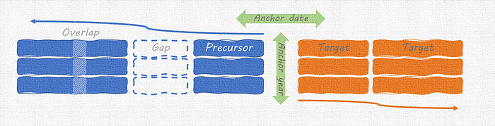
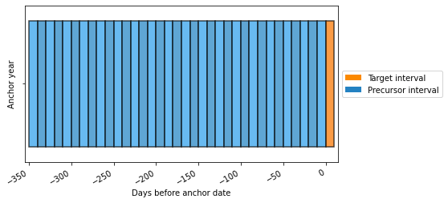
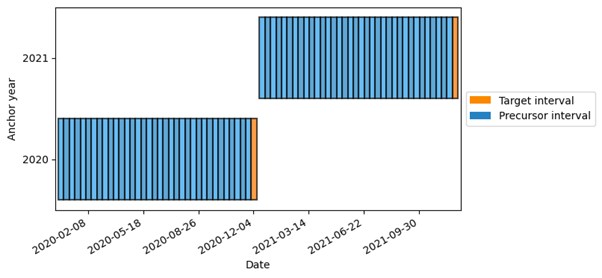
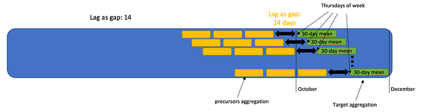
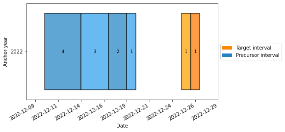

## Designed with the S2S community, available for everyone

These are just some of the questions that scientists in the field of sub-seasonal to seasonal (S2S) weather and climate prediction have to deal with on a daily basis. Especially now that the use of machine learning is [gaining traction](https://s2s-ai-challenge.github.io/). In this blog post, we introduce [Lilio](https://lilio.readthedocs.io/en/latest/index.html), a new calendar [package ](https://pypi.org/project/lilio/)that was designed to help tackle these questions.

[https://github.com/AI4S2S/lilio](https://github.com/AI4S2S/lilio)

## The niche

Before we dive into the capabilities of Lilio, let me briefly review why existing packages didn’t cut the deal for us. [Pandas](https://pandas.pydata.org/) is great and we rely on it, but we wanted more flexibility to construct varying intervals with custom gaps in between. And instead of a continuous index, we wanted to exploit the periodicity in our use cases. Existing time series models (e.g. *[Darts](https://medium.com/unit8-machine-learning-publication/time-series-forecasting-using-past-and-future-external-data-with-darts-1f0539585993)) often apply the same model irrespective of the forecast issue date, and the forecasts are anchored to said issue date. By contrast, our experiments are usually anchored to a clear target period, and each target may have a unique set of predictors. We have different models with different precursors for a windy May, a wet monsoon, a mild winter, …

## The fill

So, how does Lilio help with all of that? First of all, we stack the years to obtain a 2-dimensional calendar. Each row represents a year, and columns are intervals within that year. Typically we have several precursor periods leading up to one or more target periods. This aligns nicely with the common representation of samples and features in ML data. In our case, the target is in the rightmost column(s).

Conceptual illustration of the structure of our calendars.We define the “anchor date” to be between the target and precursor periods. All other intervals are expressed as offsets to this anchor date. Conveniently, this eliminates any ambiguity related to leap years. Here’s a calendar generated with Lilio:

Example calendar with uniform 10-day intervals, here represented as offsets to the anchor date.By default, we include as many blocks (of a given frequency) as fit in one year but not more. To control this behaviour, Lilio provides options to allow or prohibit overlap. This makes it straightforward to apply existing train/test splitting strategies without leakage.

## Anchor + offset = date

Initially, Lilio calendars don’t include years. Only after we map the calendar onto a given year range or dataset, actual dates can be calculated. Since the start or end date of the calendar doesn’t always nicely align with the input data, the calendar also comes with a method to map it to the range of available data.

Same calendar as above but plotted on a datetime axis. The anchor date for this calendar is 30 November. Combined with the anchor years 2020 and 2021, the actual dates can be inferred.

## Visualizations &amp; wishful drawing

The visualizations shown above are generated automatically. This turns out to be very helpful in the initial process of setting up your experiments. We even found ourselves making “wishful drawings” to communicate about alternative calendars that we’d like to support.

Illustrated feature request for a “rolling calendar”

## Resampling

Lilio’s resampling functionality can be used to aggregate the input data based on the calendar’s intervals. Here, again, we heavily rely on the presence of bounded intervals. By using these as resampling bins, we ensure that all input data ends up on the exact same time axis.

## Simple and custom calendars

For many applications, a simple weekly, monthly, or (n-)daily calendar may be all you need, and Lilio makes this super easy. With only a bit more effort, you can also construct calendars with gaps and overlapping intervals of varying lengths. Here’s a more exotic calendar for predicting the chances of a white Christmas:

This calendar uses more fine-grained information closer to the target

## What’s next?

Lilio has been developed in the context of a larger [project ](https://research-software-directory.org/projects/ai4s2s)in which we are developing a Python package to set up and streamline S2S — machine learning workflows. It will be a key component in our experimental setup. At the same time, the calendar is also very suitable as a stand-alone component for use in other applications. We are curious to learn about new use cases that you may have for it.

## Final note

Collaborative research software development is a [team effort](https://github.com/AI4S2S/lilio/graphs/contributors). Please give appropriate credit and consider[ joining us](https://github.com/AI4S2S/lilio) 😊. And if you read up to this point and still wonder who Lilio was: [here you go](https://en.wikipedia.org/wiki/Aloysius_Lilius).
