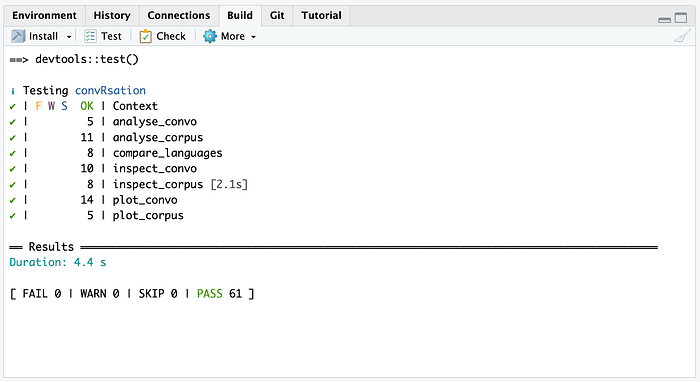

1

*If after reading this post you are motivated to make your own R package, consider joining our upcoming workshop! *[*Free tickets are now available*](https://www.eventbrite.nl/e/reproducible-research-with-r-packages-tickets-672884123527)*.*

If you are an R user, think about this scenario:

How often have you reused someone else’s code — a colleague’s workflow, perhaps a script you found as an appendix in a paper? Did it run right away? Was it easy to reuse?

Now, ask yourself whether you have used someone else’s packaged code. How often have you started your own script with *library (packagename)*, and used functions that are not part of base R?

I am willing to bet quite a lot that the second scenario is an order of magnitude more common than the first. There is a reason for this: packages are made to be reused. Scripts, while technically reusable, are not.

Let me now ask you about your own work: do you want it to be reused?

You know what you have to do now, right?

Photo by [Kira auf der Heide](https://unsplash.com/@kadh?utm_source=medium&amp;utm_medium=referral) on [Unsplash](https://unsplash.com/?utm_source=medium&amp;utm_medium=referral)

### But making a package… isn’t that complicated?

An R package distinguishes itself from scripted code in a few ways, but it is much less complex than you may think.

First of all, when your code is packaged, it is contained in a standardized folder structure. The code itself lives in a designated folder (aptly named ‘R’). In addition, the root of the package contains files with some basic information about your package — like the title, the authors, and the license for future users.

Secondly, and perhaps most crucially, packaged code consists of functions only. Functions are the units at the centre of a package. They take information as arguments and return an output. For example, I have a function called *multiply. *This function, you guessed it, multiplies the two arguments I give it, and returns the result:

multiply &lt;- function(a, b){
  return(a * b)
}After including this function in a package — let’s call it *mypackage — *someone else can now use it without opening and running the entire codebase, but instead by attaching the package and calling the function:

&gt; library(myPackage)
&gt; multiply(3,4)
[1] 12You have likely written functions before. And you know how folders work. To dot the i’s and cross the t’s, Rstudio is here to help: it contains many built-in functions to make package creation a breeze.

### Your work deserves to be reused.

Just in case you are now doubting yourself, please don’t. Scripting an analysis is more than just applying existing calculations. The workflow itself is an original thought. Even if you have not, say, designed a new statistical method yourself, the methods you choose, the way you select and handle your data, the visualisations you make — they are your work, and could be reused as a standardised workflow in your field.

Let’s take an example. Mark*, a linguistics professor, runs frequent analyses on datasets made from taped conversations. He uses R to uncover the unwritten rules of conversation, finding out how people weave their utterances together. With this data, he creates [fantastic](https://ideophone.org/snailplot-rmd/) [visualisations](https://markdingemanse.net/publications/visuals/how-asr-training-data-differs-from-real-conversation), which give insight into the conversational dynamics at play.

Mark has hundreds of conversations to analyse, so he made functions that contains the essential elements of his workflow. Now, when he loads a new conversation, he can for instance use this function** to quickly get an overview of the basic statistics:

&gt; conversation &lt;- read.csv("data/conversation25.csv")
&gt; inspect_convo(conversation)
Number of speakers: 2
Length of conversation: 10:03
Number of utterances: 9438But Mark does not work alone. His group contains PhD students and postdocs, and is a popular place for bachelor and master internships. He shares his scripts with his group, but they can be a daunting sight for those who have not programmed much before. And as his toolkit grows, he loses track of the different elements it contains, and what updates he has shared with whom.

Mark needs an R package.

### A package makes you a better programmer.

An important element of packaged functions is their documentation: a user who only has access to the name of the function, needs to know how to use it. But writing documentation is not just for users: it does something for you as a developer as well.

Writing down the logic of your functions — what goes in? What comes out? Exactly what formats are needed for each argument?— helps you think more critically about the objects you use and create as part of your workflow. You may not expect it, but documentation is a powerful way to take a step back and start viewing your set of functions as a whole.

This is where you go from scripting to software engineering.

Photo by [RetroSupply](https://unsplash.com/@retrosupply?utm_source=medium&amp;utm_medium=referral) on [Unsplash](https://unsplash.com/?utm_source=medium&amp;utm_medium=referral)

### Packaged code is more robust, and developing it is more efficient.

Because your functions are in a package, you now also have access to another powerful tool in the software engineering toolbox: testing.

Most likely, when you were developing your function, you were running it over and over to confirm it still did what it was supposed to. You gave it input, and checked that it returned the right output.

You were testing your function, and it took a lot of time.

With tests, we can automate this process. Mark, for instance, knows that when he puts the file conversation25.csv* into *inspect_convo*, it should return information about the number of speakers (2), the length of the file (10 minutes and 3 seconds), and the number of utterances (9438). He does not have to keep checking this himself, but can put his knowledge inside a test:

test_that("Conversation inspection returns the right results", {
  # load the test object and run inspect_convo
  load("conversation25.Rda")
  conversation &lt;- inspect_convo(conversation25)
  
  # inspect_convo should return the right information
  expect_true(conversation[1] == "Number of speakers: 2")
  expect_true(conversation[2] == "Length of conversation: 10:03")
  expect_true(conversation[3] == "Number of utterances: 9438")
})Now he simply runs the tests, and Rstudio will tell him if they pass. This quickly starts saving him a lot of time, especially when the package grows and starts including more functions. With one click, Mark can confirm that everything, everywhere, is OK.

The Rstudio view of the tests in this package confirm that every function is operating as it should.Being able to check functionality like this comes with a lot of freedom, to grow your package, but also to improve the things already written. How efficient is that function you wrote, really? When you edit (or “refactor”) the code, your tests give you the peace of mind that your edits have not caused any inadvertent problems. After all, as soon as something breaks, you will know!

### But what about my paper?

While you may be happy that someone else can reuse your functions, it is likely that the original goal of your research project was not to write a toolkit, but a paper. Not to worry, there is a designated space for this inside an R package: a vignette.

In a vignette, you take a reader through your project from A to Z. While explaining your workflow in accompanying markdown-formatted text, you apply your functions in blocks of R code, and the resulting document shows both the code and the resulting output. This is the cherry on top: you have turned your research into an easily reusable toolkit, and shown how to use the functions in a reproducible document.

### Would you like some help?

There are a lot of online resources that can help you work on your first package. For one, the book [R Packages](https://r-pkgs.org/) is a resource I cannot recommend enough. It has been the basis for the [Carpentries lesson “R Packaging”](https://carpentries-incubator.github.io/lesson-R-packaging/), which is regularly held as part of the eScience Center’s digital skills workshops. Take a look [at our schedule](https://www.esciencecenter.nl/events/?f=workshops) to see upcoming dates for “Reproducible Research with R Packages”, and join us!

*) The story used in this blog is inspired by the package [*talkr*](https://github.com/elpaco-escience/talkr/), which is part of [*Towards next-generation scientific computing tools for diversity-aware language science and technology*](https://research-software-directory.org/projects/diversity-aware), a project with Mark Dingemanse and Andreas Liesenfeld at the Radboud Universiteit Nijmegen. You can read more about the real Mark at his own website: [markdingemanse.net](https://markdingemanse.net/).

**) The functions and files in this blog are simplified and fictionalised for ease of reading.
