A surprisingly simple and elegant way to teach your computer how to perform derivatives, with some Julia (and Python) examples

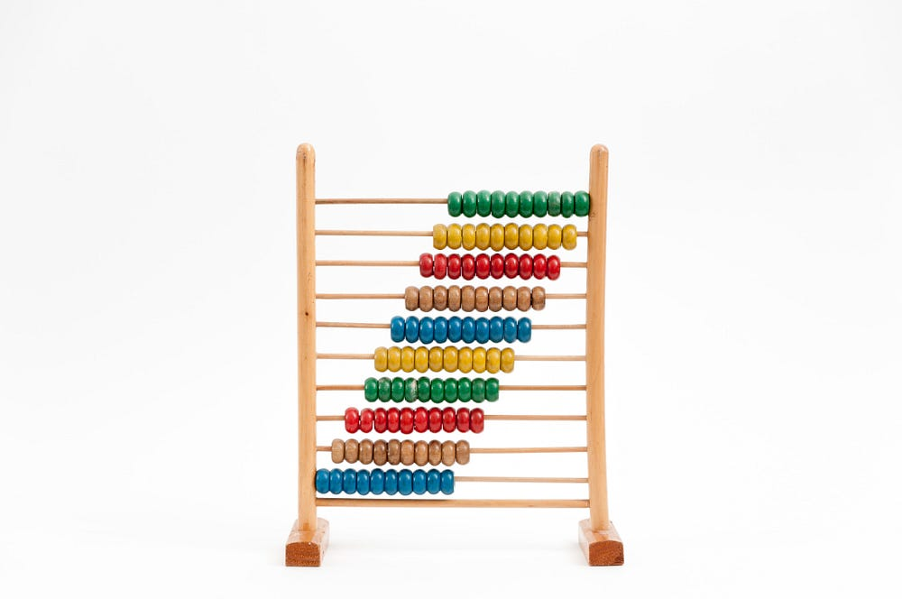

Photo by [Crissy Jarvis](https://unsplash.com/@crissyjarvis?utm_source=medium&amp;utm_medium=referral) on [Unsplash](https://unsplash.com/?utm_source=medium&amp;utm_medium=referral)

## First, a disclaimer

Automatic differentiation is a well-known sub-field of applied mathematics. You definitely don’t have to implement it from scratch, unless, as I did, you want to. And why would you want to do such a thing? My motivation was a mix of the following:

* I like to understand what the packages I use do
* The theory behind automatic differentiation happens to be very beautiful
* I could use it as a case study to improve my understanding of the Julia language

Furthermore, if you are interested in performance, you’d likely want to focus on backward automatic differentiation, and not, as I did, on the forward one.

If you are still reading, it means that after all these disclaimers your intrinsic motivation is still intact. Great! Let me introduce you to the fascinating topic of automatic differentiation and my (quick and dirty) implementation.

## Enter the dual numbers

Probably you remember it from your high school years. The nightmare of derivatives! All those tables you had to memorize, all those rules you had to apply… chances are that it is not a good memory!

Would it be possible to teach a computer the rules of differentiation? The answer is yes! It is not only possible but can even be elegant. Enter the dual numbers! A dual number is very similar to a two-dimensional vector:

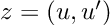
the first element represents the value of a function at a given point, and the second one is its derivative at the same point. For instance, the constant 3 will be written as the dual number (3, 0) (the 0 means that it’s a constant and thus its derivative is 0) and the variable x = 3 will be written as (3,1) (the 1 meaning that 3 is an evaluation of the variable x, and thus its derivative respective to x is 1). I know this sounds strange, but stick with me; it will become clearer later.

So, we have a new mathematical toy. We have to write down the game rules if we want to have any fun with it: let’s start defining addition, subtraction, and multiplication by a scalar. We decide they follow exactly the same rules that vectors do:

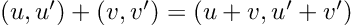

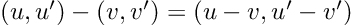

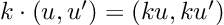
So far, nothing exciting. The multiplication is defined in a more interesting way:

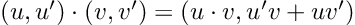
Why? Because we said the second term represents a derivative, it has to follow the product rule for derivatives.

What about quotients? You guessed… the division of dual numbers follows the quotient rule for derivatives:

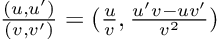
Last but not least, the power of a dual number to a real number is defined as:

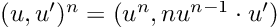

> Perhaps you feel curiosity about the multiplication by u’. This corresponds to the chain rule, and enables our dual numbers for something as desirable as function composition.

The operations defined above cover a lot of ground. Indeed, any algebraic operation can be built using them as basic components. This means that we can pass a dual number as the argument of an algebraic function, and here comes the magic, the result will be:

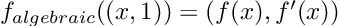
It is hard to overstate how powerful this is. The equation above tells us that just by feeding the function the dual number (x, 1) it will return its value at, plus its derivative! Two for the price of one!

> 

Those readers familiar with complex numbers may find interesting to try the following exercise:

If we define a dual number as

(u, u’) = u + e u’

with e² = 0, all the properties above are automatically satisfied!

## Teaching derivatives to your computer

Just as a calculus student will do, the rules of differentiation turn a calculus problem into an algebra one. And the good news: computers are better at algebra than you!

So, how can we implement these rules in a practical way on our computer? Implementing a new object (a dual number) with its own interaction rules sounds like a task for object-oriented programming. And, interestingly enough, the process is surprisingly similar to that of teaching a human student. With the difference that our “digital student” will never forget a rule, apply it the wrong way, or forget a minus sign!

So, how do these rules look, for instance, in Julia? (For a Python implementation, take a look [here](https://github.com/PabRod/dualdiff)). First of all, we need to define a `Dual` object, representing a dual number. In principle, it is as simple as a container for two real numbers:

""" Structure representing a Dual number """
struct Dual
    x::Real
    dx::Real
endLater, it will come in handy to add a couple of constructors.

""" Structure representing a Dual number """
struct Dual
    x::Real
    dx::Real
    
    """ Default constructor """
    function Dual(x::Real, dx::Real=0)::Dual
        new(x, dx)
    end
    
    """ If passed a Dual, just return it
    This will be handy later """
    function Dual(x::Dual)::Dual
        return x
    end
end
> *Don’t worry too much if you don’t understand the lines above. They have been added only making the *`*Dual*`* object easier to use (for instance, *`*Dual(1)*`* would have failed without the first constructor, and so would have done the application of *`*Dual*`* to a number that is already a *`*Dual*`*).*

Another trick that will prove handy soon is to create a type alias for anything that is either a `Number` (one of Julia's base types) or a `Dual`.

const DualNumber = Union{Dual, Number}And now comes the fun part. We’ll teach our new object how to do mathematics! For instance, as we saw earlier, the rule for adding dual numbers is to add both their components, just as in a 2D vector:

import Base: +
function +(self::DualNumber, other::DualNumber)::Dual
    self, other = Dual(self), Dual(other) # Coerce into Dual
    return Dual(self.x + other.x, self.dx + other.dx)
endWe have to teach even more basic stuff. Remember a computer is dramatically devoid of common sense, so, for instance, we have to define the meaning of a plus sign in front of a `Dual`.

+(z::Dual) = z
> This sounds as idiotic as explaining that +3 is equal to 3, but the computer needs to know! Another possibility is using inheritance, but this is an advanced topic beyond the scope of this piece.

Defining minus a `Dual` will also be needed:

import Base: -
-(z::Dual) = Dual(-z.x, -z.dx)and actually, it allows us to define the subtraction of two dual numbers as a sum:

function -(self::DualNumber, other::DualNumber)::Dual
	self, other = Dual(self), Dual(other) # Coerce into Dual
	return self + (-other) # A subtraction disguised as a sum!
endSome basic operations may be slightly trickier than expected. For instance, when is a dual number smaller than another dual number? Notice that in this case, it only makes sense to compare the first elements, and ignore the derivatives:

import Base: &lt;
&lt;(self::Dual, other::Dual) = self.x &lt; other.xAs we saw before, more interesting stuff happens with multiplication and division:

import Base: *, /

function *(self::DualNumber, other::DualNumber)::Dual
    self, other = Dual(self), Dual(other) # Coerce into Dual
    y = self.x * other.x
    dy = self.dx * other.x + self.x * other.dx # Rule of product for derivatives
    return Dual(y, dy)
end

function /(self::DualNumber, other::DualNumber)::Dual
    self, other = Dual(self), Dual(other) # Coerce into Dual
    y = self.x / other.x
    dy = (self.dx * other.x - self.x * other.dx) / (other.x)^2 # Rule of quotient for derivatives
    return Dual(y, dy)
endand with potentiation to a real number:

import Base: ^
function ^(self::Dual, other::Real)::Dual
    self, other = Dual(self), Dual(other) # Coerce into Dual
    y = self.x^other.x
    dy = other.x * self.x^(other.x - 1) * self.dx # Derivative of u(x)^n
    return Dual(y, dy)
endThe full list of definitions for algebraic operations [is here](https://github.com/PabRod/DualDiff.jl/blob/main/src/Dual.jl). For Python, use [this link](https://github.com/PabRod/dualdiff/blob/main/dualdiff/dual.py). I recommend taking a look!

After this, each and every time our dual number finds one of the operations defined above in its mysterious journey down a function or a script, it will keep track of its effect on the derivative. It doesn’t matter how long, complicated, or poorly programmed the function is, the second coordinate of our dual number will manage it. Well, as long as the function is differentiable and we don’t hit the machine’s precision… but that would be asking our computer to do magic.

### Example

As an example, let’s calculate the derivative of the polynomial:

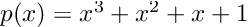
at x = 3.

For the sake of clarity, we can compute the derivative by hand:

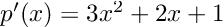
it is apparent that and p(3) = 39 and p’(3) = 34.

Using our `Dual` object, we can reach the same conclusion automatically:

poly = x -&gt; x^3 + x^2 + x 
z = Dual(3, 1)
poly(z)

&gt; Dual(39, 34)Even if the same polynomial is defined in a more intricate way, the `Dual` object can keep track:

""" Equivalent to poly = x -&gt; x^3 + x^2 + x
Just uglier """
function poly(x)
	aux = 0 # Initialize auxiliary variable
	for n in 1:3 # Add x^1, x^2 and x^3
		aux = aux + x^n
	end
end

poly(z)

&gt; Dual(39, 34)

## What about non-algebraic functions?

The method sketched above will fail miserably as soon as our function contains a non-algebraic element, such as a sine or an exponential. But don’t panic, we can just go to our calculus book and teach our computer some more basic derivatives. For instance, our table of derivatives tells us that the derivative of a sine is a cosine. In the language of dual numbers, this reads:

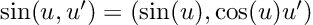

> Confused about the u’? Once again, this is just the chain rule.*

The rule of thumb here is, and actually was since the very beginning:

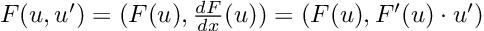
We can create a `_factory` function that abstracts this structure for us:

function _factory(f::Function, df::Function)::Function
    return z -&gt; Dual(f(z.x), df(z.x) * z.dx)
endSo now, we only have to open our derivatives table and fill line by line, starting with the derivative of a sine, continuing with that of a cosine, a tangent, etc.

import Base: sin, cos

sin(z::Dual) = _factory(sin, cos)(z)
cos(z::Dual) = _factory(cos, x -&gt; -sin(x))(z) # An explicit lambda function is often requiredIf we know our maths, we don’t even need to fill all the derivatives manually from the table. For instance, the tangent is defined as:

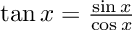
and we already have automatically differentiable sine, cosine, and division in our arsenal. So this line will do the trick:

import Base: tan

tan(z::Dual) = sin(z) / cos(z) # We can rely on previously defined functions!Of course, hard-coding the tangent’s derivative is also possible, and probably good for code performance and numerical stability. But hey, it’s quite cool that this is even possible!

See a more complete derivatives table [here](https://github.com/PabRod/DualDiff.jl/blob/main/src/primitives.jl) (Python version [here](https://github.com/PabRod/dualdiff/blob/main/dualdiff/primitives.py)).

### Example

Let’s compute the derivative of the non-algebraic function

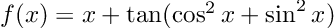
It is easy to prove analytically that the derivative is 1 everywhere (notice that the argument of the tangent is actually constant). Now, using `Dual`:

fun = x -&gt; x + tan(cos(x)^2 + sin(x)^2)

z = Dual(0, 1)
fun(z)

&gt; Dual(1.557407724654902, 1.0)

## Making it more user-friendly

We can use dual numbers to create a user-friendly derivative function:

"""
    derivative(f)

    Seamlessly turns a given function f
    into
    the function's derivative
"""
function derivative(f)
    df = x -&gt; f(Dual(x, 1.0)).dx
    return df
endUsing this, our example above will look like:

fun = x -&gt; x + tan(cos(x)^2 + sin(x)^2)

dfun = derivative(f)
dfun(0)

&gt; 1.0

### Another example**

Now we want to calculate and visualize the derivatives of:

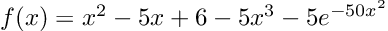
First, we have to input the function, and the derivative gets calculated automatically:

f(x) = x^2 - 5x + 6 - 5x^3 - 5 * exp(-50 * x^2)

df = derivative(f)We can visualize the results by plotting a tangent line:

using Plots

I = [-0.7; 0.7]
δ = 0.025
@gif for a = [I[1]:δ:I[2]; I[2]-δ:-δ:I[1]+δ]
    L(x) = f(a) + df(a) * (x - a)
    plot(f, -1, 1, leg=false)
    scatter!([a], [f(a)], m=(:red, 2))
    plot!(L, -1, 1, c=:red)
    ylims!(-5, 15)
end
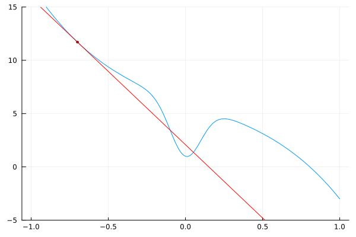

## Is this useful?

Automatic differentiation is particularly useful in the field of Machine Learning, where multidimensional derivatives (better known as gradients) have to be performed as fast and exactly as possible. Said this, automatic differentiation for Machine Learning is usually implemented in a different way, the so-called backward or reverse mode, for efficiency reasons.

A well-established library for automatic differentiation is [JAX](https://jax.readthedocs.io/en/latest/) (for Python). Machine learning frameworks such as [Tensorflow](https://www.tensorflow.org/) and [Pytorch](https://pytorch.org/) also implement automatic differentiation. For Julia, multiple libraries [seem to be competing](https://juliadiff.org/), but [Enzyme.jl](https://enzyme.mit.edu/) seems to be ahead. [Forwarddiff.jl](https://juliadiff.org/ForwardDiff.jl/stable/) is also worth taking a look at.

## Acknowledgments

I want to say thanks to my colleague and friend [Abel Siqueira](https://abelsiqueira.com), for kindly introducing me to Julia and reviewing this post, and to [Aron Jansen](https://medium.com/@aronpjansen), for his kind and useful suggestions. A more in-depth introduction can be found in [this episode](https://book.sciml.ai/notes/08-Forward-Mode_Automatic_Differentiation_(AD)_via_High_Dimensional_Algebras/) of Chris Rackauckas’ [book on scientific machine learning](https://book.sciml.ai/).

The [TeX Math Here](https://github.com/mathaddons/tex-math-here) browser add-in also played an important role: it allowed me to transfer my Latex equations from Markdown to Medium in an (almost) painless way.
