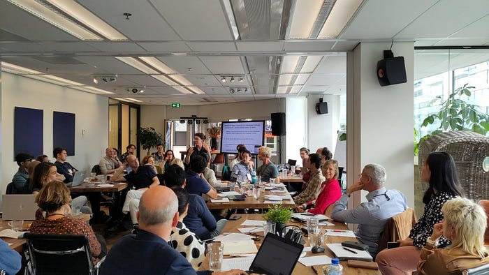

# **Navigating research software policies: Insights from the Dutch research community**

Imagine you’re a researcher who developed a brilliant piece of software that may be useful to many. Maybe it’s a single script that cleans data in a specific format. Or perhaps it’s a larger piece of research infrastructure, that could be a crucial part of the workflow for nearly all researchers in your discipline. You may be wondering how to make your software available in a way that safeguards your, your institute’s, the users’ and science’s interests. What if the rules around doing this would all be thoroughly outlined to you by your institute?

Just as there are many decisions to make about how to license software, there are many decisions to be made when drafting an institutional software policy. All possible decision paths can seem overwhelming, which is why [PRO4RS](https://www.rd-alliance.org/groups/rda-resa-policies-research-organisations-research-software-pro4rs) is helping policy makers and researchers with this task. Photo by [Distinct Mind](https://unsplash.com/@distinctmind?utm_source=medium&amp;utm_medium=referral) on [Unsplash](https://unsplash.com/?utm_source=medium&amp;utm_medium=referral)The eScience Center, NWO, TU Delft and the VU organized an event on 3 October 2023 where we discussed with representatives from more than 20 Dutch knowledge organizations (research institutes, research infrastructure providers, research funding organizations, universities, UMCs and universities of applied sciences) how to develop and implement institutional research software policies, and what the challenges may be in embarking on such a project.

### Why Institutional Software Policies?

To provide valuable context, [Software Sustainability Institute](https://www.software.ac.uk/) director [professor Neil Chue Hong](https://www.epcc.ed.ac.uk/about-us/our-team/prof-neil-chue-hong) laid out why research software policies are important. He started his presentation by explaining that institutional policy generally serves as a crucial element in effecting cultural change. Policies provide various purposes, such as encouraging good practices, ensuring legal compliance, maintaining ethical norms, reducing institutional risk, improving operational efficiency, and promoting and enhancing a mission.

The cultural change research software policies specifically encourage are open research and open science practices. They typically focus on promoting reuse of research software through recommendations about licenses and research output management plans (data or software management plans). On an individual level, these policies should encourage authors and developers to cite software and make their software citable. On an institutional level, research software policies are used to mitigate institutional risk in areas such as cybersecurity, procurement, asset management, research ethics, and integrity.

Research software policies are important for good practices in research software management and open science. Despite this, many organizations do not yet have an institutional research software policy. During our event, those interested in setting up or further developing their own policies answered questions about the situation at their institutes via Mentimeter. From the answers to those questions, it became clear that most of the Dutch institutes that were represented (77%) do not have a policy on research software (yet). However, about half of those institutes are currently (planning on) developing one.

Participants during the 3 October 2023 event discussed what should be included in their institutional research software policy, and how to practically go about developing this policy.

### Drafting and Implementing Research Software Policies

Drafting research software policies poses several challenges. First, [defining research software can be difficult](https://doi.org/10.5281/zenodo.5504016), as the same piece of software may be categorized as research software or not depending on its [role](/defining-the-roles-of-research-software-21535a43f23), or the context where it is produced and used. Second, [the complexity and maturity of research software vary](/defining-the-roles-of-research-software-21535a43f23), ranging from [analysis code to prototype tools to mature research software infrastructure](https://zenodo.org/doi/10.5281/zenodo.4940273). Institutions need to account for all these levels of complexity in their policies without being overly prescriptive or incomplete for different cases. Third, multiple stakeholders, including senior management, IT services, libraries, enterprise and innovation offices, and open science/open source policy offices, need to be involved in creating research software policies. The challenge lies in avoiding a situation where “if everyone is responsible, no one is”. Fourth, research software policies are interconnected with other university policies and processes. Integrating a new policy with existing policies can raise new questions and challenges.

The challenges pointed out by Neil Chue Hong and the audience were reflected in [Jacko Koster](https://www.universiteitleiden.nl/medewerkers/jacko-koster#tab-1)’s talk. Jacko provided a snapshot of Leiden University’s work in progress in developing such a policy. The variety of parties involved, as well as the many aspects of research software, make for a complicated process that involves discussing with many stakeholders at all levels of the university. [Paula Martinez Lavanchy](https://www.tudelft.nl/library/research-data-management/r/support/data-stewardship/contact/paula-martinez-lavanchy) from TU Delft discussed her university’s success story. In 2021, she led the drafting and implementation of [TU Delft’s research software policy](https://zenodo.org/doi/10.5281/zenodo.4629661) together with a group of TU Delft’s employees. She started by putting together a working group that encompassed relevant stakeholders from all areas: researchers, librarians, data stewards, valorisation center employees, legal services and the ICT department. The inclusion of many different parties and integration of all their perspectives was crucial to her success.

](https://zenodo.org/doi/10.5281/zenodo.4629661)Click the image to read TU Delft’s research software policyTU Delft’s experience provides valuable insights into what can make institutional research software policies effective. For example, TU Delft has made sure that the implementation and software workflow described by the policy is solidly integrated into training for staff. This approach fits well with findings by the PASTEUR40A project, which investigated success factors in implementing policies at universities. In their project, they investigated Open Access policies at 120 different universities. Drawing from these experiences with implementing Open Access policies, they wrote [a paper](https://doi.org/10.5281/zenodo.35635) that concluded that effective policies should be minimally burdensome, mandatory, linked to evaluation and incentives, and applied at the optimal time in the lifecycle. Additionally, they must align with funders’ policies for university staff to adhere to them.

The challenge of drafting and implementing research software policies for individuals at knowledge institutions has inspired the formation of the recently approved RDA working group PRO4RS, a joint initiative by ReSA and the RDA, with support of the RDA Tiger project. For those wondering how to go about drafting an institutional research software policy, this group is working on an overview of existing policies. Next steps will include putting together resources on how to achieve policy change at an institute, and to develop a common framework for research software policy, specifically. You can [join this group](https://www.rd-alliance.org/groups/rda-resa-policies-research-organisations-research-software-pro4rs) to receive updates and information about the group’s work, as well as sessions during the RDA plenary (two times per year). A summary of the working group’s most recent (autumn 2023) RDA plenary session is available [here](https://www.rd-alliance.org/group/rda-resa-policies-research-organisations-research-software-pro4rs/post/summary-rda-plenary-21).

The participants at our event brainstormed about what should be part of their research software policies. They agreed that at a minimum, a definition of research software should be included in the policy. Most participants agreed that it should include rules about licensing and sharing software, too. An interesting point of discussion was the question whether guidelines on good practices in software development should be part of a research software policy, and where to draw the line regarding this. For example, some participants agreed that pointers on research software quality and a commitment to training researchers on good practices should be part of a research software policy, while others did not.

### Next steps**

We invite anyone interested in staying up to date about institutional research software policies to **attend **[**our webinar**](https://www.eventbrite.com/e/institutional-research-software-policies-tickets-765126843987?aff=oddtdtcreator)** on 16 January 2024 to continue the conversation about institutional research software policies in the Netherlands. **During this webinar, we plan to include an update from the PRO4RS RDA working group and reiterate the most important points from our workshop on 3 October to those who missed it. Sign up [here](https://www.eventbrite.com/e/institutional-research-software-policies-tickets-765126843987?aff=oddtdtcreator) to join the webinar.

If you are interested in developing institutional research software policies, you can** subscribe to updates from the PRO4RS RDA working group **[**here**](https://www.rd-alliance.org/groups/rda-resa-policies-research-organisations-research-software-pro4rs).

Finally, on 23 April 2024, the eScience Center is jointly organising [**National Research Software Day**](https://www.eventbrite.com/e/national-research-software-day-tickets-761242004327?aff=oddtdtcreator), where policy makers, research supporters and community leaders will come together to discuss all things research software. You can find out more and sign up for this day here.

Written by Lieke de Boer. Thanks to Carlos Martinez-Ortiz, Maaike de Jong, Maria Cruz and Meron Vermaas for comments.*
