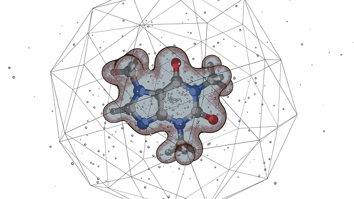
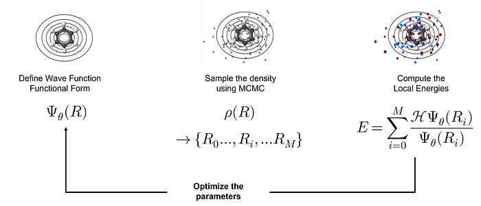
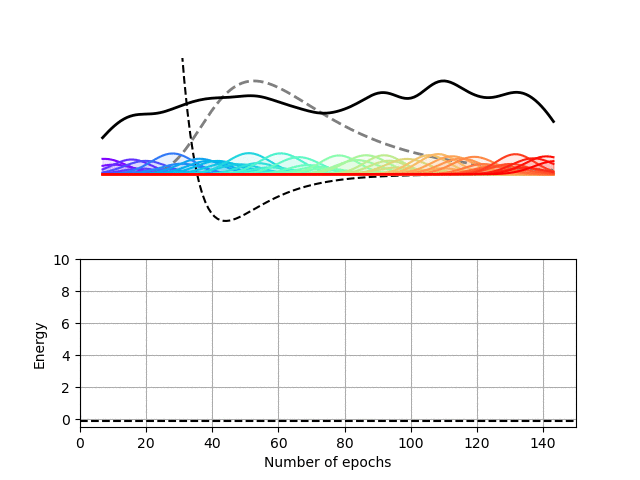
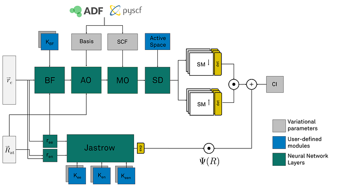
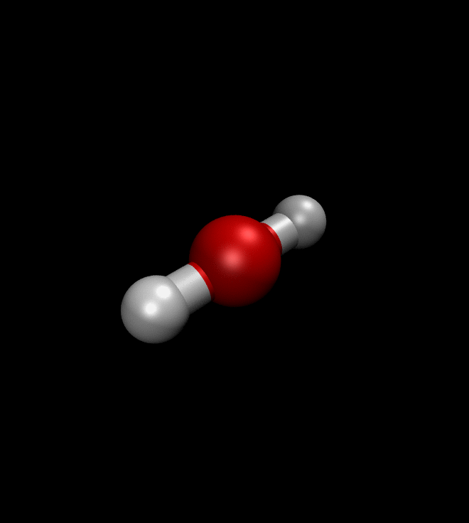

Machine learning techniques are impacting all areas of science, and molecular simulations are not spared. This blog post shows how to make use of the tools and techniques developed for machine learning to facilitate high-accuracy electronic structure calculations.

Quantum chemistry, the application of quantum mechanics to the study of molecular systems, is a powerful approach to design better materials, more efficient catalysts, and even better drugs. If you are reading this text on a fancy 4K [OLED](https://en.wikipedia.org/wiki/OLED) screen, chances are that quantum chemistry was used to fine-tune the light emission properties of the molecules that are shooting photons at you.

Quantum chemistry is, however, not a single technique, but the aggregation of many approaches that have been developed over many decades by many people. Some methods are computationally inexpensive and usually not so accurate, while others require important computational resources but can reach a higher degree of accuracy.

Quantum Monte Carlo (QMC) simulations are particularly interesting as they can reach a high degree of accuracy and can also be efficiently parallelized on very large computational resources. Many software packages, like [CHAMP ](https://github.com/filippi-claudia/champ)or [QMC=CHEM](https://github.com/TREX-CoE/qmcchem2), provide solutions to perform QMC simulations and have been used in countless scientific publications.

Illustration of the QMC approach. We first define a wave function containing tunable parameters. We sample the associated density and compute the system’s energy and its gradient w.r.t. the tunable parameters. We then update the value of the parameters and start again until we find the minimum value of the total energyTo understand how QMC works, let’s consider a small molecule of, let’s say, benzene. To keep things simple we are going to assume that all the electrons of the molecule are located around its center following a Gaussian distribution of variable width. To compute the energy of the molecule, we first sample this distribution to obtain representative configurations of the electronic positions. This can be done via a variety of techniques, for example, the [Metropolis-Hastings](https://en.wikipedia.org/wiki/Metropolis%E2%80%93Hastings_algorithm) algorithm. Computing the energy of the electrons in these configurations and taking averaging them can finally be used to approximate the total energy of the molecule.

A [cornerstone of quantum chemistry](https://en.wikipedia.org/wiki/Variational_method_(quantum_mechanics)) tells us that the most accurate description of the molecule is obtained for the lowest value of its total energy. In our simple example, we can tweak the width of the Gaussian distribution until we find the minimal value of the total energy. If you now think, *hey that almost looks like a machine learning problem*, you’re not completely wrong. All we need is to encode the wave function in some sort of neural network.

## Let’s start with a toy problem

Let’s first look at a toy problem that you may have encountered in your undergraduate studies: a single particle in a one-dimensional potential. We pick here the Morse potential as it is simple enough yet non-trivial.

We choose here to use a [radial basis function (RBF) neural network](https://en.wikipedia.org/wiki/Radial_basis_function_network) to encode the wave function of this one-dimensional potential. In our RBF network, the input node encodes the position of the particle and each hidden node computes the value of a particular Gaussian function at this location. These values are then summed up on the output node to yield the value of the wave function at the particle’s location. This architecture therefore expresses the wave function of our particle as a sum of Gaussian functions, which is sufficient for this particular problem.

Schrodinet in action. The solver optimizes the positions, widths, and heights of all the Gaussian functions composing the RBF network to minimize the energy of the system.

## QMCTorch for molecules

While replacing first-year university students with simple neural networks is appealing, it would be even better to apply the same machinery to more complex cases, for example, molecules. Unfortunately, the wave functions of molecular systems are much more complex than the one of a single particle trapped in a one-dimensional potential. All the electrons of the molecule interact with each other and also with the atomic nuclei and everything becomes very complicated very quickly. Fortunately, many scientists have given us a good understanding of the ingredients that should make up the wave functions of these systems.

Armed with this vast amount of knowledge, and a little bit of tenacity, we have developed [**QMCTorch**](https://github.com/NLESC-JCER/QMCTOrch)** **a Python package that allows to run QMC simulations of molecular systems using neural network wave functions.

Representation of the neural network that encodes the wave function in QMCTorch. Starting from the atomic and electronic coordinates, different layers progressively compute the value of the wave function.Neural networks in QMCTorch take the positions of the electrons and atoms as inputs and compute the value of the wave function as an output. In between the input and output layers, many layers compute the different ingredients involved in the definition of the molecular wave function. These layers have parameters that can be specified by the user or extracted from external chemistry codes such as [pyscf](https://pyscf.org/) or [ADF](https://www.scm.com/product/adf/). These parameters can be further optimized to lead to an even more accurate wave function.

As the name indicates, QMCTorch is based on the popular deep learning framework [PyTorch ](https://pytorch.org/)and leverages automatic differentiation to compute various derivatives needed in the optimization process. The use of automatic differentiation allows users to easily explore new flavors of the wave function without having to analytically compute all its derivatives. QMCTorch can also make use of multiple GPUs to accelerate the simulations thanks to the native capabilities of PyTorch and the distributed deep learning library [Horovd](https://horovod.ai/). For more information on QMCTorch, go see the [code documentation](https://qmctorch.readthedocs.io/en/latest/) or the [paper](https://joss.theoj.org/papers/10.21105/joss.05472) in the Journal of Open Source Software.

To use the code we first need to define a molecule through its atomic positions. QMCTorch allows for a few different flavors of wave functions to be used and we therefore need to pick one. We also have to define a sampler and an optimizer to compute and minimize the total energy of the system. Of course, each component has a lot of knobs that can be tweaked and that can greatly affect the result of the calculation.

from torch import optim
from qmctorch.scf import Molecule
from qmctorch.wavefunction import SlaterJastrow,
from qmctorch.solver import Solver
from qmctorch.sampler import Metropolis

# create a H2 molecule
mol = Molecule(atom='H 0 0 -0.69; H 0 0 0.69')

# create the wave function object
wf = SlaterJastrow(mol, cuda=True)

# create a sampler
sampler = Metropolis(nwalkers=1000, nstep=2000, 
                     step_size=0.2, nelec=wf.nelec,
                     cuda=True)

# create an optimizer
opt = optim.Adam(wf.parameters(), lr=1E-3)

# create a solver and optimize the wave function
solver = Solver(wf=wf, sampler=sampler, optimizer=opt)
solver.run(250)We can then ask QMCTorch to optimize the wave function of a molecule or even to optimize its geometry. The illustration below shows the result of such a geometry optimization for a water molecule. Starting from a non-ideal atomic arrangement, where the oxygen and the two hydrogens are aligned, the optimization process quickly brings the atoms in a more favorable conformation.

## What now?

Many research groups have also developed their own solutions, like [FermiNet ](https://arxiv.org/pdf/1909.02487.pdf)or [PauliNet ](https://arxiv.org/abs/1909.08423)and many others, to use machine learning techniques to accelerate and improve QMC calculations. Their approaches often use more convoluted functional forms than the ones used in QMCTorch. This allows for greater flexibility in the wave function and therefore more accurate results that have the potential to expand our chemical intuition.

One could, of course, argue that the energy change during a QMC optimization is so small that it does not justify the large amount of computing resources thrown at it. But if you want your red pixel to be red and not reddish/brown this is the level of accuracy needed!
