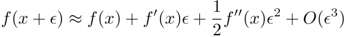
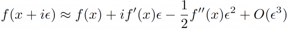
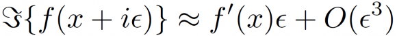
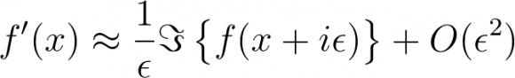
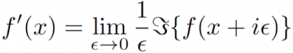
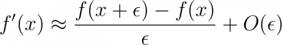

54

A surprising application of complex numbers

Photo by [charlesdeluvio](https://unsplash.com/@charlesdeluvio?utm_source=medium&amp;utm_medium=referral) on [Unsplash](https://unsplash.com/?utm_source=medium&amp;utm_medium=referral)

Some time ago I came across one of those ideas that makes you wonder: *“why nobody told me about this before?”*

Those of you with mathematical training certainly remember the [Taylor series](https://en.wikipedia.org/wiki/Taylor_series). For those who do not, and yet want to keep reading, this [visual simulation ](https://www.geogebra.org/m/CeW2gCzH)may be helpful.

The idea is that any continuous, smooth function, can be approximated by a polynomial; the higher the degree, the more accurate the approximation. To put it otherwise: if we know the value of a function and its derivatives at a given point (x), we can estimate its value at a nearby point (x + ε). More specifically:

Example of a generic Taylor seriesIf instead of a step (ε) in the realm of real numbers, we perform a step in the world of imaginary numbers (i ε), it follows:

It is here where things get interesting. If we take only the imaginary part, we get an equation that involves only the first derivative, the function evaluated in the complex plane, and the step size:

We just keep the imaginary part, and drop the real oneThis can be rearranged as an interesting formula for an approximate derivative:

Complex-step numerical derivativeThat can be even used for exact evaluation:

Complex-step exact derivative

## Is this useful at all?

I know…, that was pretty strange. It feels like a complicated *tour de force* for something as well-known as a numerical derivative. Nevertheless, it is hard to find a mathematical result that is completely useless, and complex-step differentiation is no exception.

Let’s take a look at the last formula of the day, that of the classical step-forward numerical differentiation:

Step-forward numerical derivativeIf we use the step-forward numerical derivative on a computer, the subtraction can cause numerical problems. Computers can’t store real numbers, but a rounded representation of them, and their numerical resolution is limited. If e is very small, it may happen that the subtraction above returns a zero as an artifact, making the whole calculation wrong.

Notice now the main difference between this and our complex-step algorithm: there is no subtraction in the complex one. One problem less!

## Further information

More information here: [Differentiation without a difference. SIAM news](https://sinews.siam.org/Details-Page/differentiation-without-a-difference).

If you enjoyed this article, you may also like [Automatic differentiation from scratch](/automatic-differentiation-from-scratch-23d50c699555).

—

This article appeared first, in Spanish, in *[*Naukas.com*](https://fuga.naukas.com/2018/08/20/derivando-sin-restar/)*.*
