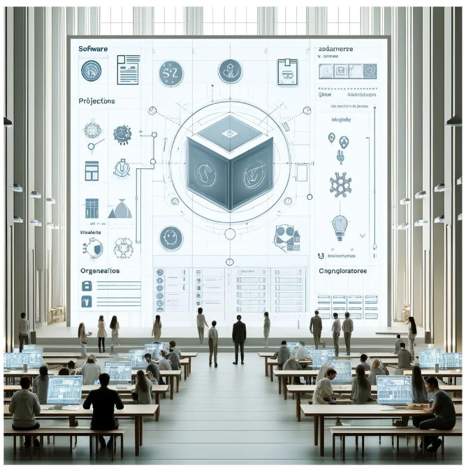

# *Brainstorming on the success of a research software catalogue*

1

Researchers reflect on the whys and hows of scientific software catalogues

*Created with DALL-E. Timestamp: 2024–04–23 14.57.58 Prompt: Create an image that conveys the concept of a digital software repository in a minimalistic and modern academic style.*

## Motivation

This blog entry was born during the unconference session on software catalogues that took place during the [National Research Software Day 2024](https://www.esciencecenter.nl/news/national-research-software-day-recap/) in Hilversum, the Netherlands.

The session was chaired by [Mees van Stiphout](https://www.uu.nl/medewerkers/MvanStiphout). The piece was co-authored by [Pedro Hernández Serrano](https://www.linkedin.com/in/pedrohserrano/), [Irene Martorelli](https://www.linkedin.com/in/irenemartorelli/), Belén Torrente, Emma Daniëls, and [Sreeparna Deb](https://orcid.org/0009-0002-9622-6663). It was reviewed and edited by [Pablo Rodríguez-Sánchez](https://pabrod.github.io).

## Introduction

Software catalogues have become increasingly important for research software in modern-day academia. They are helpful for searching and finding research software; they guarantee that research software is accessible, has markers of quality, and is actively maintained. In this unconference conversation, we discussed what can make a software catalogue useful for users, developers, and the research community.

## Software catalogues

A software catalogue acts as a digital hub where research software is deposited or published, often linking to software stored on other servers. These catalogues are commonly referred to as directories, catalogues, registries, or platforms. The core aim of such catalogues is to make software readily available and useful for its intended research purposes. Popular examples are

* [https://r-universe.dev](https://r-universe.dev/)
* [https://research-software-directory.org/](https://research-software-directory.org/)
* [https://zenodo.org/](https://zenodo.org/)

Easy access to the software is crucial. Effective catalogues ensure that their contents are easily searchable both through their own interfaces and via external search engines.

* number of downloads
* date of last release
* size of the project
* reproducible build

Furthermore, robust metadata practices are essential.

Beyond the technical aspects, the human element is also vital. Successful catalogues are supported by invested communities. These communities can offer support, facilitate collaboration, and even drive the software’s ongoing development. Additionally, providing clear documentation and accessible APIs helps users understand and interact with the catalogue more effectively, promoting better usage and integration of the software.

Helping a community develop around a platform or catalogue is no trivial task: after achieving content ‘critical mass’, we need to do a lot of outreach to different parts of the research community just to make users and contributors aware of the catalogue.

Some catalogues also integrate services such as rendering documentation, showing the maintenance status of the software, and checking reproducibility of builds by building the package within the platform. These services not only add value but also reassure users about the reliability and active development of the tools available.

A catalogue must be clear about its purpose. Whether it aims to promote software, to serve as a portfolio, or to fulfill other objectives, this clarity helps shape the user experience and guide the catalogue’s strategic development.

## Conclusion

A software catalogue is about building an accessible, reliable, and community-supported platform that fosters reuse of software and reproduction of methods in the research software landscape. By focusing on content quality, ease of access, ease of use, and community engagement, catalogues can greatly enhance their utility and impact. These elements combine to not only preserve and share valuable software but also to stimulate ongoing improvement and discovery of research software. Through such catalogues, the future of research software is not just preserved; it is actively nurtured and expanded.
