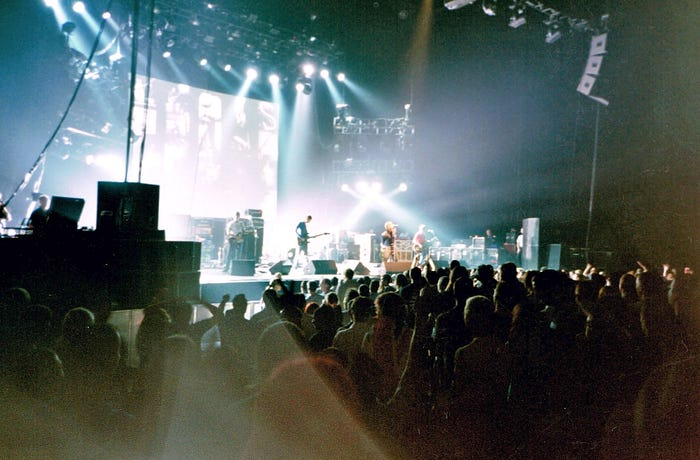

14

It’s Friday night, 5 July 2024. After some out-of-this-world pizza and a couple of drinks with colleagues, I’m on my way to catching a late train home. I get to the station just in time to park my bike. (I don’t know if it turns into a pumpkin, but the parking closes at midnight so if you’re late, it sleeps outside.)

It’s crowded in the building. This is Amsterdam Central on a Friday night, so I wasn’t expecting deserted platforms, but tonight it’s packed and somewhat confusingly there are many people dressed in white, with glitters on their faces or even dressed in them completely.

Then I remember the morning’s news. Taylor Swift concert. Incredibly popular pop singer, researchers studying why. Billionaire. First tour to gross a billion dollars. First concert in The Netherlands in seven years, and sold out way in advance. Fans called Swifties, waiting in line all day in the rain to get a good spot. I’ve never heard a Taylor Swift song.

Oasis in Montreal, Canada, in 2002. The lyrics to their 1997 song *D’You Know What I Mean describe the singer visiting his childhood home and seeing the Bob Dylan album and a Beatles single that would inspire his music. *[*Photo by Nesnad*](https://commons.wikimedia.org/wiki/File:Oasis-band-concert-Montreal-Canada-Aug2002.jpg)* on Wikimedia Commons. CC-BY-SA 4.0.*The next morning I decide that I should probably find out what all the fuss is about. You have to keep up with the times after all. I pull up YouTube and type “Taylor Swift”. A song called “[Fortnight](https://www.youtube.com/watch?v=q3zqJs7JUCQ)” comes up, apparently her latest single. Featuring someone called Post Malone, which raises the question of why Malone ended, and whether there was a Pre Malone before him, but I digress. I click the link.

“[Goldband!](https://youtu.be/aB4OzAEgfD0?t=305)” my brain goes as the song starts playing. The very first sound is a 1980s-style synthesizer melody that immediately reminds me of this Dutch pop band. They had their Taylor Swift moment for me last year, as I similarly read about their popularity in the news and decided to investigate.

One of the things I found then was an [interview](https://www.annavastgoedencultuur.nl/nieuws-1/producerwiegerhoogendorp) with Goldband’s producer Wieger Hoogendorp that I found very interesting. He explained that the 1980s sounds in their music make it popular because their audience has parents who were teenagers in the 1980s, and they played that stuff to their children. Similar music reminds the now-older kids of those good times, and so this is a recurring cycle in music. People like the familiar.

I thought about this. As a teenager in the ‘90s, I’d listen to the sound of boy bands emanating from my sister’s room. I liked Father and Son, by Boyzone. It wasn’t until much later that I discovered that it was a cover, the original having been written by Cat Stevens 25 years earlier. My favorite band in the ’90s was Oasis, who was huge and took their inspiration from The Beatles, popular in the ’60s. Maybe there was something to this.

In the Fortnight video meanwhile, Swift is singing the song while moving from a suspended bed frame to a library where she uses a typewriter. Somehow this feels familiar. She casts a glance at Malone, similarly equipped, and straightens out some papers. At the end of the song, the library scene returns, and all the papers catch fire, and it clicks. It’s another ’80s reference, this time to the clip for Toto’s Africa.

Stills from [Fortnight by Taylor Swift](https://www.youtube.com/watch?v=q3zqJs7JUCQ) and [Africa by Toto](https://www.youtube.com/watch?v=FTQbiNvZqaY). Note the similarities, which make the clip for Fortnight feel familiar to the viewer, as they’ve likely seen the clip for Africa before. And then nostalgia does the rest. Copyright © 1982 and 2024 by the respective owners.

## About that software

But Lourens, you may ask, that is all very interesting, but what does it have to do with Research Software Engineering?

First, please don’t start programming in Fortran ’77 again because it was popular in the 80's. We have better options now, like Julia or modern Fortran or, well, anything really. Ms. Swift didn’t hire Toto as her backing band either.

Instead, there are a few aspects of what Taylor Swift does that we can learn from if we want to get more people to use our scientific software.

### What users want

It may sound incredibly obvious, but we’ve seen above that one of the reasons Ms. Swift is so popular is that she gives people what they want. Note that that’s not the same as what they *say* they want. I bet very few Swifties, if you asked them what they wanted to hear in the next song, would say “I’d like it to start with a 1980’s style synthesizer melody reminiscent of Goldband, and then I want her to start singing halfway through the first measure already (another recent innovation in pop music, it reduces the probability that people will skip to the next song right away), and then I want the music video to remind me of Toto’s ‘Africa’.” A much more likely answer would be “I’m so glad you’re here, do you know how I can get this glitter off my face?”

But Swift and her team are professionals and they know what people actually want. They have all the know-how from decades of experience with pop music, and these days a ton of very detailed data too from streaming services on what people listen to and when and how.

### Making things easy

Another thing we can take inspiration from is the dress code. First, there’s apparently a dress code for Ms. Swift’s concerts (probably not a formal one, but enough to fill a train platform with similarly dressed people), which is nice because it means that you don’t have to feel insecure about what to wear to the concert. Nobody likes feeling insecure.

Second, the dress code is white. Everyone has something white in their closet, so that’s easy. Glitter is easy to come by and cheap, and as an added bonus it reminds you of being a kid again. And then of course the concert is in a place that’s easy to reach for most people, and it ends on time so that you can still easily get home by public transport. In short, going to a Taylor Swift concert is easy! Anyone can do it and feel good doing it, and so more people do.

The same principle applies to scientific software. Reduce the barrier to entry as much as you can. Make sure it installs (flawlessly!) in at most a single command (and that includes dependencies!). Put that command in the documentation so people can copy-paste and don’t have to type. Ensure there’s an easy-to-follow tutorial, and that it is written from the perspective of the users, which you figured out above. Add a ton of examples on how to do specific things that many people will want to do so that they can copy-paste without having to learn how to operate the software. And set up a chat channel so people can easily ask questions.

The Toto reference gives us another hint: make your software familiar. Users are going to interact with it in a way that you design, and the more familiar that interaction feels to them, the more usable your software is. So look at other software that is similar, or that your users are likely to be using already, and try to design along similar lines. Clever tricks and highly artistic solutions may be fun to build, and they may make you feel very smart, but they don’t help the user.

> 

In short: Software exists to make people’s lives easier. Make sure yours does.

### Community

There’s another thing that dress codes or uniforms (or [friendship bracelets](https://www.today.com/popculture/music/taylor-swift-eras-tour-friendship-bracelets-rcna99768)) do: they foster a sense of community. Humans are social animals, and we love being part of a group. That’s why we all dress in orange and go to a stadium to cheer on a group of people dressed in the same color, or grow our hair long and wear black and go to a metal concert, or put on suits and go to important meetings. All to be a part of something, to show that we’re part of the group.

Software is more successful if it has a community around it because it helps people feel like they’re a part of something when they use it. Chat channels, mailing lists, meet-ups, workshops, all these things make it easier for people to start using software and to stay involved. I’ve worked with some software that’s really not very good technically but has an amazing community manager who keeps it alive, nonetheless. Whether that’s a good idea is questionable, but it shows that it works.

### Advertising

Collaborations are quite popular in pop music these days. I don’t remember Madonna or Michael Jackson doing a lot of duets when I was a teenager, but it seems that these days every other single features someone or another. The reason of course is simple: it’s good advertising.

Taylor Swift had a concert, causing a lot of people to gather at a train station, as a result of which I listened to Fortnight, and now I am aware of the existence of Post Malone (and Malone, and Pre Malone, look at that, triple word value!). Moreover, the cloud’s algorithms are now more likely to keep serving me Malones as well, and there’s someone out there whose bottom line is served by that.

Of course, trying to influence search results using a link farm would be evil, but registering your software in the [Research Software Directory](https://research-software-directory.org/) is good practice, as is archiving it on [Zenodo](https://zenodo.org/), and it works almost as well. Make it easy to use together with related software, and advertise that in that other software’s community. Glue some glitter on your colleague’s faces and send them to the local train station. The point is, if no one knows about your software, no one will use it.

## Impact is more than numbers

There’s another reason Taylor Swift is popular, and that is that her music is firmly mainstream. It features recognizable sounds and rhythms, the lyrics are relatable, and so it works for many people. Compare that with my favourite pop artist, [Grimes](https://www.youtube.com/watch?v=Tv9YoYCKNoE), who makes songs about things as nerdy as [Roko’s Basilisk](https://www.youtube.com/watch?v=gYG_4vJ4qNA). As a result, Grimes is not a billionaire. (She used to date one, but that doesn’t count.)

Research Software Engineers are unlikely to become billionaires either, and sometimes we end up working on specialist software that does something only very few researchers need. It’s hard to have a lot of users then, even though the software could still be very important. On the other hand, something as generic as NumPy has a huge number of users, but then again if NumPy were the only thing we had we’d still not get much science done. (Are NumPy users called NumPies? If not, why not? And how do they get the glitter off their faces after finishing their calculations?)

So it’s probably a good idea to not give the number of users too much importance when we’re trying to gauge the impact of research software. Do good science with it, make sure that it works for the people doing that science (however many there are), and enjoy the critical acclaim from the users you’ve got and whose lives you made easier. In the end, that’s what it’s all about.
