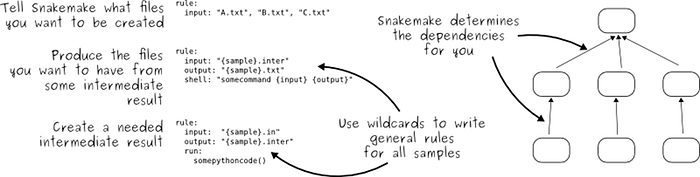
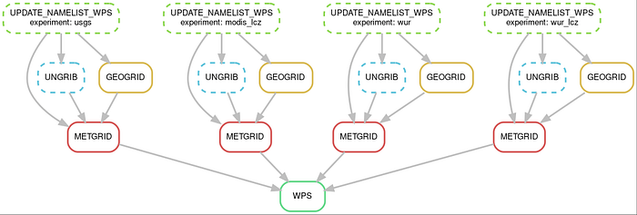

# **(Un)wieldy workflows with WRF**

## **Streamlining experiments with the Weather Research and Forecasting model**

The [Weather Research and Forecasting model](https://www.mmm.ucar.edu/models/wrf), WRF for short, is a beautiful piece of research software with a large community of active users. That’s something we love and advocate for at the eScience Center.

Given its large user base, one might think this must be an exemplary model to work with. And perhaps it is, in comparison to other models in the scene. But as I’m working with WRF again after several years, I’m reminded of my struggles in keeping my workflows organized.

Photo by [Bernd 📷 Dittrich](https://unsplash.com/@hdbernd?utm_source=medium&amp;utm_medium=referral) on [Unsplash](https://unsplash.com/?utm_source=medium&amp;utm_medium=referral)

To try and tackle this issue once and for all, we experimented with different solutions, including a simple shell script, as well as [Snakemake](https://snakemake.readthedocs.io/en/stable/), a python-based workflow management tool often used in bioinformatics. Both approaches turn out to have their own merits and quirks.

Overall, we did get a better grip on the antipatterns that prevented us from keeping a nice and orderly workflow. From this, we extracted some best practices for managing complex (WRF) modelling workflows. This blogpost documents our journey and the lessons learned, in the hope that it will be useful for other WRF users and those who struggle with managing their experiments.

## Running basic WRF**

Let’s start with an overview of the steps required to run a basic WRF (real data) experiment, as per the instructions in the [user guide](https://www2.mmm.ucar.edu/wrf/users/wrf_users_guide/build/html/wps.html). First you must run the WRF preprocessing system (WPS), which itself consists of three programs: geogrid, ungrib, and metgrid. Then you run WRF itself, which also consists of two programs: real and wrf.

cd WPS**
# Run geogrid (interpolate spatial datasets to the model grid)
./geogrid.exe

# Run ungrib (unpack meteorological input data)
./link_grib.csh /your/meteo/data/dir
ln -s ungrib/Variable_Tables/Vtable.GFS Vtable
./ungrib.exe

# Run metgrid (interpolate the meteo data to model grid)
./metgrid.exe

cd ../WRF/run

# Run real (extract initial and boundary fields from preprocessed data)
ln -sf ../../WPS/met_em* .
./real.exe

# Run WRF (the actual forecast)
./wrf.exeThis workflow is not great in several ways. WRF and WPS are run in different working directories; yet they “pretend” to be in the same directory by use of symbolic links (`ln`). Also, exectuables are in the same directory as the input/output data. Now, imagine, for example, that we want to do multiple experiments with slightly different settings.

One option would be to move the output to a separate directory between each run. We would need to meticulously bookkeep our files, especially since runs may fail at different stages causing us to re-run (part of) the workflow. Also, we would not be able run the experiments in parallel. Clearly, using WRF in this way is a labour-intensive, error-prone process.

Alternatively, we could duplicate our `WPS`and `WRF/run`directories. That’s also not great: imagine we want to re-run our experiments with a re-compiled version of WRF. Then we would need to copy over the new executables to all experiment directories.

Finally, there’s lots of files in these directories that are not needed for our experiments, which makes it hard to tell the wheat from the chaff.

### Our workflow wishlist**

Considering the points above, let’s think about how we would like it to be, and start a workflow wishlist:

* Each/all experiment(s) can be re-run with a single command
* One directory per experiment, containing config + output
* Intermediate/output data well organized in subdirectories
* Config files (namelists) specify paths to all relevant input data; no links
* Executables should be in a system path or another dedicated location
* We should be able to (re-)run only part of a workflow
* Bonus: reuse intermediate files that are the same for all experiments

## **Solution #1: using a shell script**

Let’s see how far we can get with a simple shell script. In this example, we maintain multiple namelists and geogrid tables for each experiment. These are stored alongside the shell script and copied over to the experiment folder once the script is run. The full code is available [here](https://github.com/Urban-M4/wrf-runner).

# Some initialization of the environment, module loads etc.**# ...

# Set path to executables
WPS_HOME=$HOME/wrf-model/WPS
WRF_HOME=$HOME/wrf-model/WRF

# Define experiment name
EXP=USGS

# Make new experiment directory
export RUNDIR=wrf_experiments/${EXP}
mkdir -p $RUNDIR
mkdir $RUNDIR/geogrid
mkdir $RUNDIR/metgrid

# Copy experiment-dependent files
cp namelist.wps_$EXP $RUNDIR/namelist.wps
cp namelist.input_$EXP $RUNDIR/namelist.input
cp GEOGRID.TBL.ARW_$EXP $RUNDIR/GEOGRID.TBL

# Copy additional input files from WRF/WPS
cd $RUNDIR
cp $WPS_HOME/metgrid/METGRID.TBL.ARW METGRID.TBL
cp $WPS_HOME/ungrid/Variable_Tables/Vtable.ECMWF VTable
cp $WRF_HOME/run/CAMtr_volume_mixing_ratio.RCP8.5 CAMtr_volume_mixing_ratio
cp $WRF_HOME/run/ozone* .
cp $WRF_HOME/run/RRTMG* .
cp $WRF_HOME/run/*.TBL .

# Run experiments
$WPS_HOME/link_grib.csh "path/to/our/input/data/*"
$WPS_HOME/ungrib.exe
$WPS_HOME/geogrid.exe
grep "ERROR" geogrid.log &amp;&amp; echo "Aborting: ERROR in geogrid.log." &amp;&amp; exit 1
$WPS_HOME/metgrid.exe
grep "ERROR" metgrid.log &amp;&amp; echo "Aborting: ERROR in metgrid.log." &amp;&amp; exit 1

$WRF_HOME/run/real.exe
$WRF_HOME/run/wrf.exeEvidently, WRF and WPS *can* be run from another directory, by calling them by their full path. Alternatively, we could have added the `WPS` and `WRF/run` directories to our `PATH` variable. However, WRF and WPS expect certain files (tables etc.) in the working directory, so we need to copy those.

Geogrid and metgrid tables are expected in subfolders, but we can use the namelist setting `opt_geogrid_table_path='.'` (default is `'./geogrid'`) to overwrite that, and similar for metgrid. Geogrid will then look in that folder for a file called `GEOGRID.TBL`. (Why not simply point to the geogrid table directly in the namelist?)

We were able to declutter our working directory somewhat by using the namelist.wps options `opt_output_from_geogrid_path` and similar for metgrid. Unfortunately, that option is not available for ungrib, the worst clutterer of all… We were able to point `real.exe` to our metgrid subfolder through the namelist.input parameter `[auxinput1_inname](https://github.com/wrf-model/WRF/blob/0a11865f97680fdd6865b278ea29d910e5db3ed7/run/README.namelist#L89)`, so we could skip that linking step as well.

We wanted the workflow to fail when one of the steps fails. However, metgrid and geogrid [don’t fail with a proper exit code](https://github.com/wrf-model/WPS/issues/252#issue-2315032244). As a simple patch, we added extra commands to look for errors in the log files and raise an exception when needed.

Despite some peculiarities, this is a good start. We can already tick some of the items off our wishlist. However, the workflow quickly becomes more complex. For example, as we are adding more experiments, we would like to edit the namelists programmatically. And for some runs, we may want to run an intermediate step (e.g. wudapt-to-wrf). Before we know it, the shell script becomes messy, which defeats our purpose of maintaining a tidy and organized workflow.

To summarize, the following namelist parameters should probably be much better advertised:

* `opt_geogrid_table_path` (namelist.wps)
* `opt_metgrid_table_path` (namelist.wps)
* `opt_output_from_geogrid_path` (namelist.wps)
* `opt_output_from_metgrid_path` (namelist.wps)
* `[auxinput1_inname](https://github.com/wrf-model/WRF/blob/0a11865f97680fdd6865b278ea29d910e5db3ed7/run/README.namelist#L89)` (namelist.input)

With a similar option for ungrib, the WRF experience would already be much better.

## Solution #2: using Snakemake**

Ideally, we want to be able to run only part of a workflow. For example, when `real.exe` fails, we don’t want to re-run WPS. Similarly, we may want to run all pre-processing first, and then submit WRF as a batch job.

### Brief intro to Snakemake

Example Snakemake rules (source [https://snakemake.readthedocs.io/en/stable/project_info/faq.html#what-is-the-key-idea-of-snakemake-workflows](https://snakemake.readthedocs.io/en/stable/project_info/faq.html#what-is-the-key-idea-of-snakemake-workflows))A snakemake workflow, aka ‘Snakefile’, consists of rules. Each rule has certain inputs and outputs, and the commands to produce that output, either in Python code (a `run` block) or as shell commands (a `shell` block). When you tell snakemake to produce a certain output file, it will check which rule must executed in order to obtain that file. It does so in a smart way: if the required for a rule input already exists, it will not re-run that rule, unless the input is newer than the output.

### Our desired workflow

Before we delve into details, let’s have a look at the workflow that we want to achieve. For demonstration purposes I will focus on WPS only. Snakemake provides a command (`snakemake --dag WPS | dot -Tpng &gt; dag.png`) to visualize the task graph for our workflow:

Task graph for our WPS workflow. Boxes (nodes) are rules, arrows indicate dependencies between rules. Dashed lines indicate that these rules have already been executed. Full-line rules still need to be (re)run.As you can see, we want to run four independent experiments. While they share all the same steps, they have a different value for the `experiment` setting. This is achieved through the use of a wildcard*.

### Providing experiment settings

The values for the wildcard are provided to snakemake via a configuration file. This is a relatively simple file which, in addition to our experiment-specific settings, contains some global settings like `wps_home`. Our config file looks like this (only showing the first experiment):

wps_home: ~/Urban-M4/WPS
wrf_home: ~/Urban-M4/WRF
data_home: /projects/0/prjs0914/wrf-data/default
working_directory: ./output

experiments:
  usgs:
    geog_data_res: ['usgs_30s','usgs_30s','usgs_30s','usgs_30s']
    geog_data_path: '/projects/0/prjs0914/wrf-data/default/static/summerinthecity'
    geogrid_table: GEOGRID.TBL.ARW_USGS
    use_wudapt_lcz: false
    num_land_cat: 24
  modis_lcz:
    ...The config file is read at the very top of the Snakefile, like so:

configfile: workflow.source_path("config.yaml")The first rule in our workflow, `UPDATE_NAMELIST_WPS`, uses a python package `[f90nml](https://f90nml.readthedocs.io/en/latest/)` to load a reference namelist.wps, modify the settings as specified in the experiment configuration, and store the updated namelist in the output folder for that experiment. It looks like this:

rule UPDATE_NAMELIST_WPS:
    input:
        namelist_wps = workflow.source_path("namelist.wps")
    output:
        "{experiment}/namelist.wps",
    run:
        # Get parameters from config
        geog_data_res = config['experiments'][wildcards.experiment]['geog_data_res']
        geog_data_path = config['experiments'][wildcards.experiment]['geog_data_path']

        # Read source namelist.wps with f90nml, make some changes, and save in experiment dir
        nml = f90nml.read(input.namelist_wps)
        nml["geogrid"]["geog_data_path"] = geog_data_path
        nml["geogrid"]["geog_data_res"] = geog_data_res
        nml.write(f"{wildcards.experiment}/namelist.wps")Notice that we are reading the reference namelist form the workflow source path. This is because it is stored alongside the snakefile. Normally, all paths in snakemake are relative to the working directory.

Importantly, this rule works for any value of the `experiment` wildcard (as long as the settings are provided in the configuration file). To invoke the rule for each of our experiments, we use a target rule, like so:

rule PRODUCE_ALL_NAMELISTS:
    input: collect("{experiment}/namelist.wps", experiment=config["experiments"].keys())The `collect` function fills the values of `experiment` with all keys found in `config["experiments"]`. When we invoke this target rule, e.g. by running `snakemake PRODUCE_ALL_NAMELISTS`, Snakemake will look for a rule that can produc the following files (unless they already exist):

* usgs/namelist.wps
* modis_lcz/namelist.wps
* wur/namelist.wps
* wur_lcz/namelist.wps

It will find `UPDATE_NAMELIST_WPS`and invoke this rule, inferring that the first segment corresponds to the value of the wildcard.

### Specifying the other steps

Getting Snakemake to use the different experiment settings was by far the most involved part of our journey. Next, we want to add rules for all the other steps. For example, out METGRID rule looks as follows:

rule METGRID:
    input:
        "{experiment}/namelist.wps",
        "{experiment}/finished.ungrib",
        "{experiment}/finished.geogrid",
    output: "{experiment}/finished.metgrid"
    shell:
        """
        cd {wildcards.experiment}
        mkdir -p metgrid

        cp {config[wps_home]}/metgrid/METGRID.TBL.ARW METGRID.TBL
        {config[wps_home]}/metgrid.exe

        # Scan logfile for errors and raise if necessary (metgrid can fail silently with 0 exit status)
        grep "ERROR" metgrid.log &amp;&amp; echo "Aborting: ERROR in metgrid.log. " &amp;&amp; exit 1

        touch finished.metgrid
        """Snakemake infers the dependecies between rules via their input and output filenames. Since WPS output filenames are not predictable without parsing the namelist, we opted for a workaround: at the end of each rule, we create an empty file called `finished.&lt;rule&gt;`. As such, we inform Snakemake that metgrid must be run after updating the namelist, and after geogrid and ungrib.

As opposed to the first rule, which executes Python code (a `run` block), here we use shell commands. This is nice, because it is very similar to what you would do manually on the command line. As an intermediate option we can use `params`. We use this in our `GEOGRID` rule:

rule GEOGRID:
    input: "{experiment}/namelist.wps",
    output: "{experiment}/finished.geogrid"
    params: geogrid_table = lambda wildcards: workflow.source_path(config['experiments'][wildcards.experiment]['geogrid_table']),
    shell:
        """
        cd {wildcards.experiment}
        mkdir -p geogrid
        cp {params.geogrid_table} GEOGRID.TBL

        # Run geogrid
        {config[wps_home]}/geogrid.exe

        # Scan logfile for errors and raise if necessary (geogrid can fail silently with 0 exit status)
        grep "ERROR" geogrid.log &amp;&amp; echo "Aborting: ERROR in geogrid.log." &amp;&amp; exit 1

        touch finished.geogrid
        """The use of params enables us to execute some Python code to assign a value to a variable, which can then be accessed in the shell block of the rule. Here, we get the `geogrid_table` from our experiment config. So we can combine the flexibility of Python with the transparancy of plain shell commands.

### Final workflow

Putting everything together, our full workflow looks something like below. Notice that `WPS` is the target rule in this case.

import os
from pathlib import Path

import f90nml

configfile: workflow.source_path("config.yaml")
workdir: config["working_directory"]
envvars: "NETCDF"

rule UPDATE_NAMELIST_WPS:
    input:
        namelist_wps = workflow.source_path("namelist.wps")
    output:
        "{experiment}/namelist.wps",
    run:
        # Get parameters from config
        geog_data_res = config['experiments'][wildcards.experiment]['geog_data_res']
        geog_data_path = config['experiments'][wildcards.experiment]['geog_data_path']

        # Read source namelist.wps with f90nml, make some changes, and save in experiment dir
        nml = f90nml.read(input.namelist_wps)
        nml["geogrid"]["geog_data_path"] = geog_data_path
        nml["geogrid"]["geog_data_res"] = geog_data_res
        nml.write(f"{wildcards.experiment}/namelist.wps")

rule GEOGRID:
    input: "{experiment}/namelist.wps",
    output: "{experiment}/finished.geogrid"
    params: geogrid_table = lambda wildcards: workflow.source_path(config['experiments'][wildcards.experiment]['geogrid_table']),
    shell:
        """
        cd {wildcards.experiment}
        mkdir -p geogrid
        cp {params.geogrid_table} GEOGRID.TBL

        # Run geogrid
        {config[wps_home]}/geogrid.exe

        # Scan logfile for errors and raise if necessary (geogrid can fail silently with 0 exit status)
        grep "ERROR" geogrid.log &amp;&amp; echo "Aborting: ERROR in geogrid.log." &amp;&amp; exit 1

        touch finished.geogrid
        """

rule UNGRIB:
    input: "{experiment}/namelist.wps"
    output: "{experiment}/finished.ungrib"
    shell:
        """
        cd {wildcards.experiment}

        # Remove old output if present (ungrib doesn't like to overwrite stuff)
        rm -f FILE*

        # Link vtable
        cp {config[wps_home]}/ungrib/Variable_Tables/Vtable.ECMWF Vtable

        # Link gribfiles
        {config[wps_home]}/link_grib.csh {config[data_home]}/real-time/july2019/*

        # Run ungrib
        {config[wps_home]}/ungrib.exe

        # Scan logfile for errors and raise if necessary (ungrib can fail silently with 0 exit status)
        grep "ERROR" ungrib.log &amp;&amp; echo "Aborting: ERROR in ungrib.log." &amp;&amp; exit 1

        # Report ready
        touch finished.ungrib
         """

rule METGRID:
    input:
        "{experiment}/namelist.wps",
        "{experiment}/finished.ungrib",
        "{experiment}/finished.geogrid",
    output: "{experiment}/finished.metgrid"
    shell:
        """
        cd {wildcards.experiment}
        mkdir -p metgrid

        cp {config[wps_home]}/metgrid/METGRID.TBL.ARW METGRID.TBL
        {config[wps_home]}/metgrid.exe

        # Scan logfile for errors and raise if necessary (metgrid can fail silently with 0 exit status)
        grep "ERROR" metgrid.log &amp;&amp; echo "Aborting: ERROR in metgrid.log. " &amp;&amp; exit 1

        touch finished.metgrid
        """

rule WPS:
    input: collect("{experiment}/finished.metgrid", experiment=config["experiments"].keys())We’re steadily accumulating lines of code, but overall, we’re quite happy with how interpretable this still looks. As we develop this further, it would be good to split it up into multiple files, and incorporate other best practices as outlined in the [Snakemake documentation](https://snakemake.readthedocs.io/en/stable/snakefiles/best_practices.html).

### Struggles

While we’re quite happy with our progress so far, here are some things that we struggled with:

* Flexibility of output directories: we want to organize our output as follows: `./results/{experiment}`. By default, all paths are relative to the working directory. We set the working directory to `./results`, so the first rule, `UPDATE_NAMELIST`, will actually create the file `./results/{experiment}/namelist.wps`. Unfortunately, snakemake cannot use wildcards for the working directory. Therefore, we need to `cd` to the experiment directory in every rule.
* Complex input/output: the output of WPS programs depends on the settings in namelist.wps. Specifically, filenames like `met_em.d03.2019...` encode information about the domain and (a lot of) dates. We could use something like `output: expand("met_em.{domain}.{datetime}.nc", domain=DOMAINS, datetime=DATETIMES)`. For that to work, we’d need to set `DOMAINS` and `DATETIMES` in the configuration file, or infer them from the template namelist.wps. Not ideal, and quickly getting complex.
* Atomic inputs/outputs: a bit of a stretch goal, but when using a workflow manager like this, it would be nice if you could do, for example, `metgrid.exe --domain=1 --date=20190101`. This way, when only one domain/timestamp needs to be re-processed, we don’t need to re-run the workflow for everything else as well. However, this means some of the logic that’s currently encoded in WPS programs, specifically parsing the domain and time control sections of the namelist and looping over them, is moved entirely to the workflow. Do we really want to go down that path?
* Shared input/output: now, we’re saving the output of each experiment in a dedicated directory. However, there is quite some duplication. Instead, we could store WPS output in a shared directory. But what happens if two namelists with different settings create the same file `geo_em.d01.nc`? We would need to encode the WPS configuration in the path somehow, e.g. `geogrid/usgs**/geo_em.d01.nc` and `ungrib/**ifs**/FILE:20190101` combine to create `metgrid/**usgs/ifs**/met_em...`. This is currently not possible since the ungrib directory is not configurable.
* SLURM: snakemake can submit workflows to a batch scheduler like slurm through a plugin. However, we found it to be very cumbersome. For example, we found the main Snakemake program was hanging often and did not seem to check for status; online help often referred to old versions; you can mark jobs for local execution when slurm is the default, but not vice versa as we would have preferred; the working directory was not respected; we had to carefully reinitialize the environment; et cetera. Eventually it seemed easier to wrap the entire Snakemake workflow in a batch script and submit that to slurm, but this is also suboptimal, especially since we cannot differentiate between resources for eacht task then.

### Verdict

Some of these things can probably be solved by digging further into the inner workings of Snakemake. At the same time, we’re conscious of the complexity of our workflow. If it takes more time to build and maintain it than it would take to do the tedious manual bookkeeping, is it really worth the effort?

Hopefully yes: reproducibility is important, and perhaps others can benefit as well. For now, however, we need to focus on the results for a bit. So let’s do a quick recap and call it a day.

If you want to follow our progress, keep an eye on our repository [here](https://github.com/Urban-M4/snakemake-wrf).

## Conclusions

We’ve experimented with different options for managing WRF workflows. With a few tweaks, we were able to tackle many of our initial painpoints. Once we got the hang of it, we quite liked the flexibility of Snakemake and its promise of reproducible experiment sets. However, while we aimed for something simple, we found that our solutions quickly grew complex as we tried to bend the tools to our will.

There’s a few peculiarities about WRF that were very much in the way. For example, that we couldn’t specify the ungrib directory. In terms of compatibility with Snakemake, it would be nice if WRF was less dependent on the current working directory, and/or if Snakemake’s working directory would be able to adapt to wildcard values.

Perhaps the main conclusion should be that organizing your (WRF) workflows is not as straightforward as it may seem. This is something that many people must struggle with. And while there’s plenty of resources on the WRF documentation and user forum, “how to manage your workflow” does not seem to get the attention it deserves.

How do you manage your workflows? Please share your tips and tricks in the comments or in any other way that you see fit.
