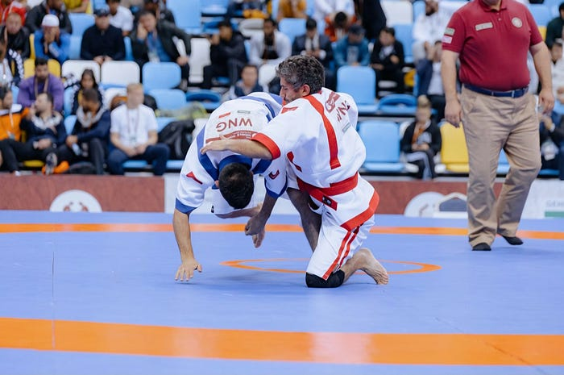
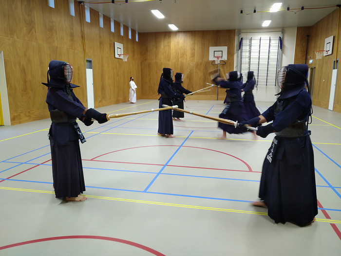
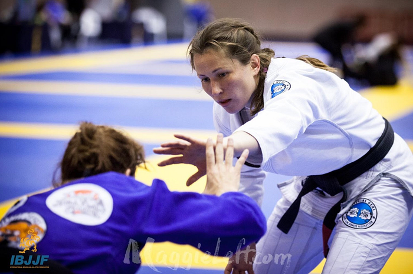

# **Beyond research**

‘Beyond research’ is a new mini-series we are starting on the eScience Center blog. We want to give you some insight into the interests, hobbies and accomplishments of our colleagues. Learn more about the writers behind our blogs and get to know them beyond the research. This first post features [Walter Baccinelli](/beyond-research-e220eb18f8b4#41d4), [Carlos Martinez-Ortiz](/beyond-research-e220eb18f8b4#0155) and [Olga Lyashevska](/beyond-research-e220eb18f8b4#4a75).

Walter Baccinelli: wrestling and words of wisdom**

I started my path in martial arts a long time ago when I was six and had no pain in my joints. I would love, at this point, to tell an inspiring and moving story about how I found my way to the dojo and “the gentle way” (aka, Judo), but I have none. The truth is that my older sister was already practicing Judo and the gym was close by, so I joined in. It was very convenient. What is incredible is that I never left this amazing world. Judo has been my first love and a very important part of my life, but I’ve been exploring, with more or less commitment, other disciplines like Sambo, Muay Thay, Wrestling, Kung Fu, as well as traditional fighting like Shuai Jiao and Qazaq Kuresi.

Since I began practicing martial arts, there have been many moments that I am proud of and that have impacted me. I started competing for fun as a kid, and more seriously as a teenager and into adulthood. I had the chance to take part in countless competitions at different levels, from very fun amateur to European and World championships and, very recently, the [World Nomad Games](https://worldnomadgames.kz/en) as part of the Italian national team. Regardless of the level of the competition, stepping on the mat always takes a lot of courage, and I’m proud of myself every time I decide to put on my Gi (Judo uniform) and challenge myself by fighting. Even before the fight itself, the path is hard and it takes commitment, self-sacrifice, passion and a bit of craziness. It requires constant training, always pushing yourself to your limit. It requires suffering through the fatigue and, sometimes, the injuries. It requires adjusting your whole lifestyle, fasting and resting instead of partying. It requires being ready to win, but, even more, being ready to lose despite all the work.

This may sounds like an awful life. Why would any sane person consciously decide to do this? Well, it also comes with joy. Firstly, it gives you the awareness that you have what it takes to reach the goals that you set, and some self-awareness never hurts. Secondly, reaching those goals is extremely satisfying. Entering the arena wearing the colors of your nation, hearing the cheering of your teammates and winning an important medal. That’s priceless.

It is clear that sport, for me, was not just a hobby or a complementary part of my life, but a totalizing activity and a way of living. Having had the privilege of experiencing the athlete’s life shaped my character and taught me a lot of lessons largely applicable to my private and work life. And no, I’m not speaking only about how to correctly punch the keyboard when a test fails with my code. Martial arts has taught me the immense value of respect. Respect for the people you train with, your teammates but even more for your opponent. I learned that an opponent is not an enemy. I learned that I cannot achieve my goals without the support of other people and that my support is fundamental for other people to reach their own goals. In Judo, you cannot train alone and you and your “Uke” (sparring partner) need each other to improve together. It’s all about collaboration and learning from other people. I learned that the higher my goals are, the harder the route to fulfill them. Failure and frustration (as well as accepting these emotions) are a part of the process, and commitment, hard work and patience (and sometimes also a bit of luck) are the tools with which I must be equipped.

Walter during the World Nomad Games[**Carlos Martinez-Ortiz: Kendo and committing to curiosity**](#0155)

I started kendo a few years ago. One of my friends had started a few weeks before and it sounded like a fun thing to do, so I joined him. A few months later, my friend stopped, because he started doing something else, but I just liked it enough to stay. Initially, I really liked the external part of it: it is very dynamic, and explosive — lots of shouting and running around. You get to wear cool armour and feel like a samurai. But over time there were other aspects that I enjoyed more — the aspect of long-term improvement and leaving the rest of the world outside when I practice.

I think kendo for me has shown me some aspects of my own character.

A couple of years ago, when I was preparing for a kendo exam, one of my seniors gave me some feedback on things I should improve — not only in terms of technique but also in terms of my attitude. Around the same time, I had my yearly appraisal with my line manager, and his feedback was very similar. From my perspective, what I needed to learn in kendo was the same thing I needed to learn for my personal development.

Olga Lyashevska: my Jiu-jitsu journey**

> 

It is not about how good you get but about what you do for the community — *Carlson Gracie Jr.

My jiu-jitsu journey began back in 2005 when I was at university. One day, I noticed a group of students running around in what looked like white pajamas, jumping, rolling, and clearly having fun. Intrigued, I decided to check it out since I had some free time that week.

When I arrived at the gym, I figured I’d just sit back and watch a session, but to my surprise, I wasn’t allowed. “You’ve got to join in,” the teacher said. So, without much hesitation, I grabbed one of those white ‘pajamas,’ which I later learned was called a *gi*, and picked out a random belt from a box in the corner.

The class started, and we jumped right into running, tumbling, and falling all over the mats. I had no clue what I was doing. At some point, the teacher noticed the belt I had tied around my waist — it was one meant for higher-ranked students. He looked at me with a puzzled expression and asked, “What belt are you?” I hadn’t the slightest idea what to say because I hadn’t earned any belt yet, let alone the one I was wearing. It was awkward and funny, but at that moment something kickstarted in me.

From that day forward, I never stopped training. Jiu -itsu became much more than just a hobby — it transformed how I approached challenges, relationships and ultimately, how I saw myself. What started as an accidental introduction became a lifelong passion that continues to shape who I am today.

As time passed, my training intensified. I found myself training up to six days a week, balancing my time between judo and jiu-jitsu, and competing and refereeing in both disciplines. Along the way, I’ve had many moments I’m proud of — from winning the World and European Championships to refereeing big competitions with some of the best competitors in the world.

But as much as those achievements mean to me, they pale in comparison to the joy of watching my students grow. There’s nothing quite like seeing the transformation in people. I’ve seen shy individuals blossom into confident athletes, not only excelling on the mats but also gaining a new sense of self. I’ve worked with women who’ve faced difficult challenges, and through jiu-jitsu, they’ve found strength, empowerment and a community that supports them.

Recently, one such moment after a women-only jiu-jitsu class I teach in Amsterdam, as students left with smiles and a sense of accomplishment, my teacher hugged me and whispered, “you’re changing lives.”

I will be competing again, and the medals and titles are great, but the real reward comes from knowing that, through jiu-jitsu, I’ve been able to help others discover their own power and confidence.

