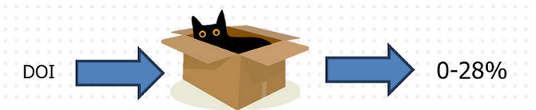

Written by [Esther Plomp](https://estherplomp.github.io/), [Meron Vermaas](https://www.esciencecenter.nl/fellowship-programme/meron-vermaas/), [Carlos Martinez-Ortiz](https://www.esciencecenter.nl/team/dr-carlos-martinez-ortiz/), [Nemo Andrea](https://nemoandrea.github.io/#primarySection/greeterSlider), [Ewan Cahen](https://www.esciencecenter.nl/team/ewan-cahen/), [Felix Weijdema](https://www.uu.nl/medewerkers/FPWeijdema), [Dorien Huijser](https://www.uu.nl/medewerkers/DCHuijser), [Marta Teperek](https://www.openscience.nl/en/marta-teperek), [Bjørn Bartholdy](https://www.tudelft.nl/library/research-data-management/r/support/data-stewardship/contact/bjoern-bartholdy) &amp; [Ana Parrón Cabañero](https://www.universiteitleiden.nl/en/staffmembers/ana-parron-cabanero#tab-1).

*During the Open Science Festival in Maastricht on 22 October 2024, we gathered a full room for the session *[*Tracking Research Objects: Levelling the playing field in research assessment*](http://web.archive.org/web/20241107150720/https://www.opensciencefestival.nl/en/programme/tracking-research-objects-levelling-the-playing-field-in-research-assessment)*! This was a topic that eScience Fellows Meron Vermaas and Esther Plomp were interested in investigating as a part of their *[*eScience Center Fellowship*](https://www.esciencecenter.nl/fellowship-programme/)* project. Read on to find out how you can investigate this using their methods!*

Photo by [Richard Bell](https://unsplash.com/@maplerockdesign?utm_source=medium&amp;utm_medium=referral) on [Unsplash](https://unsplash.com/?utm_source=medium&amp;utm_medium=referral)

We currently know a lot about how much research is published in Open Access publications for the Netherlands, to the degree that there are complete data and percentages available. For example, [TU Delft researchers published 98% of their publications Open Access in 2023](https://www.tudelft.nl/en/library/support/library-for-researchers/publishing-outreach/creating-your-publishing-strategy/open-access-publishing). How much of the other research outputs are published openly remains a wild guess, as it is a lot more difficult to measure research objects such as datasets, software repositories, protocols, podcasts, community outreach projects and so forth.

Just because these research objects are difficult to measure, does not necessarily mean they should not be measured. Being able to measure the degree of Open Access has led to positive attention for research outputs being openly available, and measuring this for other research objects may also result in increased sharing and recognition of these efforts.

We therefore started our session with some case studies on how other research objects can be made more visible. Esther presented on a project from TU Delft, and Meron presented on two projects he has been involved with from the Vrije Universiteit Amsterdam and the HvA. See [their slides](https://doi.org/10.5281/zenodo.13952611) for more details.

Esther and Meron worked together during their eScience Fellowship projects with [Carlos Martinez-Ortiz](https://www.esciencecenter.nl/team/dr-carlos-martinez-ortiz/) and [Ewan Cahen](https://www.esciencecenter.nl/team/ewan-cahen/) from the Netherlands eScience Center to set up a workflow that could deduce from the DOIs of a journal article whether accompanying research objects are available. It turns out that it is possible to measure this fairly easily with a script that Ewan worked on, as long as the research objects are cited within the publication. This [script is available on GitHub](https://github.com/EstherPlomp/TNW-Tracking/blob/main/main.py) for others to try out and reuse.

According to this data/script, the amount of shared research objects for the TU Delft Faculty of Applied Sciences in the period 2020–2023 range from 0–28%. This is likely to be an underestimate, as not all researchers cite the underlying/associated research objects within the article. The next steps for this project are to set up guidelines for researchers to make them aware why citation of these research objects are important, as well as perform text scraping to see how many other research objects are overlooked if we only look at cited research objects within the articles. For this, they will use a workflow that Meron has previously worked on during his [eScience Fellowship](https://www.esciencecenter.nl/fellowship-programme/meron-vermaas/).

Meron and Ewan created a workflow to find code repositories created by researchers at the VU. Because it is not yet possible to track these in a straightforward way, they found them by looking into mentions of software repositories in scientific papers. While around 70% of the researchers mention the use of a research software (such as Python or R), only ~10% mention a code repository. However, mentioning a code repository does not automatically mean the code was created by the authors of the paper. Thus, this is probably an overestimation of the amount of software that was actually produced and published by researchers from the VU. As a next step [the scripts (available on GitHub](https://github.com/meronvermaas/PURE_fulltext_analysis)) also searched through the code repositories and checked if the contributors are affiliated to the VU. This allows for finding and then reaching out to researchers who shared their code, so that support can be offered to make the code repositories more FAIR. Getting in touch with those researchers is an ongoing effort.

### Community input on research object tracking

After a presentation on these efforts, the group split into six groups that discussed questions related to research object tracking for ~ 15 minutes, and at the end of the session we reported back to the full group on our findings. Below follows a short summary for each of the groups:

Group 1: Should we track research objects (what are the disadvantages?)?**

This group thought it would be beneficial to track research objects and did not discuss any disadvantages. The group thought it was important for recognising the work, as well as the possibility of validating and verifying research. Careful attention should be paid to the gamification of this system, however, as well as the costs that may be involved in making these research objects available in a reusable and trackable manner. There needs to be incentives for the researchers and professional staff involved in these efforts to make it worthwhile.

It also needs to be clearer what the definition of a research object is and what the scope is. Potentially every research output can be considered a research object — even non-digital objects such as physical samples (blood samples, synthetic materials, or geological samples).

**Group 2: In what way would tracking of research objects nurture a culture of sharing research outputs?**

By tracking research objects individuals involved in research can be made aware of the benefits of sharing research objects: the visibility and accessibility of research outputs are important. To promote sharing practices we can develop and provide workshops and share recommended practices (research objects need a DOI, be registered in CRIS (current research information system), and/or made discoverable via preprint servers or data repositories).

Nevertheless, sharing research objects may be discipline dependent, and may not apply to all disciplines, or may apply differently (what about law and history?). Not all research may result in research objects that are trackable!

**Group 3: What (existing) technological infrastructure would be needed to effectively track research objects?**

This group discussed how ORCID could also be used to automatically track research objects. ORCID has options to connect with existing research-object infrastructures and automatically add the publications, protocols and software to a researcher’s profiles. Since ORCID is not widely used for tracking research objects, more awareness of these capabilities may be needed.

For data and software sharing the existing infrastructure are already available. For example, there are hosting services that make use of Git such as GitHub, or open source alternatives such as GitLab and GitTea, in combination with data repositories. For the sharing of protocols, there are protocols servers that can be used such as [protocols.io](http://protocols.io), or open source alternatives such as [OSF](https://osf.io/). Since the infrastructure already exists for many purposes, the limiting factor seems to be the awareness of the resources available, and the practical implementation of citing research objects in publications. An example is the self-citation needed to automatically detect shared research objects (as done in the case study described by Esther). To solve this problem, the group came up with an idea of a tool where researchers can upload their text of a version of their article (before submitting to a journal!), that will analyse the text content and check for missing links and DOIs (for example: “you mentioned a GitHub repository but no DOI for data was found” or “no data repository was found, did you know you can upload your data free of charge to 4TU.ReseachData”). This way, researchers are automatically notified about any missing links or citations to research objects. Currently, there is a proposal (by a group not part of the session) to develop a software called “[Transparency Check](https://osf.io/z3tr9)” that will provide an automatic assessment and suggestions for the improvement of the transparency of data and methods in research reports before they are published.

**Group 4: How can we balance quantitative metrics and qualitative indicators in the evaluation of research objects?**

They also discussed the dangers of quantitative metrics:

* Counting outputs can lead to prioritising quantity over quality (such as splitting up a dataset and publishing the subsets to have “more” datasets published).
* Quantitative metrics are subjected to circumventing, hacking and gaming.
* Quantitative metrics do not describe how the funding was used throughout the project and provide little context.
* It is difficult to quantify open science related work.
* Comparing metrics between institutes may lead to counterproductive competition and not be representative of the actual work that went into the outputs.

Group 5: What would you use research object tracking for? How can tracking research objects promote equity and inclusion within the research community?**

This group noted that tracking research objects can be helpful to measure impact of research, and may also be very relevant to funders. It can also help to provide input for policies and to provide ways to guide support distribution, as it would be possible to establish targeted support based on the tracking research objects. Tracking research objects could promote equity and inclusion within the research community as it would provide recognition for all research outputs, not just papers, also datasets, podcasts and other research objects. This could include recognition for all staff involved in research, also professional staff.

**Group 6: How do we track research objects in a way that helps us to understand how behaviour changes over time?**

The last group came up with their own question to address, and focused on working backwards from what type of behaviour we would like to track or change. The end goal is not to track research objects: we want the broader adoption of open science practices. The group pondered how the why behind all of this could be changing — why would researchers want to share their research objects? What research objects could they create, and which of those are being tracked? They also discussed whether Data Management Plans could be a tool to change behaviour, and whether monitoring data management plans would be helpful: are Data Management Plans updated — when and why?

## Examples

We also distributed a survey/form with 9 respondents to collect examples of best practices across the Dutch and international landscape:

**Which infrastructures are used in your organisation to track research objects?**

The majority (8 out of 9) mentioned their current research information system (CRIS), generally PURE. Three cases mention tracking the use of [ISAAC](http://www.isaac.nwo.nl/en), [dataverse](https://dataverse.nl/), [the inhouse repository](https://data.4tu.nl/) and [OpenAlex](https://openalex.org/).

**Which research objects are being tracked?**

Considering the majority using PURE as their main tracking system, it does not come as a surprise that publications are also the main research object being tracked. Six also mention datasets and there are isolated occurrences of tracking code, media appearances, supervised theses, keynote lectures.

**What does your organisation use research object tracking for?**

Most responses mention reporting, evaluation and assessment. Also the ambition to use it to effectively recognise and reward non traditional research outputs.One institute responded that descriptive reports on scientific activities at departmental level are used.

**Do you know of other successful examples of research object tracking?**

Positive responses were sparse in this question. The [PLOS Open Science Indicators](https://theplosblog.plos.org/2023/06/open-science-indicators-update-q1-2023/) were mentioned and a [FAIR dashboard ](https://fairdashboard.helmholtz-metadaten.de/en/data_in_helmholtz)was shared. A promising outlook into the future was mentioned where an institute is working on creating a platform to keep track of the research outputs (as well as the Research Data Management &amp; Open Science compliance documents such as Data Management Plans, Software Management Plans, Privacy and Ethics). In the session slide initiatives such as [Charité Metrics Dashboard](https://quest-dashboard.charite.de/), [French Open Science monitor](https://frenchopensciencemonitor.esr.gouv.fr/) and the [Open Science Monitoring Initiative](https://open-science-monitoring.org/) were mentioned.

**Conclusion**

Collaborative initiatives can create a more equitable research assessment framework that recognizes diverse contributions to science. If you’re passionate about advancing Open Science and interested in contributing to similar community projects, consider applying for the [eScience Center Fellowship program](https://www.esciencecenter.nl/fellowship-programme/). The Fellowship gives researchers and supporters the opportunity to work on technical solutions for open science challenges while collaborating with experts in the field.
