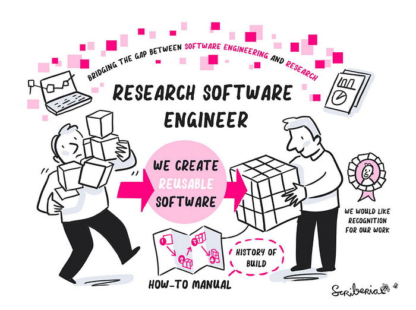
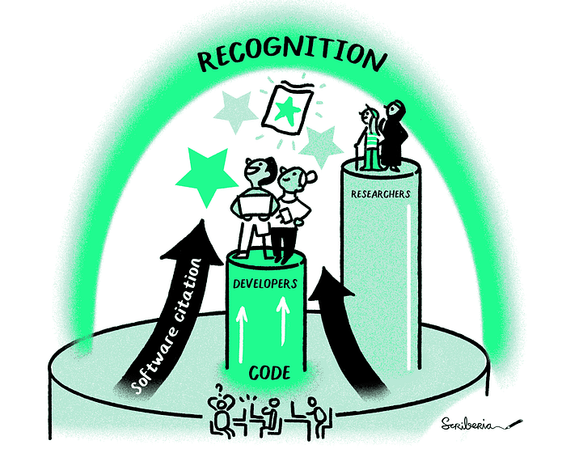

## *The Netherlands eScience Center and Turing Way have long been collaborating on the common goal to improve reproducible research practices*

1

A long time ago, in the far-away Amsterdam Science Park, the eScience Center created their own “[eScience Center software development guide](https://guide.esciencecenter.nl/)”. The aim of The Guide was for our RSEs to have a starting point to learn about how to write research software in adherence to open science practices. In other words, reproducible research software.

After a few years, we came across [*The Turing Way*](https://book.the-turing-way.org/), and saw that there was a lot of overlap between our goals: we both wanted to share good practices in reproducible research in general, and reproducible research software specifically.

Image by [Scriberia](https://www.scriberia.com/)In 2020, we decided to migrate our content to [*The Turing Way*](https://book.the-turing-way.org/), with a few exceptions. Our rule of thumb is: all content which is interesting to a general audience should be in [*The Turing Way*](https://book.the-turing-way.org/) and; content which is eScience Center specific, should go in The Guide. For instance, the description of [why one should use a license](https://the-turing-way.netlify.app/reproducible-research/licensing) goes in The Turing Way, whereas [our decision to use Apache2](https://guide.esciencecenter.nl/#/best_practices?id=licensing), goes in The Guide.

We used to block time to work on The Guide (“guide sprints”), which was essentially the same concept as the “Book Dash” events. We decided, in the spirit of open science, to NOT duplicate efforts, but instead dedicate our efforts in contributing to [*The Turing Way*](https://book.the-turing-way.org/). For a few years now, we have been (together with colleagues at VU Amsterdam and TU/Delft) involved in organizing local Book Dash events.

At a personal level, being involved in the project has allowed me to learn a lot about how to contribute to an open science community. Specifically, a community that works on a project based on Open Source principles — and you don’t have to be a skilled developer to contribute. I have also met many knowledgeable inspiring people! I have felt really welcome as part of the community.

For the last couple of years, I have also been involved in the Book Dash working group. In this group, I am involved in planning the Book Dash events, and try to encourage the (remote) participation of the Dutch community.

Image by [Scriberia](https://www.scriberia.com/)[The Turing Way*](https://book.the-turing-way.org/) has become an important reference resource for our internal use and as part of the resources we share with the research community in the Netherlands.

Beyond the multiple times on this blog, [*The Turing Way*](https://book.the-turing-way.org/) is mentioned in: our internal Project Management Protocol and our internal training resources, our [Research Software Support](https://esciencecenter-digital-skills.github.io/research-software-support/) training materials, our [Practical Guide to Software Management Plans](https://doi.org/10.5281/zenodo.7038280) and training materials developed in our [Best Practices for Sustainable software](https://tdcc.nl/projects/project-initiatives-nes/tdcc-nes-bottleneck-projects/best-practices-for-sustainable-software/) project point to different chapters as reference resources. It will also be part of the reference resources for the [EVERSE Research Software Quality kit](https://everse.software/RSQKit/).

For the eScience Center,* *[*The Turing Way*](https://book.the-turing-way.org/)* *is a priceless resource for sharing our expertise in contributing to reproducible research software.

Has [*The Turing Way*](https://book.the-turing-way.org/) helped you in your work? Please share your story [here](https://github.com/the-turing-way/the-turing-way/issues/4032#top). If you are interested in joining a Book Dash, you can contact [Carlos](https://github.com/c-martinez) or [get in touch](https://github.com/the-turing-way/the-turing-way?tab=readme-ov-file#get-in-touch) with *The Turing Way*
