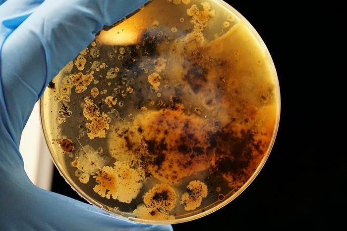
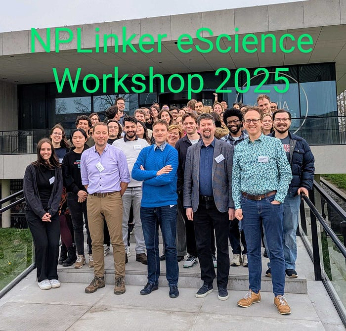
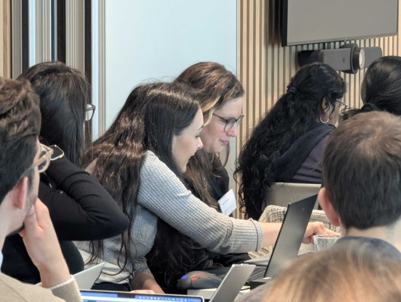
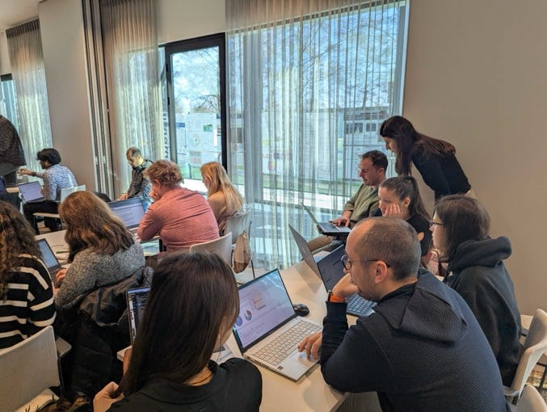
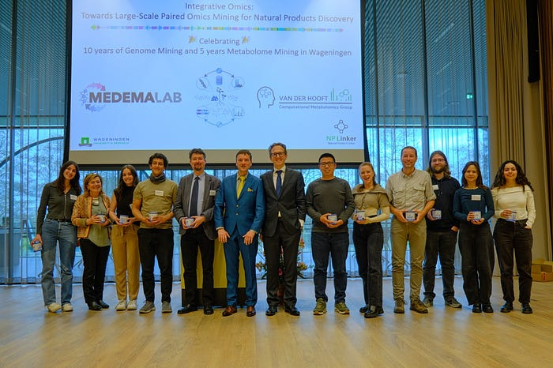
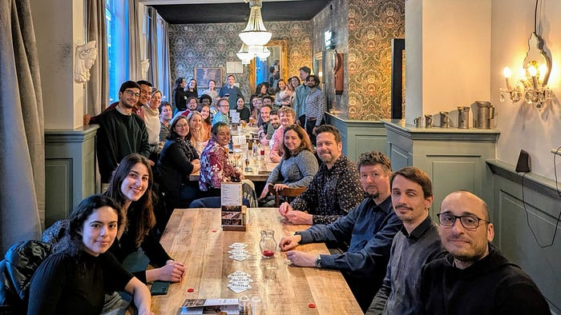
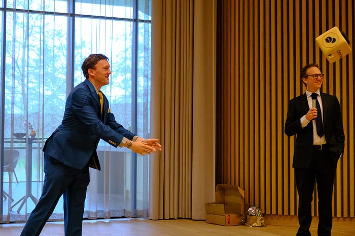

*This blog post is written by Wageningen University &amp; Research Assistant Professor *[*Justin van der Hooft*](https://www.linkedin.com/in/jjjvanderhooft/)*, who participates in the Open eScience Call 2021. His project “A community-supported workflow connecting microbial genes and organisms to their molecular products” aims to facilitate the finding of novel bio-active molecules from nature. It does so by enabling the integrated use of various omics data types.*

*Want to know more of what Justin’s team is doing?! Check his team’s *[*website*](https://vdhooftcompmet.github.io/)*.*

Photo by [Adrian Lange](https://unsplash.com/pt-br/@vollkornapfel?utm_source=unsplash&amp;utm_medium=referral&amp;utm_content=creditCopyText) on [Unsplash](https://unsplash.com/photos/Wk902ZLaA7M?utm_source=unsplash&amp;utm_medium=referral&amp;utm_content=creditCopy

Text)

Motivation for the workshop**

Nature is still full of unknown chemistry with possible beneficial properties such as anti-inflammatory or antibiotic ones. Over the last decade, increasing numbers of genome sequences and metabolomics profiles have become available in public resources. Hence, the combination of genome mining and metabolome mining has gained traction in accelerating natural product discovery by linking biosynthetic genes to molecular scaffolds and structures, and associating producers with their products. However, effective integrative omics mining has proven challenging due to the various data types and tools involved. In 2021, [NPLinker](https://journals.plos.org/ploscompbiol/article?id=10.1371%2Fjournal.pcbi.1008920) was proposed as a solution to streamline many aspects of integrative omics, so that researchers can focus on analyzing the possible matches between genes and molecules. Over the last years, the Open eScience Call project has further build on this solution to create [a framework for paired omics analyses](https://research-software-directory.org/software/nplinker). To gain experience with the NPLinker framework and build an integrative omics mining community of talented, driven early-career researchers and knowledgeable instructors, Marnix Medema and I organized this second NPLinker-eScience workshop in Wageningen, the Netherlands.

**Outline of the workshop**

During this second workshop in a series of two, we again aimed to bring together researchers interested in integrative omics analysis, spanning various career stages, computational or the application-focused backgrounds, and diverse organisms they work on. Following a selection process, 38 participants were selected to come to Wageningen to learn about analyzing genomes and metabolomes, and to get an outlook towards the integration of the two. The general aims of [the workshop](https://www.wur.nl/en/research-results/chair-groups/plant-sciences/bioinformatics/teaching/nplinker_workshop.htm) were:

* Introduce the NPLinker framework both conceptually and hands-on
* Educate and train natural product researchers and other interested scientists
* Extend the Integrative Omics Mining Community

The workshop intended learning outcomes were:

* Understand the concepts of and motivations for paired omics analysis
* Apply NPLinker to a public paired omics dataset
* Understand the NPLinker scoring
* Evaluate NPLinker outcome in the web app
* Understand how to contribute to the NPLinker code base

To stimulate networking amongst the participants and instructors, several measures were put in place: extended coffee and tea breaks, the opportunity to present a poster, and a social mixer at the start to get to know each other. Furthermore, Marnix and I organized a symposium on Wednesday to highlight exciting developments in genome mining, metabolome mining, integrative omics mining, and the reuse of public omics data. We are grateful for the financial support from the eScience Center, which helped to make the workshop affordable for participants from across the globe through a travel reimbursement scheme and enabled the participation of three international instructors.

All 38 participants from across the globe together with the instructors in front of the [Omnia building](https://www.wur.nl/en/location/omnia-2.htm) at the [Wageningen University &amp; Research](https://www.wur.nl/en.htm) campus.

I am increasingly aware of how integrative omics mining brings together different disciplines — what’s in a name, one could say. Furthermore, the field connects both researchers using the omics tools and developers working on them. We intentionally invited participants from these two groups and various disciplines to foster connections and collectively gain experience with the latest developments in the field. One key insight is that the fields is moving rapidly: only two years ago, we explained the latest in genome mining and metabolome mining, and during this workshop, versions 2 of BiG-SCAPE and GNPS were on the menu, replacing the previous versions. From a user perspective, this means staying up-to-date with how to use these tools effectively is key to remain on top of the latest possibilities in omics mining. From a developer perspective, it is important to build integrative tools like NPLinker in a way that can keep pace with the fast-evolving omics landscape. Another key insight is that, given the diverse backgrounds of participants, it is challenging to fully cater everyone’s needs. Striking the right balance between fixed program components and more flexible ones may help–allowing the explanation and demonstration of concepts or tools to be targeted based on participants’ needs. A final key insight is that promoting the exchange of knowledge and expertise in between participants is crucial, as it accelerates the uptake of new skills and information and helps form the bonds that create a scientific community.

Participants have been working hands-on with BiG-SCAPE, GNPS, and NPLinker during the workshop.

**Open Access Materials**

A tangible outcome of the workshop for the broader community is that the instructors all made as much as possible [the materials available under an open access license](https://doi.org/10.5281/zenodo.15281967)! I hope this initiative will help to further foster the teaching of the future generation of omics miners, support the development of educational resources for genome mining, metabolomics, and metabolome mining, and promote discussions and integration between the fields of genome mining and metabolome mining.

With huge thanks to all the NPLinker eScience Workshop instructors who came from across the globe to Wageningen to teach the participants many facets of integrative omics mining.

**Personal reflection**

Altogether, I am happy that all participants and instructors enjoyed the workshop and gained something valuable from it. I am very pleased that everyone had a good time and that the location and catering was appreciated. Furthermore, it was great to organize the symposium with Marnix Medema that celebrated the work lustra of our teams in computational genomics (1o years) and metabolomics (5 years). Not only did we invite keynote speakers–Pieter Dorrestein, Tilmann Weber, and Margherita Sosio–but we also invited three workshop participants to showcase their work in a flash talk. In case you are curious, you can watch it back [here](https://wur.yuja.com/V/Video?v=885970&amp;node=4776818&amp;a=66183860). I found it nice to read in the evaluations how the participants liked to see each others’ posters during the breaks, and how they liked the flash talks during the symposium.

If there is one thing I would have changed looking back at the event, it would be to organize more structured parallel sessions to dive deeper into the application and development of NPLinker, for example by using two separate rooms and dividing participants and instructors accordingly. This would have allowed both groups (users and developers) to discuss their ideas and challenges in greater detail, without the feeling of disturbing each other.

Community building during the workshop dinner!

What I really liked were the workshop keynotes–thanks again to Kate Duncan for setting the scene on Monday, to Margherita Sosio for showcasing how omics mining is applied in an industrial setting and how the Molecules Gateway operates, and to Kumar Saurabh Singh for sharing his perspective on multi-omics analyses. Further, thanks again to the eScience Center for supporting this workshop series, and to the Omnia and Orion teams for their support and efforts before and during the week. A big thank-you as well to Maria Augustijn and Marie-José van Iersel for their support in organizing various aspects of the workshop and symposium. Thanks to Marnix for your support and being co-organizer of this event. And finally, many thanks to all the participants for their open and constructive attitude during the workshop — much appreciated!

Marnix Medema (right) and myself (left) during the symposium we organized.

Whilst this was the last workshop in a series of two, I hope to see the integrative omics community together on future occasions!
