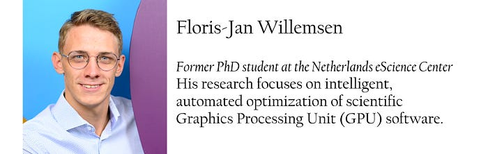

Floris-Jan Willemsen has been a PhD student at the Netherlands eScience Center since 2021, working on auto-tuning GPU software as part of the [CORTEX](https://research-software-directory.org/projects/cortex) project under the supervision of Rob van Nieuwpoort (Professor in Computer Science at Leiden University) and Ben van Werkhoven (Assistant Professor at Leiden University and former Research Software Engineer at the eScience Center).

Why auto-tune GPUs?**

“My research focuses on auto-tuning: creating software and algorithms to optimize performance on hardware. Smarter and faster auto-tuning not only leads to quicker results but also consumes less energy, making it a more sustainable option. We did this within the context of a project where we, together with other institutes like ASTRON, want to investigate the ‘explosive universe’. To observe the universe at that scale means a lot of data, which requires big computers, but even that is not enough — we need to be smart about what data we focus on and how we process it. That requires auto-tuning, which essentially is like a panel of many different knobs and sliders, with only one combination of millions leading to optimal performance. Therefore, we first focused on creating an algorithm that was able to find those combinations in very few attempts.”

Van Leeuwen/ASTRON (bron: NOS Nieuws)**What were some challenges you experienced?**

“This part of the project was itself a challenge, but the difficulty didn’t end when it was finished. The next step was to develop a uniform methodology. Each research group working with auto-tuning has a different way of visualizing and comparing data, as well as of reporting results. In 2022, we organized a Lorentz workshop to compare all these different methodologies and to design a new, uniform one. The major win was receiving the community’s mandate to spearhead this new methodology, which allows everyone to fairly compare auto-tuning performance — a significant breakthrough.

After this, I removed a major bottleneck in the auto-tuning process. This, together with other important advances, ultimately allowed me to optimize the optimization algorithms themselves — ‘tuning the tuner’ if you will.”

**Who can use this tool?**

ESiWACE3What was special about doing your PhD at the Netherlands eScience Center?**

“It allowed us to design tools that simply didn’t exist before. Building on the expertise of the Research Software Engineers at the Netherlands eScience Center, we were able to build high-quality software that is both at the cutting edge of research as well as user-friendly and stable. This is a combination that is rarely seen and allows us to put what we research today in the hands of scientists and developers tomorrow. Another perk was the focus on meeting with user bases through tutorials at a variety of international conferences like SuperComputing. At such conferences, we taught them new ways to get the most out of their hardware from us and we learned how users interacted with our software and how we could improve it further.”

**What are your plans for the near future?**

“I’m starting a new position as a Postdoctoral researcher at the Leiden Institute of Advanced Computer Science (LIACS) at Leiden University, where I’ll continue to build on the research I did during my Ph.D. and explore exciting new directions for auto-tuning. I’m looking forward to leveraging the experience I gained in building high-quality software in all future projects!”

**What made working at the eScience Center a unique experience?**

“The priority at universities is to always get the research done first, which tends to lead to software that gets the job done but is not accessible, maintainable, or usable outside of the exact scope of the research. The eScience Center has the combination of people experienced in both the academic and the software side of things, which puts it at a unique intersection to create sustainable scientific software. What I created during my time at the eScience Center is not limited to one specific purpose and can immediately be deployed in other people’s research. I’m proud to have been able to make an impact in that way.”

Read the article the NOS wrote about the *[*CORTEX Project*](https://nos.nl/artikel/2552914-astronomen-westerbork-ontrafelen-lichtflits-mysterie-in-de-ruimte)* (link in Dutch) in January 2025.*

**Who are we?**

The Netherlands eScience Center is a research organization dedicated to applying research software to answer research questions in any scientific domain through project collaborations. It has the largest concentration of dedicated, high-level research software expertise in the Netherlands. The eScience Center also has a [fellowship programme](https://www.esciencecenter.nl/fellowship-programme/) and makes all of its software and training materials openly available online. For more information about what we offer, visit [esciencecenter.nl](https://www.esciencecenter.nl/).
