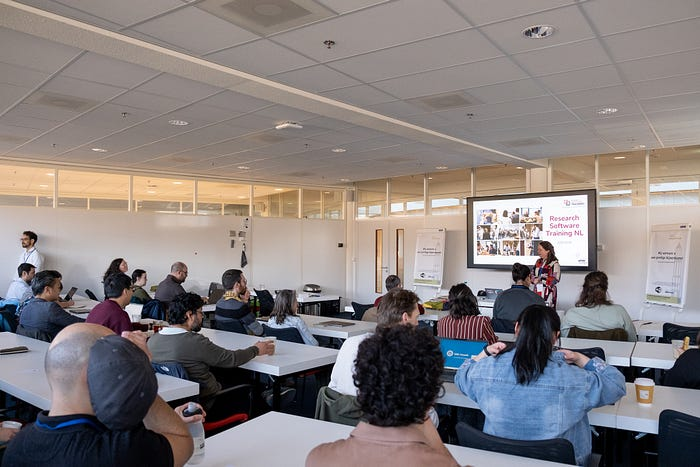
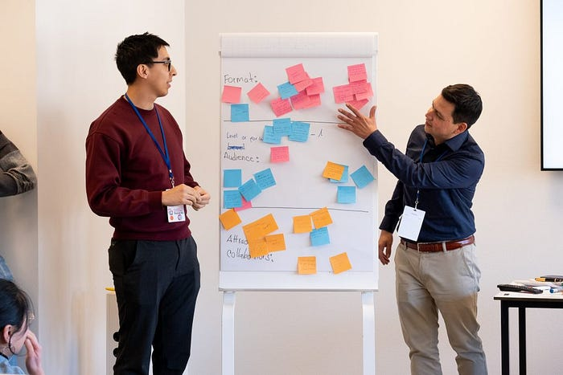
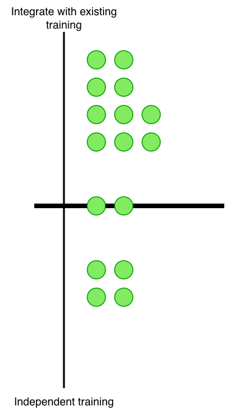
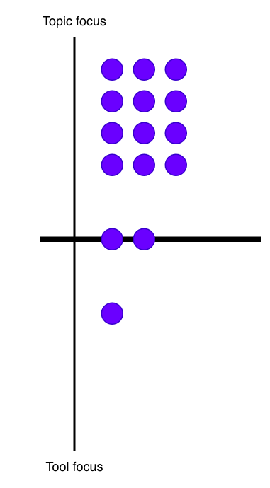
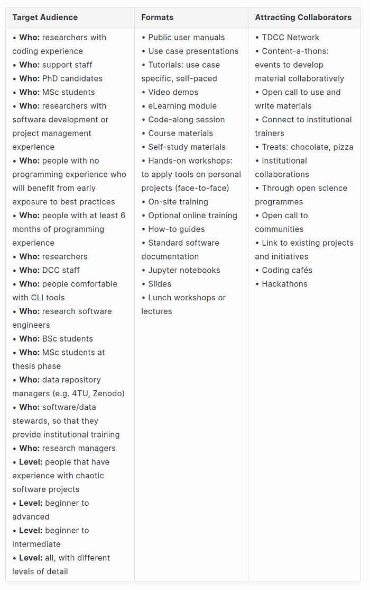

Training materials are most effective when they are created hand-in-hand with the communities who will actually use them.

Photo of the eventBy [Manuel G. Garcia](https://www.tudelft.nl/en/staff/m.g.garciaalvarez/) and [Serkan Gigin](https://people.utwente.nl/s.girgin).

Training materials are most effective when they are created with the communities who will actually use them. Co-design brings together lived experience, local knowledge, and technical expertise, ensuring that learning resources are relevant, accessible, and grounded in real needs. During the Research Software Training Day 2026, we engaged with research software trainers from across the Netherlands to explore how training materials for [Meta-Template](https://ss-nes.github.io/meta-template/) and [Code Auditor](https://github.com/SS-NES/code-auditor) should be developed and delivered.

This the story of our experience and the lessons we learned along the way:

Meta-Template** is a tool for aligning software best practices across teams, groups, and organisations through software templates. These templates provide structure and boilerplate code for software projects, offering several key advantages for research software development: they reduce the time and barriers involved in setting up a new project, encourage the adoption of best practices such as the FAIR principles for software, and promote standardisation and consistency across projects within a research team, group, or organisation.

**Code Auditor** is a conformity checking tool that provides insights into the structure and content of a research software project. When applied to a code base, such as a code repository, Code Auditor can identify missing or conflicting best practices, suggest solutions to the issues it detects, and generate conformity reports in both machine- and human-friendly formats. It can also be used to verify compliance with software management plans and, when integrated with software templating tools, enables automated corrections.

These two tools complement each other. Meta-Template facilitates the adoption of software best practices from the very inception of a research software project, while Code Auditor helps monitor compliance with those practices at key points throughout the software lifecycle.

To promote the adoption of these tools, we need training materials, such as tutorials, that introduce them to potential users, demonstrate their value, and attract collaborators to the open-source projects that maintain them. With this goal in mind, we consulted the Research Software Training community about which directions and approaches to follow.

> 

**Fact Sheet**** Participants: 16
 Experience as trainners: beginners (1 year) to proficient (&gt; 5 years)
 Location: Utrecht
 Duration: 1.5 hours

## Directions for Training Tutorials

Training tutorials can be developed in several directions. During our engagement with software trainers, we focused on understanding their preferences and opinions regarding two key questions:

* How independent should training materials be from other training materials and initiatives?** Independent materials might be easier to develop and maintain, but risk being too niche to reach a broad pool of potential users. On the other hand, integrating materials with existing training programmes could provide good leverage to reach a wider audience, though it requires more coordination and effort.
* **Should training materials focus on the tools themselves, or on the research software development topics they relate to?** Tool-focused materials would have a narrower scope but highlight the capabilities of the tools in detail, while topic-focused materials would cover broader software topics, such as publishing research software, and introduce the tools as mechanisms to ease the workload.

## Independence vs Integration

Most trainers agreed that training materials for **Meta-Template** and **Code Auditor** should be developed as part of existing training programmes, taking advantage of established initiatives and institutional structures. However, some arguments in favour of *independent* training highlighted that standalone materials could be shorter and use-case oriented, requiring less time investment from potential users. A few others acknowledged these arguments but felt that choosing a single direction might not be necessary, since both approaches offer advantages and drawbacks.

Despite the differences in opinion, the discussion concluded with trainers agreeing that a good starting point would be to explore integrating materials into existing and related training initiatives.

## Tool Focus vs Topic Focus

A large majority of trainers agreed that training materials should be topic-focused. The strongest argument in favour was that topic-focused materials would emphasise the value of the tools within a particular use case or research domain, demonstrating how useful they can be in a specific context and therefore serving as a better strategy to attract users. The argument for tool-focused materials, on the other hand, emphasised that such materials could be shorter and concentrate on demonstrating the how-to of each tool. Those who favoured neither direction raised arguments similar to those in the discussion about independence vs integration.

## Audiences, Formats, and Collaborations

In the final part of the workshop, trainers proposed ideas on three topics:

* Which audiences should the training materials target?
* Which formats would be most suitable?
* How can we attract collaborators to help develop materials?

The most favoured ideas pointed towards targeting PhD candidates, MSc students, data support staff, and data repository managers, through on-site training sessions such as workshops. However, a wide range of ideas were proposed for each aspect — see Table 1.

Regarding collaboration, the preferred approach was to organise on-site events, such as content-a-thons, where trainers work together on developing materials.

Table 1. Ideas for addressing topics related to audiences, formats and collaborations for developing training materials for *[*Meta-Template*](https://ss-nes.github.io/meta-template/)* and *[*Code Auditor*](https://github.com/SS-NES/code-auditor)*.*

## Key Takeaways

The main takeaways from the workshop were as follows:

* Work towards integrating training materials for the tools into existing initiatives, such as data and software training programmes, to leverage the opportunities they offer for reaching a wider audience.
* Topic-focused materials offer a strategic advantage in demonstrating the value of new tools such as Meta-Template and Code Auditor, which in turn helps attract new users.
* Prioritise PhD candidates, MSc students, and data/software support staff as target audiences, delivering training through on-site formats such as hands-on workshops.
* Trainers prefer collective efforts during on-site events, such as content-a-thons, for contributing to the development of training materials.

## Contact

If you would like to learn more about Meta-Template** and **Code Auditor**, or explore how to use them in your own training activities, we would love to hear from you. We also warmly invite contributions from the community — whether by improving the existing materials, sharing feedback, or helping co-develop new training resources together.

Dr. Manuel Garcia Alvarez
Research Software Engineer
TU Delft DCC
[m.g.garciaalvarez@tudelft.nl](mailto:m.g.garciaalvarez@tudelft.nl)

Dr. Serkan Girgin
Associate Professor
University of Twente, Faculty ITC
[s.girgin@utwente.nl](mailto:s.girgin@utwente.nl)

*The project “Best Practices for Sustainable Software” with file number ICT.TDCC.002.001 of the research programme NWO Implementation Plan for ICT Infrastructure for TDCC Bottleneck Projects is financed by the Dutch Research Council (NWO).*
