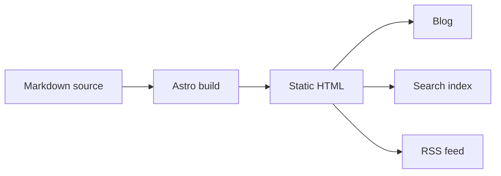
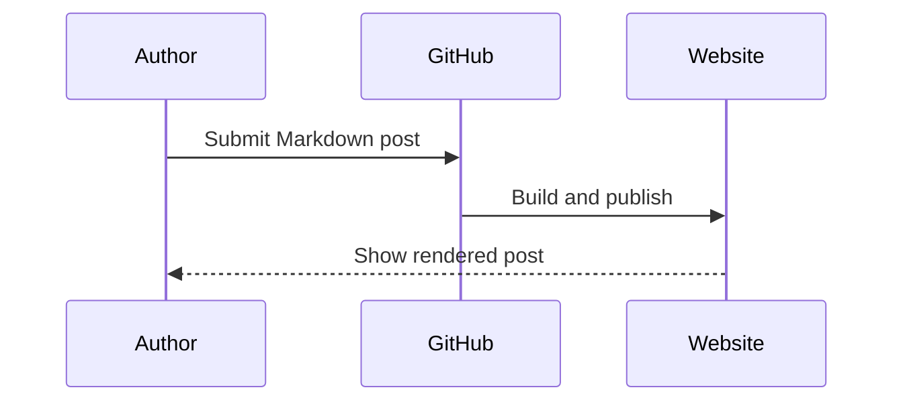

This unlisted guide shows what authors can use in an eScience Center blog post. Each example is rendered first and followed by the Markdown or HTML needed to reproduce it. Copy an example into your post and replace its content.

## Start a post

Every post starts with YAML frontmatter. It supplies the title, author, publication status, source, and topics used by the blog.

```yaml
---
title: "A clear and specific title"
author: "Author Name"
slug: "clear-and-specific-title"
published: true
source: "local"
tags:
  - research software
  - reproducibility
---
```

The custom `slug` is optional. When supplied, it creates a short, stable URL containing only lowercase letters, numbers, and hyphens.

## Text, links, and emphasis

<div data-code-example-preview></div>

A paragraph can include **bold text**, *emphasis*, `inline code`, and a link to [the Netherlands eScience Center](https://www.esciencecenter.nl/).

<div data-code-example-source></div>

```markdown
A paragraph can include **bold text**, *emphasis*, `inline code`, and a link to [the Netherlands eScience Center](https://www.esciencecenter.nl/).
```

## Headings

Headings divide a longer post into sections. Start with level-two headings because the post title is already the level-one heading.

<div data-code-example-preview></div>

### A section within the post

#### A subsection when another level is needed

<div data-code-example-source></div>

```markdown
## A section within the post

### A subsection when another level is needed
```

## Blockquotes

Use a blockquote for a short quotation or a statement that needs emphasis.

<div data-code-example-preview></div>

> Good research software makes methods easier to inspect, reuse, and improve.

<div data-code-example-source></div>

```markdown
> Good research software makes methods easier to inspect, reuse, and improve.
```

## Lists

<div data-code-example-preview></div>

An unordered list:

- research software
- reproducible workflows
- public knowledge archives

An ordered list:

1. Write the post.
2. Preview it locally.
3. Submit it for review.

A nested list:

- Prepare the article
  - add the text
  - add the figures
- Check the result
  - test every link
  - read the rendered page

<div data-code-example-source></div>

```markdown
An unordered list:

- research software
- reproducible workflows
- public knowledge archives

An ordered list:

1. Write the post.
2. Preview it locally.
3. Submit it for review.

A nested list:

- Prepare the article
  - add the text
  - add the figures
- Check the result
  - test every link
  - read the rendered page
```

## Code

Add the language after the opening backticks to enable syntax highlighting.

<div data-code-example-preview></div>

```python
def estimate_reading_time(words: int, words_per_minute: int = 225) -> int:
    return max(1, round(words / words_per_minute))

print(estimate_reading_time(900))
```

<div data-code-example-source></div>

````markdown
```python
def estimate_reading_time(words: int, words_per_minute: int = 225) -> int:
    return max(1, round(words / words_per_minute))

print(estimate_reading_time(900))
```
````

## Inline and block LaTeX

Use single dollar signs for an expression within a sentence and double dollar signs for a separate equation.

<div data-code-example-preview></div>

The third power of two is $2^3 = 8$.

$$
e^{i \theta} = \cos \theta + i \sin \theta
$$

$$
\operatorname{softmax}(x_i) = \frac{e^{x_i}}{\sum_j e^{x_j}}
$$

<div data-code-example-source></div>

```markdown
The third power of two is $2^3 = 8$.

$$
e^{i \theta} = \cos \theta + i \sin \theta
$$

$$
\operatorname{softmax}(x_i) = \frac{e^{x_i}}{\sum_j e^{x_j}}
$$
```

## Images

Write useful alternative text that describes the information in the image. Images can be placed next to the post's `index.md` file and referenced with a relative path such as `./figure.png`.

<div data-code-example-preview></div>


<div data-code-example-source></div>

```markdown
![Describe the information shown in the figure][figure]

[figure]: ./figure.png
```

## Tables

Use tables for compact, structured comparisons. Long prose is usually easier to read as paragraphs or lists.

<div data-code-example-preview></div>

| Format | Best used for |
| --- | --- |
| Markdown | Article structure and prose |
| LaTeX | Mathematical notation |
| Mermaid | Diagrams described as text |

<div data-code-example-source></div>

```markdown
| Format | Best used for |
| --- | --- |
| Markdown | Article structure and prose |
| LaTeX | Mathematical notation |
| Mermaid | Diagrams described as text |
```

## Footnotes

<div data-code-example-preview></div>

Footnotes keep a supporting detail close at hand without interrupting the main argument.[^example]

[^example]: This is the rendered footnote text.

<div data-code-example-source></div>

```markdown
Add the footnote marker after a statement.[^source]

[^source]: Add the footnote text anywhere in the same post.
```

## Mermaid flowchart

Mermaid turns a text description into a diagram. Keep labels short so the result remains readable on small screens.

<div data-code-example-preview></div>



<div data-code-example-source></div>

````markdown

````

## Mermaid sequence diagram

<div data-code-example-preview></div>



<div data-code-example-source></div>

````markdown

````

## Collapsible details

Use a details element for optional supporting information. Important conclusions should remain visible without requiring a click.

<div data-code-example-preview></div>

<details>
  <summary>Show the technical note</summary>

  This information is available when the reader needs it.
</details>

<div data-code-example-source></div>

```html
<details>
  <summary>Show the technical note</summary>

  This information is available when the reader needs it.
</details>
```

## YouTube video

Use the privacy-enhanced YouTube domain and provide a descriptive title. Only embed media that is necessary for the article.

<div data-code-example-preview></div>

<iframe
  width="560"
  height="315"
  src="https://www.youtube-nocookie.com/embed/dQw4w9WgXcQ"
  title="Example embedded video"
  loading="lazy"
  frameborder="0"
  allow="accelerometer; autoplay; clipboard-write; encrypted-media; gyroscope; picture-in-picture; web-share"
  allowfullscreen>
</iframe>

<div data-code-example-source></div>

```html
<iframe
  width="560"
  height="315"
  src="https://www.youtube-nocookie.com/embed/VIDEO_ID"
  title="Describe the video"
  loading="lazy"
  frameborder="0"
  allow="accelerometer; autoplay; clipboard-write; encrypted-media; gyroscope; picture-in-picture; web-share"
  allowfullscreen>
</iframe>
```

## Interactive embed

Only embed trusted external websites that permit framing. Restrict iframe permissions with `sandbox`, avoid sending referrer data, and test the embed in the local preview before publishing it.

<div data-code-example-preview></div>

<iframe
  src="https://observablehq.com/embed/@d3/bar-chart/2?cells=chart"
  title="Observable D3 bar chart"
  loading="lazy"
  sandbox="allow-scripts allow-same-origin"
  referrerpolicy="no-referrer"
  style="width: 100%; min-height: 460px; border: 1px solid #e5e5e5; border-radius: 12px;">
</iframe>

<div data-code-example-source></div>

```html
<iframe
  src="https://example.com/embeddable-view"
  title="Describe the interactive content"
  loading="lazy"
  sandbox="allow-scripts allow-same-origin"
  referrerpolicy="no-referrer"
  style="width: 100%; min-height: 460px; border: 1px solid #e5e5e5; border-radius: 12px;">
</iframe>
```

## Before publishing

- Preview the rendered post on both a wide and narrow screen.
- Give every informative image useful alternative text.
- Check links, equations, diagrams, videos, and interactive embeds.
- Keep essential information in the article rather than only inside an external embed.
