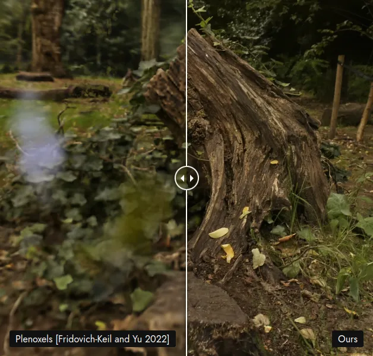

Source: https://repo-sam.inria.fr/fungraph/3d-gaussian-splatting/

Imagine trying to understand the structural integrity of a Roman ruin, or the complex vascular network of a biological organ, by looking at a flat map or static 2D photographs. You might get the general idea, but the depth, the context, and the reality are lost in translation.

We live in a three-dimensional world, yet so much of our scientific data remains trapped on two-dimensional screens. For researchers in fields ranging from digital humanities to environmental science, this is not just an aesthetic issue. It’s a barrier to discovery.

Luckily, there is research software to overcome this barrier and get more insight by intuitive and photo-realistic 3D visualization. However, this software comes with another barrier: ease of use. This is where **3DLab** can help you: to easily access this powerful technology.

## The Challenge: Capturing the World Around You

There is an active field of computer vision research trying to tackle how we explore new places. In simultaneous localization and mapping (SLAM), a camera with location sensors (e.g. GPS and IMU) has to both accurately track its location while simultaneously creating a digital representation of the surroundings.

In recent years, SLAM has seen a huge boom in interest with the application of novel machine learning techniques. Novel scene representations like neural radiance fields have made the resulting digital models photo-realistic. In turn, 3D Gaussian Splatting has made it possible to create such photo-realistic models in under an hour and render them at high frame-rates.

## The Approach: Gaussian Splatting

<iframe width="560" height="315" src="https://www.youtube.com/embed/q7zCeH9HXEU?si=TWZJpqxw_t0CVkk3" title="YouTube video player" frameborder="0" allow="accelerometer; autoplay; clipboard-write; encrypted-media; gyroscope; picture-in-picture; web-share" referrerpolicy="strict-origin-when-cross-origin" allowfullscreen></iframe>

If traditional 3D models (meshes) are like origami sculptures, Gaussian Splatting is like 3D impressionist painting. It represents a scene using millions of fuzzy 3D ellipses (“splats”). These splats can overlap and blend, allowing for incredibly realistic rendering of complex scenes, like the fuzzy texture of moss on a stone or the reflective sheen of polished marble, that traditional methods struggle to capture.

However, Gaussian Splatting is complex to set up and use. It requires very specific software dependencies and careful manual workflows. 3DLab focuses on removing these hurdles, allowing researchers to input raw data and receive a high-fidelity 3D visualization without needing a second PhD in computer science.

Key features of the 3DLab approach include:

- **Accessibility:** ease of installation through detailed step-by-step installation instructions.
- **Automation:** scripts that handle the heavy lifting of pre-processing your data and training the 3D models.
- **Organization:** guided by a single configuration file that organizes your data and parameter settings.

## Impact: From Artifacts to Algorithms

<iframe width="560" height="315" src="https://www.youtube.com/embed/P6xOVA1wYNg?si=g-hN8fqpCjtOdpLo" title="YouTube video player" frameborder="0" allow="accelerometer; autoplay; clipboard-write; encrypted-media; gyroscope; picture-in-picture; web-share" referrerpolicy="strict-origin-when-cross-origin" allowfullscreen></iframe>

While the project has applications in medicine and engineering, its potential in the **Social Sciences and Humanities (SH)** is particularly exciting.

Consider the field of art history. Capturing and preserving historical sites is a meticulous process. By using the tools developed in 3DLab, researchers can create “digital twins” of heritage sites with unprecedented photo-realism. This preserves the site digitally for remote or future study. It also allows an immersive way to present this history to the public.

The impact of 3DLab goes beyond just pretty pictures. It aligns with the **FAIR principles** (Findable, Accessible, Interoperable, Reusable). By providing open-source automation tools, the project ensures that 3D visualizations are not just one-off artistic projects, but reproducible scientific outputs.

## Building a Community of Visualizers

3DLab is not developed in a vacuum. It represents a strategic effort to embed 3D expertise into the Dutch research ecosystem. The project aims to leverage the vibrant **NL-RSE (Research Software Engineers in the Netherlands)** community, sharing knowledge and code to ensure these tools survive beyond the initial funding cycle.

The project also highlights the collaborative nature of modern science. It sits at the intersection of computer vision, software engineering, and domain-specific research. By making the code open source on GitHub, the eScience Center invites contributions from developers and researchers worldwide, fostering a culture of shared innovation.

## Looking Ahead

The work on 3DLab is just the beginning. As techniques like Gaussian Splatting mature, we gaze at the branching possibilities, like integrating these visualizations into virtual reality (VR) and augmented reality (AR) environments. Imagine a medical student walking inside a simulation of a patient’s heart, or a historian walking through a digital reconstruction of 17th-century Amsterdam.

By lowering the barrier to entry, 3DLab is ensuring that the future of science isn’t just data-driven but it’s immersive, interactive, and accessible to all.

## Get Involved

Are you a researcher struggling to visualize high-dimensional data? Or an RSE interested in the bleeding edge of computer graphics?

- **Explore the Code:** Check out the [3D Gaussian Splatting automation repository on GitHub](https://github.com/NLeSC/3dgs_automation).
- **Read the Report:** Dive deeper into the technical details in the [3D Lab project report](https://nlesc-my.sharepoint.com/:w:/g/personal/t_vanlankveld_esciencecenter_nl/IQDcC5wodS0xTYJHQKD2wM1NAZ6h-z-12IevTwMOFfgEUp0?e=3oC24W).
- **Connect:** Reach out to *Thijs van Lankveld* or the *eScience Center* team to discuss how 3D visualization can transform your research.
